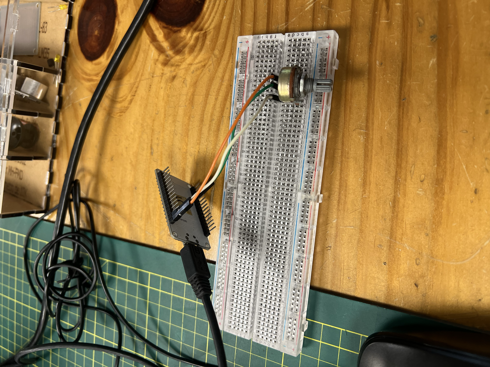
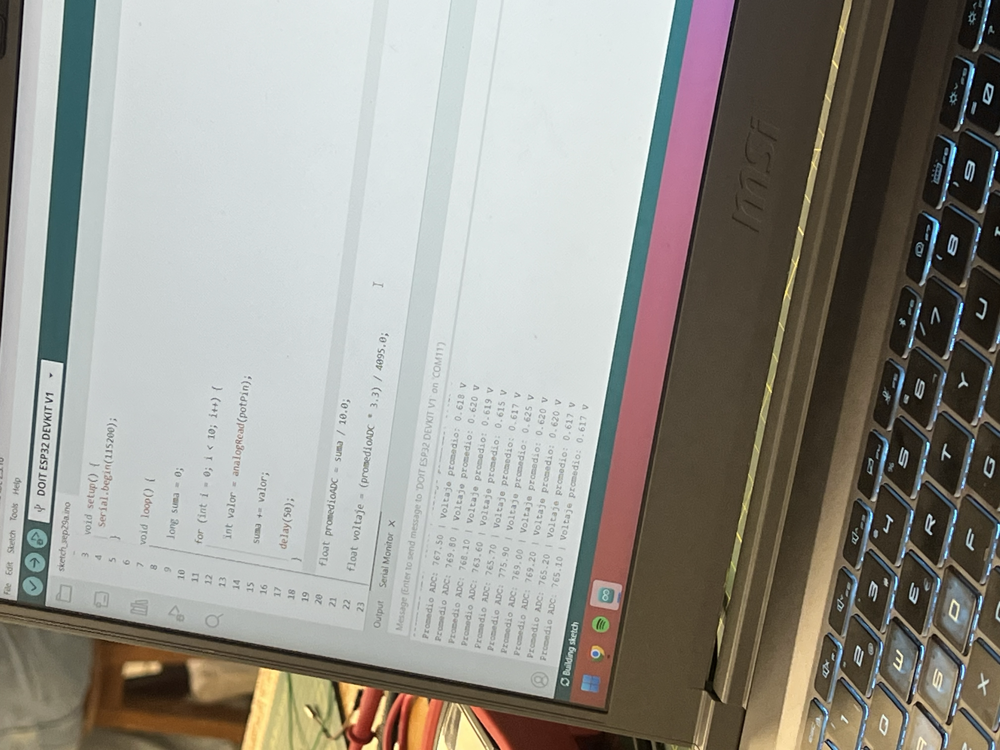
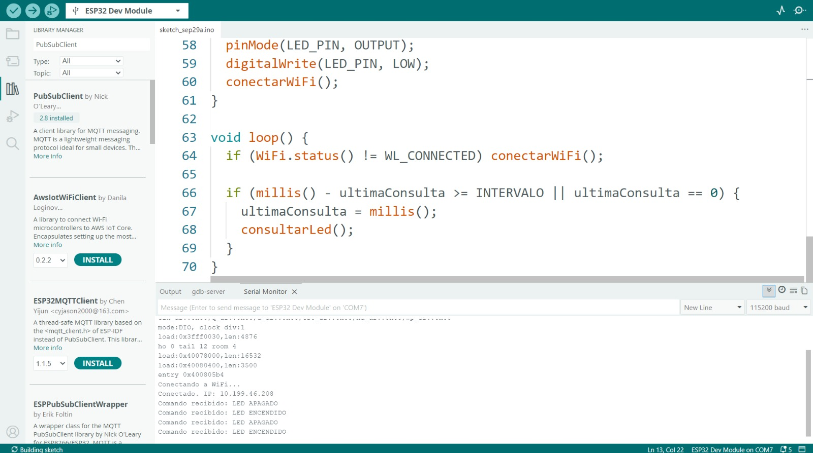
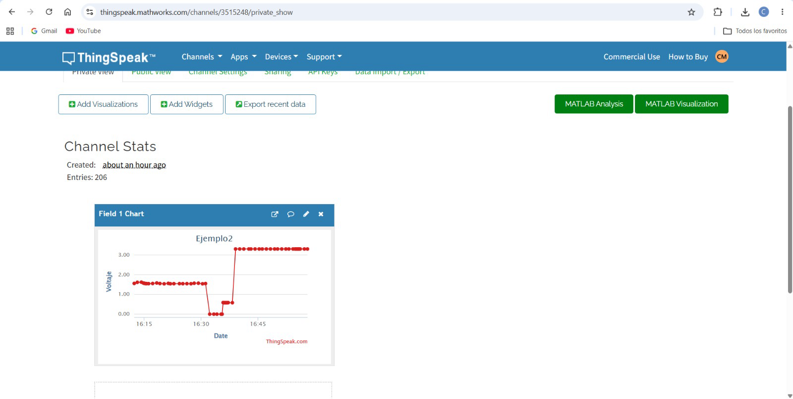
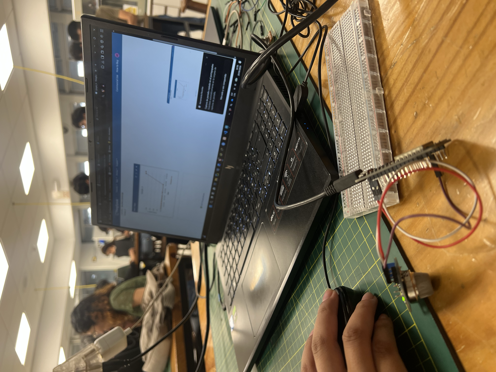
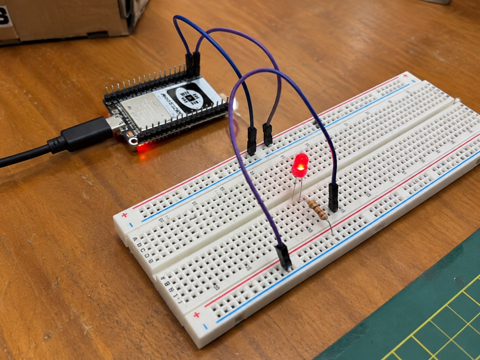
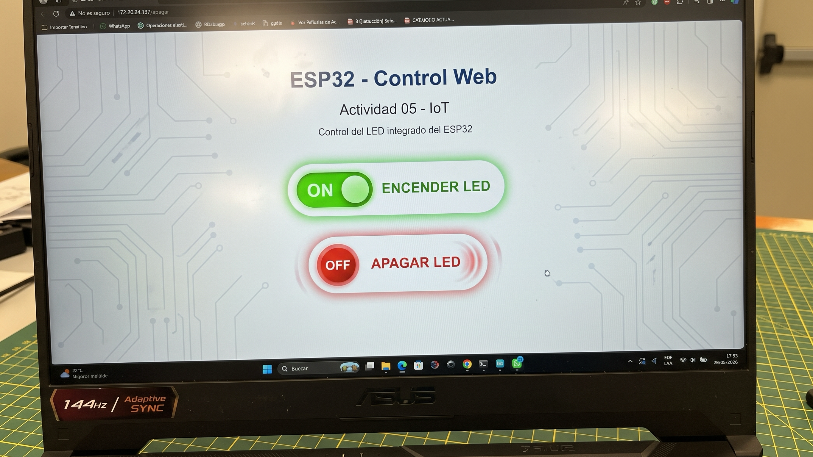

<div align="center">

# 🌐 Taller de Internet de las Cosas (IoT)

### ESP32 · Sensores · WiFi · ThingSpeak · Control Web

> Informe de prácticas de Internet de las Cosas

</div>

---

## 📌 Descripción general

Durante este taller realicé diferentes prácticas utilizando una tarjeta ESP32, enfocadas principalmente en el funcionamiento de sensores, comunicación mediante WiFi, envío de información a plataformas en la nube y control de dispositivos a través de una interfaz web.

Para desarrollar las actividades se utilizaron principalmente una placa ESP32, una protoboard, un potenciómetro y un sensor ultrasónico HC-SR04.

---

## 🎛️ Actividad 1: Lectura del potenciómetro, promedio y voltaje

En esta primera actividad se realizó la conexión de un potenciómetro al ESP32 con el objetivo de obtener y analizar sus valores analógicos.

### 🔌 Conexión

La conexión realizada fue la siguiente:

Un terminal del potenciómetro conectado a 3.3V.

El otro terminal conectado a GND.

El terminal central conectado al GPIO 34 del ESP32.

Para obtener un resultado más estable, se realizaron varias mediciones y posteriormente se calculó el promedio de las lecturas obtenidas. Finalmente, el valor promedio del ADC fue convertido a su equivalente en voltaje.

### 📷 Conexión realizada

<div align="center">



*Conexión realizada*

</div>

### 📷 Resultado en el monitor serial

<div align="center">



*Resultado en el monitor serial*

</div>

En el monitor serial se puede visualizar el promedio de las lecturas realizadas por el ADC y el voltaje correspondiente obtenido a partir de dicho valor.

### 💻 Código utilizado

```cpp
int potPin = 34;
void setup() {
Serial.begin(115200);
}
void loop() {
long suma = 0;
// Tomar 10 lecturas
for (int i = 0; i < 10; i++) {
int valor = analogRead(potPin);
suma += valor;
delay(50);
}
// Calcular promedio de las 10 lecturas
float promedioADC = suma / 10.0;
// Convertir el promedio a voltaje
float voltaje = (promedioADC * 3.3) / 4095.0;
Serial.print("Promedio ADC: ");
Serial.print(promedioADC);
Serial.print(" | Voltaje promedio: ");
Serial.print(voltaje, 3);
Serial.println(" V");
delay(500);
}
```

---

## 📶 Actividad 2: Conexión del ESP32 a una red WiFi

En esta actividad se estableció una conexión inalámbrica entre el ESP32 y una red WiFi, utilizando el punto de acceso o Hotspot de un teléfono celular.

Para realizar la conexión se utilizó la librería WiFi.h, mediante la cual se configuraron los datos de la red a la que debía conectarse el ESP32.

Una vez establecida correctamente la comunicación, el dispositivo mostró en el monitor serial la dirección IP asignada por la red.

### 📷 Resultado obtenido

<div align="center">


*Resultado obtenido*

</div>

La conexión se realizó correctamente y fue posible comprobar mediante el monitor serial que el ESP32 recibió una dirección IP dentro de la red.

### 💻 Código utilizado

```cpp
#include <WiFi.h>
#include <WebServer.h>
const char* ssid = "UPCH_CENTRAL";
const char* password = "CAYETANO2022";
WebServer server(80);
void handleRoot() {
server.send(200, "text/html",
"<h1>Bienvenido Anderson</h1>"
"<p>Servidor funcionando correctamente.</p>");
}
void setup() {
Serial.begin(115200);
WiFi.begin(ssid, password);
Serial.print("Conectando a WiFi");
while (WiFi.status() != WL_CONNECTED) {
delay(500);
Serial.print(".");
}
Serial.println();
Serial.println("WiFi conectado");
Serial.print("Direccion IP: ");
Serial.println(WiFi.localIP());
// Configurar página principal
server.on("/", handleRoot);
// Iniciar servidor
server.begin();
Serial.println("Servidor web iniciado");
}
void loop() {
server.handleClient();
}
Por motivos de seguridad, los datos reales de acceso a la red WiFi no se incluyen en el informe.
```

---

## ☁️ Actividad 3: Envío de datos del potenciómetro a ThingSpeak

En esta actividad se volvió a utilizar el potenciómetro conectado al GPIO 34, pero esta vez el objetivo fue enviar los valores obtenidos hacia la plataforma IoT ThingSpeak mediante una conexión WiFi.

La conexión del potenciómetro se realizó de la siguiente manera:

VCC conectado a 3.3V.

GND conectado a GND.

Salida del potenciómetro conectada al GPIO 34.

El funcionamiento consiste primero en establecer la conexión del ESP32 con la red WiFi. Posteriormente, el dispositivo obtiene el valor del potenciómetro y lo envía a ThingSpeak, específicamente al Field 1 del canal configurado.

El envío de información se realizó aproximadamente cada 20 segundos.

### 📷 Monitor serial

<div align="center">



*Monitor serial*

</div>

En el monitor serial se puede verificar el valor obtenido del potenciómetro y comprobar si el envío de información hacia ThingSpeak se realizó correctamente.

### 📷 Visualización en ThingSpeak

<div align="center">



*Visualización en ThingSpeak*

</div>

En la plataforma ThingSpeak se puede observar gráficamente la variación de los valores registrados a medida que se modifica la posición del potenciómetro.

### 💻 Código utilizado

```cpp
#include <WiFi.h>
#include <ThingSpeak.h>
const char* ssid = "UPCH_CENTRAL";
const char* password = "CAYETANO2022";
// ThingSpeak
unsigned long channelID = 3515248;
const char* writeAPIKey = "BNU5ZQ3GHU1X1O49";
WiFiClient client;
int potPin = 34;
void setup() {
Serial.begin(115200);
WiFi.begin(ssid, password);
Serial.print("Conectando a WiFi");
while (WiFi.status() != WL_CONNECTED) {
delay(500);
Serial.print(".");
}
Serial.println();
Serial.println("WiFi conectado");
Serial.print("IP del ESP32: ");
Serial.println(WiFi.localIP());
ThingSpeak.begin(client);
}
void loop() {
long suma = 0;
// Tomar 10 lecturas
for (int i = 0; i < 10; i++) {
int valor = analogRead(potPin);
suma += valor;
delay(50);
}
// Promedio de ADC
float promedioADC = suma / 10.0;
// Conversión a voltaje
float voltaje = (promedioADC * 3.3) / 4095.0;
Serial.print("ADC promedio: ");
Serial.print(promedioADC);
Serial.print(" | Voltaje: ");
Serial.print(voltaje, 3);
Serial.println(" V");
// Enviar a Field 1
ThingSpeak.setField(1, voltaje);
int respuesta = ThingSpeak.writeFields(channelID, writeAPIKey);
if (respuesta == 200) {
Serial.println("Dato enviado correctamente a ThingSpeak");
} else {
Serial.print("Error al enviar. Codigo HTTP: ");
Serial.println(respuesta);
}
// Esperar antes del siguiente envío
delay(15000);
}Por seguridad, no se incluyen en este documento la contraseña de la red WiFi ni la API Key utilizada para realizar los envíos a ThingSpeak.
```

---

## 📡 Actividad 4: Sensor de gas MQ-2 conectado a ThingSpeak

En esta actividad se utilizó el sensor de gas MQ-2, un dispositivo que permite detectar la presencia de diferentes gases combustibles y humo en el ambiente.

El sensor fue conectado al ESP32 para obtener lecturas de concentración de gases mediante su salida analógica. Posteriormente, los valores registrados fueron enviados a la plataforma ThingSpeak a través de una conexión WiFi, permitiendo visualizar los cambios en las mediciones.

La conexión utilizada fue:

VCC → 5V del ESP32.

GND → GND.

AO (salida analógica) → GPIO 34 del ESP32.

El ESP32 se encarga de leer las señales proporcionadas por el sensor MQ-2 y transmitir los valores obtenidos hacia ThingSpeak para su almacenamiento y representación gráfica.

### 📷 Conexión del sensor MQ-2

<div align="center">



*Conexión del sensor MQ-2*

</div>

El sensor MQ-2 se conectó al ESP32 utilizando su salida analógica para obtener las variaciones de las lecturas según la presencia de gases o humo en el ambiente.

### 📷 Datos enviados a ThingSpeak

<div align="center">


*Datos enviados a ThingSpeak*

</div>

En la gráfica de ThingSpeak se pueden observar las variaciones de los valores registrados por el sensor. Cuando cambia la presencia de gases o humo cerca del MQ-2, las lecturas analógicas también pueden experimentar modificaciones.

### 💻 Código utilizado

```cpp
#include <WiFi.h>
#include <HTTPClient.h>
const char* ssid = "UPCH_CENTRAL";
const char* password = "CAYETANO2022";
String apiKey = "1NNJ4UQJU2CYUT6M";
const int MQ2_PIN = 34;
void setup() {
Serial.begin(115200);
pinMode(MQ2_PIN, INPUT);
WiFi.begin(ssid, password);
while (WiFi.status() != WL_CONNECTED) {
delay(500);
Serial.print(".");
}
Serial.println("\nWiFi conectado");
}
void loop() {
int valorMQ2 = analogRead(MQ2_PIN);
Serial.print("Valor MQ-2: ");
Serial.println(valorMQ2);
if (WiFi.status() == WL_CONNECTED) {
HTTPClient http;
String url = "https://api.thingspeak.com/update?api_key="
+ apiKey + "&field1=" + String(valorMQ2);
http.begin(url);
int respuesta = http.GET();
Serial.print("Respuesta ThingSpeak: ");
Serial.println(respuesta);
http.end();
}
delay(15000);
}
```

---

## 💡 Actividad 5: Control de un LED desde una página web

En esta última actividad se implementó un pequeño servidor web utilizando el ESP32, con el propósito de controlar un LED de manera remota desde una página web.

El LED fue conectado a uno de los pines digitales de la placa. Desde la interfaz web se habilitaron dos opciones para controlar su estado:

ENCENDER LED

APAGAR LED

Primero, el ESP32 establece la conexión con la red WiFi y obtiene una dirección IP. Posteriormente, esta dirección puede ingresarse desde un celular o computadora que se encuentre conectado a la misma red.

### 📷 Conexión del LED al ESP32

<div align="center">



*Conexión del LED al ESP32*

</div>

### 📷 Página web de control

<div align="center">



*Página web de control*

</div>

Al seleccionar la opción ENCENDER LED, el ESP32 activa el pin correspondiente y el LED se enciende. De igual manera, al seleccionar APAGAR LED, el dispositivo desactiva dicho pin y el LED se apaga.

### 💻 Código utilizado

```cpp
#include <WiFi.h>
#include <HTTPClient.h>
// ====== WiFi ======
const char* ssid     = "--";
const char* password = "--";
// ====== ThingSpeak ======
const char* CHANNEL_ID   = "3515252";
const char* TS_READ_KEY  = "RWORDQV5T4AA9YQO";
// ====== LED ======
const int LED_PIN = 2;
const unsigned long INTERVALO = 5000;  // Consulta cada 5 s
unsigned long ultimaConsulta = 0;
int estadoLed = -1;                    // -1 = aún sin estado
void conectarWiFi() {
Serial.print("Conectando a WiFi");
WiFi.mode(WIFI_STA);
WiFi.begin(ssid, password);
while (WiFi.status() != WL_CONNECTED) {
delay(500);
Serial.print(".");
}
Serial.print("\nConectado. IP: ");
Serial.println(WiFi.localIP());
}
void consultarLed() {
HTTPClient http;
String url = "http://api.thingspeak.com/channels/" + String(CHANNEL_ID) +
"/fields/2/last.txt?api_key=" + String(TS_READ_KEY);
http.begin(url);
int codigo = http.GET();
if (codigo == 200) {
String respuesta = http.getString();
respuesta.trim();
int nuevo = (respuesta == "1") ? 1 : 0;
if (nuevo != estadoLed) {
estadoLed = nuevo;
digitalWrite(LED_PIN, estadoLed ? HIGH : LOW);
Serial.print("Comando recibido: ");
Serial.println(estadoLed ? "LED ENCENDIDO" : "LED APAGADO");
}
} else {
Serial.print("Error HTTP: ");
Serial.println(codigo);
}
http.end();
}
void setup() {
Serial.begin(115200);
pinMode(LED_PIN, OUTPUT);
digitalWrite(LED_PIN, LOW);
conectarWiFi();
}
void loop() {
if (WiFi.status() != WL_CONNECTED) conectarWiFi();
if (millis() - ultimaConsulta >= INTERVALO || ultimaConsulta == 0) {
ultimaConsulta = millis();
consultarLed();
}
}
```

### 💻 Código utilizado

```cpp
```

---

## ✅ Conclusión

El desarrollo de este taller permitió poner en práctica diferentes características y aplicaciones del ESP32 dentro del área del Internet de las Cosas (IoT).

En la primera actividad se trabajó con la lectura de señales analógicas mediante un potenciómetro, realizando posteriormente el cálculo del promedio de las mediciones y su conversión a voltaje.

Luego se realizó la conexión del ESP32 a una red WiFi mediante el Hotspot de un celular, permitiendo identificar la dirección IP asignada al dispositivo.

También se utilizó la plataforma ThingSpeak para almacenar y visualizar información obtenida desde el potenciómetro y el sensor ultrasónico HC-SR04.

Finalmente, se implementó un servidor web en el ESP32 que permitió controlar un LED de forma remota mediante una interfaz web.

En conjunto, las actividades permitieron comprender de forma práctica cómo un dispositivo ESP32 puede adquirir información de sensores, conectarse a Internet mediante WiFi, enviar datos a una plataforma IoT y ejecutar acciones a partir de comandos enviados desde una página web.


---

<div align="center">

**Fin del informe**

</div>
