<div align="center">

# TALLER DE INTERNET DE LAS COSAS (IoT) · ESP32

### INFORME DE LABORATORIO

**Prácticas con ESP32, sensores, WiFi y servicios en la nube**

</div>

| **Datos del informe** | **Información** |
|---|---|
| **Curso** | Proyecto Integrador |
| **Estudiante** | Cesar Rodrigo Milla Gomez |
| **Docente** | Umbert Lewis De La Cruz, Maria Rejas, Harry Rivera, Renzo Chan |
| **Fecha** | 01/10/2026 |
| **Institución** | Universidad Peruana Cayetano Heredia |

---

## 📑 Contenido

- [1. Introducción](#1-introducción)
- [2. Objetivos](#2-objetivos)
- [4. Actividad 01: Lectura promediada de un potenciómetro](#4-actividad-01-lectura-promediada-de-un-potenciómetro)
- [5. Actividad 02: Conexión del ESP32 a un Hotspot WiFi](#5-actividad-02-conexión-del-esp32-a-un-hotspot-wifi)
- [6. Actividad 03: Envío del potenciómetro a plataformas IoT](#6-actividad-03-envío-del-potenciómetro-a-plataformas-iot)
- [7. Actividad 04: Envío de datos de un sensor a la nube](#7-actividad-04-envío-de-datos-de-un-sensor-a-la-nube)
- [8. Actividad 05: Control de un LED desde la nube con Firebase](#8-actividad-05-control-de-un-led-desde-la-nube-con-firebase)
- [9. Conclusiones](#9-conclusiones)
- [10. Recomendaciones](#10-recomendaciones)

---

# 1. Introducción

El presente informe reúne cinco prácticas desarrolladas con la tarjeta ESP32 para comprender, de manera progresiva, los componentes básicos de una solución de Internet de las Cosas. Las actividades abarcan la adquisición de señales analógicas, el tratamiento de datos, la conexión inalámbrica a una red WiFi, el envío de información hacia servicios en la nube y el control remoto de un actuador mediante una interfaz web.

A diferencia de una práctica aislada, el conjunto permite observar el flujo completo de un sistema IoT: un dispositivo físico capta o ejecuta una acción, se conecta a Internet y se comunica con una plataforma capaz de almacenar, visualizar o modificar información.

# 2. Objetivos

## Objetivo general

Implementar prácticas básicas de adquisición, comunicación y control remoto empleando un ESP32 como nodo de Internet de las Cosas.

## Objetivos específicos

- Obtener lecturas más estables de un potenciómetro mediante promediado y convertir el valor ADC a voltaje.

- Conectar el ESP32 a un punto de acceso WiFi y verificar la dirección IP asignada.

- Enviar mediciones del potenciómetro a plataformas IoT para su visualización en línea.

- Transmitir la lectura de un sensor del kit hacia servicios en la nube.

- Controlar el encendido y apagado de un LED desde una interfaz web conectada a Firebase Realtime Database.


---

# 4. Actividad 01: Lectura promediada de un potenciómetro

## Propósito

Mejorar la lectura analógica del potenciómetro realizando varias muestras consecutivas, calcular su promedio y expresar el resultado como un voltaje aproximado entre 0 y 3.3 V.

## Conexión utilizada

| **Elemento / terminal**              | **Conexión en ESP32** |
|--------------------------------------|-----------------------|
| Terminal lateral 1 del potenciómetro | 3.3 V                 |
| Terminal lateral 2                   | GND                   |
| Terminal central (cursor)            | GPIO 34               |

## Procedimiento

El ESP32 toma diez lecturas del convertidor analógico-digital. Las muestras se acumulan y se dividen entre el número total de lecturas. Debido a que el ADC del ESP32 trabaja normalmente con valores de 0 a 4095, el promedio se convierte a voltaje mediante la relación entre el valor leído y la referencia de 3.3 V.

## Código empleado

```cpp
const int POT_PIN = 34;

const int MUESTRAS = 10;

void setup() {

Serial.begin(115200);

}

void loop() {

long acumulado = 0;

for (int i = 0; i < MUESTRAS; i++) {

acumulado += analogRead(POT_PIN);

delay(40);

}

float adcPromedio = acumulado / (float)MUESTRAS;

float voltaje = (adcPromedio * 3.3) / 4095.0;

Serial.print("ADC promedio: ");

Serial.print(adcPromedio, 1);

Serial.print(" | Voltaje: ");

Serial.print(voltaje, 3);

Serial.println(" V");

delay(500);

}
```


## Resultado esperado

Al girar el eje del potenciómetro, el valor promedio del ADC y el voltaje cambian de forma gradual. El promediado reduce pequeñas variaciones entre lecturas consecutivas y facilita observar una señal más estable en el monitor serial.

<p align="center">
  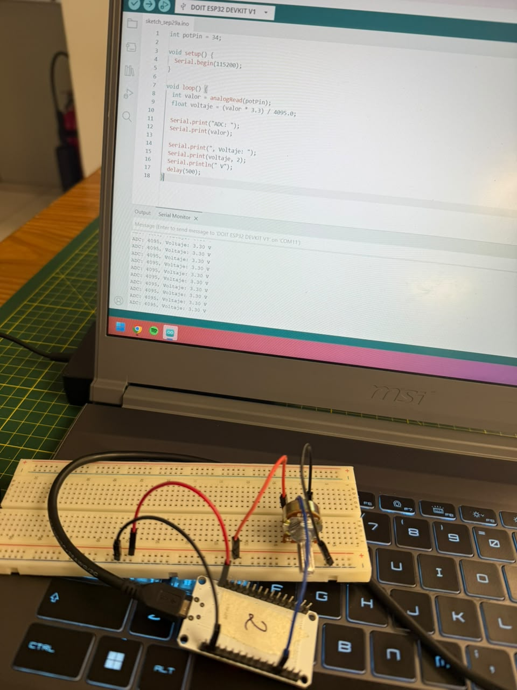
</p>

<p align="center"><em>Evidencia visual de la lectura y procesamiento del potenciómetro.</em></p>


---

# 5. Actividad 02: Conexión del ESP32 a un Hotspot WiFi

## Propósito

Utilizar un teléfono celular como punto de acceso inalámbrico y comprobar que el ESP32 pueda incorporarse a la red y obtener una dirección IP válida.

## Procedimiento

Se habilitó el Hotspot del smartphone y se configuraron en el programa el nombre de la red y su contraseña. A continuación, el ESP32 inició el proceso de asociación mediante la librería WiFi.h. Una vez conectada la placa, la dirección IP fue mostrada en el monitor serial.

## Código empleado

```cpp
#include <WiFi.h>

const char* SSID = "UPCH_CENTRAL";

const char* PASSWORD = "CAYETANO2022";

void setup() {

Serial.begin(115200);

WiFi.mode(WIFI_STA);

WiFi.begin(SSID, PASSWORD);

Serial.print("Conectando al Hotspot");

while (WiFi.status() != WL_CONNECTED) {

delay(500);

Serial.print(".");

}

Serial.println("\nConexion establecida");

Serial.print("Direccion IP asignada: ");

Serial.println(WiFi.localIP());

}

void loop() {

}
```


## Resultado esperado

El monitor serial debe indicar que la conexión fue establecida y mostrar una dirección IP privada asignada por el teléfono o router. Esta conexión constituye la base para las siguientes prácticas que requieren comunicación con servicios en Internet.

<p align="center">
  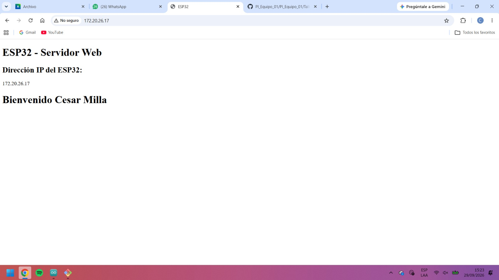
</p>

<p align="center"><em>Evidencia visual de la conexión WiFi del ESP32.</em></p>

<p align="center">
  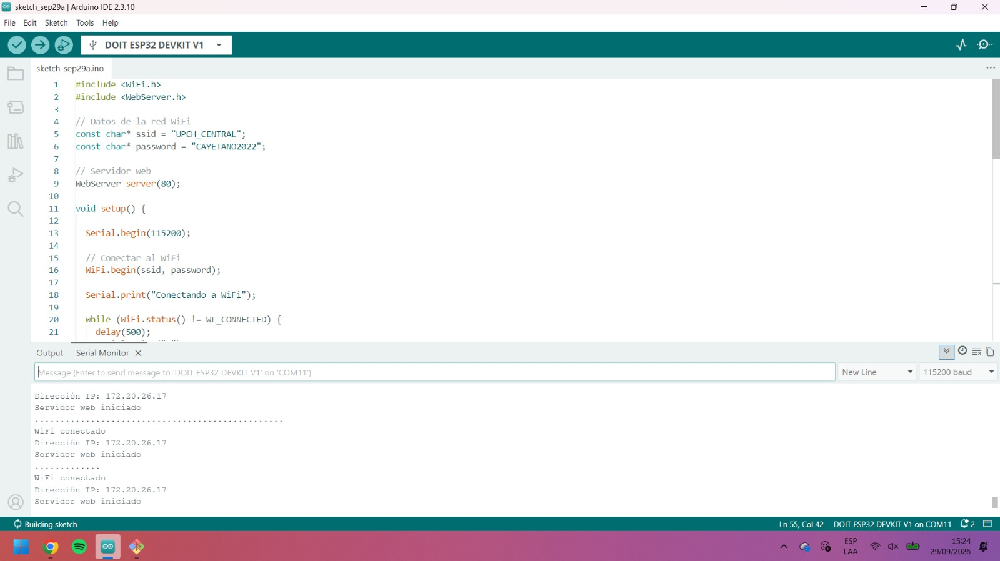
</p>

<p align="center"><em>Evidencia complementaria de la conexión y dirección IP asignada.</em></p>


---

# 6. Actividad 03: Envío del potenciómetro a plataformas IoT

## Propósito

Publicar en Internet la variación del potenciómetro conectado al ESP32 y observarla mediante plataformas de Internet de las Cosas. La práctica considera Arduino Cloud, ThingSpeak y Ubidots como alternativas de visualización.

## Conexión del potenciómetro

| **Elemento / terminal**   | **Conexión en ESP32** |
|---------------------------|-----------------------|
| VCC                       | 3.3 V                 |
| GND                       | GND                   |
| Salida / terminal central | GPIO 34               |

## Funcionamiento

El ESP32 obtiene varias muestras del potenciómetro, calcula un promedio, convierte la lectura a voltaje y transmite el dato a través de WiFi. En cada plataforma se configura una variable o campo para representar la medición mediante indicadores o gráficos históricos.

## Ejemplo de envío mediante ThingSpeak

```cpp
#include <WiFi.h>

#include <ThingSpeak.h>

const char* SSID = "UPCH_CENTRAL";

const char* PASSWORD = "CAYETANO2022";

unsigned long CHANNEL_ID = TU_CHANNEL_ID;

const char* WRITE_API_KEY = "TU_WRITE_API_KEY";

WiFiClient client;

const int POT_PIN = 34;

void setup() {

Serial.begin(115200);

WiFi.begin(SSID, PASSWORD);

while (WiFi.status() != WL_CONNECTED) {

delay(500);

Serial.print(".");

}

ThingSpeak.begin(client);

}

void loop() {

long suma = 0;

for (int i = 0; i < 10; i++) {

suma += analogRead(POT_PIN);

delay(40);

}

float adcPromedio = suma / 10.0;

float voltaje = (adcPromedio * 3.3) / 4095.0;

ThingSpeak.setField(1, voltaje);

int codigo = ThingSpeak.writeFields(CHANNEL_ID, WRITE_API_KEY);

Serial.print("Voltaje enviado: ");

Serial.print(voltaje, 3);

Serial.print(" V | Respuesta: ");

Serial.println(codigo);

delay(15000);

}
```


## Registro en las plataformas

| **Plataforma** | **Dato publicado**         | **Visualización esperada** |
|----------------|----------------------------|----------------------------|
| Arduino Cloud  | Voltaje o ADC promedio     | Variable, gauge o gráfica  |
| ThingSpeak     | Field 1: voltaje           | Gráfica temporal           |
| Ubidots        | Variable del potenciómetro | Widget/serie temporal      |

## Resultado esperado

Al mover el potenciómetro, la gráfica o indicador de la plataforma debe reflejar la variación del dato enviado. El cambio puede visualizarse con un pequeño retardo asociado al intervalo de publicación y al procesamiento del servicio.

<p align="center">
  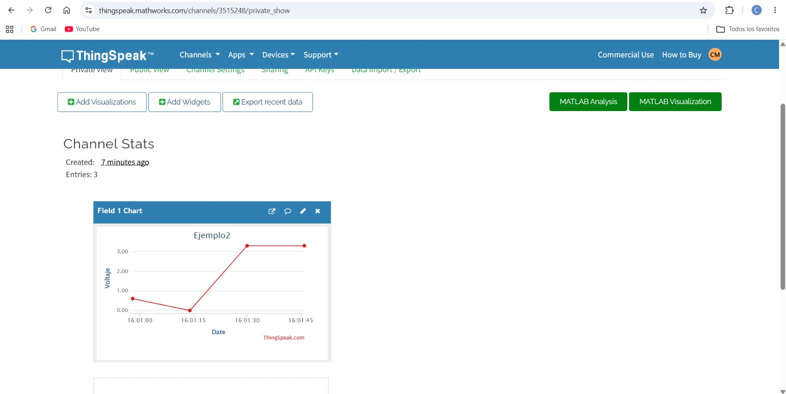
</p>

<p align="center"><em>Evidencia visual del envío de datos del potenciómetro a la plataforma IoT.</em></p>

<p align="center">
  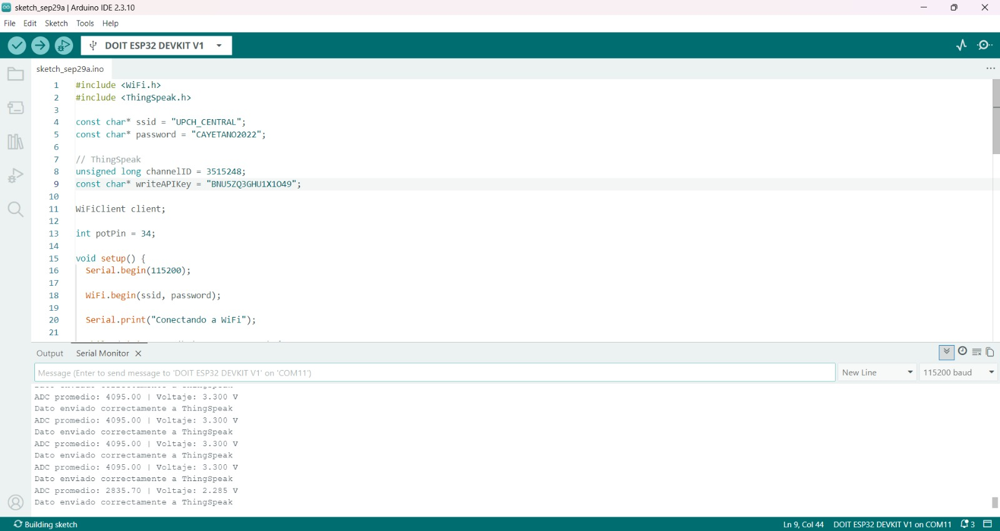
</p>

<p align="center"><em>Evidencia complementaria de la visualización de datos en la nube.</em></p>


---

# 7. Actividad 04: Envío de datos de un sensor a la nube

## Propósito

Aplicar el mismo principio de comunicación de la actividad anterior a un sensor distinto del potenciómetro. Para este informe se plantea un LDR como ejemplo, cuya resistencia varía según la cantidad de luz recibida.

## Conexión de referencia

| **Elemento / terminal** | **Conexión en ESP32** |
|-------------------------|-----------------------|
| Módulo LDR - VCC        | 3.3 V                 |
| Módulo LDR - GND        | GND                   |
| Módulo LDR - AO         | GPIO 34               |

## Procedimiento

El ESP32 lee la señal analógica producida por el sensor de luz y envía periódicamente el valor a la nube. Al cubrir el sensor o acercar una fuente luminosa, la lectura cambia, permitiendo observar la respuesta del sensor en un gráfico remoto.

## Código de ejemplo para ThingSpeak

```cpp
#include <WiFi.h>

#include <HTTPClient.h>

const char* ssid = "UPCH_CENTRAL";

const char* password = "CAYETANO2022";

String apiKey = "1NNJ4UQJU2CYUT6M";

const int MQ2_PIN = 34;

void setup() {

Serial.begin(115200);

pinMode(MQ2_PIN, INPUT);

WiFi.begin(ssid, password);

while (WiFi.status() != WL_CONNECTED) {

delay(500);

Serial.print(".");

}

Serial.println("\nWiFi conectado");

}

void loop() {

int valorMQ2 = analogRead(MQ2_PIN);

Serial.print("Valor MQ-2: ");

Serial.println(valorMQ2);

if (WiFi.status() == WL_CONNECTED) {

HTTPClient http;

String url = "https://api.thingspeak.com/update?api_key="

+ apiKey + "&field1=" + String(valorMQ2);

http.begin(url);

int respuesta = http.GET();

Serial.print("Respuesta ThingSpeak: ");

Serial.println(respuesta);

http.end();

}

delay(15000);

}
```


## Resultado esperado

Los valores deben modificarse al variar la iluminación que llega al LDR. En la plataforma IoT se observa una serie temporal que permite comparar el comportamiento del sensor en diferentes condiciones.

La misma estructura puede adaptarse a otros sensores del kit, como LM35, MQ-2 u otros módulos analógicos, cambiando la lectura y, cuando corresponda, la ecuación de conversión.

<p align="center">
  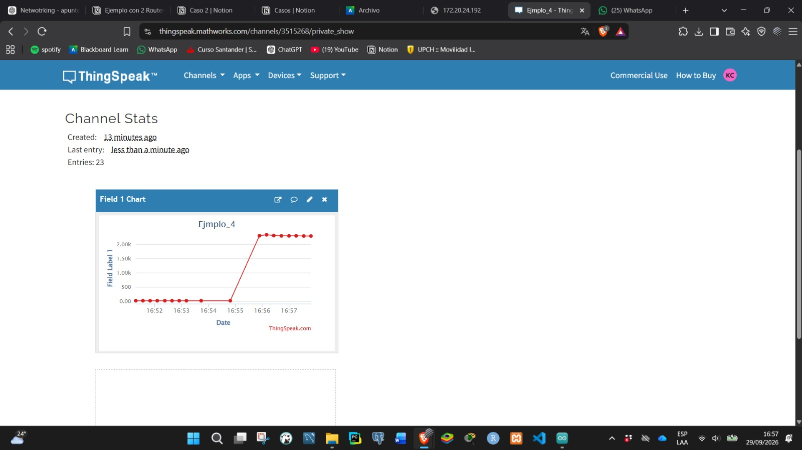
</p>

<p align="center"><em>Evidencia visual del sensor empleado en la práctica.</em></p>

<p align="center">
  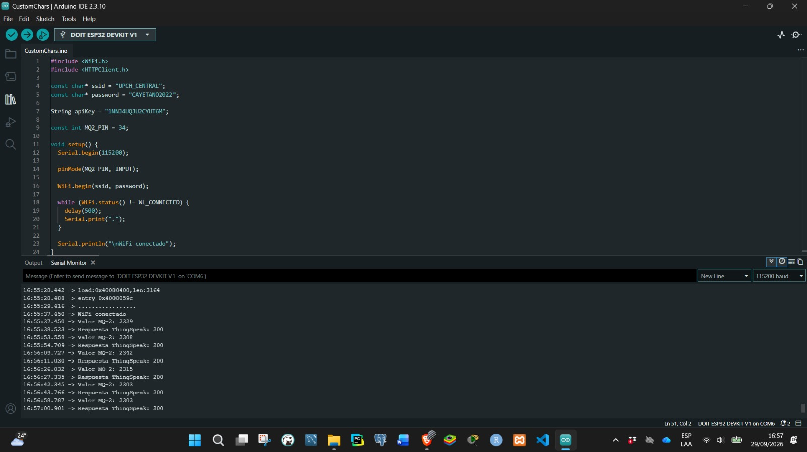
</p>

<p align="center"><em>Evidencia complementaria de las lecturas obtenidas.</em></p>

<p align="center">
  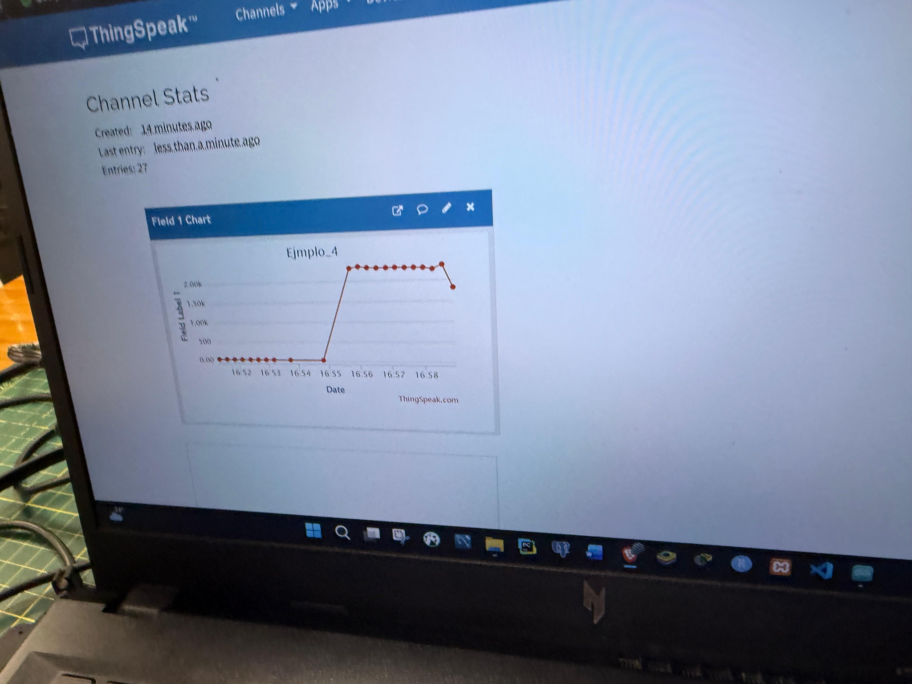
</p>

<p align="center"><em>Evidencia de la visualización de los datos enviados a la nube.</em></p>


---

# 8. Actividad 05: Control de un LED desde la nube con Firebase

## Propósito

Controlar un LED conectado al ESP32 desde una página web. En esta implementación, Firebase Realtime Database funciona como intermediario en la nube: la página modifica el estado y el ESP32 consulta dicho valor para ejecutar la orden.

## Arquitectura de la solución

> **Arquitectura IoT:** `Página web` → `Firebase Realtime Database` → `ESP32` → `LED`

## Conexión del LED

| **Elemento / terminal** | **Conexión en ESP32**                |
|-------------------------|--------------------------------------|
| Ánodo del LED           | GPIO 2 mediante resistencia de 220 Ω |
| Cátodo del LED          | GND                                  |

## Estructura utilizada en Realtime Database

```text
estado: false
```

Cuando el interruptor de la web cambia a encendido, la variable estado pasa a true. El ESP32 lee ese dato desde Internet y coloca el GPIO 2 en nivel alto. Al volver a false, el pin se desactiva y el LED se apaga.

## Código del ESP32 con FirebaseClient

```cpp
#define ENABLE_USER_AUTH

#define ENABLE_DATABASE

#include <WiFi.h>

#include <WiFiClientSecure.h>

#include <FirebaseClient.h>

#define WIFI_SSID "MILLA"

#define WIFI_PASSWORD "Anjali04"

#define API_KEY "TU_FIREBASE_API_KEY"

#define DATABASE_URL "https://TU-PROYECTO-default-rtdb.firebaseio.com/"

#define USER_EMAIL "esp32@talleriot.com"

#define USER_PASSWORD "Esp32Proyecto2026"

#define LED_PIN 2

UserAuth user_auth(API_KEY, USER_EMAIL, USER_PASSWORD);

FirebaseApp app;

WiFiClientSecure ssl_client;

using AsyncClient = AsyncClientClass;

AsyncClient async_client(ssl_client);

RealtimeDatabase Database;

unsigned long anterior = 0;

void callback(AsyncResult &resultado) {

if (resultado.isError()) {

Serial.println(resultado.error().message());

}

}

void setup() {

Serial.begin(115200);

pinMode(LED_PIN, OUTPUT);

digitalWrite(LED_PIN, LOW);

WiFi.begin(WIFI_SSID, WIFI_PASSWORD);

while (WiFi.status() != WL_CONNECTED) {

delay(500);

Serial.print(".");

}

ssl_client.setInsecure();

initializeApp(async_client, app, getAuth(user_auth), callback, "authTask");

app.getApp<RealtimeDatabase>(Database);

Database.url(DATABASE_URL);

}

void loop() {

app.loop();

if (app.ready() && millis() - anterior >= 1000) {

anterior = millis();

bool estado = Database.get<bool>(async_client, "/estado");

digitalWrite(LED_PIN, estado ? HIGH : LOW);

Serial.println(estado ? "LED ENCENDIDO" : "LED APAGADO");

}

}
```


## Lógica de la página web

La interfaz web utiliza el SDK de Firebase para escuchar y modificar la ruta estado en tiempo real. Un interruptor visual permite cambiar el valor entre true y false, mientras que el estado recibido de la base actualiza el texto y la apariencia del panel.

## Resultado esperado

El LED debe responder a los cambios realizados desde la interfaz web incluso cuando el dispositivo de control y el ESP32 estén en redes diferentes, siempre que ambos tengan acceso a Internet y a Firebase.

Por seguridad, el informe no incluye contraseñas de WiFi, claves de usuarios ni credenciales privadas. En una implementación real deben aplicarse reglas de acceso y autenticación adecuadas en Firebase.

<p align="center">
  
</p>

<p align="center"><em>Evidencia visual del control del LED mediante Firebase.</em></p>

<p align="center">
  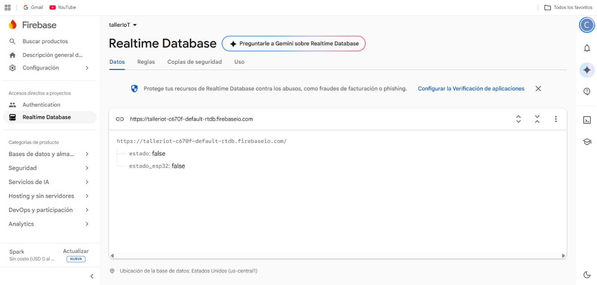
</p>

<p align="center"><em>Evidencia complementaria de Firebase Realtime Database.</em></p>

<p align="center">
  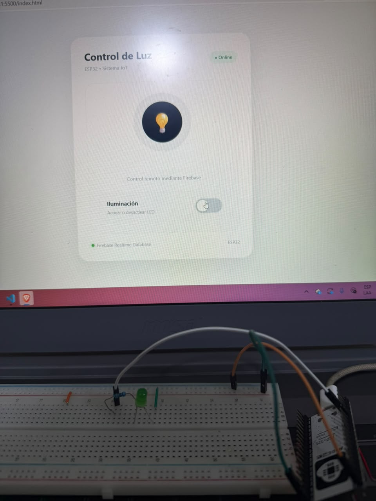
</p>

<p align="center"><em>Evidencia de la interfaz web utilizada para controlar el LED.</em></p>

<p align="center">
  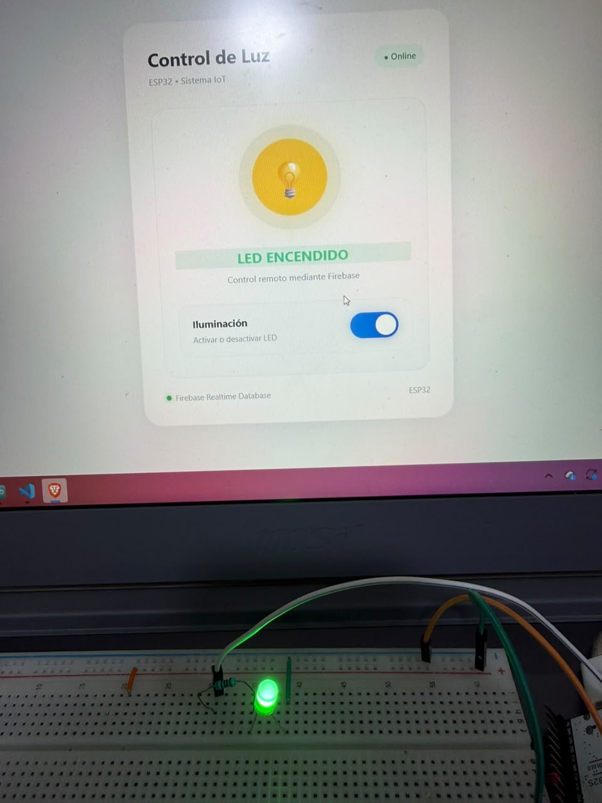
</p>

<p align="center"><em>Evidencia complementaria del funcionamiento del sistema de control remoto.</em></p>


---

# 9. Conclusiones

1.  El promediado de varias muestras mejora la estabilidad de la lectura de un sensor analógico y permite convertir de manera sencilla los valores del ADC a unidades de voltaje.

2.  La conexión WiFi del ESP32 permite que la placa deje de funcionar como un dispositivo aislado y pueda intercambiar información con servicios externos mediante Internet.

3.  Las plataformas IoT facilitan el almacenamiento y la representación gráfica de variables físicas, por lo que son útiles para supervisar sensores a distancia y analizar su evolución en el tiempo.

4.  La misma arquitectura de adquisición y transmisión puede reutilizarse con diferentes sensores, modificando principalmente la forma en que se interpreta la señal obtenida.

5.  Firebase Realtime Database permitió implementar un esquema de control remoto en el que una página web envía una orden a la nube y el ESP32 la convierte en una acción física sobre un LED.


---

# 10. Recomendaciones

- No publicar en capturas o informes las contraseñas de redes WiFi, API Keys de escritura o credenciales de usuarios.

- Verificar que el GPIO seleccionado admita el tipo de señal requerido y respetar los niveles eléctricos de 3.3 V del ESP32.

- Mantener intervalos adecuados de envío para evitar exceder límites de las plataformas en la nube.

- Antes de la entrega final, incorporar como evidencia las fotografías del montaje, capturas del monitor serial y gráficos obtenidos en cada servicio.
