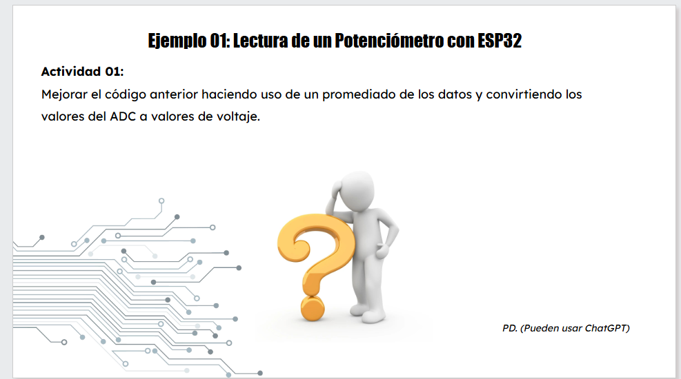
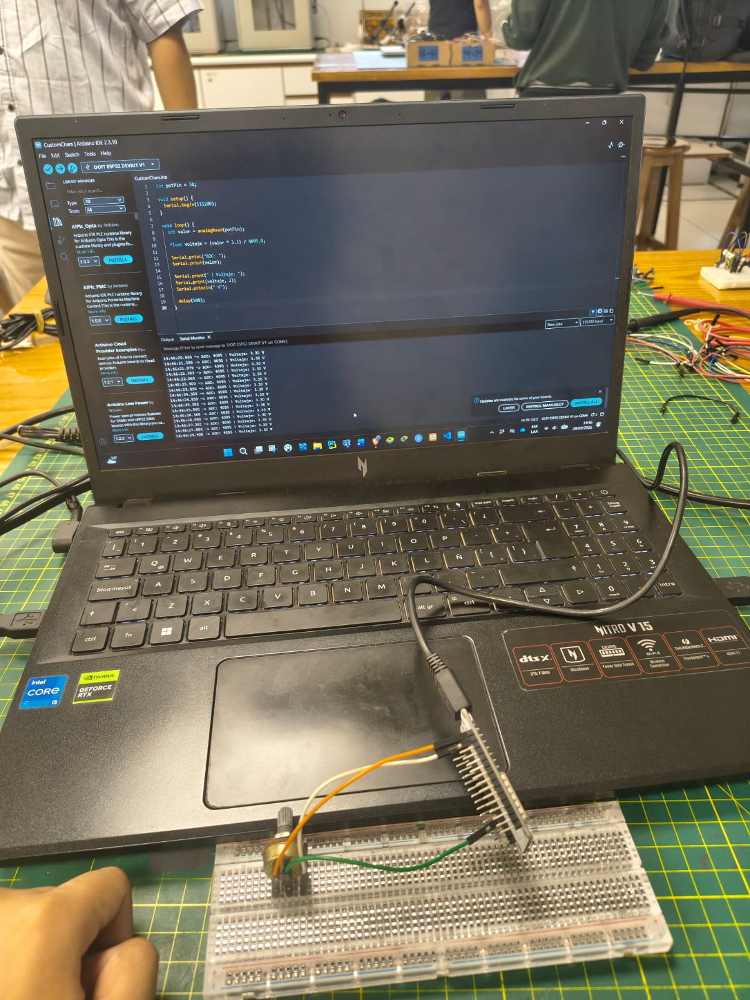
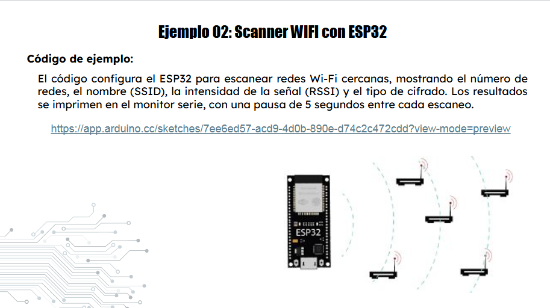
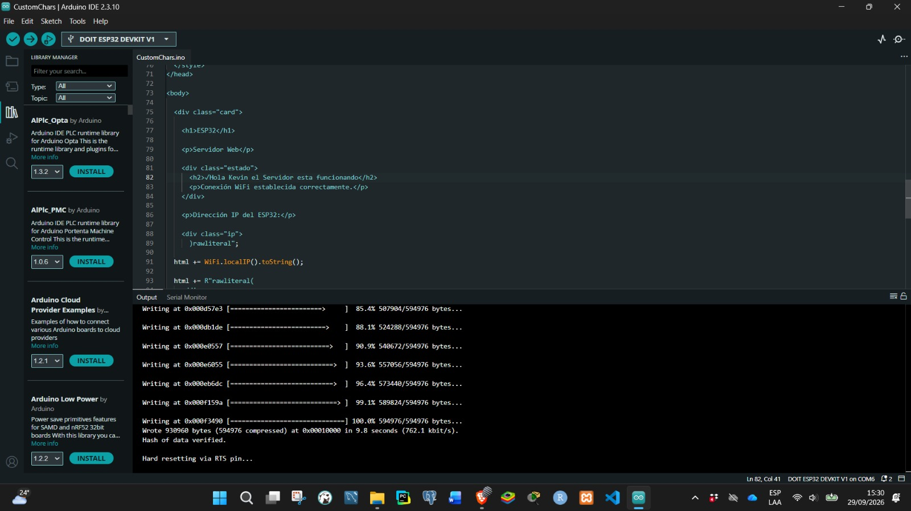
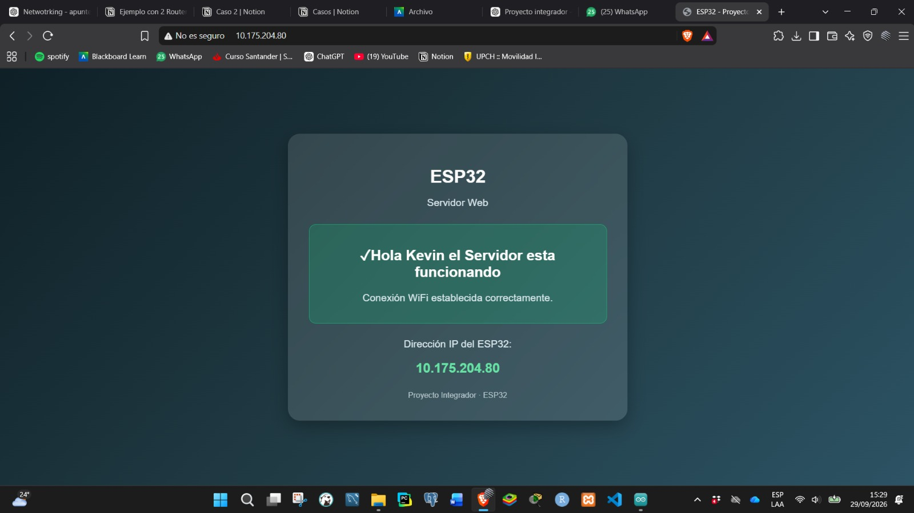
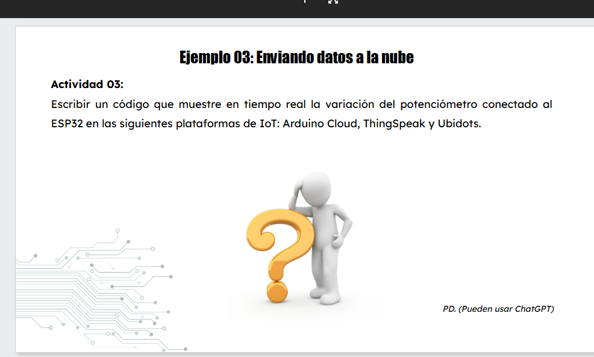
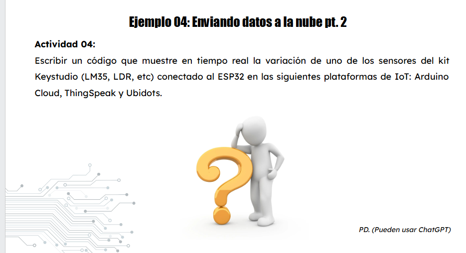
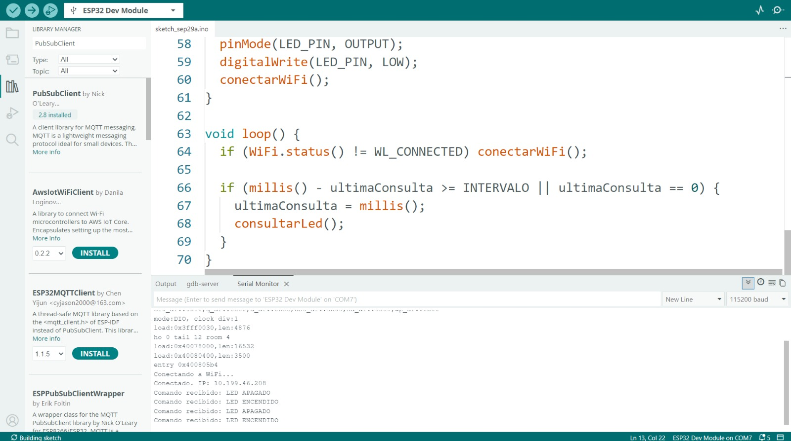
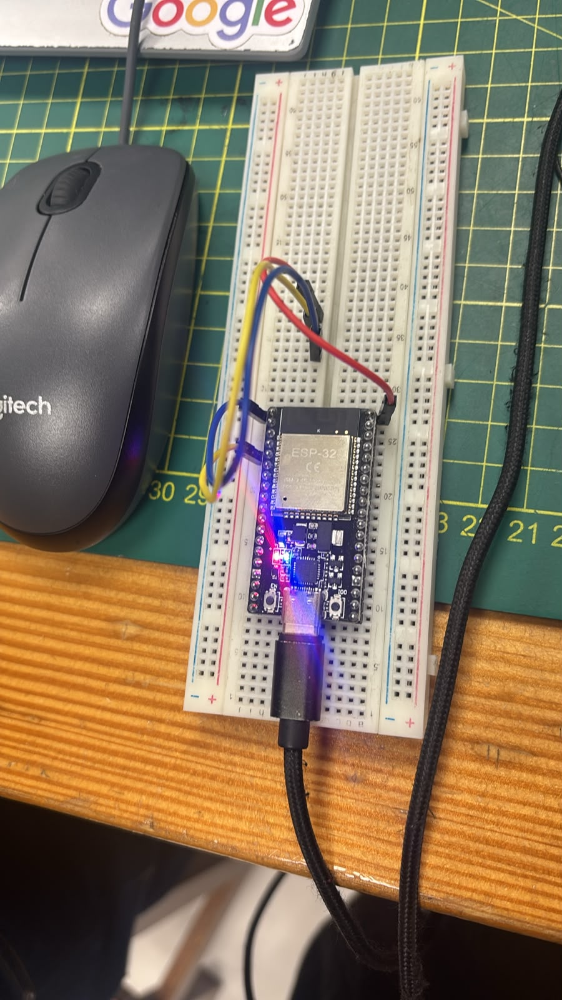

# INFORME DE TALLER

## ESP32, sensores, WiFi y plataformas IoT

**Análisis y explicación de los Ejemplos 01 al 05**

*Documento convertido desde el informe en formato DOCX. Las evidencias visuales se encuentran en la carpeta `imagenes/`.*

INFORME DE TALLER
ESP32, sensores, WiFi y plataformas IoT

Análisis y explicación de los Ejemplos 01 al 05



*Figura 1. Actividad del Ejemplo 01: lectura de un potenciómetro con ESP32.*

Curso / Taller de sistemas embebidos e IoT
Plataforma: ESP32 + Arduino IDE
Documento elaborado a partir de las evidencias, códigos e imágenes proporcionados.

# 1. Introducción

El presente informe documenta el desarrollo de cinco actividades prácticas realizadas con una placa ESP32. Las actividades muestran una progresión desde la lectura analógica de un potenciómetro hasta la comunicación con redes WiFi, la publicación de datos en ThingSpeak y la consulta remota de un estado para controlar un LED.

En cada ejemplo se explica el propósito del código, la función de sus principales instrucciones, la forma en que se conecta el circuito, el comportamiento observado en el monitor serial y, cuando corresponde, la interpretación de las gráficas generadas en ThingSpeak. Las evidencias visuales se integran como respaldo del desarrollo práctico.

# 2. Resumen de las actividades

| Elemento | Descripción |
| --- | --- |
| Ejemplo 01 | Lectura de un potenciómetro, promedio de 10 muestras y conversión de ADC a voltaje. |
| Ejemplo 02 | Conexión del ESP32 a una red WiFi y creación de un servidor web local para mostrar la IP. |
| Ejemplo 03 | Lectura del potenciómetro y envío del voltaje a ThingSpeak mediante su librería. |
| Ejemplo 04 | Lectura analógica del sensor MQ-2 y envío del valor a ThingSpeak mediante HTTP. |
| Ejemplo 05 | Consulta de un campo de ThingSpeak y control de un LED del ESP32 según el valor recibido. |

# 3. Ejemplo 01: Lectura de un potenciómetro con ESP32

Objetivo: mejorar la lectura del potenciómetro tomando varias muestras, calcular un promedio para reducir variaciones instantáneas y convertir el resultado del ADC en un valor de voltaje.

## 3.1. Componentes y conexión

- ESP32 DevKit.
- Potenciómetro.
- Protoboard y cables de conexión.
- Entrada analógica GPIO 34.
El potenciómetro funciona como un divisor de tensión. Sus extremos se conectan a alimentación y tierra, mientras que el terminal central (cursor) se conecta al GPIO 34. Al girar el mando cambia la tensión aplicada a la entrada ADC del ESP32.


*Figura 2. Montaje físico del potenciómetro en la protoboard.*



*Figura 3. Evidencia del código y de las lecturas obtenidas en el monitor serial.*

## 3.2. Código utilizado

```cpp
int potPin = 34;
void setup() {
```

```cpp
Serial.begin(115200);
}
```

```cpp
void loop() {
long suma = 0;
```

```cpp
// Tomar 10 lecturas
for (int i = 0; i < 10; i++) {
```

```cpp
int valor = analogRead(potPin);
suma += valor;
```

```cpp
delay(50);
}
```

```cpp
// Calcular promedio de las 10 lecturas
float promedioADC = suma / 10.0;
```

```cpp
// Convertir el promedio a voltaje
float voltaje = (promedioADC * 3.3) / 4095.0;
```

```cpp
Serial.print("Promedio ADC: ");
Serial.print(promedioADC);
```

```cpp
Serial.print(" | Voltaje promedio: ");
Serial.print(voltaje, 3);
```

```cpp
Serial.println(" V");
delay(500);
```

```cpp
}
```

## 3.3. Explicación del funcionamiento

1. Se define el GPIO 34 como entrada analógica mediante la variable potPin.
1. En setup() se inicia la comunicación serial a 115200 baudios.
1. En cada ciclo se realizan 10 lecturas con analogRead(potPin).
1. Las diez lecturas se acumulan en suma y posteriormente se divide entre 10 para obtener promedioADC.
1. El ADC del ESP32 utiliza una escala de 0 a 4095. Por ello, el promedio se convierte a voltios mediante (ADC × 3.3) / 4095.
1. Finalmente, el valor promedio de ADC y el voltaje se muestran en el monitor serial.
El promedio permite que pequeñas fluctuaciones eléctricas no se reflejen directamente como cambios bruscos en el valor mostrado. La resolución utilizada en la fórmula corresponde a un ADC de 12 bits, con 4096 niveles posibles (0–4095).

## 3.4. Interpretación de las salidas

En la evidencia del monitor serial se observan lecturas del ADC cercanas a la parte alta de su rango y valores de tensión próximos a 3.3 V. Esto indica que el cursor del potenciómetro se encontraba cerca del extremo de mayor tensión. Al girar el potenciómetro hacia el otro extremo, el ADC debe disminuir y el voltaje calculado debe acercarse a 0 V. Por tanto, existe una relación directa entre la posición del cursor, la lectura ADC y el voltaje mostrado.

# 4. Ejemplo 02: Scanner WiFi / servidor web con ESP32

Objetivo: conectar el ESP32 a una red WiFi utilizando un smartphone como punto de acceso y permitir que el usuario acceda desde un navegador a una página web alojada directamente en el ESP32.



*Figura 4. Planteamiento de la actividad del Ejemplo 02.*



*Figura 5. Evidencia de la carga del programa en el ESP32.*



*Figura 6. Página web mostrada desde la dirección IP del ESP32.*

## 4.1. Código utilizado

```cpp
#include <WiFi.h>
#include <WebServer.h>
```

```cpp
const char* ssid = "GalaxyA04s";
const char* password = "12345678";
```

```cpp
WebServer server(80);
void handleRoot() {
```

```cpp
String html = R"rawliteral(
<!DOCTYPE html>
```

```cpp
<html lang="es">
<head>
```

```cpp
<meta charset="UTF-8">
<meta name="viewport" content="width=device-width, initial-scale=1.0">
```

```cpp
<title>ESP32 - Proyecto Integrador</title>
<style>
```

```cpp
body {
margin: 0;
```

```cpp
font-family: Arial, sans-serif;
background: linear-gradient(135deg, #0f2027, #203a43, #2c5364);
```

```cpp
color: white;
display: flex;
```

```cpp
justify-content: center;
align-items: center;
```

```cpp
min-height: 100vh;
}
```

```cpp
.card {
background: rgba(255, 255, 255, 0.12);
```

```cpp
backdrop-filter: blur(10px);
width: 90%;
```

```cpp
max-width: 500px;
padding: 35px;
```

```cpp
border-radius: 20px;
text-align: center;
```

```cpp
box-shadow: 0 10px 30px rgba(0,0,0,0.3);
}
```

```cpp
h1 { margin-bottom: 10px; font-size: 30px; }
p { color: #d8e6eb; font-size: 17px; }
```

```cpp
.estado {
margin: 25px 0;
```

```cpp
padding: 15px;
border-radius: 12px;
```

```cpp
background: rgba(0, 200, 120, 0.2);
border: 1px solid rgba(0, 255, 150, 0.4);
```

```cpp
}
.ip {
```

```cpp
font-size: 22px;
font-weight: bold;
```

```cpp
color: #66e3a4;
}
```

```cpp
.footer {
margin-top: 25px;
```

```cpp
font-size: 13px;
color: #b8c9ce;
```

```cpp
}
</style>
```

```cpp
</head>
<body>
```

```cpp
<div class="card">
<h1>ESP32</h1>
```

```cpp
<p>Servidor Web</p>
<div class="estado">
```

```cpp
<h2>✓Hola Kevin Servidor funcionando</h2>
<p>Conexión WiFi establecida correctamente.</p>
```

```cpp
</div>
<p>Dirección IP del ESP32:</p>
```

```cpp
<div class="ip">
)rawliteral";
```

```cpp
html += WiFi.localIP().toString();
html += R"rawliteral(
```

```cpp
</div>
<div class="footer">
```

```cpp
Proyecto Integrador · ESP32
</div>
```

```cpp
</div>
</body>
```

```cpp
</html>
)rawliteral";
```

```cpp
server.send(200, "text/html", html);
}
```

```cpp
void setup() {
Serial.begin(115200);
```

```cpp
WiFi.begin(ssid, password);
Serial.print("Conectando a WiFi");
```

```cpp
while (WiFi.status() != WL_CONNECTED) {
delay(500);
```

```cpp
Serial.print(".");
}
```

```cpp
Serial.println();
Serial.println("WiFi conectado");
```

```cpp
Serial.print("Direccion IP: ");
Serial.println(WiFi.localIP());
```

```cpp
server.on("/", handleRoot);
server.begin();
```

```cpp
Serial.println("Servidor web iniciado");
}
```

```cpp
void loop() {
server.handleClient();
```

```cpp
}
```

## 4.2. Explicación del funcionamiento

1. WiFi.h proporciona las funciones necesarias para conectar el ESP32 a la red inalámbrica.
1. WebServer.h permite levantar un servidor HTTP en el puerto 80.
1. WiFi.begin(ssid, password) inicia la conexión con la red configurada.
1. El while mantiene el programa esperando hasta que el ESP32 se encuentre conectado.
1. WiFi.localIP() obtiene la dirección IP que el router o punto de acceso asignó al ESP32.
1. server.on("/", handleRoot) indica que cuando el navegador solicite la ruta principal se ejecutará handleRoot().
1. handleRoot() construye una página HTML y envía una respuesta HTTP 200 al navegador.
1. server.handleClient() mantiene atendidas las solicitudes del navegador dentro de loop().
## 4.3. Resultado e interpretación

La evidencia muestra que el ESP32 se conectó correctamente y que el navegador pudo acceder a su servidor web utilizando la IP local. En la práctica se observó la dirección 10.175.204.80. Esto confirma que el dispositivo recibió una dirección válida dentro de la red y que el servidor HTTP del ESP32 estaba funcionando.

# 5. Ejemplo 03: Envío de datos a ThingSpeak

Objetivo: tomar la lectura del potenciómetro, calcular su valor promedio y convertirlo a voltaje para enviarlo a una plataforma IoT. En esta actividad se utilizó ThingSpeak como servicio de almacenamiento y visualización.



*Figura 7. Planteamiento de la actividad del Ejemplo 03.*


*Figura 8. Montaje y ejecución de la práctica con ESP32 y potenciómetro.*


*Figura 9. Evidencia del programa utilizado para enviar el valor a ThingSpeak.*


*Figura 10. Gráfica de ThingSpeak correspondiente al voltaje registrado.*

## 5.1. Código utilizado

```cpp
#include <WiFi.h>
#include <ThingSpeak.h>
```

```cpp
const char* ssid = "UPCH_CENTRAL";
const char* password = "CAYETANO2022";
```

```cpp
// ThingSpeak
unsigned long channelID = 3515248;
```

```cpp
const char* writeAPIKey = "BNU5ZQ3GHU1X1O49";
WiFiClient client;
```

```cpp
int potPin = 34;
void setup() {
```

```cpp
Serial.begin(115200);
WiFi.begin(ssid, password);
```

```cpp
Serial.print("Conectando a WiFi");
while (WiFi.status() != WL_CONNECTED) {
```

```cpp
delay(500);
Serial.print(".");
```

```cpp
}
Serial.println();
```

```cpp
Serial.println("WiFi conectado");
Serial.print("IP del ESP32: ");
```

```cpp
Serial.println(WiFi.localIP());
ThingSpeak.begin(client);
```

```cpp
}
void loop() {
```

```cpp
long suma = 0;
// Tomar 10 lecturas
```

```cpp
for (int i = 0; i < 10; i++) {
int valor = analogRead(potPin);
```

```cpp
suma += valor;
delay(50);
```

```cpp
}
// Promedio de ADC
```

```cpp
float promedioADC = suma / 10.0;
// Conversión a voltaje
```

```cpp
float voltaje = (promedioADC * 3.3) / 4095.0;
Serial.print("ADC promedio: ");
```

```cpp
Serial.print(promedioADC);
Serial.print(" | Voltaje: ");
```

```cpp
Serial.print(voltaje, 3);
Serial.println(" V");
```

```cpp
// Enviar a Field 1
ThingSpeak.setField(1, voltaje);
```

```cpp
int respuesta = ThingSpeak.writeFields(channelID, writeAPIKey);
if (respuesta == 200) {
```

```cpp
Serial.println("Dato enviado correctamente a ThingSpeak");
} else {
```

```cpp
Serial.print("Error al enviar. Codigo HTTP: ");
Serial.println(respuesta);
```

```cpp
}
// Esperar antes del siguiente envío
```

```cpp
delay(15000);
}
```

## 5.2. Explicación del código

1. Se incluyen WiFi.h y ThingSpeak.h para establecer la conexión y comunicarse con la plataforma.
1. channelID identifica el canal de ThingSpeak y writeAPIKey autoriza el envío de datos.
1. WiFiClient client crea el cliente de red usado por ThingSpeak.
1. Se toman 10 muestras del GPIO 34 y se calcula su promedio.
1. El promedio ADC se convierte a voltios utilizando el rango de 3.3 V y 4095 cuentas.
1. ThingSpeak.setField(1, voltaje) coloca el valor en el Field 1 del canal.
1. ThingSpeak.writeFields(...) realiza el envío y devuelve un código de estado.
1. El código 200 se interpreta como una respuesta HTTP correcta.
1. El delay de 15000 ms establece aproximadamente 15 segundos entre envíos.
## 5.3. Interpretación de la gráfica

La gráfica evidencia tres comportamientos principales: primero, un periodo relativamente estable alrededor de 1.5–1.6 V; posteriormente, una caída hasta valores cercanos a 0 V; finalmente, un incremento hasta aproximadamente 3.3 V, donde la señal vuelve a mantenerse estable. Este comportamiento es coherente con el giro del potenciómetro: una posición intermedia produce una tensión intermedia, mientras que las posiciones cercanas a los extremos producen valores próximos a 0 V o 3.3 V.

Los puntos repetidos corresponden a los envíos periódicos realizados por el ESP32. La gráfica, por tanto, permite visualizar remotamente cómo cambia la variable medida en función del tiempo.

# 6. Ejemplo 04: Envío de datos del sensor MQ-2 a ThingSpeak

Objetivo: obtener una lectura analógica del sensor de gas MQ-2 conectado al ESP32 y enviar el valor a ThingSpeak para observar su variación en el tiempo.



*Figura 11. Planteamiento de la actividad del Ejemplo 04.*


*Figura 12. Evidencia de la gráfica generada en ThingSpeak a partir del MQ-2.*

## 6.1. Conexión del circuito

| Elemento | Descripción |
| --- | --- |
| MQ-2 VCC | Alimentación del módulo según el montaje empleado. |
| MQ-2 GND | GND del ESP32. |
| MQ-2 AO | GPIO 34 del ESP32 para lectura analógica. |
| GPIO 34 | Entrada ADC utilizada para obtener el valor del sensor. |

En el programa se define const int MQ2_PIN = 34. El ESP32 realiza una conversión analógico-digital de la salida del sensor. El valor obtenido es una lectura ADC cruda, no una concentración de gas expresada directamente en ppm.

## 6.2. Código utilizado

```cpp
#include <WiFi.h>
#include <HTTPClient.h>
```

```cpp
const char* ssid = "UPCH_CENTRAL";
const char* password = "CAYETANO2022";
```

```cpp
String apiKey = "1NNJ4UQJU2CYUT6M";
const int MQ2_PIN = 34;
```

```cpp
void setup() {
Serial.begin(115200);
```

```cpp
pinMode(MQ2_PIN, INPUT);
WiFi.begin(ssid, password);
```

```cpp
while (WiFi.status() != WL_CONNECTED) {
delay(500);
```

```cpp
Serial.print(".");
}
```

```cpp
Serial.println("\nWiFi conectado");
}
```

```cpp
void loop() {
int valorMQ2 = analogRead(MQ2_PIN);
```

```cpp
Serial.print("Valor MQ-2: ");
Serial.println(valorMQ2);
```

```cpp
if (WiFi.status() == WL_CONNECTED) {
HTTPClient http;
```

```cpp
String url = "https://api.thingspeak.com/update?api_key="
+ apiKey + "&field1=" + String(valorMQ2);
```

```cpp
http.begin(url);
int respuesta = http.GET();
```

```cpp
Serial.print("Respuesta ThingSpeak: ");
Serial.println(respuesta);
```

```cpp
http.end();
}
```

```cpp
delay(15000);
}
```

## 6.3. Explicación del funcionamiento

1. Se incluyen WiFi.h y HTTPClient.h.
1. Se configura el GPIO 34 como entrada para recibir la señal analógica del MQ-2.
1. analogRead(MQ2_PIN) obtiene el valor digital correspondiente al nivel de tensión presente en la salida analógica del módulo.
1. Se construye una URL con el Write API Key y el valor del sensor en Field 1.
1. http.GET() realiza la solicitud HTTP al servidor de ThingSpeak.
1. http.end() libera los recursos utilizados por la conexión.
1. El envío se repite aproximadamente cada 15 segundos.
## 6.4. Interpretación de la salida y de la gráfica

En el monitor serial, una respuesta ThingSpeak igual a 200 indica que el servidor recibió correctamente la solicitud. La variable 'Valor MQ-2' representa la lectura ADC instantánea del sensor.

En la gráfica de evidencia se observa inicialmente una señal cercana a valores bajos y, posteriormente, un incremento brusco hasta aproximadamente la zona de 2000–2300 cuentas ADC, manteniéndose después en una meseta con una pequeña disminución al final. Esto significa que la tensión entregada por la salida analógica del MQ-2 aumentó durante la prueba.

Importante: la lectura ADC no debe interpretarse directamente como 'ppm de gas'. Para convertirla en una concentración física se requiere conocer la característica del sensor, realizar calibración y aplicar el procedimiento correspondiente al gas y al módulo utilizado.

# 7. Ejemplo 05: Consulta de ThingSpeak y control de un LED

Objetivo: consultar periódicamente un valor almacenado en ThingSpeak y utilizarlo como comando remoto para encender o apagar un LED conectado al GPIO 2 del ESP32.



*Figura 13. Código del Ejemplo 05 y evidencia de comandos recibidos en el monitor serial.*



*Figura 14. Montaje físico del ESP32 utilizado en la actividad.*

## 7.1. Código utilizado

```cpp
#include <WiFi.h>
#include <HTTPClient.h>
```

```cpp
// ====== WiFi ======
const char* ssid = "Redmi Note 14 Pro 5G";
```

```cpp
const char* password = "11111111";
// ====== ThingSpeak ======
```

```cpp
const char* CHANNEL_ID = "3515252";
const char* TS_READ_KEY = "RWORDQV5T4AA9YQO";
```

```cpp
// ====== LED ======
const int LED_PIN = 2;
```

```cpp
const unsigned long INTERVALO = 5000; // Consulta cada 5 s
unsigned long ultimaConsulta = 0;
```

```cpp
int estadoLed = -1; // -1 = aún sin estado
void conectarWiFi() {
```

```cpp
Serial.print("Conectando a WiFi");
WiFi.mode(WIFI_STA);
```

```cpp
WiFi.begin(ssid, password);
while (WiFi.status() != WL_CONNECTED) {
```

```cpp
delay(500);
Serial.print(".");
```

```cpp
}
Serial.print("\nConectado. IP: ");
```

```cpp
Serial.println(WiFi.localIP());
}
```

```cpp
void consultarLed() {
HTTPClient http;
```

```cpp
String url = "http://api.thingspeak.com/channels/" + String(CHANNEL_ID) +
"/fields/2/last.txt?api_key=" + String(TS_READ_KEY);
```

```cpp
http.begin(url);
int codigo = http.GET();
```

```cpp
if (codigo == 200) {
String respuesta = http.getString();
```

```cpp
respuesta.trim();
int nuevo = (respuesta == "1") ? 1 : 0;
```

```cpp
if (nuevo != estadoLed) {
estadoLed = nuevo;
```

```cpp
digitalWrite(LED_PIN, estadoLed ? HIGH : LOW);
Serial.print("Comando recibido: ");
```

```cpp
Serial.println(estadoLed ? "LED ENCENDIDO" : "LED APAGADO");
}
```

```cpp
} else {
Serial.print("Error HTTP: ");
```

```cpp
Serial.println(codigo);
}
```

```cpp
http.end();
}
```

```cpp
void setup() {
Serial.begin(115200);
```

```cpp
pinMode(LED_PIN, OUTPUT);
digitalWrite(LED_PIN, LOW);
```

```cpp
conectarWiFi();
}
```

```cpp
void loop() {
if (WiFi.status() != WL_CONNECTED) conectarWiFi();
```

```cpp
if (millis() - ultimaConsulta >= INTERVALO || ultimaConsulta == 0) {
ultimaConsulta = millis();
```

```cpp
consultarLed();
}
```

```cpp
}
```

## 7.2. Explicación del funcionamiento

1. El ESP32 se conecta a la red WiFi configurada mediante conectarWiFi().
1. El LED se configura como salida en el GPIO 2 y comienza apagado.
1. Cada 5 segundos se consulta el último dato almacenado en Field 2 del canal de ThingSpeak.
1. La respuesta se obtiene como texto mediante http.getString().
1. Si la respuesta es '1', el programa interpreta el comando como LED ENCENDIDO; en caso contrario, lo interpreta como LED APAGADO.
1. digitalWrite() cambia físicamente el estado de la salida del GPIO 2.
1. La variable estadoLed evita repetir mensajes y escrituras cuando el estado no ha cambiado.
1. millis() permite controlar el intervalo de consulta sin utilizar un delay prolongado dentro de loop().
## 7.3. Interpretación de la salida

La evidencia del monitor serial muestra mensajes como 'Comando recibido: LED APAGADO' y 'Comando recibido: LED ENCENDIDO'. Esto demuestra el funcionamiento del enlace de lectura: ThingSpeak almacena el comando, el ESP32 consulta el último valor y, según la respuesta, cambia el estado del LED.

El proceso es bidireccional a nivel de arquitectura IoT: en los ejemplos 3 y 4 el ESP32 publica información hacia la nube; en este ejemplo el ESP32 consume información almacenada en la nube y la convierte en una acción física.

# 8. Análisis comparativo de los cinco ejemplos

Las cinco actividades muestran una evolución desde una lectura local hasta un sistema IoT con comunicación de ida y vuelta.

| Elemento | Descripción |
| --- | --- |
| E01 – Potenciómetro | Entrada analógica → promedio → conversión a voltaje → monitor serial. |
| E02 – WiFi/Servidor | ESP32 → red WiFi → servidor HTTP local → navegador. |
| E03 – ThingSpeak | Potenciómetro → ESP32 → WiFi → ThingSpeak → gráfica. |
| E04 – MQ-2 | MQ-2 → ADC GPIO 34 → ESP32 → HTTP → ThingSpeak → gráfica. |
| E05 – Control remoto | ThingSpeak → HTTP → ESP32 → GPIO 2 → LED. |

# 9. Funcionamiento general del circuito y flujo de datos

En los ejemplos con sensores, la variable física se transforma primero en una señal eléctrica. El ESP32 recibe esa señal a través de una entrada analógica, la convierte mediante su ADC a un número digital y luego procesa o transmite ese valor. Cuando se utiliza ThingSpeak, la red WiFi permite que el ESP32 envíe o consulte información mediante solicitudes HTTP.

El flujo puede resumirse de la siguiente manera:

1. Sensor o potenciómetro genera una señal eléctrica.
1. El ESP32 recibe la señal por el GPIO correspondiente.
1. El ADC transforma la tensión en una lectura digital cuando se utiliza una entrada analógica.
1. El programa procesa la lectura: promedio, conversión o interpretación.
1. WiFi proporciona conectividad con la red.
1. ThingSpeak recibe los datos o entrega un dato previamente almacenado.
1. El ESP32 muestra el resultado en el monitor serial o lo transforma en una acción, como encender un LED.
# 10. Conclusiones

- El ESP32 permite integrar adquisición de datos, procesamiento local y comunicación inalámbrica en un mismo dispositivo.
- El promedio de varias muestras mejora la estabilidad de las lecturas del potenciómetro frente a pequeñas variaciones.
- La conexión WiFi permite utilizar al ESP32 como servidor web y también como cliente de plataformas IoT.
- ThingSpeak facilita almacenar y visualizar temporalmente las mediciones, permitiendo observar cambios y tendencias.
- El MQ-2 proporciona una lectura analógica que puede emplearse como indicador de variación, pero una concentración de gas requiere calibración específica.
- El Ejemplo 05 demuestra que la nube no solo puede almacenar datos: también puede utilizarse como fuente de comandos para controlar una salida física.
- En conjunto, las actividades permiten comprender el flujo completo de un sistema IoT: medición, procesamiento, comunicación, visualización y actuación.
# 11. Observaciones técnicas

- Las claves de API, contraseñas WiFi y credenciales mostradas en las evidencias son datos de laboratorio. En un proyecto real deben mantenerse fuera del código público y renovarse si fueron expuestas.
- Los valores de voltaje calculados suponen una referencia de 3.3 V y la escala ADC de 0–4095 utilizada en el ejercicio.
- Los códigos HTTP 200 observados indican respuestas exitosas del servidor para las solicitudes realizadas.
- Las gráficas de ThingSpeak representan los datos enviados por el ESP32 en función del tiempo; sus cambios deben relacionarse con la manipulación del sensor o con las condiciones de la prueba.
Fin del informe
