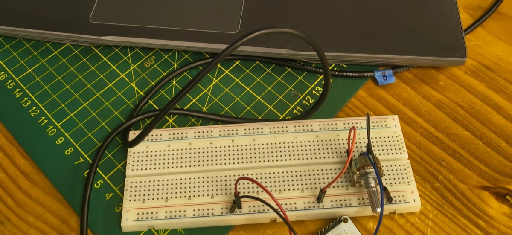
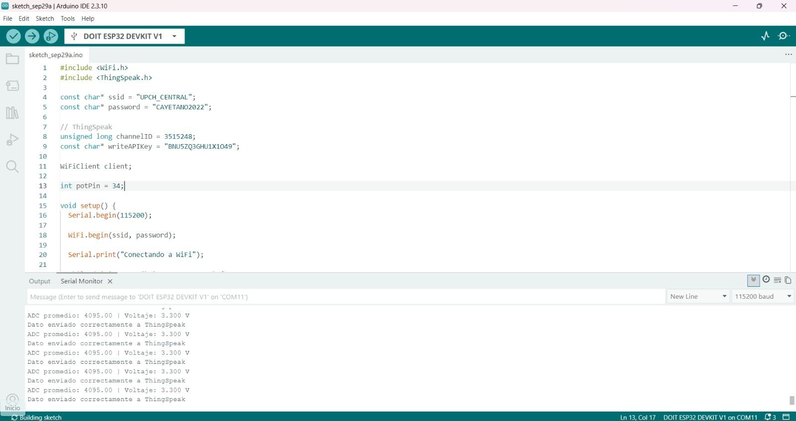
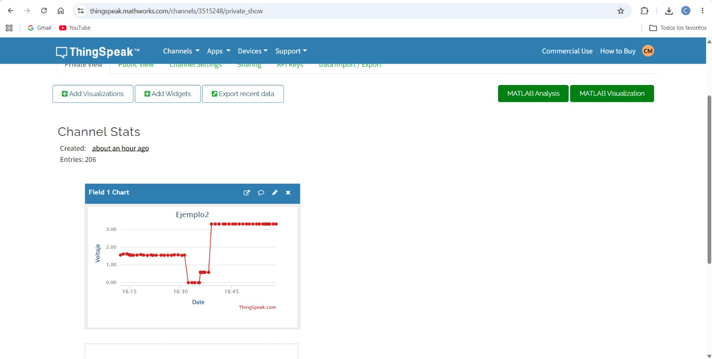
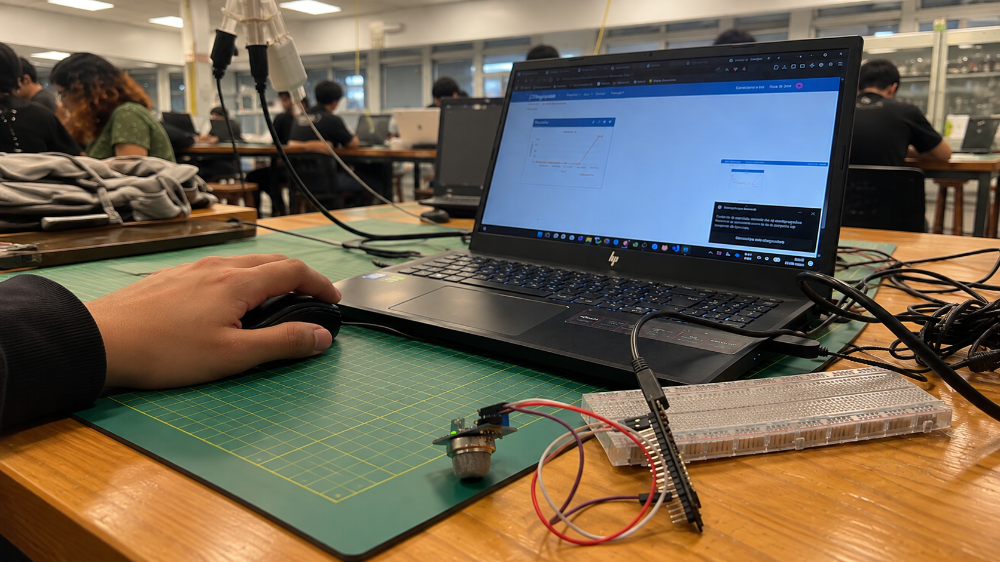
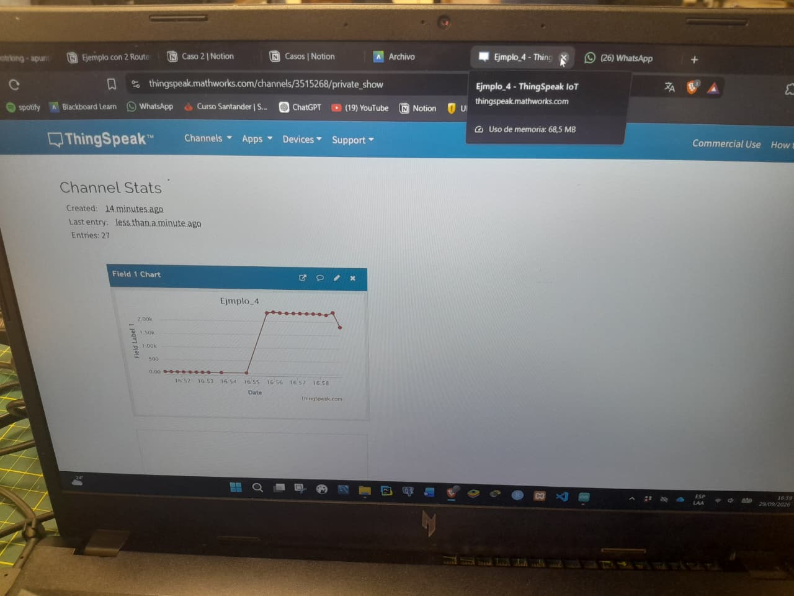
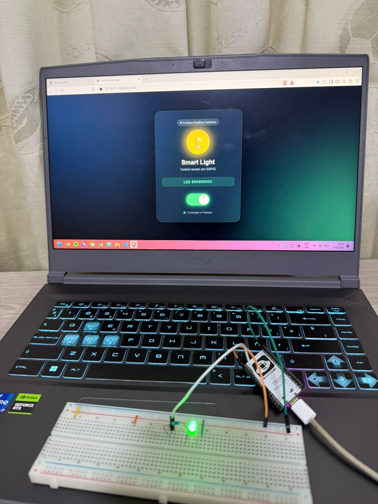
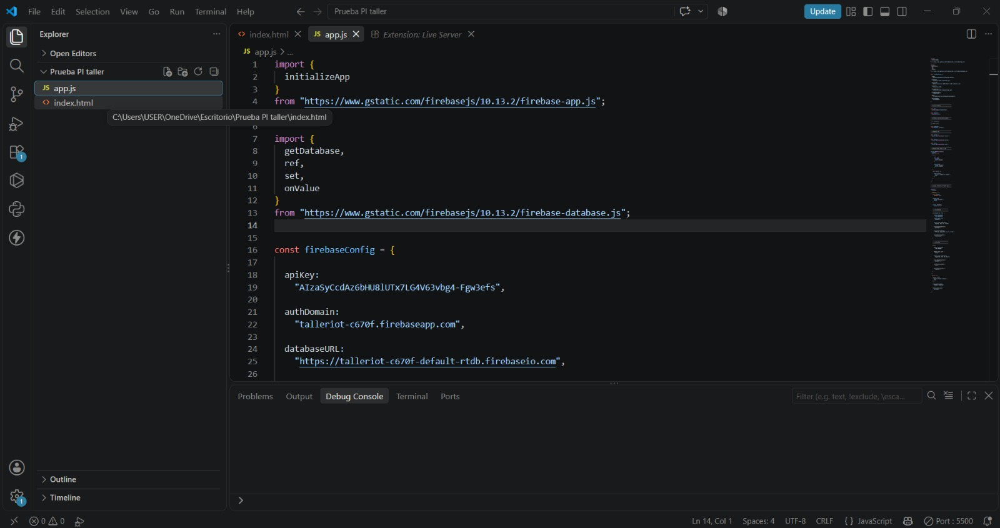

<div align="center">

# TALLER DE INTERNET DE LAS COSAS (IoT) · ESP32

### INFORME DE LABORATORIO

**Prácticas con ESP32, sensores, WiFi y servicios en la nube**

</div>

| **Datos del informe** | **Información** |
|---|---|
| **Curso** | Proyecto Integrador |
| **Estudiante** | Kevin Esty Carvallo Neciosup |
| **Docentes** | Umbert Lewis De La Cruz Rodriguez, Maria Rejas, Harry Rivera, Renzo Chan |
| **Fecha** | 01/10/2026 |
| **Institución** | Universidad Peruana Cayetano Heredia |

---

## 📑 Contenido

- [1. Consideraciones generales](#1-consideraciones-generales)
- [2. Ejemplo 1: Lectura de un potenciómetro con ESP32](#2-ejemplo-1-lectura-de-un-potenciómetro-con-esp32)
- [3. Ejemplo 2: Scanner WiFi / servidor web con ESP32](#3-ejemplo-2-scanner-wifi--servidor-web-con-esp32)
- [4. Ejemplo 3: Envío de datos a ThingSpeak](#4-ejemplo-3-envío-de-datos-a-thingspeak)
- [5. Ejemplo 4: Envío de datos del sensor MQ-2 a ThingSpeak](#5-ejemplo-4-envío-de-datos-del-sensor-mq-2-a-thingspeak)
- [6. Ejemplo 5: Control remoto de un LED mediante ESP32 y Firebase](#6-ejemplo-5-control-remoto-de-un-led-mediante-esp32-y-firebase)
- [7. Integración y comparación de los cinco ejemplos](#7-integración-y-comparación-de-los-cinco-ejemplos)
- [8. Resultados](#8-resultados)
- [9. Análisis](#9-análisis)
- [10. Conclusiones](#10-conclusiones)

---

# 1. Consideraciones generales

El presente informe analiza cinco prácticas realizadas con un ESP32. El
objetivo no es únicamente describir qué hace cada instrucción, sino
relacionar el programa con el funcionamiento físico del circuito, la
comunicación por WiFi y la visualización o almacenamiento de los
resultados. La fuente principal de los códigos y evidencias es el
documento del taller proporcionado, complementado con las fotografías
incluidas en el material de trabajo.

Cuando una lectura corresponde a una entrada analógica, se diferencia
explícitamente entre el valor digital obtenido por el ADC y una magnitud
física calibrada. En particular, en el caso del MQ-2, el programa
obtiene un valor ADC crudo; por tanto, no se interpreta como ppm de gas
porque el código no contiene una calibración que permita realizar esa
conversión.

Por seguridad y buenas prácticas, las credenciales de WiFi, API Keys y
contraseñas que aparecen en el código original se describen
funcionalmente en este informe, pero no se vuelven a publicar como datos
de acceso.

# 2. EJEMPLO 1: Lectura de un potenciómetro con ESP32

## 2.1 Objetivo

El primer ejemplo busca obtener una señal analógica proveniente de un
potenciómetro conectado al ESP32, realizar varias lecturas para reducir
la variabilidad instantánea mediante un promedio y convertir ese
resultado del dominio digital del ADC a un valor de voltaje estimado.
Finalmente, el programa muestra ambos resultados en el Monitor Serial.

## 2.2 Materiales y componentes

- ESP32 (DOIT ESP32 DEVKIT V1, según la evidencia del Arduino IDE).

- Potenciómetro.

- Protoboard y cables de conexión.

- Computadora con Arduino IDE.

## 2.3 Conexión del circuito

El código define int potPin = 34, por lo que la señal que el programa
lee está asociada al GPIO 34. Este GPIO se utiliza como entrada
analógica. La fotografía evidencia el potenciómetro montado sobre la
protoboard y conectado al ESP32. El código no documenta de forma
explícita los rieles de alimentación, por lo que este informe no asigna
números de pin adicionales que no puedan confirmarse con seguridad en la
evidencia.


*Figura 1. Evidencia del potenciómetro, ESP32, protoboard y Monitor
Serial.*

## 2.4 Explicación del código por bloques

### Bloque 1: Selección del GPIO analógico

int potPin = 34;

La variable potPin almacena el número del GPIO donde se encuentra la
señal del potenciómetro. Se utiliza int porque el número de pin es un
valor entero. La importancia de esta variable es que permite que el
resto del programa no tenga que escribir repetidamente el número 34:
cuando se ejecuta analogRead(potPin), el ESP32 sabe que debe consultar
ese GPIO.

### Bloque 2: Inicialización del Monitor Serial

void setup() {  
Serial.begin(115200);  
}

setup() se ejecuta una sola vez al iniciar o reiniciar el ESP32.
Serial.begin(115200) inicializa la comunicación serial a 115200 baudios.
Esta comunicación permite observar en el Monitor Serial los resultados
calculados por el programa. El valor 115200 corresponde a la velocidad
configurada tanto en el programa como en el Monitor Serial.

### Bloque 3: Acumulación de diez lecturas

long suma = 0;  
  
for (int i = 0; i \< 10; i++) {  
int valor = analogRead(potPin);  
suma += valor;  
delay(50);  
}

En cada ejecución de loop(), la variable suma comienza en cero. El ciclo
for se repite diez veces, por lo que analogRead(potPin) se ejecuta diez
veces. Cada lectura se almacena temporalmente en valor y se acumula
mediante suma += valor. La instrucción delay(50) introduce 50 ms entre
lecturas. Esto evita tomar las diez muestras prácticamente en el mismo
instante y establece un pequeño intervalo entre ellas.

### Bloque 4: Cálculo del promedio ADC

float promedioADC = suma / 10.0;

Después de reunir las diez muestras, el programa divide la suma entre
10.0. El uso de 10.0 hace que la operación se realice como cálculo de
punto flotante, permitiendo conservar decimales en el promedio. El
resultado representa el valor medio de las lecturas digitales entregadas
por el ADC durante esa ventana de muestreo.

### Bloque 5: Conversión de ADC a voltaje

float voltaje = (promedioADC \* 3.3) / 4095.0;

Esta expresión aplica una conversión lineal basada en una referencia de
3.3 V y un rango ADC de 0 a 4095. El término promedioADC \* 3.3 escala
la lectura digital al rango de voltaje, y la división entre 4095
normaliza el resultado respecto al máximo digital utilizado por el
programa. El resultado es una estimación de voltaje según el modelo
asumido en el código.

### Bloque 6: Presentación de resultados

Serial.print("Promedio ADC: ");  
Serial.print(promedioADC);  
Serial.print(" \| Voltaje promedio: ");  
Serial.print(voltaje, 3);  
Serial.println(" V");

El programa construye una línea de salida que muestra primero el
promedio ADC y luego el voltaje promedio. El parámetro 3 de
Serial.print(voltaje, 3) solicita tres cifras decimales. Esto facilita
comparar lecturas entre ciclos.

### Bloque 7: Periodo entre grupos de mediciones

delay(500);

Al final de loop(), el ESP32 espera 500 ms antes de comenzar el
siguiente grupo de diez lecturas. Por ello, el sistema no imprime
resultados de forma continua sin pausa, sino que genera una nueva
estimación aproximadamente cada medio segundo, además del tiempo
empleado en las diez muestras.

## 2.5 Funcionamiento completo del sistema

1.  El potenciómetro modifica la señal eléctrica que llega a la entrada
    analógica asociada al GPIO 34.

2.  El ADC del ESP32 transforma esa señal analógica en un valor digital.

3.  El programa toma diez muestras consecutivas y las acumula.

4.  Se calcula el promedio de las diez muestras para obtener una lectura
    más representativa que una sola muestra.

5.  El promedio ADC se transforma a voltaje mediante la fórmula definida
    en el código.

6.  El resultado se muestra en el Monitor Serial con tres decimales.

7.  Después de 500 ms se repite el proceso.

## 2.6 Interpretación de las salidas

La evidencia del Monitor Serial muestra lecturas de voltaje alrededor de
3.30 V en el momento capturado. La fotografía no permite leer con
suficiente precisión todos los valores ADC de cada línea, por lo que no
se inventa una serie numérica completa. Lo que sí puede afirmarse es que
la salida observada es estable alrededor de 3.30 V durante la captura.


# 3. EJEMPLO 2: Scanner WiFi / servidor web con ESP32

## 3.1 Objetivo

El segundo ejemplo establece una conexión WiFi entre el ESP32 y una red
configurada previamente y, una vez conectado, levanta un servidor web en
el puerto 80. Cuando un navegador solicita la ruta raíz, el ESP32 genera
una página HTML que informa que el servidor está funcionando y muestra
la dirección IP asignada al dispositivo.

Aunque el título del taller utiliza la expresión “Scanner WiFi”, el
código proporcionado no realiza un escaneo de redes cercanas: utiliza
WiFi.begin() para conectarse directamente a una red conocida y
posteriormente actúa como servidor web.

## 3.2 Materiales y componentes

- ESP32.

- Computadora o dispositivo con navegador web.

- Red WiFi / hotspot utilizado en la práctica.

- Cable USB para programar y alimentar el ESP32.

## 3.3 Conexión y funcionamiento de red

No existe un sensor externo en este programa. El ESP32 se conecta a la
red WiFi mediante su módulo inalámbrico integrado. La evidencia muestra
la placa conectada al equipo y, posteriormente, un navegador accediendo
a la IP del ESP32.


*Figura 2. Página web generada por el ESP32; la evidencia muestra la IP
10.175.204.80.*

### Código empleado

El programa completo utilizado para el servidor web del ESP32 es el siguiente. Las credenciales se representan como marcadores para no publicar datos de acceso.

```cpp
#include <WiFi.h>
#include <WebServer.h>

const char* ssid = "TU_WIFI";
const char* password = "TU_PASSWORD";

WebServer server(80);

void handleRoot() {
  String html = R"rawliteral(
<!DOCTYPE html>
<html lang="es">
<head>
  <meta charset="UTF-8">
  <meta name="viewport" content="width=device-width, initial-scale=1.0">
  <title>ESP32 - Proyecto Integrador</title>
  <style>
    body {
      margin: 0;
      font-family: Arial, sans-serif;
      background: linear-gradient(135deg, #0f2027, #203a43, #2c5364);
      color: white;
      display: flex;
      justify-content: center;
      align-items: center;
      min-height: 100vh;
    }
    .card {
      background: rgba(255, 255, 255, 0.12);
      backdrop-filter: blur(10px);
      width: 90%;
      max-width: 500px;
      padding: 35px;
      border-radius: 20px;
      text-align: center;
      box-shadow: 0 10px 30px rgba(0,0,0,0.3);
    }
    h1 { margin-bottom: 10px; font-size: 30px; }
    p { color: #d8e6eb; font-size: 17px; }
    .estado {
      margin: 25px 0;
      padding: 15px;
      border-radius: 12px;
      background: rgba(0, 200, 120, 0.2);
      border: 1px solid rgba(0, 255, 150, 0.4);
    }
    .ip { font-size: 22px; font-weight: bold; color: #66e3a4; }
    .footer { margin-top: 25px; font-size: 13px; color: #b8c9ce; }
  </style>
</head>
<body>
  <div class="card">
    <h1>ESP32</h1>
    <p>Servidor Web</p>
    <div class="estado">
      <h2>✓ Hola Kevin, servidor funcionando</h2>
      <p>Conexión WiFi establecida correctamente.</p>
    </div>
    <p>Dirección IP del ESP32:</p>
    <div class="ip">
)rawliteral";

  html += WiFi.localIP().toString();

  html += R"rawliteral(
    </div>
    <div class="footer">
      Proyecto Integrador · ESP32
    </div>
  </div>
</body>
</html>
)rawliteral";

  server.send(200, "text/html", html);
}

void setup() {
  Serial.begin(115200);

  WiFi.begin(ssid, password);
  Serial.print("Conectando a WiFi");

  while (WiFi.status() != WL_CONNECTED) {
    delay(500);
    Serial.print(".");
  }

  Serial.println();
  Serial.println("WiFi conectado");
  Serial.print("Direccion IP: ");
  Serial.println(WiFi.localIP());

  server.on("/", handleRoot);
  server.begin();

  Serial.println("Servidor web iniciado");
}

void loop() {
  server.handleClient();
}
```

## 3.4 Explicación del código por bloques

### Bloque 1: Librerías

\#include \<WiFi.h\>  
\#include \<WebServer.h\>

WiFi.h proporciona las funciones necesarias para que el ESP32 se conecte
a una red inalámbrica. WebServer.h proporciona la infraestructura para
crear un servidor HTTP y asociar rutas del navegador con funciones del
programa.

### Bloque 2: Credenciales de red y servidor

const char\* ssid = "…";  
const char\* password = "…";  
  
WebServer server(80);

ssid y password almacenan los datos necesarios para solicitar acceso a
la red WiFi. En este informe se omiten los valores reales por tratarse
de credenciales. WebServer server(80) crea un objeto servidor que
escucha solicitudes HTTP en el puerto 80, el puerto convencional para
HTTP sin cifrado.

### Bloque 3: Función handleRoot()

void handleRoot() {  
String html = R"rawliteral(  
...  
)rawliteral";  
  
html += WiFi.localIP().toString();  
...  
server.send(200, "text/html", html);  
}

handleRoot() se ejecuta cuando el navegador solicita la ruta raíz /. La
variable html contiene la página HTML completa, incluyendo estructura,
texto y estilos CSS. La técnica R"rawliteral(... )rawliteral" permite
escribir un bloque largo de texto sin tener que escapar continuamente
las comillas. Posteriormente, html += WiFi.localIP().toString() inserta
dinámicamente la IP asignada al ESP32. Finalmente, server.send(200,
"text/html", html) devuelve al navegador un código HTTP 200 y especifica
que el contenido enviado es HTML.

### Bloque 4: Estilos de la página

Dentro del HTML se utiliza CSS para crear una tarjeta central, fondo
degradado, tipografía, bordes, sombras y un bloque visual para el estado
del servidor. Este bloque no controla el hardware; su función es mejorar
la presentación de la información que el ESP32 entrega al navegador.

### Bloque 5: Conexión WiFi en setup()

Serial.begin(115200);  
WiFi.begin(ssid, password);  
  
while (WiFi.status() != WL_CONNECTED) {  
delay(500);  
Serial.print(".");  
}

Primero se inicia el Monitor Serial. Luego WiFi.begin() comienza el
proceso de asociación a la red. El while mantiene al programa esperando
mientras el estado no sea WL_CONNECTED. Cada 500 ms se imprime un punto,
de modo que el usuario puede observar que el ESP32 todavía está
intentando conectarse.

### Bloque 6: Inicio del servidor

Serial.println("WiFi conectado");  
Serial.print("Direccion IP: ");  
Serial.println(WiFi.localIP());  
  
server.on("/", handleRoot);  
server.begin();  
Serial.println("Servidor web iniciado");

Una vez establecida la conexión, WiFi.localIP() obtiene la dirección IP
asignada por la red. server.on("/", handleRoot) relaciona la ruta raíz
con la función handleRoot. server.begin() inicia realmente el servidor
para aceptar solicitudes.

### Bloque 7: Atención de clientes

void loop() {  
server.handleClient();  
}

handleClient() revisa continuamente si existe una solicitud de un
navegador y, cuando corresponde, ejecuta la función asociada a la ruta
solicitada. Por ello, el loop() no realiza cálculos periódicos: su tarea
principal es mantener disponible el servidor web.

## 3.5 Funcionamiento completo del sistema

8.  El ESP32 se inicia y configura la comunicación serial.

9.  Solicita conexión a la red WiFi configurada.

10. Espera hasta alcanzar el estado WL_CONNECTED.

11. Obtiene y muestra su dirección IP.

12. Inicia un servidor HTTP en el puerto 80.

13. El navegador accede a la IP del ESP32.

14. La ruta / ejecuta handleRoot().

15. El ESP32 construye la página HTML e inserta su IP.

16. El servidor devuelve la página al navegador con HTTP 200.

17. El loop continúa atendiendo nuevas solicitudes.

## 3.6 Interpretación de las salidas y evidencias

La evidencia de la página web muestra el mensaje “Servidor funcionando”
y confirma la conexión WiFi. La dirección IP observada es 10.175.204.80.
Esto demuestra que el ESP32 recibió una dirección válida dentro de la
red y que el navegador pudo establecer comunicación con el servidor web
ejecutado en la placa.


*Figura 3. Evidencia del proceso de carga del programa en el ESP32.*

## 3.7 Interpretación de la gráfica

No se genera una gráfica en este ejemplo. El resultado se valida
mediante una página web dinámica. La evidencia demuestra la cadena de
funcionamiento: conexión WiFi → asignación de IP → servidor HTTP →
respuesta HTML → visualización en navegador.

# 4. EJEMPLO 3: Envío de datos a ThingSpeak

## 4.1 Objetivo

El tercer ejemplo amplía el ejercicio del potenciómetro: además de leer
y convertir la señal analógica, el ESP32 envía el voltaje calculado a
ThingSpeak mediante su biblioteca específica. La plataforma almacena los
datos en Field 1 y los representa en una gráfica temporal.

## 4.2 Materiales y componentes

- ESP32.

- Potenciómetro conectado a GPIO 34.

- Protoboard y cables.

- Red WiFi.

- Arduino IDE.

- Cuenta/canal de ThingSpeak.



*Figura 4. Montaje del potenciómetro utilizado para el envío a
ThingSpeak.*

### Código empleado

El siguiente programa toma diez muestras del potenciómetro, calcula el promedio, convierte el resultado a voltaje y lo publica en el **Field 1** de ThingSpeak.

```cpp
#include <WiFi.h>
#include <ThingSpeak.h>

const char* ssid = "TU_WIFI";
const char* password = "TU_PASSWORD";

unsigned long channelID = 3515248;
const char* writeAPIKey = "TU_WRITE_API_KEY";

WiFiClient client;
int potPin = 34;

void setup() {
  Serial.begin(115200);

  WiFi.begin(ssid, password);

  Serial.print("Conectando a WiFi");
  while (WiFi.status() != WL_CONNECTED) {
    delay(500);
    Serial.print(".");
  }

  Serial.println();
  Serial.println("WiFi conectado");
  Serial.print("IP del ESP32: ");
  Serial.println(WiFi.localIP());

  ThingSpeak.begin(client);
}

void loop() {
  long suma = 0;

  for (int i = 0; i < 10; i++) {
    int valor = analogRead(potPin);
    suma += valor;
    delay(50);
  }

  float promedioADC = suma / 10.0;
  float voltaje = (promedioADC * 3.3) / 4095.0;

  Serial.print("ADC promedio: ");
  Serial.print(promedioADC);
  Serial.print(" | Voltaje: ");
  Serial.print(voltaje, 3);
  Serial.println(" V");

  ThingSpeak.setField(1, voltaje);

  int respuesta = ThingSpeak.writeFields(channelID, writeAPIKey);

  if (respuesta == 200) {
    Serial.println("Dato enviado correctamente a ThingSpeak");
  } else {
    Serial.print("Error al enviar. Codigo HTTP: ");
    Serial.println(respuesta);
  }

  delay(15000);
}
```

## 4.3 Explicación del código por bloques

### Bloque 1: Librerías y configuración de ThingSpeak

\#include \<WiFi.h\>  
\#include \<ThingSpeak.h\>  
  
const char\* ssid = "…";  
const char\* password = "…";  
  
unsigned long channelID = 3515248;  
const char\* writeAPIKey = "…";  
  
WiFiClient client;  
int potPin = 34;

WiFi.h permite la conexión inalámbrica y ThingSpeak.h proporciona
funciones de alto nivel para preparar y enviar datos al canal. channelID
identifica el canal donde se almacenan los datos y writeAPIKey autoriza
la escritura. WiFiClient representa el cliente de red que utiliza la
biblioteca de ThingSpeak. potPin mantiene la asociación del
potenciómetro con GPIO 34.

### Bloque 2: Conexión WiFi e inicialización de ThingSpeak

WiFi.begin(ssid, password);  
while (WiFi.status() != WL_CONNECTED) {  
delay(500);  
Serial.print(".");  
}  
Serial.println("WiFi conectado");  
Serial.println(WiFi.localIP());  
ThingSpeak.begin(client);

El programa espera a que el ESP32 se conecte a la red antes de iniciar
la comunicación con ThingSpeak. Después muestra la IP asignada y ejecuta
ThingSpeak.begin(client), que vincula la biblioteca con el cliente de
red.

### Bloque 3: Muestreo y promedio

long suma = 0;  
for (int i = 0; i \< 10; i++) {  
int valor = analogRead(potPin);  
suma += valor;  
delay(50);  
}  
float promedioADC = suma / 10.0;

Este bloque repite la estrategia del ejemplo 1. Se toman diez muestras,
se acumulan y se calcula un promedio. La finalidad es evitar que una
única lectura instantánea sea la que se envíe a la nube.

### Bloque 4: Conversión a voltaje

float voltaje = (promedioADC \* 3.3) / 4095.0;

El promedio ADC se transforma a una estimación de voltaje utilizando el
rango de 0 a 4095 y una referencia de 3.3 V, tal como está definido por
la fórmula del programa.

### Bloque 5: Preparación y envío a Field 1

ThingSpeak.setField(1, voltaje);  
int respuesta = ThingSpeak.writeFields(channelID, writeAPIKey);

ThingSpeak.setField(1, voltaje) coloca el valor calculado en el Field 1
del canal. Luego writeFields() utiliza el channelID y la Write API Key
para realizar el envío. La función devuelve un código de respuesta que
se almacena en respuesta.

### Bloque 6: Validación de la respuesta

if (respuesta == 200) {  
Serial.println("Dato enviado correctamente a ThingSpeak");  
} else {  
Serial.print("Error al enviar. Codigo HTTP: ");  
Serial.println(respuesta);  
}

El código comprueba si la operación terminó con respuesta 200. En las
evidencias aparece repetidamente “Dato enviado correctamente a
ThingSpeak”, por lo que durante la captura las escrituras se realizaron
correctamente.

### Bloque 7: Periodicidad

delay(15000);

La espera de 15 000 ms equivale a 15 segundos. Por tanto, el programa
intenta realizar un nuevo envío aproximadamente cada 15 s, además del
tiempo necesario para ejecutar la lectura, conversión y comunicación.

## 4.4 Funcionamiento completo

18. El potenciómetro produce una señal analógica variable.

19. El GPIO 34 recibe la señal y analogRead() la convierte a una lectura
    digital.

20. Se toman diez muestras y se calcula el promedio ADC.

21. El promedio se transforma a voltaje.

22. El voltaje se asigna a Field 1.

23. ThingSpeak escribe el dato en el canal identificado.

24. El Monitor Serial informa si la operación fue correcta.

25. Después de 15 s el proceso se repite.

## 4.5 Interpretación de las salidas



*Figura 5. Monitor Serial: se observan valores de ADC promedio de
4095.00, voltaje de 3.300 V y confirmación de envío.*

La evidencia muestra repetidamente “ADC promedio: 4095.00 \| Voltaje:
3.300 V” seguido de “Dato enviado correctamente a ThingSpeak”. Un ADC
promedio de 4095 corresponde al extremo superior del rango utilizado por
la fórmula del programa; al sustituir 4095 en la conversión, se obtiene
3.300 V. Esto indica que, durante la captura, el potenciómetro estaba
proporcionando una lectura cercana al máximo representado por el ADC.

## 4.6 Interpretación de la gráfica



*Figura 6. Gráfica de Field 1 en ThingSpeak para el Ejemplo 3.*

El eje X representa la fecha/hora de registro y el eje Y representa el
valor de voltaje enviado a Field 1. La gráfica muestra un primer periodo
alrededor de 1.5–1.6 V, seguido por una caída hasta aproximadamente 0 V,
una recuperación intermedia cercana a 0.5–0.6 V y finalmente un ascenso
hasta aproximadamente 3.3 V. El patrón indica que el valor del
potenciómetro fue modificado durante la experiencia o que la señal pasó
por distintos niveles de posición.

La correspondencia entre el Monitor Serial y la nube es directa: el
valor calculado como voltaje es el mismo valor colocado en Field 1. Por
ello, los cambios de nivel visibles en la gráfica representan cambios en
la señal que el ESP32 estuvo enviando.

# 5. EJEMPLO 4: Envío de datos del sensor MQ-2 a ThingSpeak

## 5.1 Objetivo

El cuarto ejemplo sustituye el potenciómetro por un sensor MQ-2 y envía
su lectura analógica a ThingSpeak. El objetivo es comprobar el flujo
completo sensor → ADC del ESP32 → WiFi → solicitud HTTP → ThingSpeak →
gráfica.

## 5.2 Materiales y componentes

- ESP32.

- Sensor MQ-2.

- Protoboard y cables.

- Red WiFi.

- Arduino IDE.

- ThingSpeak.

## 5.3 Conexión del circuito

El código define const int MQ2_PIN = 34 y configura ese GPIO como
entrada mediante pinMode(MQ2_PIN, INPUT). Por tanto, la salida analógica
que el programa está leyendo se conecta al GPIO 34. El circuito de la
evidencia muestra el módulo MQ-2 conectado mediante cables al ESP32 y a
la protoboard. La alimentación exacta de cada cable no se documenta en
el código, por lo que se evita atribuir pines de alimentación que no
estén explícitamente identificados.



*Figura 7. Evidencia del montaje físico del sensor MQ-2 y del canal de
ThingSpeak.*

### Código empleado

En este ejemplo se emplea la lectura analógica del MQ-2 y se realiza el envío directo a ThingSpeak mediante una solicitud HTTP GET.

```cpp
#include <WiFi.h>
#include <HTTPClient.h>

const char* ssid = "TU_WIFI";
const char* password = "TU_PASSWORD";

String apiKey = "TU_API_KEY";
const int MQ2_PIN = 34;

void setup() {
  Serial.begin(115200);
  pinMode(MQ2_PIN, INPUT);

  WiFi.begin(ssid, password);

  while (WiFi.status() != WL_CONNECTED) {
    delay(500);
    Serial.print(".");
  }

  Serial.println("\nWiFi conectado");
}

void loop() {
  int valorMQ2 = analogRead(MQ2_PIN);

  Serial.print("Valor MQ-2: ");
  Serial.println(valorMQ2);

  if (WiFi.status() == WL_CONNECTED) {
    HTTPClient http;

    String url = "https://api.thingspeak.com/update?api_key="
                 + apiKey + "&field1=" + String(valorMQ2);

    http.begin(url);

    int respuesta = http.GET();

    Serial.print("Respuesta ThingSpeak: ");
    Serial.println(respuesta);

    http.end();
  }

  delay(15000);
}
```

## 5.4 Explicación del código por bloques

### Bloque 1: Librerías

\#include \<WiFi.h\>  
\#include \<HTTPClient.h\>

WiFi.h habilita la conexión inalámbrica del ESP32. HTTPClient.h permite
construir y ejecutar una solicitud HTTP desde la placa. En este ejemplo
no se utiliza la biblioteca ThingSpeak.h: la comunicación se realiza
directamente mediante una URL del servicio de actualización de
ThingSpeak.

### Bloque 2: Configuración

const char\* ssid = "…";  
const char\* password = "…";  
String apiKey = "…";  
const int MQ2_PIN = 34;

ssid y password contienen las credenciales de red; apiKey identifica la
autorización de escritura del canal; MQ2_PIN indica el GPIO utilizado
para la señal analógica del MQ-2. La variable apiKey es String porque se
concatena posteriormente con otros fragmentos de texto para formar una
URL.

### Bloque 3: setup() y configuración del sensor

Serial.begin(115200);  
pinMode(MQ2_PIN, INPUT);  
WiFi.begin(ssid, password);  
  
while (WiFi.status() != WL_CONNECTED) {  
delay(500);  
Serial.print(".");  
}  
Serial.println("\nWiFi conectado");

El programa inicia el Monitor Serial, establece el GPIO 34 como entrada
y solicita la conexión WiFi. El while bloquea el avance hasta que el
estado sea WL_CONNECTED. Esto garantiza que, al llegar al envío, el
ESP32 tenga una conexión de red disponible.

### Bloque 4: Lectura del MQ-2

int valorMQ2 = analogRead(MQ2_PIN);  
  
Serial.print("Valor MQ-2: ");  
Serial.println(valorMQ2);

analogRead() toma la señal analógica del GPIO 34 y la convierte en un
número digital mediante el ADC del ESP32. Ese número se almacena en
valorMQ2 y se imprime. Es fundamental interpretar correctamente este
dato: en este programa es una lectura ADC del sensor, no una
concentración de gas expresada en ppm. Para obtener ppm sería necesario
disponer de una calibración y un modelo de conversión que no aparecen en
el código.

### Bloque 5: Verificación de conectividad

if (WiFi.status() == WL_CONNECTED) {  
...  
}

Antes de intentar el envío, el programa comprueba nuevamente el estado
de WiFi. Si la conexión no está activa, el bloque HTTP no se ejecuta y
el programa continúa hasta la siguiente iteración.

### Bloque 6: Construcción de la solicitud HTTP

HTTPClient http;  
  
String url = "https://api.thingspeak.com/update?api_key="  
+ apiKey + "&field1=" + String(valorMQ2);

HTTPClient representa el cliente HTTP. La URL se construye concatenando
cuatro partes funcionales: la dirección del endpoint de actualización de
ThingSpeak, el parámetro api_key, el valor de la API Key y el parámetro
field1 con el valor leído del MQ-2. String(valorMQ2) convierte el número
entero a texto para poder incorporarlo a la URL.

### Bloque 7: Envío y código de respuesta

http.begin(url);  
int respuesta = http.GET();  
  
Serial.print("Respuesta ThingSpeak: ");  
Serial.println(respuesta);

http.begin(url) prepara la conexión usando la URL construida. http.GET()
ejecuta una solicitud HTTP GET. El valor devuelto se almacena en
respuesta. En la evidencia del Monitor Serial se observa “Respuesta
ThingSpeak: 200” de forma repetida, lo que indica que las solicitudes
fueron aceptadas correctamente durante la captura.

### Bloque 8: Liberación y temporización

http.end();  
delay(15000);

http.end() finaliza la comunicación HTTP de esa iteración. delay(15000)
establece una espera de 15 segundos antes de volver a leer el sensor y
realizar otro envío.

## 5.5 Funcionamiento completo del sistema

- El MQ-2 produce una señal eléctrica asociada a las condiciones
    detectadas por el sensor.

- La señal llega al GPIO 34 del ESP32.

- El ADC convierte la señal a un valor digital almacenado en valorMQ2.

- El valor se muestra en el Monitor Serial.

- Si WiFi está conectado, el ESP32 construye una URL con la API Key y
    el valor en Field 1.

- HTTPClient ejecuta una solicitud GET al endpoint de ThingSpeak.

- ThingSpeak responde y el código de respuesta se muestra en el
    Monitor Serial.

- El canal almacena el dato y lo representa en la gráfica.

- Después de 15 s se repite el ciclo.

## 5.6 Interpretación de las salidas

En las evidencias previas del Monitor Serial se observan lecturas del
MQ-2 alrededor de valores de 2300, con pequeñas variaciones entre
muestras, y respuestas HTTP 200 de ThingSpeak. Por ejemplo, se
documentaron valores como 2305, 2315, 2304, 2289, 2294, 2297 y otras
lecturas cercanas. Esto muestra que la señal del sensor no fue
perfectamente constante, pero sí permaneció en un rango relativamente
cercano durante ese periodo de observación.

La variación entre lecturas no debe traducirse directamente a “ppm” sin
calibración. Lo que sí puede afirmarse es que el ADC registró cambios en
la señal eléctrica entregada por el módulo MQ-2.

## 5.7 Interpretación de la gráfica



*Figura 8. Gráfica de Field 1 del Ejemplo 4 en ThingSpeak.*

En la gráfica, el eje X representa el tiempo y el eje Y representa el
valor almacenado en Field 1. Se observa inicialmente un nivel cercano a
cero, seguido de un incremento brusco hasta aproximadamente el rango de
2.0–2.3 mil unidades, donde se mantiene durante varios registros. En el
extremo final se aprecia una disminución respecto del nivel anterior.

Este comportamiento significa que el valor ADC enviado por el ESP32
cambió de forma importante durante la sesión. La plataforma no está
calculando una concentración química por sí misma: está representando el
número que el programa envió. Por ello, la interpretación correcta es
hablar de variación de la lectura ADC del MQ-2.

## 5.8 Relación entre Monitor Serial y gráfica

Cada 15 segundos el programa obtiene una nueva lectura y la incorpora a
Field 1. Por tanto, las variaciones observadas en la gráfica son el
resultado acumulado de las lecturas que previamente aparecen en el
Monitor Serial. La respuesta 200 confirma que el mecanismo de
comunicación HTTP funcionó correctamente en las capturas.

# 6. EJEMPLO 5: Control remoto de un LED mediante ESP32 y Firebase

## 6.1 Objetivo

El quinto ejemplo implementa un control remoto: el ESP32 consulta un
estado lógico almacenado en Firebase Realtime Database y utiliza ese
estado para encender o apagar un LED conectado al GPIO 2. Además, el
ESP32 escribe una confirmación en Firebase mediante el nodo
/estado_esp32.

## 6.2 Materiales y componentes

- ESP32.

- LED conectado al GPIO 2.

- Protoboard y cables.

- Red WiFi.

- Arduino IDE.

- Proyecto de Firebase con Authentication y Realtime Database.

- Interfaz web utilizada para modificar/visualizar el estado.



*Figura 9. Evidencia del LED encendido y de la interfaz web Smart Light
conectada a Firebase.*

## 6.3 Conexión del circuito

El código define LED_PIN como 2 y posteriormente configura ese GPIO como
OUTPUT. En la evidencia se observa un LED montado en la protoboard y
encendido, conectado al ESP32. El programa controla el estado eléctrico
del GPIO mediante digitalWrite(). La resistencia en serie no se
identifica de forma inequívoca en la evidencia proporcionada, por lo que
no se afirma un valor concreto.

### Código empleado

Este programa consulta un valor booleano almacenado en Firebase y lo utiliza para controlar el LED del GPIO 2. También registra en Firebase el estado que el ESP32 ejecutó. Las credenciales se muestran como marcadores.

```cpp
#define ENABLE_USER_AUTH
#define ENABLE_DATABASE

#include <WiFi.h>
#include <WiFiClientSecure.h>
#include <FirebaseClient.h>

#define WIFI_SSID "TU_WIFI"
#define WIFI_PASSWORD "TU_PASSWORD"
#define API_KEY "TU_API_KEY"
#define DATABASE_URL "TU_DATABASE_URL"
#define USER_EMAIL "TU_USER_EMAIL"
#define USER_PASSWORD "TU_USER_PASSWORD"

#define LED_PIN 2

UserAuth user_auth(API_KEY, USER_EMAIL, USER_PASSWORD);
FirebaseApp app;
WiFiClientSecure ssl_client;
using AsyncClient = AsyncClientClass;
AsyncClient async_client(ssl_client);
RealtimeDatabase Database;

unsigned long ultimoTiempo = 0;
const unsigned long intervalo = 1000;

void processData(AsyncResult &aResult) {
  if (!aResult.isResult()) return;

  if (aResult.isError()) {
    Serial.print("Firebase error: ");
    Serial.println(aResult.error().message());
  }
}

void setup() {
  Serial.begin(115200);

  pinMode(LED_PIN, OUTPUT);
  digitalWrite(LED_PIN, LOW);

  WiFi.begin(WIFI_SSID, WIFI_PASSWORD);
  Serial.print("Conectando al WiFi");

  while (WiFi.status() != WL_CONNECTED) {
    Serial.print(".");
    delay(500);
  }

  Serial.println();
  Serial.println("WiFi conectado");
  Serial.print("IP del ESP32: ");
  Serial.println(WiFi.localIP());

  ssl_client.setInsecure();

  initializeApp(
    async_client,
    app,
    getAuth(user_auth),
    processData,
    "authTask"
  );

  app.getApp<RealtimeDatabase>(Database);
  Database.url(DATABASE_URL);

  Serial.println("Firebase iniciado");
}

void loop() {
  app.loop();

  if (millis() - ultimoTiempo >= intervalo) {
    ultimoTiempo = millis();

    if (app.ready()) {
      bool estado = Database.get<bool>(async_client, "/estado");

      Serial.print("Estado recibido: ");
      Serial.println(estado ? "true" : "false");

      if (estado) {
        digitalWrite(LED_PIN, HIGH);
        Serial.println("LED ENCENDIDO");
      } else {
        digitalWrite(LED_PIN, LOW);
        Serial.println("LED APAGADO");
      }

      Database.set<bool>(async_client, "/estado_esp32", estado);
    }
  }
}
```

## 6.4 Explicación del código por bloques

### Bloque 1: Activación de módulos y librerías

\#define ENABLE_USER_AUTH  
\#define ENABLE_DATABASE  
  
\#include \<WiFi.h\>  
\#include \<WiFiClientSecure.h\>  
\#include \<FirebaseClient.h\>

Las dos directivas ENABLE_USER_AUTH y ENABLE_DATABASE habilitan las
capacidades de autenticación y base de datos utilizadas por la
biblioteca. WiFi.h gestiona la red, WiFiClientSecure permite
comunicación segura mediante TLS/SSL y FirebaseClient proporciona la
integración con Firebase.

### Bloque 2: Configuración de WiFi y Firebase

\#define WIFI_SSID "…"  
\#define WIFI_PASSWORD "…"  
\#define API_KEY "…"  
\#define DATABASE_URL "…"  
\#define USER_EMAIL "…"  
\#define USER_PASSWORD "…"  
\#define LED_PIN 2

Este bloque concentra parámetros de conexión. WIFI_SSID y WIFI_PASSWORD
identifican la red; API_KEY identifica el proyecto de Firebase;
DATABASE_URL indica la base de datos Realtime Database; USER_EMAIL y
USER_PASSWORD corresponden al usuario utilizado por Firebase
Authentication; LED_PIN establece el GPIO de control. En el informe se
ocultan las credenciales reales.

### Bloque 3: Objetos de autenticación y base de datos

UserAuth user_auth(API_KEY, USER_EMAIL, USER_PASSWORD);  
FirebaseApp app;  
WiFiClientSecure ssl_client;  
using AsyncClient = AsyncClientClass;  
AsyncClient async_client(ssl_client);  
RealtimeDatabase Database;

UserAuth agrupa los datos necesarios para autenticarse. FirebaseApp
representa la aplicación conectada a Firebase. ssl_client proporciona el
cliente de red seguro y async_client permite las operaciones de la
biblioteca. Database representa la interfaz con Realtime Database.

### Bloque 4: Temporización y callback

unsigned long ultimoTiempo = 0;  
const unsigned long intervalo = 1000;  
  
void processData(AsyncResult &aResult)  
{  
if (!aResult.isResult())  
return;  
  
if (aResult.isError())  
{  
Serial.print("Firebase error: ");  
Serial.println(aResult.error().message());  
}  
}

ultimoTiempo registra la referencia temporal de la última lectura y
intervalo fija un periodo de 1000 ms. El callback processData() revisa
los resultados de las operaciones de Firebase. Si no existe un resultado
válido, retorna; si existe un error, muestra su mensaje en el Monitor
Serial. Esto proporciona un mecanismo de diagnóstico para la
comunicación con Firebase.

### Bloque 5: Configuración del LED

pinMode(LED_PIN, OUTPUT);  
digitalWrite(LED_PIN, LOW);

pinMode configura GPIO 2 como salida digital. digitalWrite(..., LOW)
establece el LED inicialmente apagado. Esta inicialización evita dejar
el pin en un estado indeterminado al arrancar.

### Bloque 6: Conexión WiFi

WiFi.begin(WIFI_SSID, WIFI_PASSWORD);  
while (WiFi.status() != WL_CONNECTED)  
{  
Serial.print(".");  
delay(500);  
}

El ESP32 intenta asociarse a la red y permanece en el while hasta que el
estado sea WL_CONNECTED. La impresión de puntos permite observar el
proceso de conexión. Una vez conectado, se imprime la IP local.

### Bloque 7: SSL y configuración de Firebase

ssl_client.setInsecure();  
  
initializeApp(  
async_client,  
app,  
getAuth(user_auth),  
processData,  
"authTask"  
);  
  
app.getApp\<RealtimeDatabase\>(Database);  
Database.url(DATABASE_URL);

ssl_client.setInsecure() configura el cliente TLS para no validar el
certificado del servidor. En un sistema de producción, esta decisión
debería revisarse desde el punto de vista de seguridad. initializeApp()
configura la aplicación Firebase y la autenticación;
app.getApp\<RealtimeDatabase\>(Database) obtiene la interfaz de Realtime
Database y Database.url() le indica qué base de datos utilizar.

### Bloque 8: Mantenimiento de Firebase y temporización

app.loop();  
  
if (millis() - ultimoTiempo \>= intervalo)  
{  
ultimoTiempo = millis();  
  
if (app.ready())  
{  
...  
}  
}

app.loop() mantiene las tareas internas de Firebase actualizadas.
millis() devuelve el tiempo transcurrido desde el arranque sin bloquear
el programa. La condición compara el tiempo actual con ultimoTiempo y
permite ejecutar la lectura aproximadamente cada segundo. app.ready()
comprueba que la aplicación esté preparada para realizar la operación.

### Bloque 9: Lectura del estado remoto

bool estado = Database.get\<bool\>(  
async_client,  
"/estado"  
);  
  
Serial.print("Estado recibido: ");  
Serial.println(estado ? "true" : "false");

Database.get\<bool\>() solicita el valor booleano almacenado en el nodo
/estado. El resultado se guarda en estado, que solamente puede
representar true o false. El operador ternario se utiliza para imprimir
la palabra correspondiente en el Monitor Serial.

### Bloque 10: Control físico del LED

if (estado)  
{  
digitalWrite(LED_PIN, HIGH);  
Serial.println("LED ENCENDIDO");  
}  
else  
{  
digitalWrite(LED_PIN, LOW);  
Serial.println("LED APAGADO");  
}

Este es el bloque que conecta el dato de la nube con el circuito físico.
Si estado es true, GPIO 2 pasa a HIGH y el LED se enciende. Si es false,
GPIO 2 pasa a LOW y el LED se apaga. Por tanto, la decisión tomada en
Firebase se convierte directamente en una acción eléctrica sobre el pin
de salida.

### Bloque 11: Confirmación hacia Firebase

Database.set\<bool\>(  
async_client,  
"/estado_esp32",  
estado  
);

Después de actuar sobre el LED, el ESP32 escribe el mismo estado en
/estado_esp32. Esto permite que la base de datos conserve una
confirmación del estado procesado por el dispositivo.

## 6.5 Funcionamiento completo del sistema

- El ESP32 inicia el GPIO del LED como salida y lo deja apagado.

- Se conecta a la red WiFi.

- Se inicializa la autenticación con Firebase.

- Se configura el acceso a Realtime Database.

- El loop mantiene activa la comunicación con Firebase.

- Cada aproximadamente 1 segundo, si la aplicación está lista, se
    consulta /estado.

- El valor true o false se recibe en la variable estado.

- true enciende el LED; false lo apaga.

- El ESP32 registra el resultado en /estado_esp32.

- La interfaz web y Firebase permiten visualizar/controlar el estado
    remoto.

## 6.6 Interpretación de las salidas y evidencias


*Figura 10. Firebase Realtime Database mostrando los nodos estado y
estado_esp32.*

La evidencia de Realtime Database muestra los nodos /estado y
/estado_esp32, ambos con el valor false en el momento de la captura.
Esto representa un estado lógico apagado. La fotografía del circuito
muestra, en otra captura, el LED encendido y la interfaz web indicando
“LED ENCENDIDO”, lo que demuestra que el sistema también puede trabajar
con el estado true.

## 6.7 Interfaz web complementaria



*Figura 11. Evidencia del código JavaScript de la interfaz web que
utiliza la configuración de Firebase.*

La evidencia adicional muestra un archivo JavaScript que importa
Firebase y configura la conexión con Realtime Database. Esta parte
corresponde a la interfaz web complementaria, mientras que el código del
ESP32 mostrado en el taller se encarga de consultar el estado y accionar
el LED. La arquitectura completa puede entenderse como: interfaz web ↔
Firebase Realtime Database ↔ ESP32 ↔ LED.

## 6.8 Interpretación de la gráfica

Este ejemplo no utiliza una gráfica temporal como los ejemplos de
ThingSpeak. La visualización principal es el estado booleano de Firebase
y la respuesta física del LED. Por ello, la evidencia se interpreta
mediante estados true/false y su correspondencia con LED
encendido/apagado.

# 7. Integración y comparación de los cinco ejemplos

Los cinco ejercicios muestran una progresión desde la lectura local de
una señal hasta el control y almacenamiento remoto. La secuencia permite
comprender diferentes capas de un sistema IoT.

| Ejemplo | Entrada/acción         | Comunicación             | Resultado                                  |
|---------|------------------------|--------------------------|--------------------------------------------|
| 1       | Potenciómetro / ADC    | No utiliza nube          | Promedio ADC y voltaje en Monitor Serial   |
| 2       | Conexión WiFi          | HTTP local en puerto 80  | Página web con IP del ESP32                |
| 3       | Potenciómetro / ADC    | WiFi + ThingSpeak        | Voltaje almacenado y graficado             |
| 4       | MQ-2 / ADC             | WiFi + HTTP + ThingSpeak | Lectura ADC almacenada y graficada         |
| 5       | Estado remoto booleano | WiFi + Firebase          | LED controlado y estado confirmado en nube |

## 7.1 Flujo general de datos

Sensor / interfaz  
↓  
GPIO del ESP32  
↓  
Lectura o estado lógico  
↓  
Procesamiento en el programa  
↓  
WiFi  
↓  
Plataforma IoT / servidor  
↓  
Almacenamiento o respuesta  
↓  
Visualización / actuación física

Los ejemplos 1, 3 y 4 utilizan entradas analógicas y muestran cómo una
señal eléctrica se convierte en un dato digital. Los ejemplos 2, 3, 4 y
5 incorporan comunicación de red. El ejemplo 2 utiliza al ESP32 como
servidor; los ejemplos 3 y 4 utilizan ThingSpeak como plataforma de
almacenamiento/visualización; y el ejemplo 5 utiliza Firebase como
sistema de datos remoto y control.

# 8. Resultados

Se comprobó el funcionamiento de la lectura analógica mediante el
potenciómetro, observándose valores de voltaje alrededor de 3.30 V en la
evidencia del primer ejercicio. En el segundo ejercicio se obtuvo
conectividad WiFi y una dirección IP observable desde el navegador,
10.175.204.80, con una página servida directamente por el ESP32.

En el tercer ejercicio se observaron lecturas de 4095.00 ADC y 3.300 V
acompañadas de mensajes de envío correcto a ThingSpeak. La gráfica
mostró diferentes niveles de voltaje, incluyendo un periodo cercano a
1.5 V, una caída cercana a 0 V, una recuperación intermedia y un ascenso
final hasta aproximadamente 3.3 V.

En el cuarto ejercicio se obtuvieron lecturas ADC del MQ-2 alrededor de
2.3 mil unidades en parte de la captura y respuestas HTTP 200. La
gráfica mostró un salto desde valores cercanos a cero hacia un rango
aproximado de 2.0–2.3 mil unidades, una zona relativamente estable y una
disminución al final. Estas cifras representan lecturas ADC y no
concentración de gas calibrada.

En el quinto ejercicio se comprobó el control remoto de un LED mediante
Firebase. La base de datos mostró los nodos /estado y /estado_esp32,
mientras que la evidencia del circuito y de la interfaz web mostró el
estado de LED encendido en una de las pruebas.

# 9. Análisis

El aspecto central de las prácticas es la relación entre software y
hardware. En los ejemplos analógicos, una instrucción como analogRead()
no es solamente una función de programación: representa el punto donde
una magnitud eléctrica del circuito entra al modelo digital del ESP32.
En los ejemplos de nube, las instrucciones de red convierten ese dato
local en información transportable hacia un servicio remoto.

También se evidencia que una respuesta exitosa de red no significa que
el sensor haya sido calibrado. En el caso del MQ-2, el programa
demuestra correctamente la adquisición y transmisión de la señal, pero
no contiene la etapa necesaria para transformar el ADC en ppm. Esta
distinción es importante para interpretar técnicamente los resultados
sin atribuir al sistema una medición que el código no realiza.

Firebase introduce una lógica diferente: en lugar de enviar únicamente
una medición, el ESP32 consulta un estado remoto y lo convierte en una
acción física. Esto representa un flujo bidireccional: la nube influye
en el dispositivo y el dispositivo confirma su estado de regreso.

# 10. Conclusiones

- El ESP32 puede adquirir señales analógicas mediante sus entradas ADC
    y convertirlas en datos digitales procesables por el programa.

- El uso de varias muestras y un promedio permite obtener una lectura
    más representativa que depender de una sola medición instantánea.

- La conexión WiFi permite ampliar el funcionamiento del ESP32 desde
    tareas locales hacia servidores y plataformas IoT.

- ThingSpeak permite almacenar y visualizar los valores enviados por
    el ESP32, facilitando la interpretación temporal mediante gráficas.

- El sensor MQ-2 del ejercicio 4 se trabajó como una fuente de lectura
    analógica; el valor observado es ADC y no una concentración de gas
    calibrada.

- Firebase permite implementar control remoto mediante variables
    booleanas, de modo que un estado almacenado en la nube puede
    convertirse en una acción sobre un GPIO.

- Las evidencias demuestran la correspondencia entre código, circuito,
    salida serial, comunicación de red y visualización o actuación
    final.

