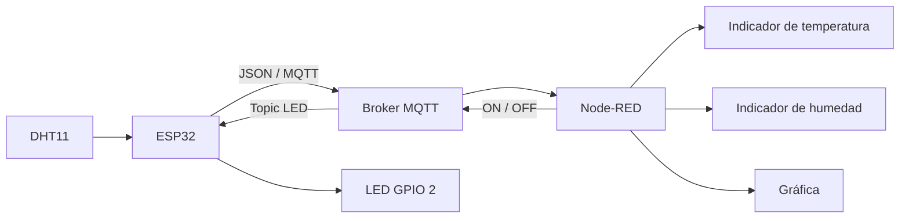
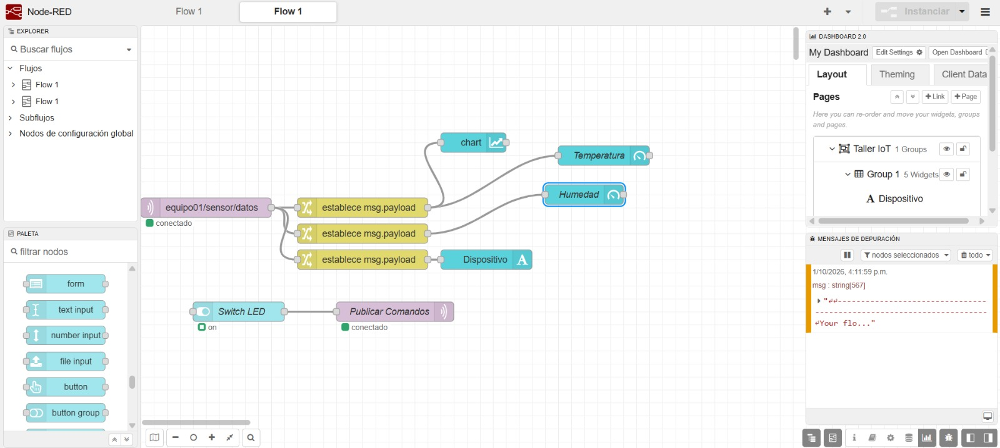
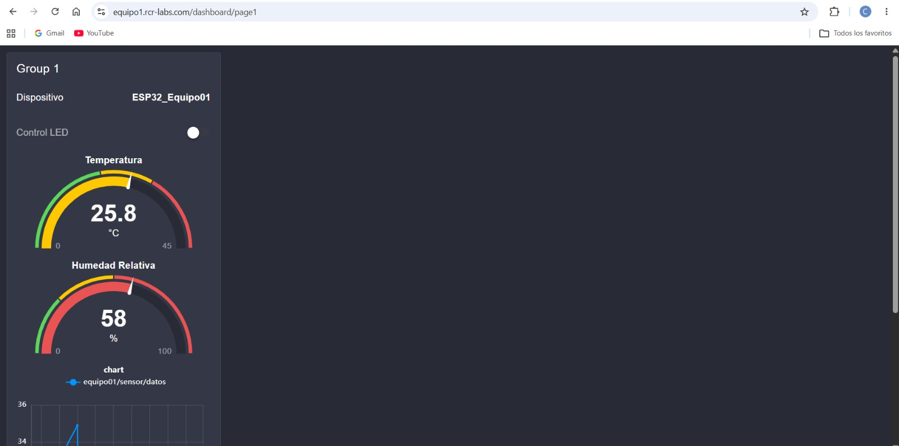
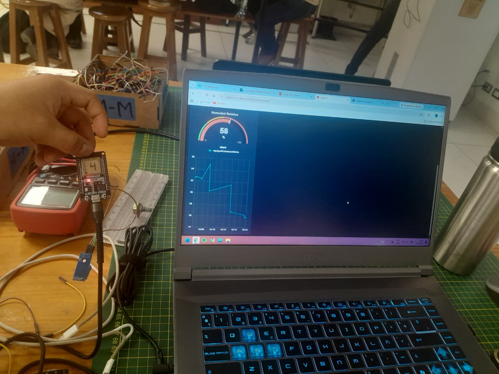
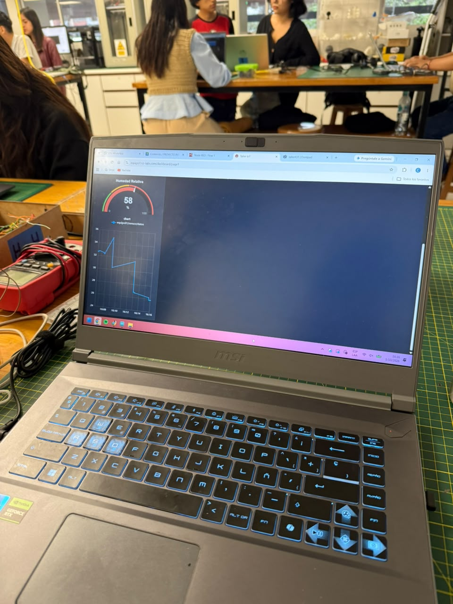
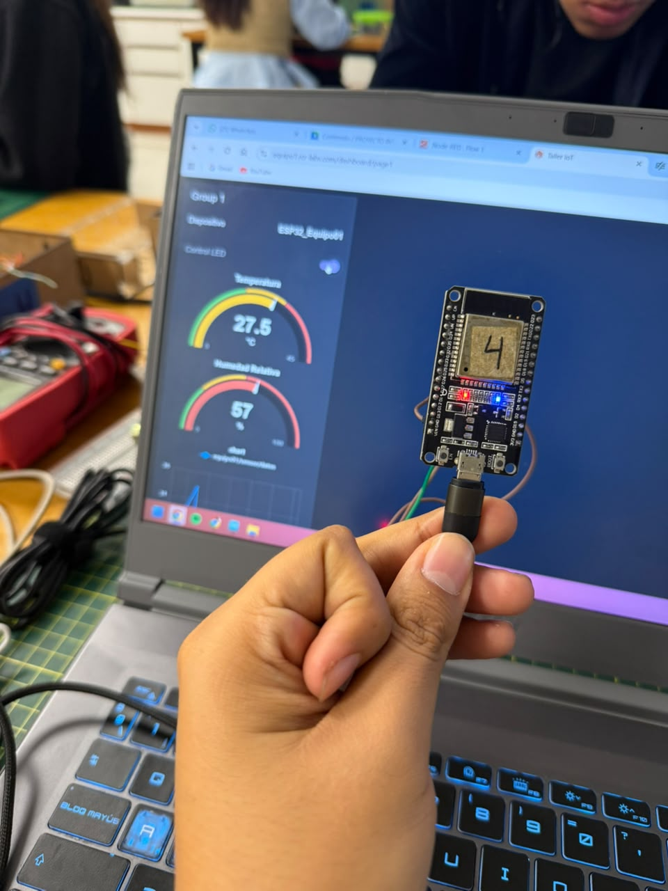
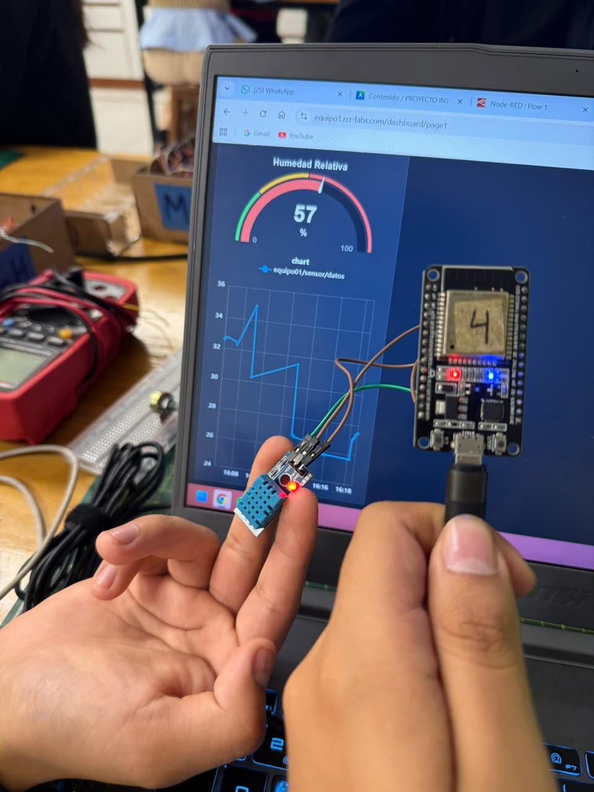

# Monitoreo de temperatura y humedad con ESP32, DHT11, MQTT y Node-RED

## Taller de Internet de las Cosas (IoT)

---

## Información del proyecto

| Campo | Detalle |
|---|---|
| **Curso** | Proyecto Integrador |
| **Actividad** | Mostrar en Node-RED los datos de un sensor DHT11 |
| **Herramientas** | ESP32, MQTT y Node-RED Dashboard 2.0 |
| **Fecha** | 01/10/2026 |
| **Institución** | Universidad Peruana Cayetano Heredia |

---

## Contenido

- [1. Introducción](#1-introducción)
- [2. Objetivos](#2-objetivos)
- [3. Materiales y herramientas](#3-materiales-y-herramientas)
- [4. Cómo funciona el sistema](#4-cómo-funciona-el-sistema)
- [5. Conexiones del circuito](#5-conexiones-del-circuito)
- [6. Configuración de MQTT](#6-configuración-de-mqtt)
- [7. Código del ESP32](#7-código-del-esp32)
- [8. Flujo en Node-RED](#8-flujo-en-node-red)
- [9. Evidencias y resultados](#9-evidencias-y-resultados)
- [10. Explicación del funcionamiento](#10-explicación-del-funcionamiento)
- [11. Conclusiones](#11-conclusiones)

---

## 1. Introducción

En esta práctica, la estudiante armó un sistema de Internet de las Cosas (IoT) que mide la temperatura y la humedad del ambiente y las muestra en una página web casi en tiempo real.

Un sensor **DHT11** conectado a una placa **ESP32** mide ambos valores. La placa los envía por internet usando **MQTT**, un sistema de mensajes muy liviano que funciona como un buzón: unos dispositivos dejan mensajes y otros los reciben. Esos mensajes pasan por un servidor intermedio llamado "broker". Luego, **Node-RED**, un programa que permite armar flujos de datos de forma visual, recibe la información y la muestra en indicadores y en una gráfica.

Además de ver los datos, el sistema permite dar órdenes. Desde el panel de Node-RED se puede encender o apagar el LED que trae la placa, enviando un mensaje por MQTT.

En resumen, la práctica reunió cuatro ideas:

| Idea | Cómo se aplicó |
|---|---|
| Medir | El sensor DHT11 toma la temperatura y la humedad. |
| Enviar | La placa manda los datos por MQTT. |
| Mostrar | Node-RED los presenta en un panel web. |
| Controlar | Desde el panel se enciende y apaga el LED de la placa. |

---

## 2. Objetivos

### Objetivo general

Armar un sistema IoT que mida la temperatura y la humedad con un sensor DHT11 y una ESP32, envíe los datos por MQTT y los muestre en un panel creado con Node-RED.

### Objetivos específicos

- Conectar la ESP32 a una red WiFi y a un servidor MQTT en internet.
- Leer cada cierto tiempo la temperatura y la humedad que entrega el sensor.
- Agrupar las dos medidas en un solo mensaje (formato JSON) y enviarlo por MQTT.
- Recibir los datos en Node-RED y mostrarlos en indicadores y en una gráfica.
- Enviar desde Node-RED una orden de encendido o apagado al LED de la placa.

---

## 3. Materiales y herramientas

| Recurso | Para qué se usó |
|---|---|
| **ESP32** | Leer el sensor y enviar los datos. |
| **Sensor DHT11** | Medir temperatura y humedad. |
| **Cables Dupont** | Unir el sensor con la placa. |
| **Protoboard** | Armar el circuito sin soldar. |
| **Arduino IDE** | Programar la ESP32. |
| **Node-RED** | Recibir los datos y armar el panel. |
| **Node-RED Dashboard 2.0** | Crear la página web con los indicadores. |
| **Broker MQTT** | Servidor que reparte los mensajes entre la ESP32 y Node-RED. |
| **Red WiFi** | Dar acceso a internet a la placa. |

### Librerías usadas en Arduino

Una librería es un conjunto de funciones ya hechas que se agregan al programa para no escribirlas desde cero.

| Librería | Para qué sirve |
|---|---|
| `WiFi.h` | Conectar la placa a la red WiFi. |
| `PubSubClient.h` | Enviar y recibir mensajes MQTT. |
| `ArduinoJson.h` | Armar el mensaje con los datos en formato JSON. |
| `DHT.h` | Leer el sensor DHT11. |

```cpp
#include <WiFi.h>
#include <PubSubClient.h>
#include <ArduinoJson.h>
#include <DHT.h>
```

---

## 4. Cómo funciona el sistema

El dato recorre este camino, desde el sensor hasta la pantalla:



Dicho de forma simple:

```text
DHT11 → ESP32 → MQTT → Node-RED → Indicadores, gráfica y control del LED
```

El sensor mide, la ESP32 prepara el mensaje y lo envía por MQTT, y Node-RED lo recibe y actualiza el panel. El camino inverso también existe: cuando se presiona el interruptor del panel, la orden viaja por MQTT hasta la ESP32, que enciende o apaga el LED.

---

## 5. Conexiones del circuito

| Elemento | Conexión | Para qué sirve |
|---|---|---|
| DHT11 - VCC | 3.3 V | Darle energía al sensor. |
| DHT11 - GND | GND | Cerrar el circuito eléctrico. |
| DHT11 - DATA | GPIO 4 | Enviar a la placa la temperatura y la humedad. |
| LED integrado | GPIO 2 | Es el LED que se enciende y apaga desde Node-RED. |

---

## 6. Configuración de MQTT

En MQTT, los mensajes se envían a "topics", que son como etiquetas o nombres de canal. Quien quiere recibir un mensaje se suscribe al topic correspondiente. En esta práctica se usaron dos:

| Topic | Hacia dónde va | Qué contiene |
|---|---|---|
| `equipo01/sensor/datos` | De la ESP32 a Node-RED | Nombre del dispositivo, temperatura y humedad. |
| `equipo01/actuadores/led` | De Node-RED a la ESP32 | La orden `ON` (encender) u `OFF` (apagar). |

### Formato de los datos

La ESP32 envía un mensaje en formato JSON, que es una forma ordenada de escribir datos con nombre y valor. Por ejemplo:

```json
{
  "dispositivo": "ESP32_Equipo01",
  "temperatura": 27.5,
  "humedad": 57.0
}
```

Así, un solo mensaje lleva las dos medidas juntas.

---

## 7. Código del ESP32

> Nota: en este informe, los datos de acceso a la red WiFi y al servidor MQTT se reemplazaron por texto de ejemplo, para no dejar a la vista información privada.

```cpp
#include <WiFi.h>
#include <PubSubClient.h>
#include <ArduinoJson.h>
#include <DHT.h>

// ================= CONFIGURACIÓN WIFI =================

const char* WIFI_SSID = "NOMBRE_DE_LA_RED";
const char* WIFI_PASS = "CLAVE_DE_LA_RED";

// ================= CONFIGURACIÓN MQTT =================

const char* MQTT_SERVER = "mqtt.rcr-labs.com";
const int MQTT_PORT = 1883;

const char* MQTT_USER = "USUARIO_MQTT";
const char* MQTT_PASSWORD = "CLAVE_MQTT";

const char* CLIENT_ID = "ESP32_Equipo01";

// ================= TOPICS MQTT =================

const char* TOPIC_PUB = "equipo01/sensor/datos";
const char* TOPIC_SUB = "equipo01/actuadores/led";

// ================= DHT11 =================

#define DHTPIN 4
#define DHTTYPE DHT11

DHT dht(DHTPIN, DHTTYPE);

// ================= OBJETOS =================

WiFiClient espClient;
PubSubClient client(espClient);

unsigned long ultimoEnvio = 0;
const long intervaloEnvio = 5000;

// ================= WIFI =================

void setupWiFi() {

  delay(10);

  Serial.println();
  Serial.print("Conectando a WiFi: ");
  Serial.println(WIFI_SSID);

  WiFi.mode(WIFI_STA);
  WiFi.begin(WIFI_SSID, WIFI_PASS);

  while (WiFi.status() != WL_CONNECTED) {
    delay(500);
    Serial.print(".");
  }

  Serial.println();
  Serial.println("WiFi conectado");

  Serial.print("IP local: ");
  Serial.println(WiFi.localIP());
}

// ================= CALLBACK MQTT =================

void callback(char* topic, byte* payload, unsigned int length) {

  String mensaje = "";

  for (unsigned int i = 0; i < length; i++) {
    mensaje += (char)payload[i];
  }

  if (String(topic) == TOPIC_SUB) {

    if (mensaje == "ON") {

      digitalWrite(2, HIGH);
      Serial.println("LED ENCENDIDO");

    }

    else if (mensaje == "OFF") {

      digitalWrite(2, LOW);
      Serial.println("LED APAGADO");

    }
  }
}

// ================= RECONEXIÓN MQTT =================

void reconnect() {

  while (!client.connected()) {

    if (client.connect(CLIENT_ID, MQTT_USER, MQTT_PASSWORD)) {

      client.subscribe(TOPIC_SUB);

    }

    else {

      delay(5000);

    }
  }
}

// ================= SETUP =================

void setup() {

  Serial.begin(115200);

  dht.begin();

  pinMode(2, OUTPUT);

  setupWiFi();

  client.setServer(MQTT_SERVER, MQTT_PORT);

  client.setCallback(callback);
}

// ================= LOOP =================

void loop() {

  if (!client.connected()) {
    reconnect();
  }

  client.loop();

  unsigned long ahora = millis();

  if (ahora - ultimoEnvio >= intervaloEnvio) {

    ultimoEnvio = ahora;

    float temperatura = dht.readTemperature();
    float humedad = dht.readHumidity();

    if (isnan(temperatura) || isnan(humedad)) {

      Serial.println("Error leyendo el DHT11");
      return;
    }

    StaticJsonDocument<200> doc;

    doc["dispositivo"] = CLIENT_ID;
    doc["temperatura"] = temperatura;
    doc["humedad"] = humedad;

    char jsonBuffer[256];

    serializeJson(doc, jsonBuffer);

    Serial.print("Temperatura: ");
    Serial.print(temperatura);
    Serial.println(" °C");

    Serial.print("Humedad: ");
    Serial.print(humedad);
    Serial.println(" %");

    client.publish(TOPIC_PUB, jsonBuffer);
  }
}
```

### Qué hace cada parte del código

| Parte del código | Qué hace, en palabras simples |
|---|---|
| `WIFI_SSID` y `WIFI_PASS` | Nombre y clave de la red WiFi a la que se conecta la placa. |
| `MQTT_SERVER`, `MQTT_USER`, `MQTT_PASSWORD` | Datos para entrar al servidor MQTT (dirección, usuario y clave). |
| `TOPIC_PUB` | Topic donde la placa deja los datos del sensor. |
| `TOPIC_SUB` | Topic donde la placa espera las órdenes para el LED. |
| `DHTPIN 4` y `DHTTYPE DHT11` | Indican que el sensor está en el terminal 4 y que es del modelo DHT11. |
| `setupWiFi()` | Conecta la placa a la red y espera hasta lograrlo. |
| `callback()` | Se ejecuta cuando llega una orden: si el mensaje es `ON` enciende el LED y si es `OFF` lo apaga. |
| `reconnect()` | Si se pierde la conexión con el servidor MQTT, vuelve a conectarse y a suscribirse al topic del LED. |
| `intervaloEnvio = 5000` | Hace que se tome y envíe una medición cada 5 segundos. |
| `isnan(...)` | Revisa que las lecturas sean números válidos. Si el sensor falla, avisa del error y no envía nada. |
| `doc["temperatura"] = ...` | Guarda cada medida dentro del mensaje JSON. |
| `client.publish(...)` | Envía el mensaje al servidor MQTT. |

---

## 8. Flujo en Node-RED

En Node-RED, la estudiante agregó un nodo **MQTT In** suscrito al topic donde la ESP32 deja sus datos:

```text
equipo01/sensor/datos
```

Cuando llega un mensaje, otros nodos separan cada valor del JSON (temperatura, humedad y nombre del dispositivo) y cada uno se manda al elemento del panel que le corresponde.

### Partes del flujo

| Elemento | Qué hace |
|---|---|
| **MQTT In** | Recibe los datos que publica la ESP32. |
| **Nodos de procesamiento** | Separan la temperatura, la humedad y el nombre del dispositivo. |
| **Indicador de temperatura (gauge)** | Muestra la temperatura en °C. |
| **Indicador de humedad (gauge)** | Muestra la humedad relativa en %. |
| **Gráfica (chart)** | Muestra cómo cambian las medidas con el tiempo. |
| **Texto** | Muestra el nombre del dispositivo que envía los datos. |
| **Interruptor del LED (switch)** | Permite elegir entre `ON` y `OFF`. |
| **MQTT Out** | Envía la orden al topic `equipo01/actuadores/led`. |

### Flujo armado en Node-RED



*Figura 1. Flujo de Node-RED que recibe los datos, los separa, los muestra en el panel y permite controlar el LED por MQTT.*

---

## 9. Evidencias y resultados

Durante las pruebas, el panel recibió sin problemas los datos enviados por la ESP32. Las capturas muestran estos valores:

| Variable | Valor observado |
|---|---|
| Temperatura | Alrededor de 27.5 °C |
| Humedad relativa | Entre 57 % y 58 % |

La gráfica permitió ver cómo las medidas iban cambiando con el paso del tiempo.

### Panel de Node-RED



*Figura 2. Panel con los indicadores de temperatura y humedad relativa.*

### Montaje completo



*Figura 3. Prueba completa del sistema, con la ESP32 conectada y el panel funcionando.*

### Humedad y gráfica



*Figura 4. Indicador de humedad relativa y gráfica de las medidas.*

### ESP32 y panel



*Figura 5. ESP32 conectada mientras Node-RED muestra los datos que recibe.*

### Sensor DHT11 y ESP32



*Figura 6. Sensor DHT11 y ESP32 usados durante la prueba.*

---

## 10. Explicación del funcionamiento

### Cómo se envían los datos

El sensor DHT11 entrega a la ESP32 dos datos: la temperatura y la humedad relativa. El programa toma una nueva medición cada 5 segundos:

```cpp
const long intervaloEnvio = 5000;
```

Antes de enviarla, comprueba que las lecturas sean válidas. Si el sensor falló, muestra un aviso y espera a la siguiente medición:

```cpp
if (isnan(temperatura) || isnan(humedad)) {
    Serial.println("Error leyendo el DHT11");
    return;
}
```

Si todo está bien, junta los datos en un mensaje JSON:

```cpp
doc["dispositivo"] = CLIENT_ID;
doc["temperatura"] = temperatura;
doc["humedad"] = humedad;
```

Y lo envía por MQTT:

```cpp
serializeJson(doc, jsonBuffer);
client.publish(TOPIC_PUB, jsonBuffer);
```

Node-RED recibe el mensaje, separa cada valor y lo lleva al indicador que le corresponde en el panel.

### Cómo se controla el LED

El camino también funciona en sentido contrario. Desde Node-RED se puede mandar una orden a la placa:

```text
Node-RED → MQTT → ESP32 → LED
```

| Mensaje recibido | Qué hace la ESP32 | Línea de código |
|---|---|---|
| `ON` | Enciende el LED. | `digitalWrite(2, HIGH);` |
| `OFF` | Apaga el LED. | `digitalWrite(2, LOW);` |

Por eso la comunicación es en los dos sentidos: la ESP32 envía datos y también recibe órdenes.

---

## 11. Conclusiones

1. La estudiante logró conectar el sensor **DHT11** a la **ESP32** y obtener medidas de temperatura y humedad cada pocos segundos.

2. **MQTT** permitió enviar los datos desde la ESP32 hasta Node-RED de forma sencilla y liviana, usando el sistema de topics.

3. Usar el formato **JSON** permitió enviar varias medidas juntas en un solo mensaje, lo que ordenó mejor la información.

4. **Node-RED Dashboard 2.0** hizo posible mostrar los datos en indicadores y en una gráfica fácil de leer.

5. Con un segundo topic se pudo controlar el LED desde el panel, de modo que la ESP32 no solo envía información, sino que también recibe y cumple órdenes.

---

**Tecnologías utilizadas:** ESP32, DHT11, WiFi, MQTT, ArduinoJson, Node-RED, Dashboard 2.0
