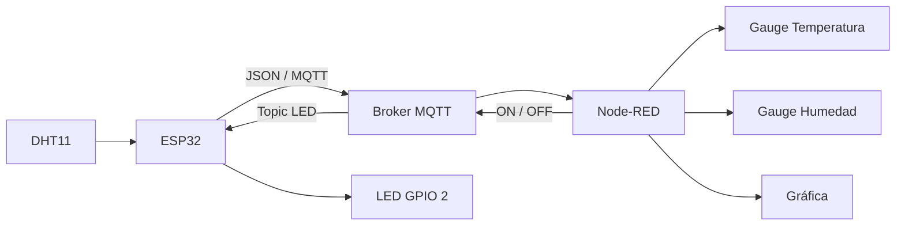

<div align="center">

# 🌡️ Monitoreo de temperatura y humedad con ESP32, DHT11, MQTT y Node-RED

### Taller de Internet de las Cosas (IoT)

**ESP32 · DHT11 · MQTT · JSON · Node-RED Dashboard 2.0**

</div>

---

## 📋 Información del proyecto

| Campo | Detalle |
|---|---|
| **Curso** | Proyecto Integrador |
| **Actividad** | Visualización de datos del sensor DHT11 en Node-RED |
| **Plataforma** | ESP32 + MQTT + Node-RED Dashboard 2.0 |
| **Fecha** | 01/10/2026 |
| **Institución** | Universidad Peruana Cayetano Heredia |

---

## 📑 Contenido

- [1. Introducción](#1-introducción)
- [2. Objetivos](#2-objetivos)
- [3. Materiales y herramientas](#3-materiales-y-herramientas)
- [4. Arquitectura de la solución](#4-arquitectura-de-la-solución)
- [5. Conexiones utilizadas](#5-conexiones-utilizadas)
- [6. Configuración MQTT](#6-configuración-mqtt)
- [7. Código implementado en el ESP32](#7-código-implementado-en-el-esp32)
- [8. Configuración del flujo en Node-RED](#8-configuración-del-flujo-en-node-red)
- [9. Evidencias y resultados](#9-evidencias-y-resultados)
- [10. Análisis del funcionamiento](#10-análisis-del-funcionamiento)
- [11. Conclusiones](#11-conclusiones)

---

## 1. Introducción

En esta práctica se implementó un sistema básico de **Internet de las Cosas (IoT)** para adquirir, transmitir y visualizar variables ambientales en tiempo real.

Un sensor **DHT11** conectado al **ESP32** midió la temperatura y la humedad relativa del ambiente. Posteriormente, el microcontrolador publicó ambas variables mediante el protocolo **MQTT** hacia un broker remoto. **Node-RED** se utilizó como plataforma de integración y visualización, donde los datos fueron procesados y mostrados mediante indicadores y una gráfica.

Además del monitoreo, el flujo incluyó un control bidireccional: desde el dashboard de Node-RED se podía enviar un comando MQTT para encender o apagar el LED integrado del ESP32. De esta manera, la actividad permitió integrar:

- adquisición de datos;
- mensajería IoT;
- visualización web;
- actuación remota.

---

## 2. Objetivos

### 🎯 Objetivo general

Implementar un sistema IoT capaz de medir temperatura y humedad con un sensor DHT11 conectado a un ESP32, transmitir los datos por MQTT y visualizarlos en un dashboard desarrollado en Node-RED.

### ✅ Objetivos específicos

- Configurar el ESP32 para conectarse a una red WiFi y a un broker MQTT remoto.
- Leer periódicamente la temperatura y la humedad relativa proporcionadas por el sensor DHT11.
- Empaquetar las mediciones en formato JSON y publicarlas en un topic MQTT.
- Recibir los datos en Node-RED y separar las variables para su representación en indicadores y gráficas.
- Enviar desde Node-RED comandos de encendido y apagado hacia el LED del ESP32 mediante un segundo topic MQTT.

---

## 3. Materiales y herramientas

| Recurso | Uso |
|---|---|
| **ESP32** | Adquisición, procesamiento y transmisión de datos |
| **DHT11** | Medición de temperatura y humedad relativa |
| **Cables Dupont** | Conexión entre sensor y ESP32 |
| **Protoboard** | Montaje del circuito |
| **Arduino IDE** | Programación del ESP32 |
| **Node-RED** | Procesamiento y visualización de datos |
| **Node-RED Dashboard 2.0** | Interfaz gráfica web |
| **Broker MQTT** | Intercambio de mensajes entre ESP32 y Node-RED |
| **WiFi** | Acceso a la red e Internet |

### 📚 Librerías utilizadas en Arduino

```cpp
#include <WiFi.h>
#include <PubSubClient.h>
#include <ArduinoJson.h>
#include <DHT.h>
```

---

## 4. Arquitectura de la solución

El sistema sigue un flujo de comunicación desde el sensor físico hasta la interfaz web.



### Flujo principal

```text
DHT11 → ESP32 → MQTT → Node-RED → Gauge / Chart / Control LED
```

El DHT11 obtiene las variables ambientales, el ESP32 las organiza en formato JSON y las publica mediante MQTT. Node-RED recibe el mensaje y actualiza los elementos del dashboard.

---

## 5. Conexiones utilizadas

| Elemento | Pin / conexión | Función |
|---|---|---|
| DHT11 - VCC | 3.3 V | Alimentación |
| DHT11 - GND | GND | Referencia eléctrica |
| DHT11 - DATA | GPIO 4 | Lectura digital de temperatura y humedad |
| LED integrado | GPIO 2 | Actuador controlado desde Node-RED |

---

## 6. Configuración MQTT

El ESP32 se configuró como cliente MQTT. Para el intercambio de información se utilizaron dos topics.

| Topic | Sentido | Contenido |
|---|---|---|
| `equipo01/sensor/datos` | ESP32 → Node-RED | JSON con dispositivo, temperatura y humedad |
| `equipo01/actuadores/led` | Node-RED → ESP32 | Comando `ON` o `OFF` |

### 📦 Formato de los datos

El ESP32 publica un objeto JSON similar a:

```json
{
  "dispositivo": "ESP32_Equipo01",
  "temperatura": 27.5,
  "humedad": 57.0
}
```

Esto permite transportar varias variables dentro de un único mensaje MQTT.

---

## 7. Código implementado en el ESP32

```cpp
#include <WiFi.h>
#include <PubSubClient.h>
#include <ArduinoJson.h>
#include <DHT.h>

// ================= CONFIGURACIÓN WIFI =================

const char* WIFI_SSID = "GalaxyA04s";
const char* WIFI_PASS = "12345678";

// ================= CONFIGURACIÓN MQTT =================

const char* MQTT_SERVER = "mqtt.rcr-labs.com";
const int MQTT_PORT = 1883;

const char* MQTT_USER = "alumno";
const char* MQTT_PASSWORD = "UPCH2026";

const char* CLIENT_ID = "ESP32_Equipo01";

// ================= TOPICS MQTT =================

const char* TOPIC_PUB = "equipo01/sensor/datos";
const char* TOPIC_SUB = "equipo01/actuadores/led";

// ================= DHT11 =================

#define DHTPIN 4
#define DHTTYPE DHT11

DHT dht(DHTPIN, DHTTYPE);

// ================= OBJETOS =================

WiFiClient espClient;
PubSubClient client(espClient);

unsigned long ultimoEnvio = 0;
const long intervaloEnvio = 5000;

// ================= WIFI =================

void setupWiFi() {

  delay(10);

  Serial.println();
  Serial.print("Conectando a WiFi: ");
  Serial.println(WIFI_SSID);

  WiFi.mode(WIFI_STA);
  WiFi.begin(WIFI_SSID, WIFI_PASS);

  while (WiFi.status() != WL_CONNECTED) {
    delay(500);
    Serial.print(".");
  }

  Serial.println();
  Serial.println("WiFi conectado");

  Serial.print("IP local: ");
  Serial.println(WiFi.localIP());
}

// ================= CALLBACK MQTT =================

void callback(char* topic, byte* payload, unsigned int length) {

  String mensaje = "";

  for (unsigned int i = 0; i < length; i++) {
    mensaje += (char)payload[i];
  }

  if (String(topic) == TOPIC_SUB) {

    if (mensaje == "ON") {

      digitalWrite(2, HIGH);
      Serial.println("LED ENCENDIDO");

    }

    else if (mensaje == "OFF") {

      digitalWrite(2, LOW);
      Serial.println("LED APAGADO");

    }
  }
}

// ================= RECONEXIÓN MQTT =================

void reconnect() {

  while (!client.connected()) {

    if (client.connect(CLIENT_ID, MQTT_USER, MQTT_PASSWORD)) {

      client.subscribe(TOPIC_SUB);

    }

    else {

      delay(5000);

    }
  }
}

// ================= SETUP =================

void setup() {

  Serial.begin(115200);

  dht.begin();

  pinMode(2, OUTPUT);

  setupWiFi();

  client.setServer(MQTT_SERVER, MQTT_PORT);

  client.setCallback(callback);
}

// ================= LOOP =================

void loop() {

  if (!client.connected()) {
    reconnect();
  }

  client.loop();

  unsigned long ahora = millis();

  if (ahora - ultimoEnvio >= intervaloEnvio) {

    ultimoEnvio = ahora;

    float temperatura = dht.readTemperature();
    float humedad = dht.readHumidity();

    if (isnan(temperatura) || isnan(humedad)) {

      Serial.println("Error leyendo el DHT11");
      return;
    }

    StaticJsonDocument<200> doc;

    doc["dispositivo"] = CLIENT_ID;
    doc["temperatura"] = temperatura;
    doc["humedad"] = humedad;

    char jsonBuffer[256];

    serializeJson(doc, jsonBuffer);

    Serial.print("Temperatura: ");
    Serial.print(temperatura);
    Serial.println(" °C");

    Serial.print("Humedad: ");
    Serial.print(humedad);
    Serial.println(" %");

    client.publish(TOPIC_PUB, jsonBuffer);
  }
}
```

---

## 8. Configuración del flujo en Node-RED

En Node-RED se añadió un nodo **MQTT In** suscrito al topic:

```text
equipo01/sensor/datos
```

El mensaje recibido se procesó para separar las variables provenientes del JSON.

### Componentes principales del flujo

- **MQTT In:** recibe los datos publicados por el ESP32.
- **Nodos de procesamiento:** separan temperatura, humedad e identificador del dispositivo.
- **Gauge de temperatura:** presenta la temperatura en °C.
- **Gauge de humedad:** presenta la humedad relativa en %.
- **Chart:** representa la evolución de las mediciones en el tiempo.
- **Texto:** muestra el identificador del ESP32.
- **Switch LED:** envía `ON` u `OFF`.
- **MQTT Out:** publica el comando en `equipo01/actuadores/led`.

### 🧩 Flujo implementado

<div align="center">


*Figura 1. Flujo desarrollado en Node-RED para recepción, procesamiento, visualización y control mediante MQTT.*

</div>

---

## 9. Evidencias y resultados

Durante las pruebas, el dashboard recibió correctamente la información transmitida por el ESP32.

Las capturas muestran valores de:

- 🌡️ **Temperatura:** aproximadamente **27.5 °C**
- 💧 **Humedad relativa:** aproximadamente **57-58 %**

La gráfica permitió observar cómo las mediciones cambiaban a lo largo del tiempo.

### 📊 Dashboard de Node-RED

<div align="center">


*Figura 2. Dashboard con los indicadores de temperatura y humedad relativa.*

</div>

### 🔧 Montaje completo

<div align="center">


*Figura 3. Prueba integral del sistema con el ESP32 conectado y el dashboard en ejecución.*

</div>

### 💧 Visualización de humedad y gráfica

<div align="center">


*Figura 4. Visualización de humedad relativa y evolución de las mediciones.*

</div>

### 📡 ESP32 conectado al dashboard

<div align="center">


*Figura 5. ESP32 conectado mientras Node-RED presenta los datos recibidos.*

</div>

### 🌡️ Sensor DHT11 y ESP32

<div align="center">


*Figura 6. Sensor DHT11 y ESP32 utilizados durante la prueba.*

</div>

---

## 10. Análisis del funcionamiento

El sensor DHT11 entrega al ESP32 dos variables digitales:

1. **Temperatura**
2. **Humedad relativa**

Cada **5 segundos**, el programa ejecuta una nueva lectura:

```cpp
const long intervaloEnvio = 5000;
```

Posteriormente se verifica que los valores sean válidos:

```cpp
if (isnan(temperatura) || isnan(humedad)) {
    Serial.println("Error leyendo el DHT11");
    return;
}
```

Los datos se organizan en un objeto JSON:

```cpp
doc["dispositivo"] = CLIENT_ID;
doc["temperatura"] = temperatura;
doc["humedad"] = humedad;
```

Finalmente, el objeto se serializa y se publica mediante MQTT:

```cpp
serializeJson(doc, jsonBuffer);
client.publish(TOPIC_PUB, jsonBuffer);
```

Node-RED recibe el mensaje, identifica las propiedades y dirige cada valor hacia el elemento correspondiente del dashboard.

### 🔄 Comunicación bidireccional

El sistema no solamente recibe información del ESP32. Node-RED también puede enviar comandos al dispositivo:

```text
Node-RED → MQTT → ESP32 → LED
```

Cuando el ESP32 recibe:

```text
ON
```

ejecuta:

```cpp
digitalWrite(2, HIGH);
```

Y cuando recibe:

```text
OFF
```

ejecuta:

```cpp
digitalWrite(2, LOW);
```

Esto demuestra una comunicación IoT **bidireccional**: el ESP32 funciona tanto como emisor de datos como receptor de órdenes.

---

## 11. Conclusiones

1. Se logró integrar correctamente el sensor **DHT11** con el **ESP32** para obtener mediciones periódicas de temperatura y humedad.

2. El protocolo **MQTT** permitió transmitir las mediciones desde el ESP32 hacia Node-RED mediante un esquema ligero basado en publicación y suscripción.

3. El uso de **JSON** facilitó el envío simultáneo de varias variables dentro de un mismo mensaje.

4. **Node-RED Dashboard 2.0** permitió representar los datos mediante indicadores visuales y una gráfica temporal.

5. El segundo topic MQTT permitió incorporar el control remoto del LED, demostrando una comunicación bidireccional entre **Node-RED y el ESP32**.

---

<div align="center">

### 🚀 Tecnologías utilizadas

`ESP32` · `DHT11` · `WiFi` · `MQTT` · `ArduinoJson` · `Node-RED` · `Dashboard 2.0`

<br>

**Taller de Internet de las Cosas (IoT)**

</div>
