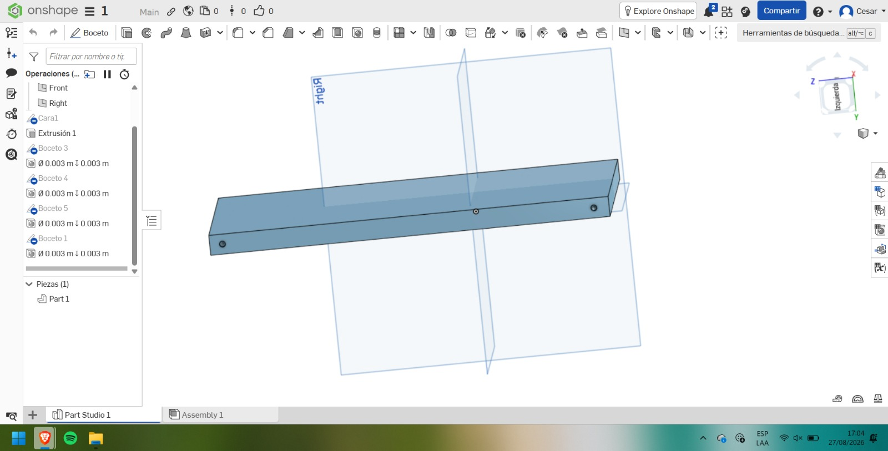
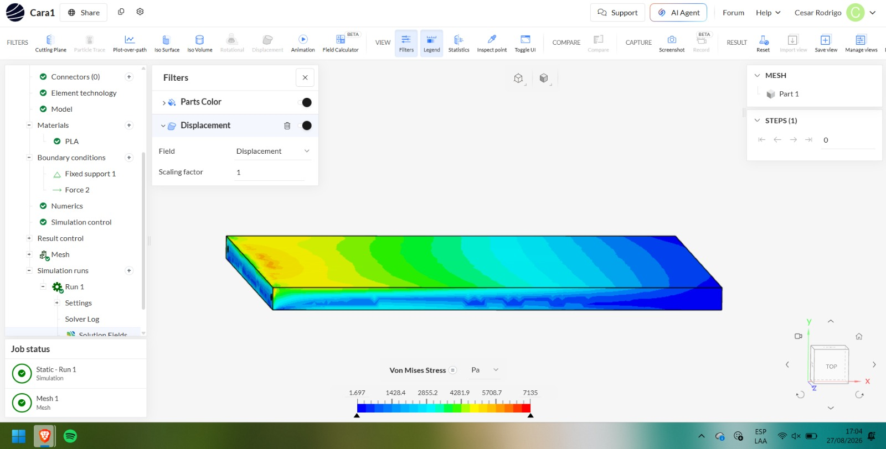

## Taller 1: Modelado y simulación en Onshape

## Modelo de la pieza

La pieza estructural fue modelada en **Onshape**, definiendo su geometría, dimensiones y los elementos necesarios para su posterior ensamblaje y fijación. El diseño corresponde a una parte del prototipo, considerando las condiciones necesarias para su fabricación.

  

<em>Figura 1. Modelado de la pieza estructural en Onshape.</em>

---

## Material utilizado

Para la simulación se asignó **PLA (ácido poliláctico)** como material de fabricación de la pieza. El PLA es un material ampliamente utilizado en la **impresión 3D**, debido a su facilidad de fabricación y sus propiedades mecánicas adecuadas para prototipos estructurales.

La asignación del material permite que la simulación considere sus propiedades mecánicas y evalúe el comportamiento de la estructura ante las cargas aplicadas.

---

## Condiciones de soporte

En la simulación se estableció un **soporte fijo** en la zona correspondiente de la estructura. Esta condición representa una parte del modelo que se encuentra restringida y no puede desplazarse durante la aplicación de las cargas.

El soporte fijo permite analizar cómo responde el resto de la estructura ante las fuerzas aplicadas y observar la distribución de los esfuerzos generados.

---

## Fuerza lateral aplicada

Se aplicó una **fuerza de 10 N sobre la cara de una de las tapas del prototipo**. Esta fuerza representa una posible carga externa que podría producirse durante la manipulación o el uso del sistema, como una **presión accidental sobre la tapa o un pequeño impacto externo**.

La aplicación de esta fuerza permite evaluar la resistencia de la tapa y analizar cómo la carga se distribuye hacia el resto de la estructura. Además, permite identificar las zonas donde podrían producirse mayores concentraciones de esfuerzo.

La fuerza de **10 N** se utilizó como una carga de prueba para verificar el comportamiento mecánico del diseño fabricado en PLA antes de su fabricación mediante impresión 3D.

---

## Aplicación de la gravedad

Además de la fuerza externa, se incorporó la **gravedad en el eje Z con un valor de -9.81 m/s²**, correspondiente a la aceleración gravitacional terrestre.

La inclusión de la gravedad permite considerar el **peso propio de la estructura** durante la simulación. De esta manera, el análisis representa de una forma más cercana las condiciones reales en las que funcionará el prototipo.

El signo negativo en el eje **Z** indica que la gravedad actúa en dirección descendente dentro del sistema de coordenadas utilizado en la simulación.

---

## Simulación estructural

Una vez terminado el diseño, la pieza fue llevada a un entorno de **simulación por elementos finitos** para evaluar su comportamiento mecánico.

En la simulación se asignó **PLA como material**, se estableció un **soporte fijo**, se aplicó una **fuerza lateral de 10 N sobre la cara de una de las tapas** y se incorporó la **gravedad en el eje Z con un valor de -9.81 m/s²**.

Posteriormente, se generó la malla del modelo y se realizó un **análisis estático estructural**. Como resultado, se obtuvo la distribución de los **esfuerzos de Von Mises**, permitiendo observar cómo las tensiones se distribuyen a lo largo de la estructura e identificar las zonas sometidas a mayores esfuerzos.

Este análisis permite comprobar si el diseño fabricado en **PLA** puede soportar las condiciones de carga establecidas antes de realizar su fabricación mediante impresión 3D.

  

<em>Figura 2. Distribución de esfuerzos de Von Mises obtenida en la simulación.</em>

---

## Enlace del modelo

🔗 [Abrir proyecto en Onshape](https://cad.onshape.com/documents/ab1cd2c0483d50533a7dbf43/w/8a763a46a296a9cda19c8320/e/317d975dd38b92baded6c56f?renderMode=0&uiState=6a90b4afa8ef525db5af49c7)

## Enlace de la simulación

🔗 [Abrir simulación en SimScale](https://www.simscale.com/workbench/?pid=4421958147455559246&mi=spec:d6bef11a-a1f6-4f27-b491-2962d1fedb19%2Cservice:SIMULATION%2Cstrategy:1)
