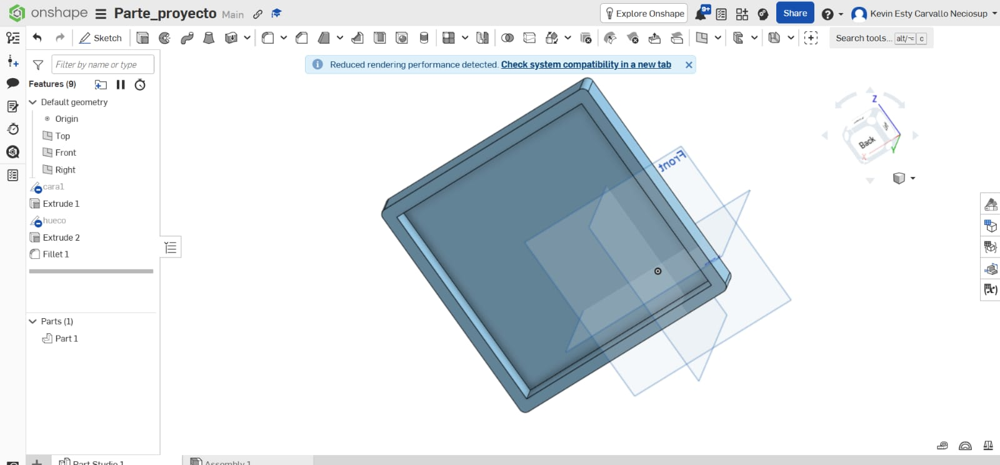

# Taller 1: Modelado y simulación en Onshape y SimScale

## Modelo 3D

El modelo tridimensional de la cámara experimental fue diseñado utilizando **Onshape**, donde se definieron la geometría, dimensiones, soportes y orificios necesarios para la construcción del prototipo.

  

<em>Figura 1. Modelado 3D de la cámara experimental realizado en Onshape.</em>

Una vez finalizado el diseño, el modelo 3D fue utilizado como base para realizar el análisis estructural en **SimScale**.

## Simulación estructural en SimScale

El análisis estructural se realizó en **SimScale** mediante una simulación estática, utilizando **PLA** como material de fabricación. El objetivo fue evaluar el comportamiento de la estructura frente a su propio peso y ante la aplicación de una fuerza lateral.

Para representar las condiciones de sujeción de la cámara, se establecieron **soportes fijos** en las zonas correspondientes. De esta manera, dichas regiones permanecen restringidas durante la simulación, mientras que el resto de la estructura puede responder a las cargas aplicadas.

### Gravedad

Para considerar el peso propio de la estructura se utilizó la aceleración gravitacional terrestre:

$$
g = 9.81\;m/s^2
$$

La fuerza generada por la gravedad depende de la masa del modelo y se determina mediante:

$$
F_g=m\cdot g
$$

donde:

* \(F_g\) = fuerza producida por la gravedad, en Newtons (N).
* \(m\) = masa de la estructura, en kilogramos (kg).
* \(g\) = aceleración gravitacional, \(9.81\;m/s^2\).

Por lo tanto, la gravedad permite representar en SimScale el efecto del **peso propio del modelo**, haciendo que el análisis sea más representativo de las condiciones físicas a las que estaría sometida la estructura.

### Justificación de la fuerza lateral de 5 N

Además de la gravedad, se aplicó una **fuerza lateral de 5 N** sobre la estructura. Esta carga se utiliza como una condición de prueba para evaluar la resistencia de la cámara frente a una acción externa horizontal, que puede representar esfuerzos producidos durante su manipulación, montaje o desplazamiento.

La magnitud de esta fuerza puede relacionarse con una masa equivalente utilizando la segunda ley de Newton:

$$
F=m\cdot g
$$

Despejando la masa:

$$
m=\frac{F}{g}
$$

Sustituyendo los valores:

$$
m=\frac{5\;N}{9.81\;m/s^2}
$$

$$
m\approx0.51\;kg
$$

Por lo tanto, **5 N equivalen aproximadamente al peso de una masa de 0.51 kg bajo la gravedad terrestre**. Esta relación proporciona una referencia física para justificar la magnitud de la carga lateral utilizada en la simulación.

### Análisis de resultados

El comportamiento de la estructura se evaluó mediante el **esfuerzo de Von Mises**, representado mediante una escala de colores.

  

<em>Figura 2. Distribución de esfuerzos de Von Mises obtenida mediante la simulación en SimScale.</em>

Las zonas azules representan menores niveles de esfuerzo, mientras que las zonas verdes, amarillas y cercanas al rojo indican mayores concentraciones de esfuerzo. Estas concentraciones se presentan principalmente alrededor de los soportes, bordes, uniones y zonas próximas al punto de aplicación de la fuerza.

La simulación permite evaluar virtualmente la respuesta mecánica de la estructura antes de fabricar el prototipo. De esta manera, se pueden identificar posibles zonas críticas y determinar si es necesario realizar modificaciones o incorporar refuerzos al diseño.

## Enlace del modelo

🔗 [Abrir proyecto en Onshape](https://cad.onshape.com/documents/7e5dfc0c5f8da095666567a1/w/43a58c234b1dbdfc2a86eaa6/e/9aea2794971a718a5ad29330)
