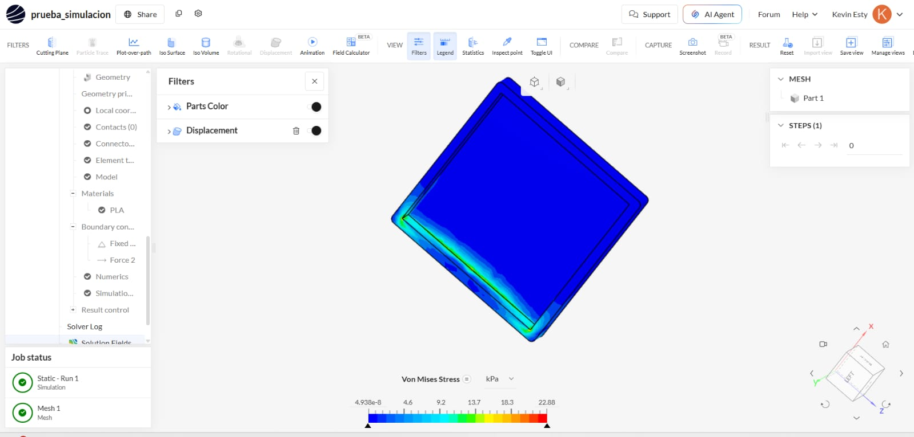

# Taller 1: Modelado y simulación en Onshape

## Modelo de la pieza

  

<em>Figura 1. Modelado de la pieza estructural en Onshape.</em>

## Simulación estructural

  

<em>Figura 2. Distribución de esfuerzos de Von Mises obtenida en la simulación.</em>

Se realizó una simulación estática estructural del modelo 3D de la cámara experimental, utilizando PLA como material de fabricación. Para el análisis se asignaron las propiedades mecánicas del PLA y se establecieron soportes fijos en la estructura para representar las zonas que permanecen inmóviles. Posteriormente, se aplicó una fuerza lateral de 5 N con el objetivo de evaluar cómo responde la cámara ante una carga externa. El comportamiento de la estructura se analizó mediante el esfuerzo de Von Mises, observando su distribución a través de una escala de colores. Las zonas azules representan menores niveles de esfuerzo, mientras que las zonas verdes, amarillas y cercanas al rojo indican una mayor concentración de esfuerzos, principalmente alrededor de los bordes y de la zona donde se aplica la fuerza. Esta simulación permite evaluar virtualmente la resistencia y el comportamiento mecánico de la estructura antes de fabricar el prototipo, ayudando a identificar posibles zonas que podrían requerir refuerzo o modificaciones en el diseño.

## Enlace del modelo

🔗 [Abrir proyecto en Onshape]()
