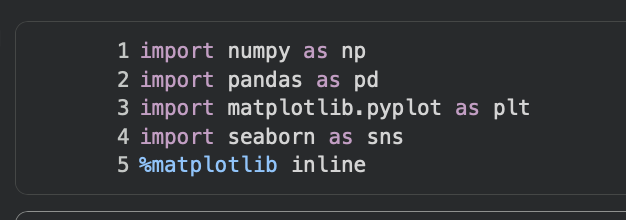
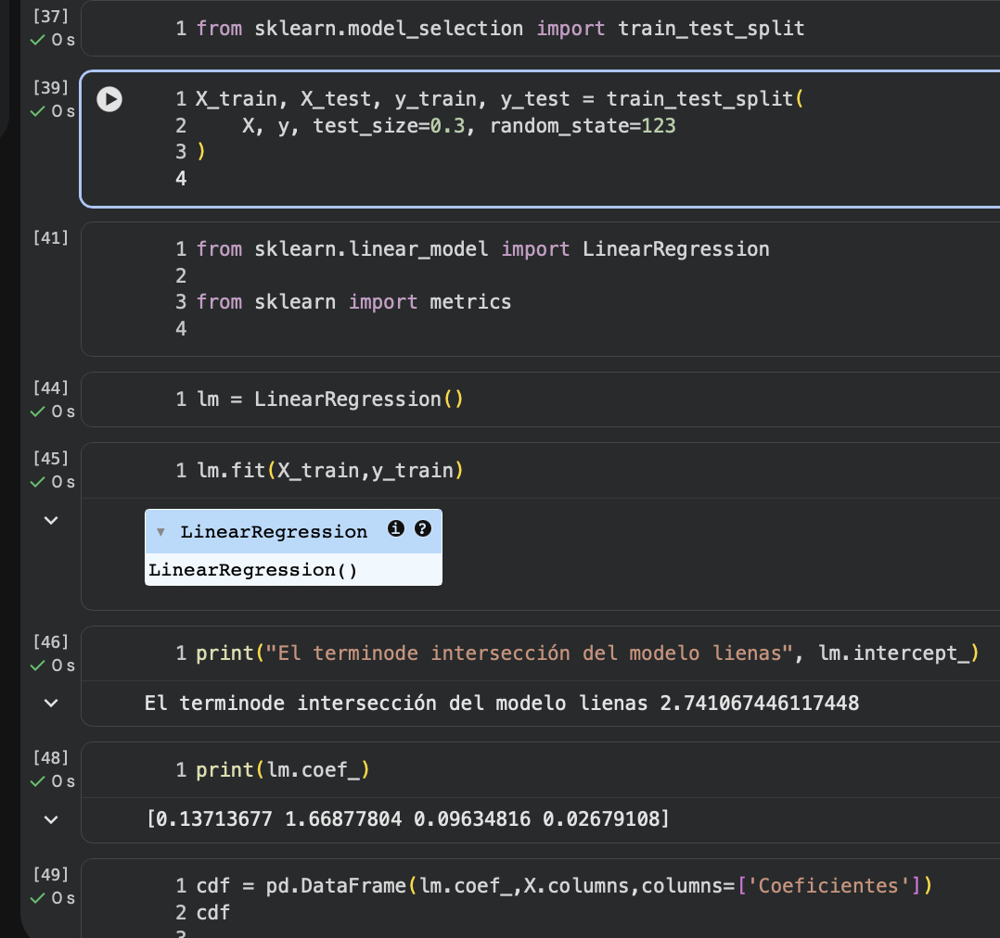
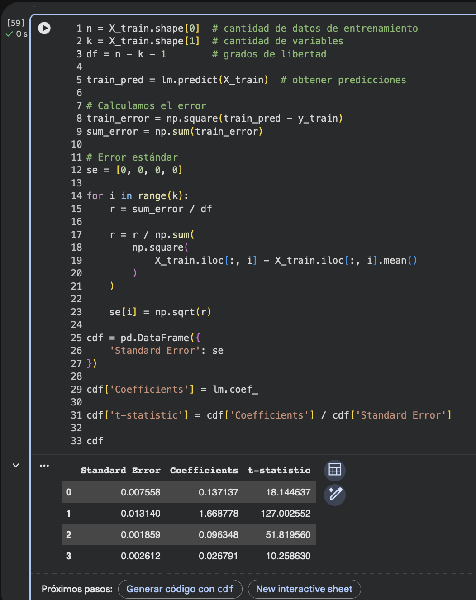
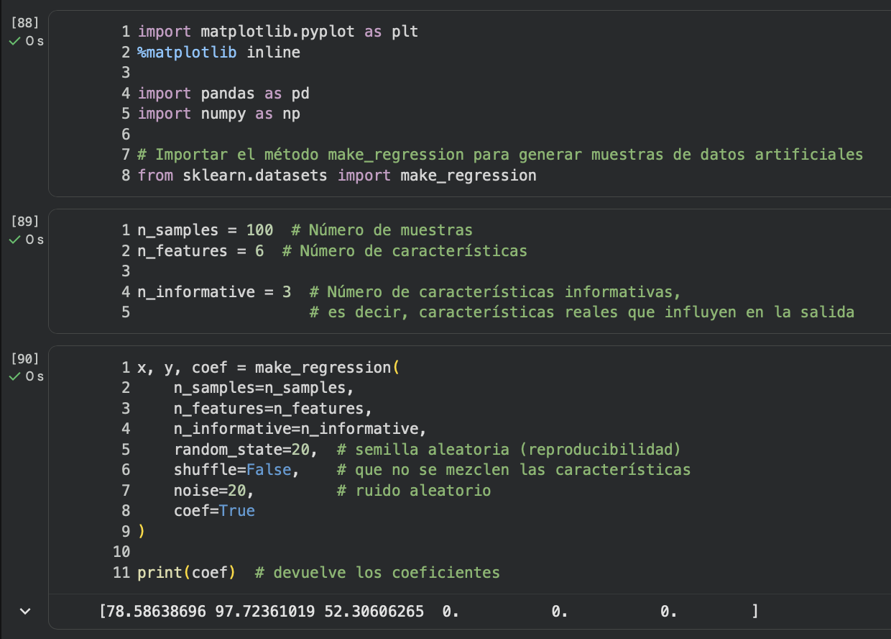
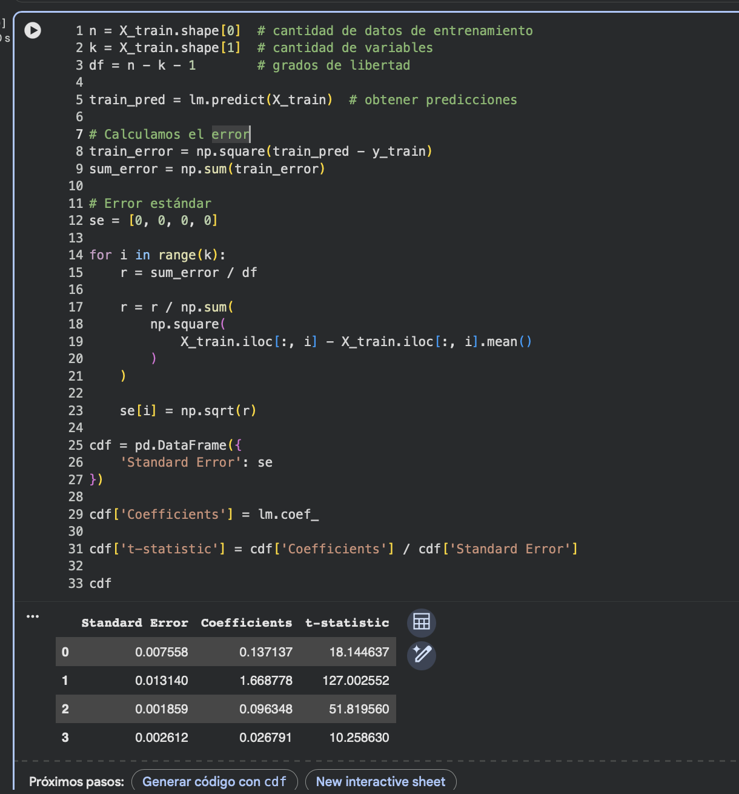
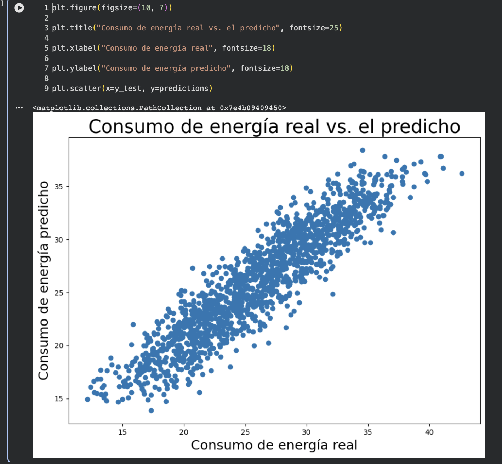
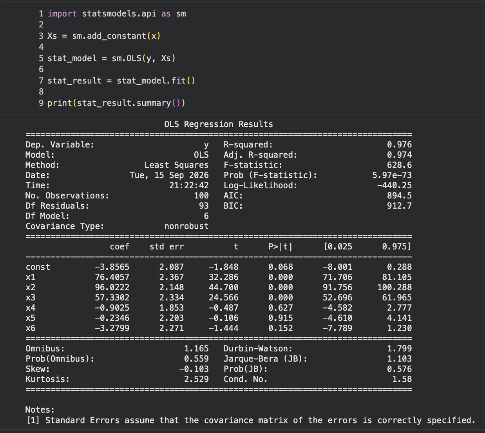
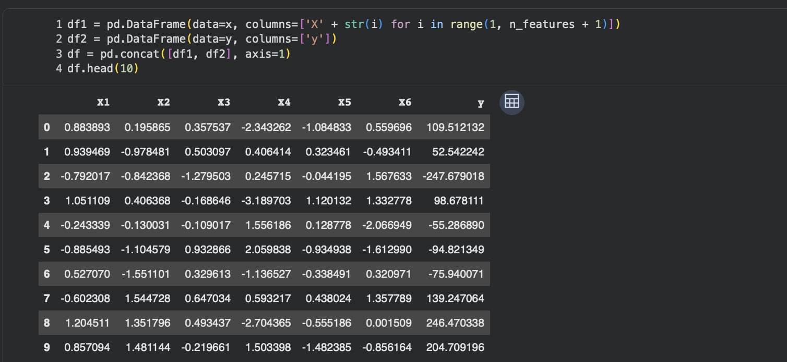
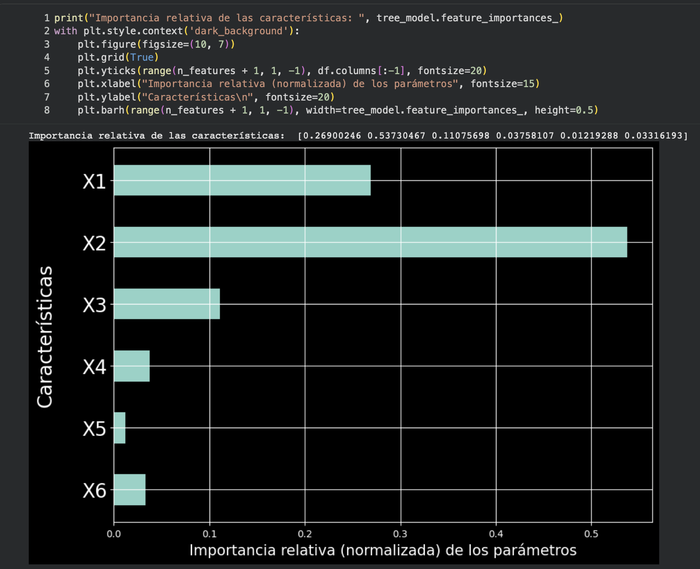

# Lo que aprendí sobre regresión lineal y análisis de datosLo que aprendí sobre regresión lineal y análisis de datosLo que aprendí sobre regresión lineal y análisis de datos

IntroducciónIntroducciónIntroducción

En esta clase he visto diferentes herramientas y conceptos relacionados con el análisis de datos y Machine Learning, principalmente utilizando Python. He trabajado con librerías como NumPy, Pandas, Matplotlib, Seaborn, Scikit-learn y Statsmodels, las cuales permiten trabajar con datos, realizar cálculos, generar gráficos y construir modelos de regresión.En esta clase he visto diferentes herramientas y conceptos relacionados con el En esta clase he visto diferentes herramientas y conceptos relacionados con el análisis de datos y Machine Learninganálisis de datos y Machine Learning, principalmente utilizando Python. He trabajado con librerías como , principalmente utilizando Python. He trabajado con librerías como NumPy, Pandas, Matplotlib, Seaborn, Scikit-learn y StatsmodelsNumPy, Pandas, Matplotlib, Seaborn, Scikit-learn y Statsmodels, las cuales permiten trabajar con datos, realizar cálculos, generar gráficos y construir modelos de regresión., las cuales permiten trabajar con datos, realizar cálculos, generar gráficos y construir modelos de regresión.



¿Qué he visto?¿Qué he visto?¿Qué he visto?

He visto cómo importar y organizar un conjunto de datos utilizando Pandas, principalmente mediante DataFrame. También aprendí a utilizar NumPy para realizar cálculos numéricos y trabajar con arreglos.He visto cómo importar y organizar un conjunto de datos utilizando He visto cómo importar y organizar un conjunto de datos utilizando PandasPandas, principalmente mediante , principalmente mediante DataFrameDataFrame. También aprendí a utilizar . También aprendí a utilizar NumPyNumPy para realizar cálculos numéricos y trabajar con arreglos. para realizar cálculos numéricos y trabajar con arreglos.

Otro tema que he visto es la visualización de datos. Utilicé Matplotlib y Seaborn para crear gráficos que permiten observar de una manera más clara la relación entre diferentes variables. En especial, los diagramas de dispersión (scatter) me permiten observar si existe una relación entre una variable independiente y el consumo de energía.Otro tema que he visto es la Otro tema que he visto es la visualización de datosvisualización de datos. Utilicé Matplotlib y Seaborn para crear gráficos que permiten observar de una manera más clara la relación entre diferentes variables. En especial, los diagramas de dispersión (. Utilicé Matplotlib y Seaborn para crear gráficos que permiten observar de una manera más clara la relación entre diferentes variables. En especial, los diagramas de dispersión (scatterscatter) me permiten observar si existe una relación entre una variable independiente y el consumo de energía.) me permiten observar si existe una relación entre una variable independiente y el consumo de energía.

También he visto cómo dividir los datos en dos grupos utilizando train_test_split:También he visto cómo dividir los datos en dos grupos utilizando También he visto cómo dividir los datos en dos grupos utilizando train_test_splittrain_test_split::

70 % para entrenamiento70 % para entrenamiento70 % para entrenamiento

30 % para prueba30 % para prueba30 % para prueba

Esto es importante porque el modelo necesita una parte de los datos para aprender y otra parte para comprobar qué tan bien realiza sus predicciones.Esto es importante porque el modelo necesita una parte de los datos para aprender y otra parte para comprobar qué tan bien realiza sus predicciones.Esto es importante porque el modelo necesita una parte de los datos para aprender y otra parte para comprobar qué tan bien realiza sus predicciones.



Regresión linealRegresión linealRegresión lineal

Uno de los temas que más he visto es la regresión lineal, utilizando LinearRegression de Scikit-learn.Uno de los temas que más he visto es la Uno de los temas que más he visto es la regresión linealregresión lineal, utilizando , utilizando LinearRegressionLinearRegression de Scikit-learn. de Scikit-learn.

El objetivo es encontrar una relación entre las variables de entrada y una variable de salida. En mi caso, se utiliza para intentar predecir el Consumo_Energia a partir de diferentes características.El objetivo es encontrar una relación entre las variables de entrada y una variable de salida. En mi caso, se utiliza para intentar predecir el El objetivo es encontrar una relación entre las variables de entrada y una variable de salida. En mi caso, se utiliza para intentar predecir el Consumo_EnergiaConsumo_Energia a partir de diferentes características. a partir de diferentes características.

El modelo se guarda en una variable como lm y posteriormente puedo utilizar:El modelo se guarda en una variable como El modelo se guarda en una variable como lmlm y posteriormente puedo utilizar: y posteriormente puedo utilizar:

```python
predictions = lm.predict(x_test)predictions predictions == lm.predict(x_test) lm.predict(x_test)
```

para obtener las predicciones sobre los datos de prueba.para obtener las predicciones sobre los datos de prueba.para obtener las predicciones sobre los datos de prueba.



Generación de datosGeneración de datosGeneración de datos

También he visto cómo generar datos artificiales utilizando make_regression.También he visto cómo generar datos artificiales utilizando También he visto cómo generar datos artificiales utilizando make_regressionmake_regression..

Con esta función puedo definir:Con esta función puedo definir:Con esta función puedo definir:

La cantidad de muestras.La cantidad de muestras.La cantidad de muestras.

La cantidad de características.La cantidad de características.La cantidad de características.

Cuántas características son realmente informativas.Cuántas características son realmente informativas.Cuántas características son realmente informativas.

El nivel de ruido.El nivel de ruido.El nivel de ruido.

Una semilla aleatoria para poder reproducir los mismos resultados.Una semilla aleatoria para poder reproducir los mismos resultados.Una semilla aleatoria para poder reproducir los mismos resultados.

Esto me ayudó a entender que los datos pueden tener diferentes variables y que no todas necesariamente tienen la misma importancia para explicar el resultado.Esto me ayudó a entender que los datos pueden tener diferentes variables y que no todas necesariamente tienen la misma importancia para explicar el resultado.Esto me ayudó a entender que los datos pueden tener diferentes variables y que no todas necesariamente tienen la misma importancia para explicar el resultado.



Error estándar y t-statisticError estándar y t-statisticError estándar y t-statistic

Otro punto que he visto es el cálculo del error estándar y del t-statistic de los coeficientes.Otro punto que he visto es el cálculo del Otro punto que he visto es el cálculo del error estándarerror estándar y del y del t-statistict-statistic de los coeficientes. de los coeficientes.

El error estándar permite conocer qué tanta incertidumbre existe alrededor de un coeficiente. Luego, el t-statistic relaciona el coeficiente con su error estándar:El error estándar permite conocer qué tanta incertidumbre existe alrededor de un coeficiente. Luego, el El error estándar permite conocer qué tanta incertidumbre existe alrededor de un coeficiente. Luego, el t-statistict-statistic relaciona el coeficiente con su error estándar: relaciona el coeficiente con su error estándar:

```python
cdf['t-statistic'] = cdf['Coefficients'] / cdf['Standard Error']cdf[cdf['t-statistic''t-statistic'] ] == cdf[ cdf['Coefficients''Coefficients'] ] // cdf[ cdf['Standard Error''Standard Error']]
```

Esto es importante porque permite analizar si un coeficiente se encuentra alejado de cero en relación con la incertidumbre que presenta.Esto es importante porque permite analizar si un coeficiente se encuentra alejado de cero en relación con la incertidumbre que presenta.Esto es importante porque permite analizar si un coeficiente se encuentra alejado de cero en relación con la incertidumbre que presenta.



Visualización de las prediccionesVisualización de las prediccionesVisualización de las predicciones

También he trabajado con un diagrama de dispersión para comparar los valores reales con los valores predichos.También he trabajado con un También he trabajado con un diagrama de dispersióndiagrama de dispersión para comparar los valores reales con los valores predichos. para comparar los valores reales con los valores predichos.

```python
plt.scatter(x=y_test, y=predictions)plt.scatter(xplt.scatter(x==y_test, yy_test, y==predictions)predictions)
```

La idea es observar qué tan cerca están las predicciones de los valores reales. Si los puntos se encuentran cerca de una línea de 45 grados, significa que las predicciones están siguiendo de manera cercana a los valores reales.La idea es observar qué tan cerca están las predicciones de los valores reales. Si los puntos se encuentran cerca de una línea de 45 grados, significa que las predicciones están siguiendo de manera cercana a los valores reales.La idea es observar qué tan cerca están las predicciones de los valores reales. Si los puntos se encuentran cerca de una línea de 45 grados, significa que las predicciones están siguiendo de manera cercana a los valores reales.



StatsmodelsStatsmodelsStatsmodels

Finalmente, he visto otra forma de realizar una regresión utilizando Statsmodels:Finalmente, he visto otra forma de realizar una regresión utilizando Finalmente, he visto otra forma de realizar una regresión utilizando StatsmodelsStatsmodels::

```python
import statsmodels.api as sm Xs = sm.add_constant(x) stat_model = sm.OLS(y, Xs) stat_result = stat_model.fit() print(stat_result.summary())importimport statsmodels.api statsmodels.api asas sm sm Xs Xs == sm.add_constant(x) sm.add_constant(x) stat_model stat_model == sm.OLS(y, Xs) sm.OLS(y, Xs) stat_result stat_result == stat_model.fit() stat_model.fit() printprint(stat_result.summary())(stat_result.summary())
```

Con OLS puedo realizar una regresión lineal por mínimos cuadrados ordinarios y obtener un resumen estadístico bastante completo del modelo.Con Con OLSOLS puedo realizar una regresión lineal por mínimos cuadrados ordinarios y obtener un resumen estadístico bastante completo del modelo. puedo realizar una regresión lineal por mínimos cuadrados ordinarios y obtener un resumen estadístico bastante completo del modelo.



¿Qué considero más importante?¿Qué considero más importante?¿Qué considero más importante?

Lo que considero más importante de lo que he visto es entender que no solamente se trata de crear un modelo y obtener una predicción. Primero es necesario conocer y preparar los datos, después dividirlos en entrenamiento y prueba, entrenar el modelo y finalmente evaluar sus resultados.Lo que considero más importante de lo que he visto es entender que no solamente se trata de crear un modelo y obtener una predicción. Primero es necesario Lo que considero más importante de lo que he visto es entender que no solamente se trata de crear un modelo y obtener una predicción. Primero es necesario conocer y preparar los datosconocer y preparar los datos, después dividirlos en entrenamiento y prueba, entrenar el modelo y finalmente evaluar sus resultados., después dividirlos en entrenamiento y prueba, entrenar el modelo y finalmente evaluar sus resultados.

También me parece importante la visualización de los datos, porque mediante los gráficos puedo observar relaciones que no serían tan fáciles de identificar solamente con números.También me parece importante la visualización de los datos, porque mediante los gráficos puedo observar relaciones que no serían tan fáciles de identificar solamente con números.También me parece importante la visualización de los datos, porque mediante los gráficos puedo observar relaciones que no serían tan fáciles de identificar solamente con números.

Otro punto que resalta es que existen diferentes herramientas para trabajar con regresión lineal. Por ejemplo, Scikit-learn permite construir modelos y realizar predicciones de una manera práctica, mientras que Statsmodels proporciona información estadística más detallada sobre el modelo, como los coeficientes, errores estándar y estadísticas de prueba.Otro punto que resalta es que existen diferentes herramientas para trabajar con regresión lineal. Por ejemplo, Otro punto que resalta es que existen diferentes herramientas para trabajar con regresión lineal. Por ejemplo, Scikit-learnScikit-learn permite construir modelos y realizar predicciones de una manera práctica, mientras que permite construir modelos y realizar predicciones de una manera práctica, mientras que StatsmodelsStatsmodels proporciona información estadística más detallada sobre el modelo, como los coeficientes, errores estándar y estadísticas de prueba. proporciona información estadística más detallada sobre el modelo, como los coeficientes, errores estándar y estadísticas de prueba.



ConclusiónConclusiónConclusión

En conclusión, he visto cómo utilizar Python para realizar un proceso básico de análisis de datos y Machine Learning mediante regresión lineal. He aprendido a importar y organizar datos, visualizar relaciones entre variables, dividir los datos, entrenar un modelo, realizar predicciones y analizar estadísticamente los resultados.En conclusión, he visto cómo utilizar Python para realizar un proceso básico de En conclusión, he visto cómo utilizar Python para realizar un proceso básico de análisis de datos y Machine Learning mediante regresión linealanálisis de datos y Machine Learning mediante regresión lineal. He aprendido a importar y organizar datos, visualizar relaciones entre variables, dividir los datos, entrenar un modelo, realizar predicciones y analizar estadísticamente los resultados.. He aprendido a importar y organizar datos, visualizar relaciones entre variables, dividir los datos, entrenar un modelo, realizar predicciones y analizar estadísticamente los resultados.

Lo que más resalta para mí es que un modelo de Machine Learning no solamente consiste en obtener una respuesta, sino también en entender los datos, evaluar el modelo y conocer qué tan confiables pueden ser sus resultados.Lo que más resalta para mí es que un modelo de Machine Learning no solamente consiste en obtener una respuesta, sino también en Lo que más resalta para mí es que un modelo de Machine Learning no solamente consiste en obtener una respuesta, sino también en entender los datos, evaluar el modelo y conocer qué tan confiables pueden ser sus resultadosentender los datos, evaluar el modelo y conocer qué tan confiables pueden ser sus resultados..


