# Taller 3: IA - Regresión Lineal

## Introducción

En este taller trabajamos con un modelo de regresión lineal, que es una técnica que sirve para predecir un valor numérico (en este caso, el consumo de energía) a partir de otras variables que lo pueden explicar (temperatura, horas de operación, carga y humedad).

Primero exploramos los datos con gráficos y estadísticas para entender cómo se comportan. Luego entrenamos un modelo que aprende una fórmula matemática para predecir el consumo de energía, y revisamos qué tan bien funciona esa predicción. Finalmente, comparamos ese modelo con datos inventados y con otro tipo de modelo (un árbol de decisión), para confirmar si el modelo realmente detecta qué variables importan y cuáles no.

## Bloque 1: Importar herramientas y cargar los datos

```python
import numpy as np
import pandas as pd
import matplotlib.pyplot as plt
import seaborn as sns
```

%matplotlib inline

```python
df = pd.read_csv("/Data_PI_regresion.csv")
df.head()
```

> **Aprendí:** Que antes de trabajar con datos hay que "traer" las herramientas necesarias: numpy y pandas para manejar números y tablas, y matplotlib/seaborn para hacer gráficos. Luego cargamos el archivo con los datos (temperatura, horas de operación, carga, humedad y consumo de energía) y vimos las primeras filas para saber cómo se ven.

## Bloque 2: Revisar la información general de los datos

```python
df.info(verbose=True)
df.describe().round(1)
df.columns
```

> **Aprendí:** Que antes de hacer cualquier modelo hay que revisar los datos: cuántas filas y columnas tiene la tabla, si falta información, y de qué tipo es cada dato. describe() me dio un resumen rápido (promedio, mínimo, máximo) de cada variable, y columns solo me mostró los nombres de las columnas.

## Bloque 3: Graficar y explorar visualmente los datos

```python
sns.pairplot(df)
df["Consumo_Energia"].plot.hist(bins=25, figsize=(8,4))
df["Consumo_Energia"].plot.density()
```

> **Aprendí:** Que los gráficos ayudan a "ver" los datos antes de modelarlos. El pairplot compara todas las variables entre sí para detectar relaciones a simple vista. El histograma me mostró cómo se distribuyen los valores de consumo de energía (si son bajos, altos o parejos), y el gráfico de densidad es una versión más suave de ese mismo histograma.

## Bloque 4: Ver qué tan relacionadas están las variables (correlación)

```python
numeric_df = df.select_dtypes(include=[np.number])
numeric_df.corr().round(4)
plt.figure(figsize=(10,7))
sns.heatmap(numeric_df.corr(), annot=True, linewidths=2)
```

> **Aprendí:** Que la correlación mide qué tan relacionadas están dos variables: un valor cercano a 1 significa que suben y bajan juntas, y uno cercano a 0 significa que no tienen relación. El heatmap convierte esos números en un mapa de colores, así es más fácil identificar de un vistazo qué variables están más conectadas con el consumo de energía.

## Bloque 5: Separar variables y preparar los datos para el modelo

```python
l_column = list(df.columns)
len_feature = len(l_column)
x = df[l_column[0:len_feature-1]]
y = df[l_column[len_feature-1]]
from sklearn.model_selection import train_test_split
x_train, x_test, y_train, y_test = train_test_split(x, y, test_size=0.3, random_state=123)
```

> **Aprendí:** Que para entrenar un modelo hay que separar los datos en dos partes: x son las variables que "explican" el resultado (temperatura, horas, carga, humedad) y y es lo que queremos predecir (consumo de energía). Además, hay que dividir los datos en un grupo para entrenar el modelo (70%) y otro para probarlo (30%) con datos que el modelo no vio antes, así se sabe si realmente aprendió o solo memorizó.

## Bloque 6: Entrenar el modelo de regresión lineal

```python
from sklearn.linear_model import LinearRegression
from sklearn import metrics
lm = LinearRegression()
lm.fit(x_train, y_train)
print("El termino de interseccion del modelo lineal", lm.intercept_)
print("Los coeficientes del modelo lineal:", lm.coef_)
cdf = pd.DataFrame(lm.coef_, x.columns, columns=["Coeficientes"])
cdf
```

> **Aprendí:** Que un modelo de regresión lineal básicamente arma una fórmula donde cada variable tiene un "peso" (coeficiente) que indica cuánto influye en el resultado. Al entrenarlo (fit), el modelo calcula esos pesos automáticamente. La tabla de coeficientes me permitió ver, por ejemplo, qué tanto influye la temperatura o la humedad en el consumo de energía.

## Bloque 7: Revisar qué tan confiables son los coeficientes

```python
n = x_train.shape[0]
k = x_train.shape[1]
degrees_of_freedom = n - k - 1
train_pred = lm.predict(x_train)
train_error = np.square(train_pred - y_train)
sum_error = np.sum(train_error)
se = [0, 0, 0, 0]
for i in range(k):
r = sum_error / degrees_of_freedom
r = r / np.sum(np.square(x_train.iloc[:, i] - x_train.iloc[:, i].mean()))
se[i] = np.sqrt(r)
cdf = pd.DataFrame({'Standard Error': se})
cdf['Coefficients'] = lm.coef_
cdf['t-statistic'] = cdf['Coefficients'] / cdf['Standard Error']
cdf
```

> **Aprendí:** Que no basta con tener los coeficientes, también hay que saber si son confiables. Calculando el "error estándar" y el "t-statistic" de cada variable pude ver cuáles realmente influyen de forma importante en el consumo de energía y cuáles podrían no aportar mucho.

## Bloque 8: Graficar cada variable contra el consumo de energía

```python
l = list(x.columns)
from matplotlib import gridspec
fig = plt.figure(figsize=(18, 10))
gs = gridspec.GridSpec(2, 2)
ax0 = plt.subplot(gs[0])
ax0.scatter(x[l[0]], y)
ax0.set_title(l[0] + " vs. Consumo_Energia", fontdict={'fontsize': 20})
ax1 = plt.subplot(gs[1])
ax1.scatter(x[l[1]], y)
ax1.set_title(l[1] + " vs. Consumo_Energia", fontdict={'fontsize': 20})
ax2 = plt.subplot(gs[2])
ax2.scatter(x[l[2]], y)
ax2.set_title(l[2] + " vs. Consumo_Energia", fontdict={'fontsize': 20})
ax3 = plt.subplot(gs[3])
ax3.scatter(x[l[3]], y)
ax3.set_title(l[3] + " vs. Consumo_Energia", fontdict={'fontsize': 20})
```

> **Aprendí:** Que graficar cada variable por separado contra el resultado (consumo de energía) ayuda a ver visualmente si existe una relación clara (una tendencia) o si los puntos están totalmente dispersos sin ningún patrón.

## Bloque 9: Comparar lo predicho contra lo real

```python
predictions = lm.predict(x)
plt.figure(figsize=(10, 7))
plt.title("Consumo de energía real vs. el predicho", fontsize=25)
plt.xlabel("Consumo de energía real", fontsize=18)
plt.ylabel("Consumo de energía predicho", fontsize=18)
plt.scatter(x=y, y=predictions)
```

> **Aprendí:** Que una forma sencilla de evaluar un modelo es comparar lo que predijo contra el valor real en un gráfico. Si los puntos forman una línea diagonal de 45°, significa que el modelo predice bastante bien.

## Bloque 10: Revisar los errores del modelo (residuos)

```python
n
plt.figure(figsize=(10, 7))
plt.title("Histograma de residuos para verificar la normalidad", fontsize=25)
sns.histplot((y - predictions), kde=True)
plt.figure(figsize=(10, 7))
plt.title("Valores residuales vs. predichos\n", fontsize=25)
plt.scatter(x=predictions, y=y - predictions)
```

> **Aprendí:** Que el "residuo" es la diferencia entre el valor real y el predicho, es decir, el error del modelo. El histograma me sirvió para comprobar que esos errores se comportan como una campana (lo cual es buena señal), y el segundo gráfico me sirvió para verificar que el error no cambia de forma rara según el valor predicho, sino que se mantiene parejo.

## Bloque 11: Crear datos inventados para poner a prueba los modelos

```python
from sklearn.datasets import make_regression
n_samples = 100
n_features = 6
n_informative = 3
X, y, coef = make_regression(n_samples=n_samples, n_features=n_features, n_informative=n_informative,
random_state=20, shuffle=False, noise=20, coef=True)
print(coef)
df1 = pd.DataFrame(data=X, columns=['X' + str(i) for i in range(1, n_features + 1)])
df2 = pd.DataFrame(data=y, columns=['y'])
df = pd.concat([df1, df2], axis=1)
df.head(10)
```

> **Aprendí:** Que se pueden crear datos falsos a propósito, donde ya sabemos de antemano la respuesta correcta. En este caso se generaron 6 variables, pero solo 3 de ellas realmente influyen en el resultado. Esto sirve para comprobar si un modelo es capaz de "descubrir" por sí solo cuáles variables importan y cuáles no.

## Bloque 12: Graficar las variables inventadas

```python
with plt.style.context(('Solarize_Light2')):
for i, col in enumerate(df.columns[:-1]):
plt.figure(figsize=(6, 4))
plt.grid(True)
plt.xlabel('Feature:' + col, fontsize=12)
plt.ylabel('Output: y', fontsize=12)
plt.scatter(df[col], df['y'], c='red', s=50, alpha=0.6)
```

> **Aprendí:** Que graficando cada variable inventada contra el resultado se puede ver a simple vista cuáles muestran algún patrón (las que sí influyen) y cuáles se ven totalmente dispersas (las que no influyen).

## Bloque 13: Entrenar un árbol de decisión

```python
from sklearn import tree
from sklearn.model_selection import train_test_split
X_train, X_test, y_train, y_test = train_test_split(X, y, test_size=0.3, random_state=123)
tree_model = tree.DecisionTreeRegressor(max_depth=5, random_state=10)
tree_model.fit(X_train, y_train)
from sklearn import metrics
test_pred = tree_model.predict(X_test)
plt.scatter(x=y_test, y=test_pred)
print("Mean square error (MSE):", metrics.mean_squared_error(y_test, test_pred))
```

> **Aprendí:** Que existe otro tipo de modelo, el árbol de decisión, que en vez de usar una fórmula lineal va haciendo preguntas tipo "sí o no" para llegar a una predicción. Lo entrené con los datos inventados, lo probé, y medí su error (MSE) para saber qué tan bien predice.

## Bloque 14: Ver qué tan importante fue cada variable para el árbol

```python
print("Importancia relativa de las características: ", tree_model.feature_importances_)
with plt.style.context('dark_background'):
plt.figure(figsize=(10, 7))
plt.grid(True)
plt.yticks(range(n_features, 0, -1), df.columns[:-1], fontsize=20)
plt.xlabel("Importancia relativa (normalizada) de los parámetros", fontsize=15)
plt.ylabel("Características\n", fontsize=20)
plt.barh(range(n_features, 0, -1), width=tree_model.feature_importances_, height=0.5)
```

> **Aprendí:** Que el árbol de decisión puede decirnos qué tanto usó cada variable para hacer sus predicciones. Al ver el gráfico de barras, pude comprobar que el modelo sí detectó correctamente que solo 3 variables eran importantes, justo las mismas que se habían marcado como "informativas" al crear los datos inventados.

## Bloque 15: Confirmar todo con un reporte estadístico

```python
import statsmodels.api as sm
Xs = sm.add_constant(X)
stat_model = sm.OLS(y, Xs)
stat_result = stat_model.fit()
print(stat_result.summary())
```

> **Aprendí:** Que existe una librería (statsmodels) que da un reporte más detallado y formal de una regresión lineal, mostrando qué tan bien explica el modelo los datos (R²) y si cada variable es estadísticamente significativa o no. El reporte confirmó que solo 3 de las 6 variables inventadas eran realmente importantes, coincidiendo con lo visto en el árbol de decisión.

## Conclusión general

En este taller aprendí a explorar datos, entrenar un modelo de regresión lineal, evaluar qué tan bien predice (con gráficos de residuos y comparaciones real vs. predicho), y a comprobar con datos inventados si un modelo (lineal o árbol de decisión) es capaz de identificar correctamente qué variables realmente influyen en un resultado.

## Lo que más me gustó del taller (Reflexión personal)

## Lo que más me gustó y me pareció más interesante de todo el laboratorio fue programar nosotros mismos el cálculo del error estándar y el estadístico t en el Bloque 7. Casi siempre en machine learning uno simplemente llama a una función que entrena el modelo y toma las respuestas como una caja negra sin saber qué pasa detrás; pero deducir a mano la varianza residual, dividirla entre la dispersión de cada variable y sacar el t-statistic me hizo entender exactamente cómo la matemática valida si una variable sirve o si solo es ruido. Ver esa conexión tan limpia entre el código de Python y la teoría estadística pura fue, sin duda, la parte más gratificante de toda la práctica.

## Imágenes del taller

Las siguientes imágenes fueron extraídas del documento original:

### Imagen 1

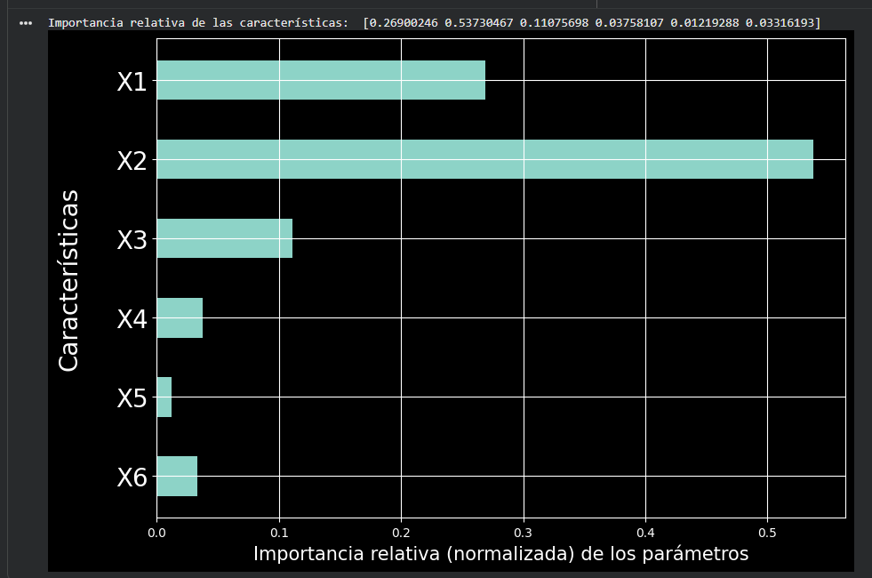

### Imagen 2

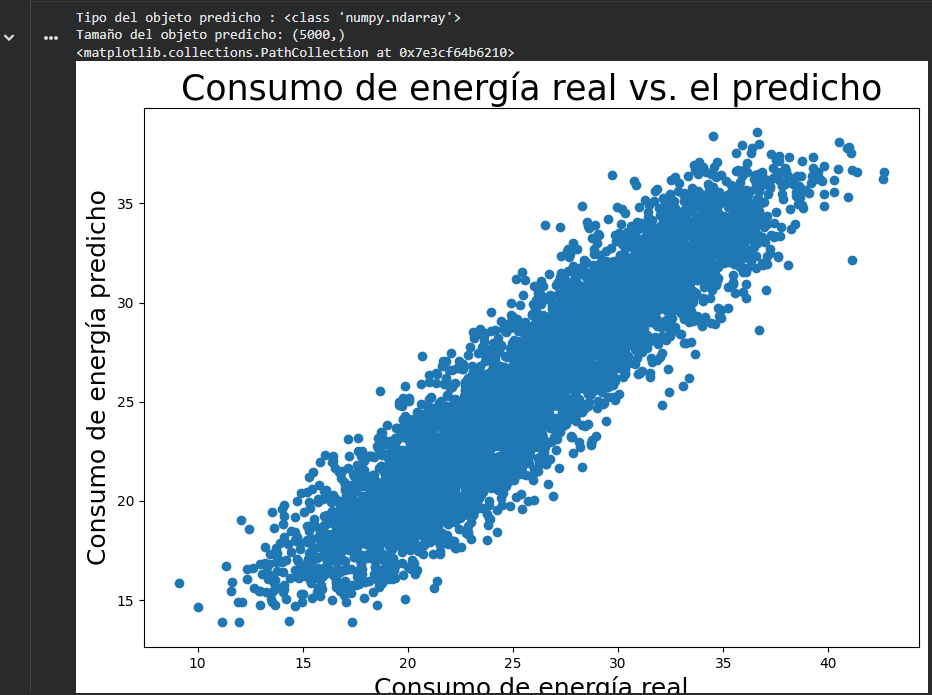

### Imagen 3

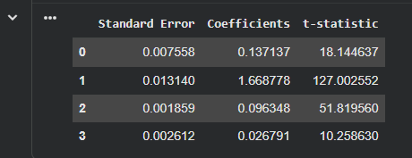

### Imagen 4

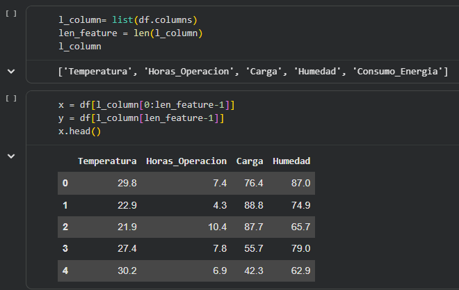

### Imagen 5

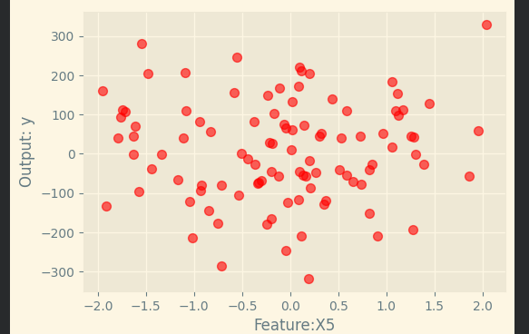

### Imagen 6

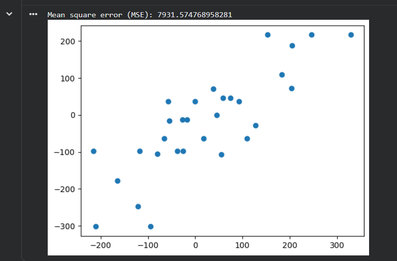

### Imagen 7

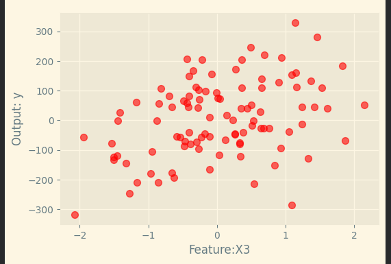

### Imagen 8

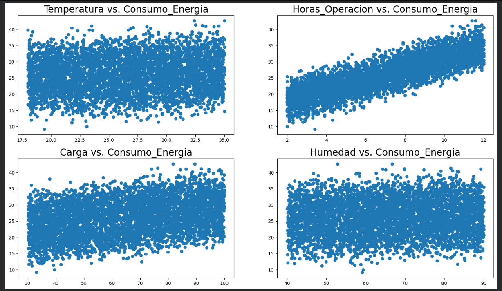

### Imagen 9

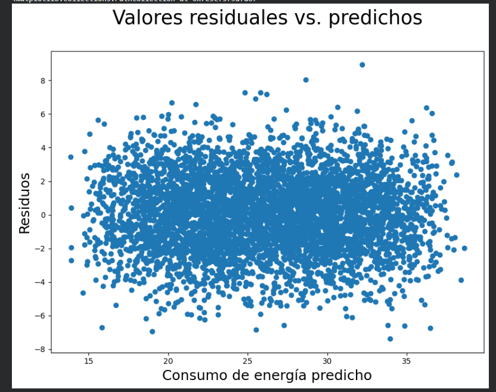

### Imagen 10

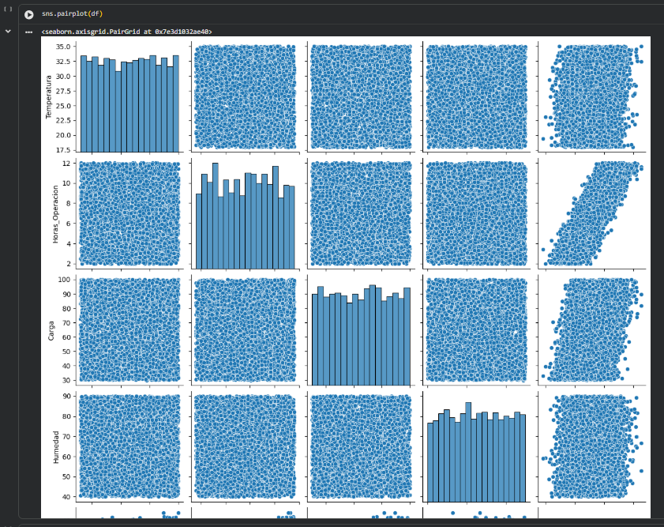

### Imagen 11

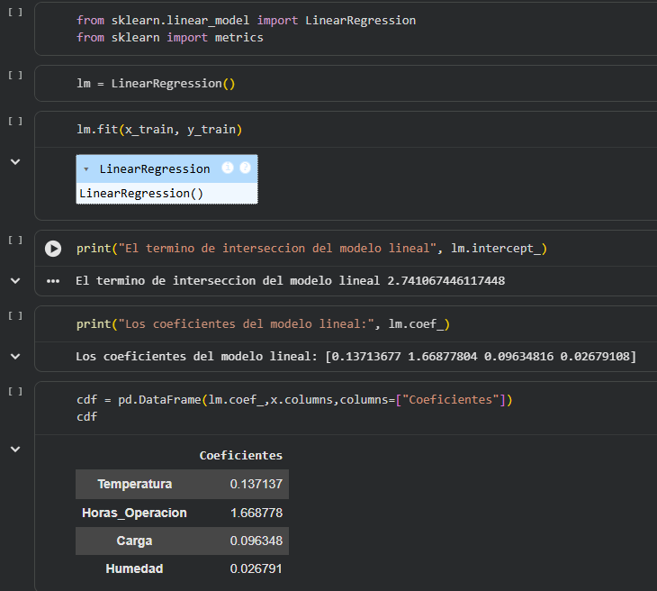

### Imagen 12

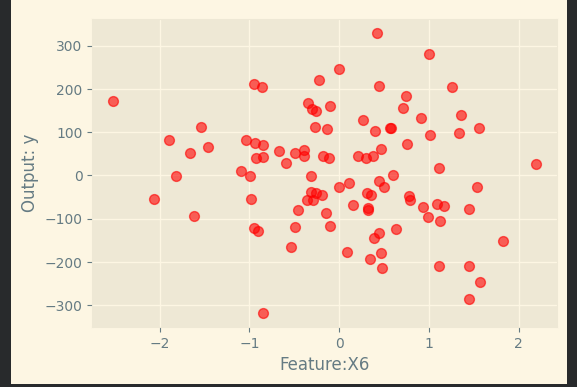

### Imagen 13

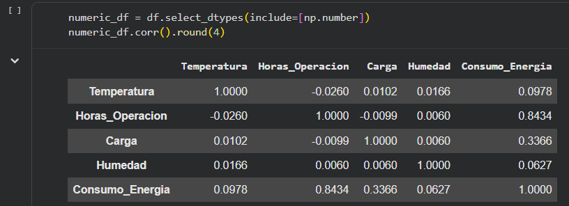

### Imagen 14

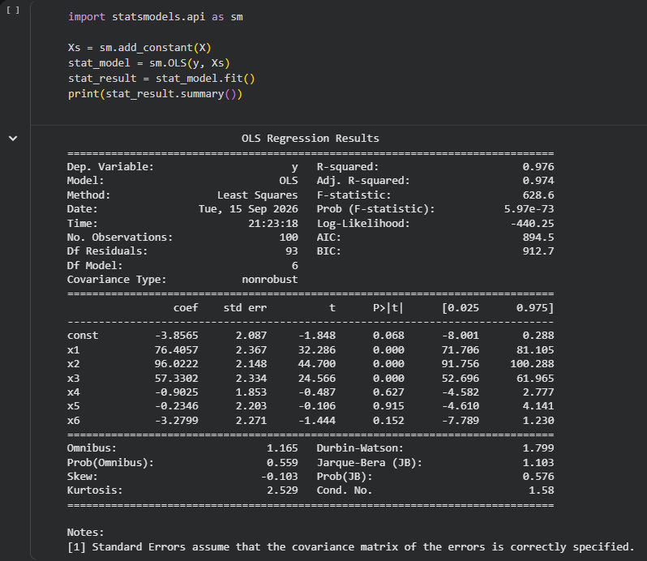

### Imagen 15

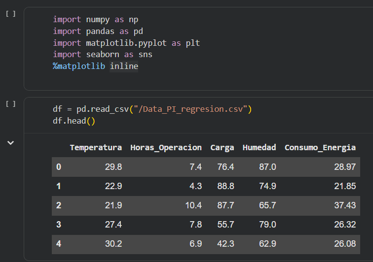

### Imagen 16

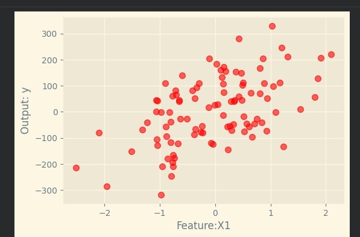

### Imagen 17

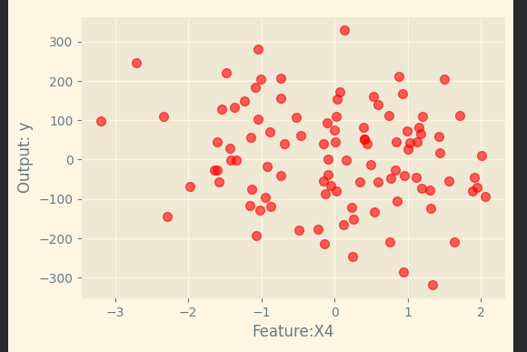

### Imagen 18

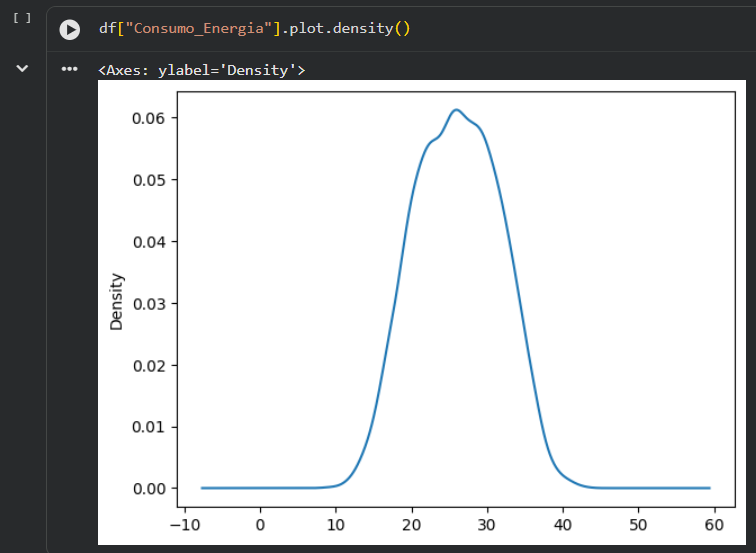

### Imagen 19

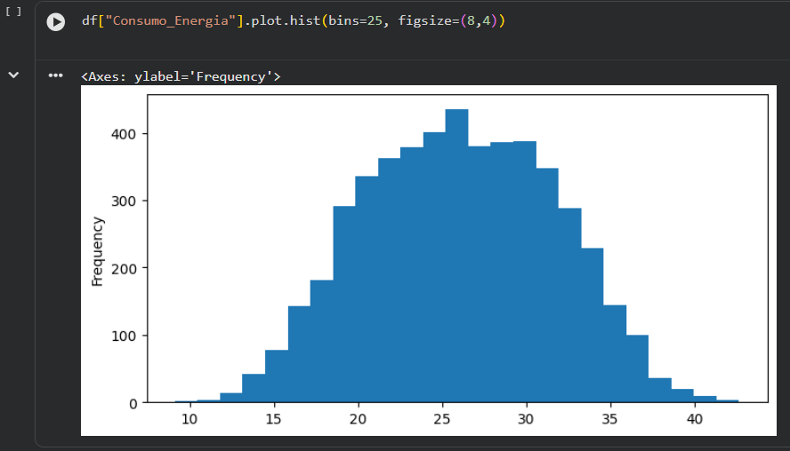

### Imagen 20

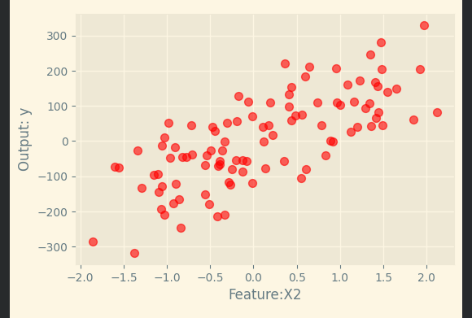

### Imagen 21

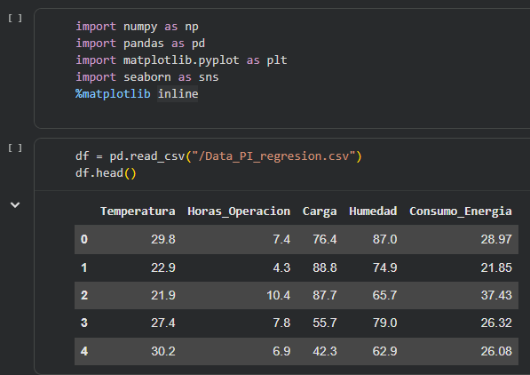

### Imagen 22

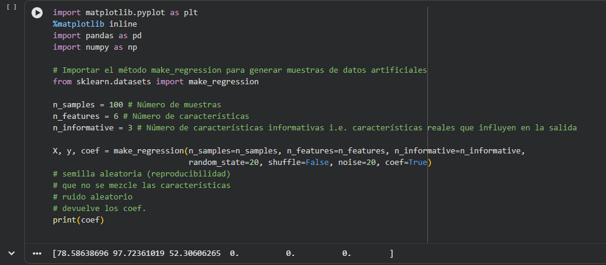

### Imagen 23

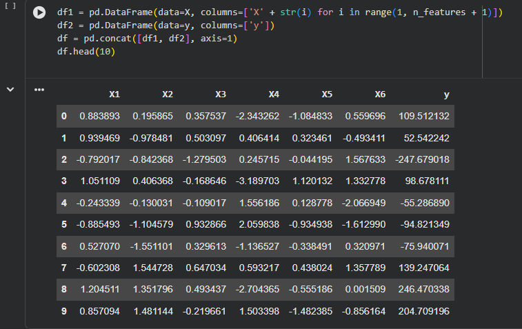

### Imagen 24

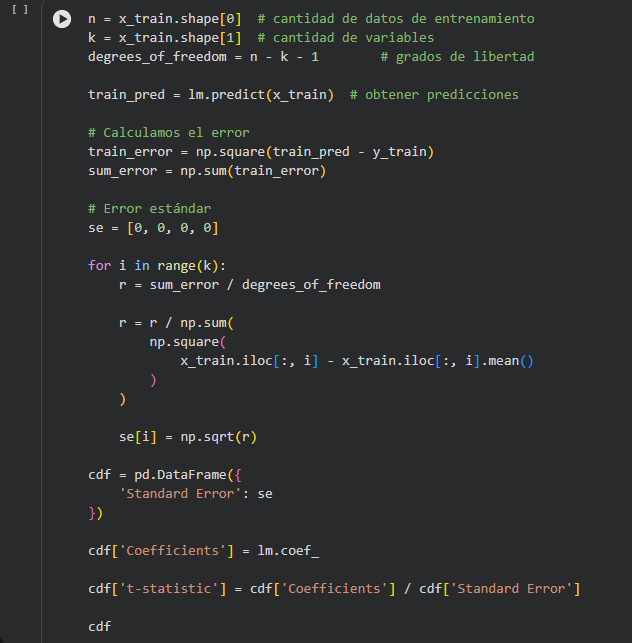

### Imagen 25

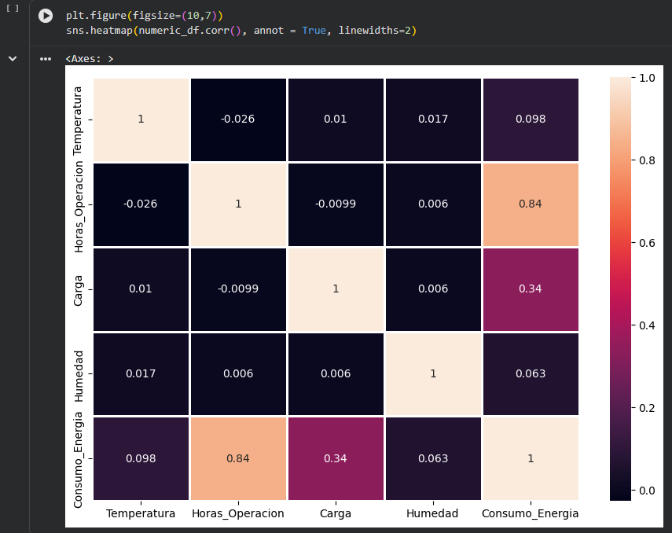
