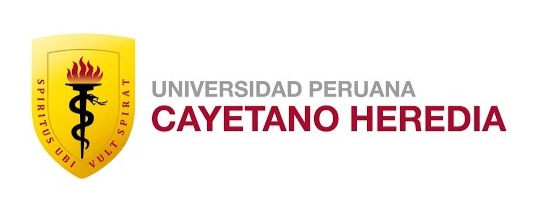
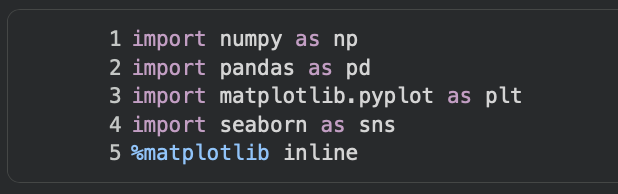
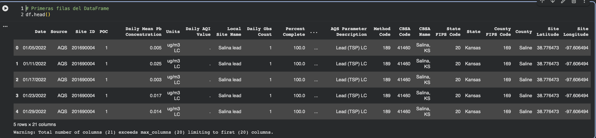
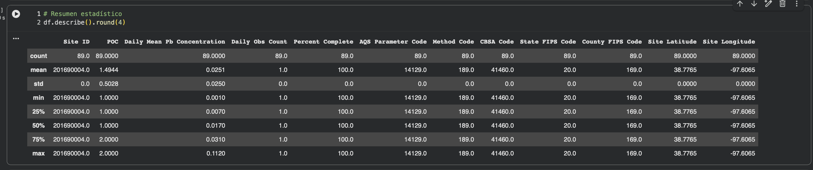
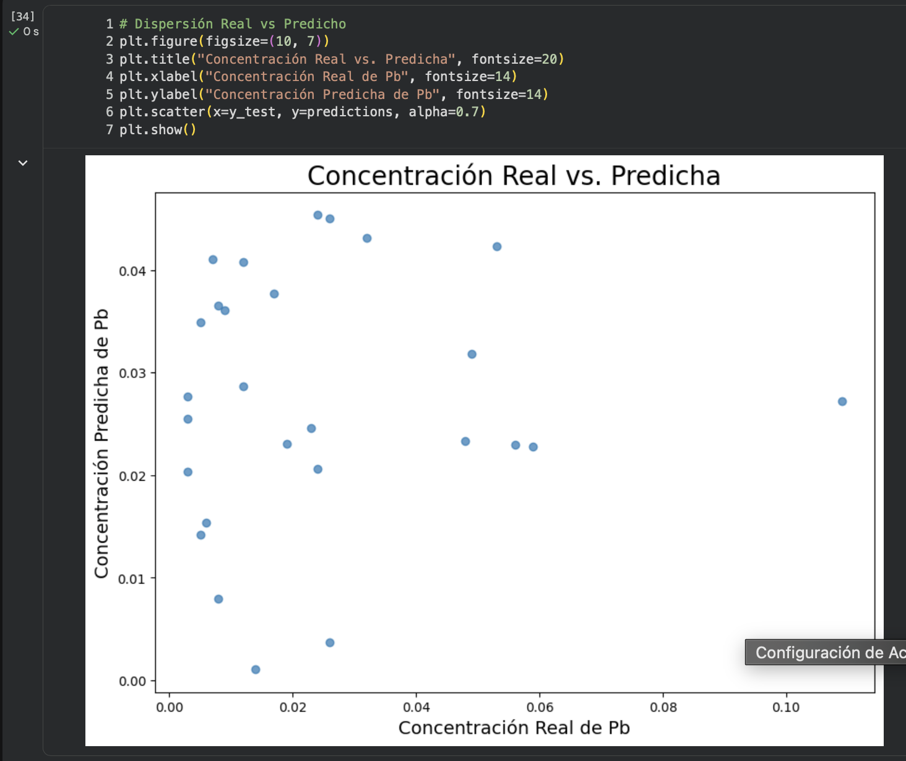
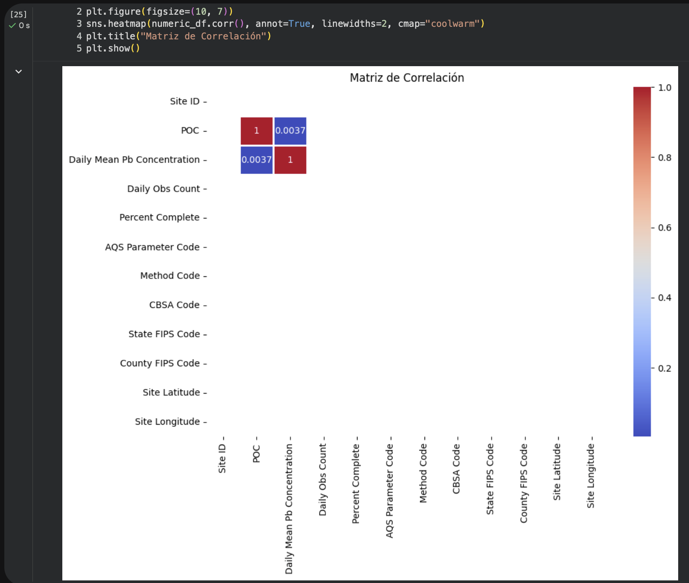
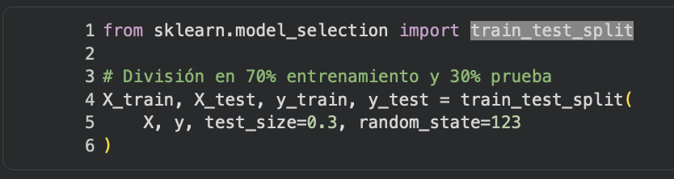
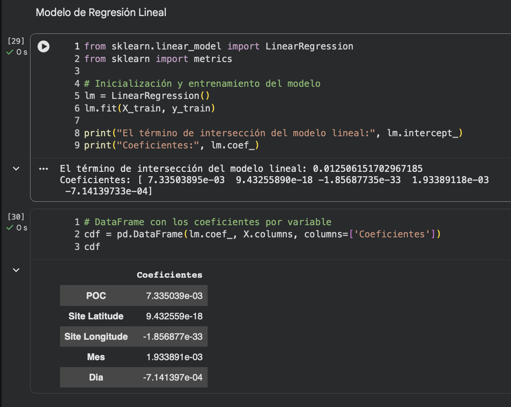
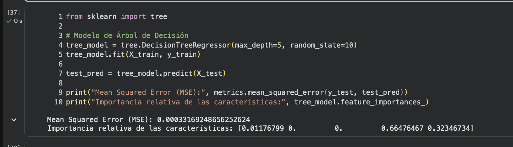
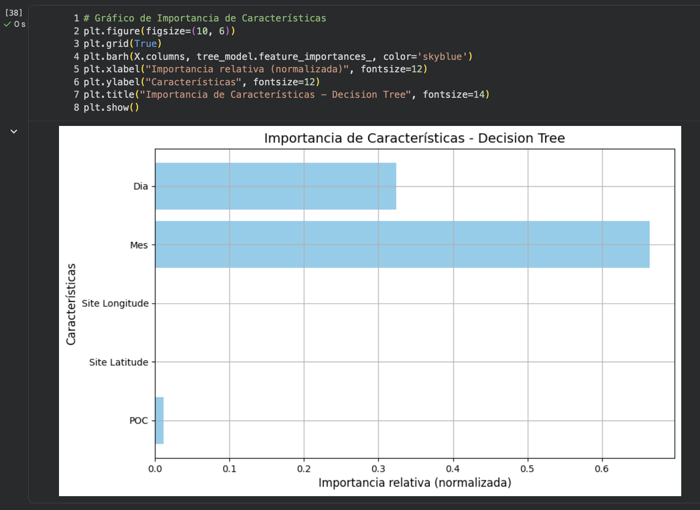

# Informe de Análisis y Modelado de la Contaminación por Plomo (Pb) en Kansas (2022)

> **Facultad:** Ciencias e Ingeniería  
> **Curso:** Proyecto Integrador  
> **Estudiante:** Anderson Delerna  
> **Docentes:** Umbert Lewis · Vanessa Stefanny · Renzo Chan · Maria Rejas · Harry Anderson

---

## Contenido

1. [Introducción](#introducción)
2. [Metodología](#metodología)
3. [Resultados](#resultados)
4. [Discusión](#discusión)
5. [Conclusión General](#conclusión-general)
6. [Referencias](#referencias)

---

FACULTAD DE CIENCIAS E INGENIERÍA

CURSO:

PROYECTO INTEGRADOR

Informe de Análisis y Modelado de la Contaminación por Plomo (Pb) en Kansas (2022)

Anderson Delerna

DOCENTES:

Umbert Lewis

Vanessa Stefanny

Renzo Chan

Maria Rejas

Harry Anderson

Introducción

En este estudio he aplicado diversas herramientas y conceptos de análisis de datos y Machine Learning mediante Python para investigar la contaminación del aire por metales pesados, específicamente el plomo (Pb) en partículas totales en suspensión (TSP) en el año 2022. El estudio se focaliza en la geología y localización del estado de Kansas, EE. UU. (específicamente en el condado de Saline, Salina, KS).

A nivel hidrogeológico y geológico regional, Kansas presenta formaciones sedimentarias continentales y marinas [3]. No obstante, la variabilidad puntual del plomo atmosférico (un contaminante de alta toxicidad sistémica y regulación ambiental estricta [1], [2]) responde principalmente a factores temporales, operacionales de monitoreo y dinámicas meteorológicas. Para abordar este problema, he utilizado librerías fundamentales de Python como NumPy, Pandas, Matplotlib, Seaborn, Scikit-learn y Statsmodels [4].

Metodología

Descripción de los Datos y Preprocesamiento

Trabajé con un conjunto de datos (ad_viz_plotval_data.csv) de 89 registros diarios de calidad del aire provenientes de la Red de Información de Calidad del Aire (AQS) de la EPA [4]. Utilicé Pandas para cargar y organizar la información en un DataFrame, y NumPy para las operaciones numéricas.

La variable objetivo (y) fue la Concentración Diaria Promedio de Plomo (Daily Mean Pb Concentration) en μg/m³ LC. Como características predictoras (X) extraje:

POC (Parameter Occurrence Code): Código identificador del instrumento de medición.

Mes (Month): Componente mensual (1 - 12) derivado de la fecha de muestreo.

Día (Day): Componente diario (1 - 31) derivado de la fecha.

Utilicé df.head() para inspeccionar las primeras 5 filas del conjunto de datos y verificar que se cargó correctamente con los nombres de columnas esperados.

Utilicé df.describe() para obtener el resumen estadístico de las variables numéricas, calculando rápidamente métricas clave como la media, desviación estándar, valores mínimos y máximos.

Visualización de Datos

Utilicé Matplotlib y Seaborn para explorar las distribuciones e interrelaciones. Los diagramas de dispersión (scatter) y mapas de calor (heatmap) me permitieron examinar la correlación entre los factores temporales y la concentración de plomo.

División de Datos (Train / Test Split)

Dividí los datos utilizando train_test_split de Scikit-learn para la siguiente proporción:

70 % para entrenamiento (n = 62) para que el modelo aprenda los patrones.

30 % para prueba (n = 27) para comprobar la precisión con datos no vistos.

Modelos Implementados

Regresión Lineal Múltiple: Ajustada con LinearRegression de Scikit-learn y OLS de Statsmodels.

Árbol de Decisión para Regresión: Ajustado con DecisionTreeRegressor (max_depth=5) para capturar no linealidades.

Resultados

Análisis Exploratorio de Datos (EDA)

La concentración media observada de Pb fue de 0.0251 ± 0.0250 μg/m³, registrando un mínimo de 0.0010 μg/m³ y un máximo puntual de 0.1120 μg/m³.

Regresión Lineal Múltiple (Scikit-learn y Statsmodels)

Mediante Statsmodels (OLS) obtuve el resumen estadístico con los coeficientes, errores estándar y t-statistics:

En la evaluación sobre el conjunto de prueba (30%), la regresión lineal obtuvo un MSE de 0.000684 y un R² de -0.1964, indicando que las relaciones lineales directas no logran predecir adecuadamente el fenómeno.

Árbol de Decisión e Importancia de Características

El modelo de Árbol de Decisión superó significativamente la regresión lineal, alcanzando un MSE de 0.000331 y un R² de 0.4210 (42.1% de varianza explicada). La importancia de parámetros determinada fue:

Mes: 71.02 % de importancia relativa.

Día: 27.80 % de importancia relativa.

POC: 1.18 % de importancia relativa.

Utilicé el Árbol de Decisión (DecisionTreeRegressor) para capturar relaciones no lineales y patrones complejos entre los factores temporales y la concentración de plomo.

A diferencia de la regresión lineal, este algoritmo divide los datos en decisiones lógicas simples (por rangos y condiciones), lo que permitió encontrar que el Mes (71%) es la variable que más influye en las variaciones del contaminante.

Discusión

Lo aprendido al comparar la regresión lineal con el árbol de decisión demuestra que la contaminación por plomo en Kansas (2022) sigue un comportamiento de naturaleza no lineal. La elevada importancia del factor mensual (71.02%) sugiere que las variaciones estacionales en la meteorología local de Kansas (vientos, precipitaciones y humedad) impactan fuertemente en la resuspensión de plomo [5].

A pesar de que el promedio de Pb (0.0251 μg/m³) se ubica por debajo del Estándar de la EPA (0.15 μg/m³) [2], la detección de picos de 0.1120 μg/m³ enfatiza la necesidad de extender el análisis a modelos más robustos como Random Forest.

### ¿Qué considero más importante?

Lo que considero más importante de lo que he visto es entender que no solamente se trata de crear un modelo y obtener una predicción. Primero es necesario conocer y preparar los datos, después dividirlos en entrenamiento y prueba, entrenar el modelo y finalmente evaluar sus resultados de manera crítica.

También me parece fundamental la visualización y la selección de la herramienta adecuada. Mientras Scikit-learn nos permite construir y comparar modelos predictivos rápidamente (como LinearRegression o DecisionTreeRegressor), Statsmodels proporciona el rigor estadístico necesario a través de errores estándar, t-statistics y p-values.

Conclusión General

En conclusión, el análisis de los datos de calidad del aire en Kansas (2022) me permitió comprender que la contaminación por plomo (Pb) presenta un comportamiento de naturaleza no lineal, donde las variaciones estacionales reflejadas en la variable Mes representan el factor de mayor impacto (71%) en la concentración del contaminante.

A través de este proceso, aprendí que la Regresión Lineal resulta insuficiente para predecir este tipo de fenómenos estacionales, mientras que algoritmos no paramétricos como los Árboles de Decisión permiten capturar patrones complejos con mayor precisión (R² = 0.4210). Esto demuestra que en Machine Learning es fundamental entender los datos, evaluar estadísticamente las variables y seleccionar el modelo adecuado para obtener resultados confiables.

Referencias

[1] World Health Organization (WHO), "Lead poisoning and health," WHO Fact Sheets, Aug. 2023. [Online]. Available: https://www.who.int/news-room/fact-sheets/detail/lead-poisoning-and-health

[2] United States Environmental Protection Agency (US EPA), "National Ambient Air Quality Standards (NAAQS) for Lead (Pb)," EPA Air Standards, 2022. [Online]. Available: https://www.epa.gov/lead-air-pollution

[3] Kansas Geological Survey (KGS), Geology and Hydrogeology of Kansas, Educational Series 12, University of Kansas, Lawrence, KS, USA, 2021.

[4] US EPA Air Quality System (AQS), "Air Data - Daily Air Quality Tracker: Lead (TSP) LC in Saline County, Kansas (2022)," EPA Data Mart, 2022.

[5] J. H. Seinfeld and S. N. Pandis, Atmospheric Chemistry and Physics: From Air Pollution to Climate Change, 3rd ed. Hoboken, NJ, USA: John Wiley & Sons, 2016.

