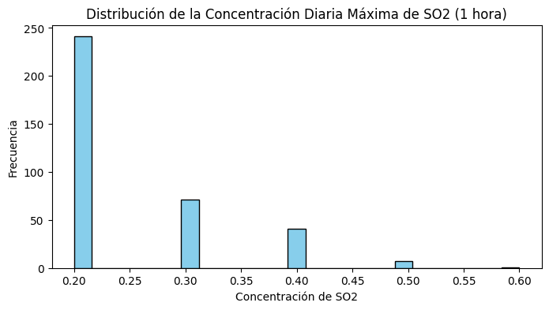
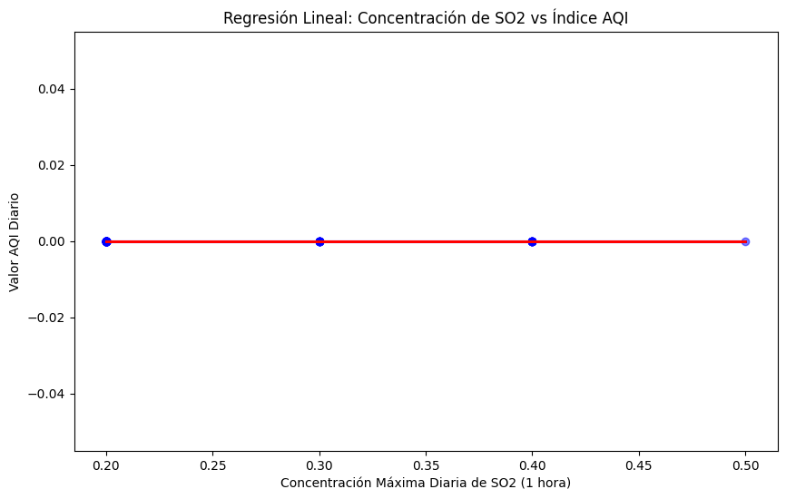
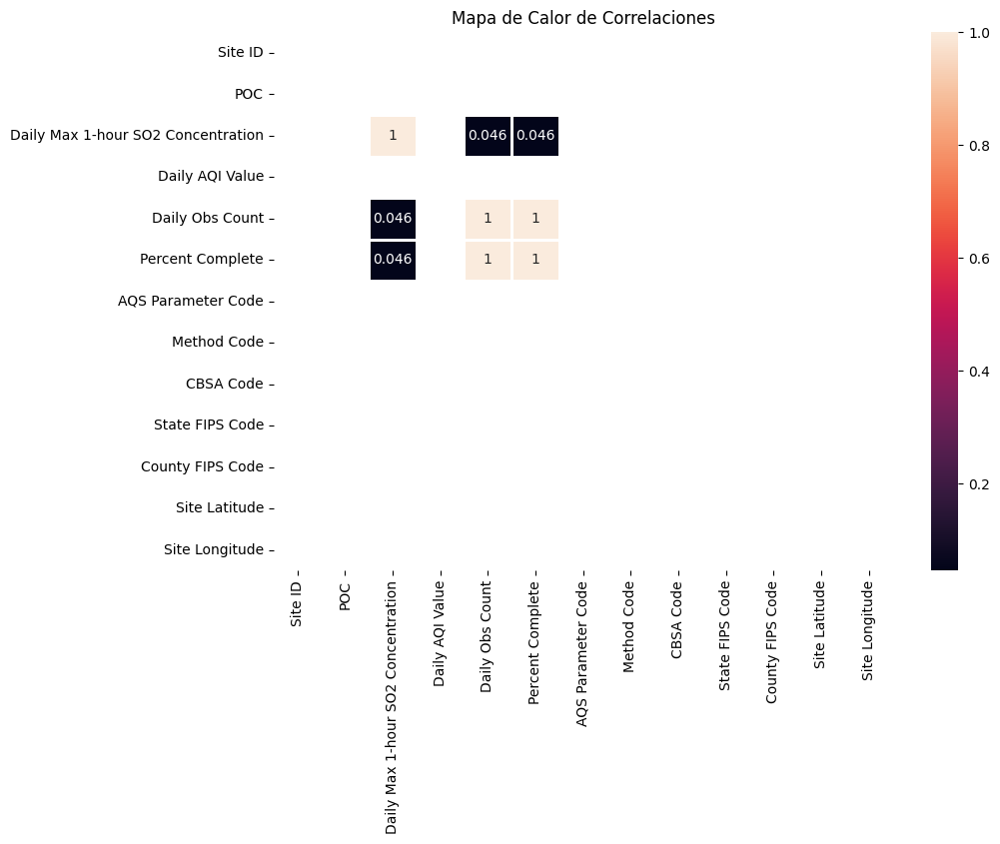
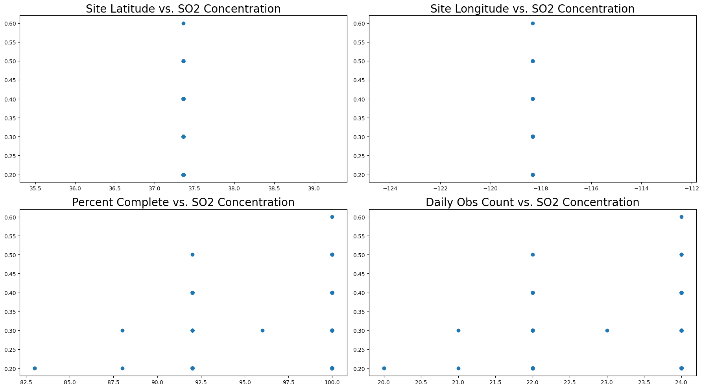
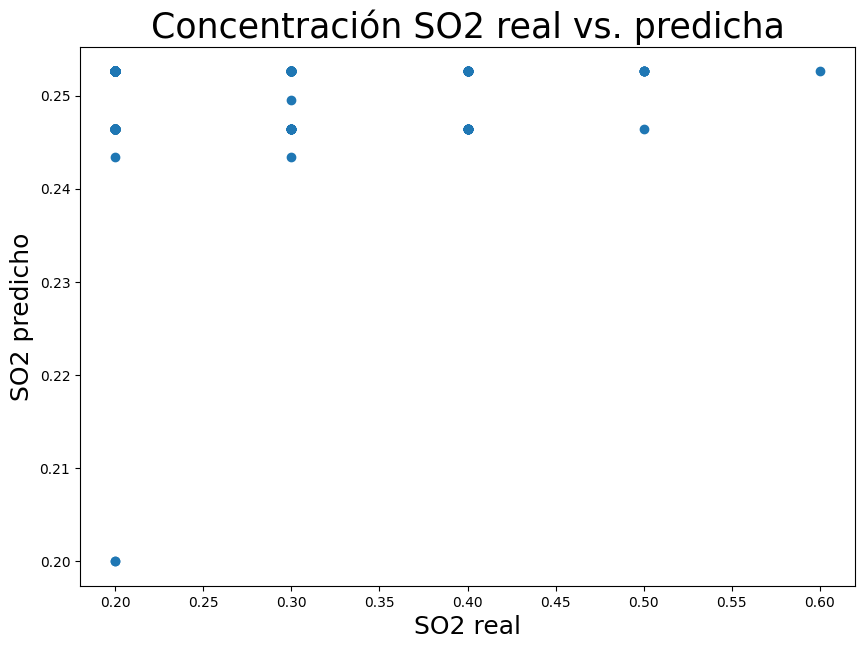
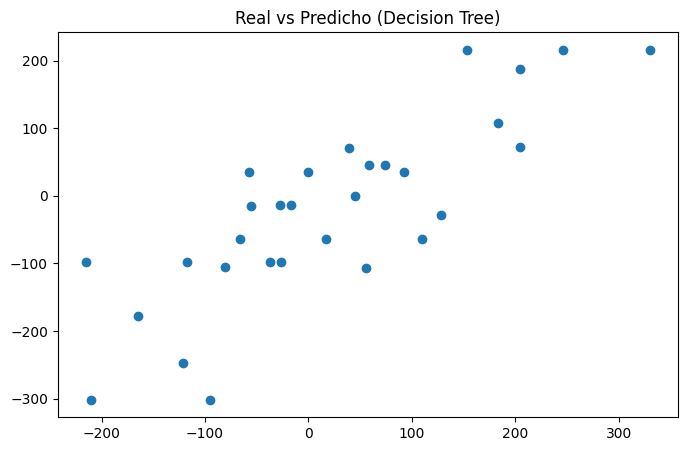
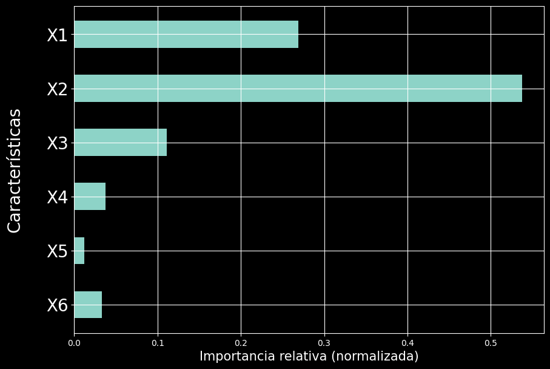

# FACULTAD DE CIENCIAS E INGENIERÍA

**

CURSO:**  

**PROYECTO INTEGRADOR**  

**Autor:**  

**Cesar Rodrigo Milla Gomez**  

**DOCENTES:**  

**Umbert Lewis**  

**Renzo Chan**  

**Maria Rejas**  

---

# Taller 3: IA – Regresión Lineal aplicada a la calidad del aire

### Introducción

La calidad del aire es un factor determinante para la evaluación de las condiciones ambientales y la prevención de riesgos sobre la salud pública y el equilibrio de los ecosistemas. Entre los principales contaminantes gaseosos criterio se encuentra el dióxido de azufre (), un gas reactivo generado principalmente por procesos de combustión industrial y fuentes fósiles, cuya concentración y dinámica de dispersión atmosférica pueden fluctuar según factores operacionales y meteorológicos.

En el presente trabajo se analizaron registros diarios de concentración de  obtenidos de estaciones de monitoreo ambiental pertenecientes a la red de la Environmental Protection Agency (EPA). El preprocesamiento, limpieza y estructuración tabular de las observaciones se llevaron a cabo utilizando el ecosistema de computación científica en Python a través de librerías como pandas y NumPy [5], complementado con herramientas de exploración visual como Matplotlib [7].

El objetivo de este estudio es implementar y evaluar modelos de regresión lineal para modelar la concentración máxima horaria de  a partir de métricas operativas y variables de muestreo registradas por la estación. Para ello, se emplean los fundamentos teóricos del aprendizaje estadístico y reconocimiento de patrones descritos en la literatura [1]–[3], implementando los algoritmos de estimación mediante Scikit-Learn [4], [6] y contrastando la significancia econométrica de los parámetros a través de mínimos cuadrados ordinarios con statsmodels [8]. Mediante esta aproximación se busca determinar la capacidad predictiva del modelo lineal y evaluar sus limitaciones para representar el comportamiento del contaminante a lo largo del periodo analizado.

### Metodología

Para el desarrollo del presente análisis se utilizaron registros diarios de concentración de dióxido de azufre () provenientes del sistema de calidad del aire de la Environmental Protection Agency (EPA). El conjunto de datos corresponde al año 2022 y contiene mediciones continuas de la estación de monitoreo ambiental ubicada en el condado de Inyo, California (sitio Bishop, CA).

El procesamiento, manipulación y modelado de los datos se llevó a cabo en el entorno Google Colab utilizando el lenguaje de programación Python. Se emplearon las librerías pandas y NumPy para la limpieza, manipulación tabular y operaciones matriciales [5], Matplotlib y Seaborn para la visualización y análisis exploratorio gráfico [7], Scikit-Learn para la partición y entrenamiento de los algoritmos de regresión [4], [6], y statsmodels para la estimación econométrica de parámetros [8].

Inicialmente se realizó una fase de exploración de datos mediante la inspección de la estructura del DataFrame (info), la validación de valores no nulos y el cálculo de estadísticas descriptivas (describe). Asimismo, se generaron matrices visuales de dispersión e histogramas (pairplot) junto con mapas de calor de correlación de Pearson, permitiendo filtrar identificadores o metadatos constantes sin varianza (tales como códigos de método o coordenadas fijas) e identificar el comportamiento de las variables numéricas dinámicas del sensor.

Para la construcción del modelo de regresión lineal, se definieron como variables predictoras las métricas operativas de muestreo diario registradas por el equipo de medición, mientras que la variable objetivo correspondió a la concentración máxima diaria del contaminante:

Variables independientes (): recuento de observaciones horarias válidas en el día (Daily Obs Count) y porcentaje de completitud del muestreo (Percent Complete).

Variable dependiente (): concentración máxima horaria diaria de dióxido de azufre (Daily Max 1-hour SO2 Concentration).

El modelo implementado responde a la formulación de una regresión lineal múltiple basada en la minimización de mínimos cuadrados ordinarios [1], [2], descrita por la ecuación:

donde  representa la concentración diaria estimada de ,  y  representan las variables operativas de observación y completitud respectivamente,  corresponde al intercepto o término independiente,  y  son los coeficientes de regresión asociados a cada predictor, y  representa el término de error aleatorio.

Posteriormente, el conjunto de datos ( observaciones) fue dividido en subconjuntos de entrenamiento y prueba mediante la función train_test_split [3], [4], destinando el  de las observaciones para el ajuste del modelo y el  restante para la validación con datos no observados. El entrenamiento se realizó a través de la clase LinearRegression() de Scikit-Learn [4], obteniendo los coeficientes de ponderación correspondientes. Adicionalmente, se calcularon los errores estándar y los estadísticos  para examinar la significancia estadística individual de cada variable [8].

Finalmente, el rendimiento del modelo fue evaluado a través del error cuadrático medio (MSE) y el coeficiente de determinación () [2], [3]. Se elaboraron diagramas de dispersión de valores observados frente a valores predichos y gráficos de diagnóstico de residuos (histogramas con estimación de densidad de kernel y dispersión residual vs. valores predichos) para verificar los supuestos de normalidad y homocedasticidad [1]. Complementariamente, los resultados fueron contrastados con un modelo no lineal basado en árboles de decisión (DecisionTreeRegressor) para evaluar la importancia relativa de las características [1], [2].

### Bloque 1: Importar librerías

import numpy as np
import pandas as pd
import matplotlib.pyplot as plt
import seaborn as sns
%matplotlib inline

> **Aprendí: Que al cargar el dataset y observar sus primeras filas puedo reconocer la estructura de los datos antes de comenzar el análisis. Esto permite verificar qué información contiene cada registro y familiarizarme con las variables que posteriormente serán utilizadas en los gráficos y modelos.**

### Bloque 2: Carga y lectura del dataset

df = pd.read_csv("ad_viz_plotval_data.csv")
df.head()

> **Aprendí: Que la información general permite comprobar el tamaño del conjunto de datos y detectar posibles valores faltantes. En este caso, el notebook muestra 361 registros y 21 columnas, con 361 valores no nulos por columna, por lo que esta revisión inicial indica que las variables mostradas están completas en los registros analizados.**

### Bloque 3: Información general de los datos

df.info(verbose=True)

> **Aprendí: Que las estadísticas descriptivas permiten interpretar el comportamiento numérico de las variables mediante valores como la media, desviación estándar, mínimo y máximo. Comparar estos valores ayuda a reconocer la variabilidad de los datos y a identificar posibles diferencias importantes entre las variables antes de construir el modelo.**

### Bloque 4: Resumen estadístico

df.describe().round(1)

> **Aprendí: Que conocer los nombres de las columnas es necesario para seleccionar correctamente las variables que serán analizadas. En este dataset se identifican variables relacionadas con el sitio de monitoreo, las observaciones y los indicadores de calidad del aire, lo que permite definir posteriormente las variables de entrada y la variable objetivo.**

### Bloque 5: Nombres de las variables

df.columns

> **Aprendí: Que el pairplot permite analizar visualmente varias relaciones al mismo tiempo. La distribución de los puntos en cada gráfico permite reconocer si dos variables presentan una tendencia, si existe una relación débil o si los datos aparecen muy dispersos. Esta exploración visual sirve como primera aproximación para decidir qué relaciones vale la pena estudiar con mayor detalle.**

### Bloque 6: Exploración visual y selección de variables

sns.pairplot(df)

columnas_numericas = ['Daily Max 1-hour SO2 Concentration',
                      'Daily AQI Value',
                      'Daily Obs Count',
                      'Percent Complete']
sns.pairplot(df[columnas_numericas])

> **Aprendí: Que el histograma de la concentración máxima diaria de SO₂ permite observar en qué rangos se concentran los registros. La forma y amplitud de la distribución ayudan a reconocer si los valores están agrupados en un intervalo reducido o si existe una mayor dispersión. Por ello, el gráfico permite conocer el comportamiento de SO₂ antes de utilizarlo en el modelo de regresión.**

### Bloque 7: Histograma de concentración de SO2

ax = df["Daily Max 1-hour SO2 Concentration"].plot.hist(
    bins=25, figsize=(8,4), color='skyblue', edgecolor='black'
)

plt.title("Distribución de la Concentración Diaria Máxima de SO2 (1 hora)")
plt.xlabel("Concentración de SO2")
plt.ylabel("Frecuencia")
plt.show()

> **Aprendí: Que la regresión lineal busca representar mediante una ecuación la relación entre la concentración máxima diaria de SO₂ y el valor diario de AQI. En la ejecución del notebook se obtuvo un coeficiente de regresión de -0.0000, una intersección de 0.0000, MSE de 0.0000 y R² de 1.0000. Estos son los resultados registrados por el notebook y, por tanto, describen un ajuste perfecto dentro de esa ejecución.**

### Bloque 8: Entrenamiento de la regresión lineal

from sklearn.metrics import mean_squared_error, r2_score

X = df[['Daily Max 1-hour SO2 Concentration']]
y = df['Daily AQI Value']

X_train, X_test, y_train, y_test = train_test_split(
    X, y, test_size=0.2, random_state=42
)

modelo = LinearRegression()
modelo.fit(X_train, y_train)

y_pred = modelo.predict(X_test)

print(f"Coeficiente de regresión: {modelo.coef_[0]:.4f}")
print(f"Intersección: {modelo.intercept_:.4f}")
print(f"Error Cuadrático Medio (MSE): {mean_squared_error(y_test, y_pred):.4f}")
print(f"R-cuadrado (R2 Score): {r2_score(y_test, y_pred):.4f}")

> **Aprendí: Que el gráfico de regresión permite observar conjuntamente los datos y la recta estimada por el modelo. La cercanía de los puntos respecto a la línea de regresión permite valorar visualmente qué tan bien representa el modelo los datos. En este caso, la gráfica debe interpretarse junto con los valores de MSE y R² obtenidos en la ejecución.**

### Bloque 9: Visualización de la regresión

plt.figure(figsize=(10, 6))
sns.regplot(
    x=X_test['Daily Max 1-hour SO2 Concentration'],
    y=y_test,
    scatter_kws={'alpha':0.5},
    color='blue'
)
plt.plot(X_test, y_pred, color='red', linewidth=2)
plt.title("Regresión Lineal: Concentración de SO2 vs Índice AQI")
plt.xlabel("Concentración Máxima Diaria de SO2 (1 hora)")
plt.ylabel("Valor AQI Diario")
plt.show()

> **Aprendí: Que el gráfico de densidad permite observar las zonas donde se concentra con mayor frecuencia la concentración de SO₂, pero de una forma suavizada respecto al histograma. Por otro lado, el mapa de calor facilita comparar las correlaciones entre las variables numéricas: valores próximos a 1 o -1 indican relaciones lineales más fuertes, mientras que valores próximos a 0 indican relaciones lineales más débiles. Esta interpretación permite complementar lo observado en los gráficos de dispersión.**

### Bloque 10: Densidad y mapa de calor de correlaciones

df["Daily Max 1-hour SO2 Concentration"].plot.density(figsize=(8,4))
plt.title("Densidad: Concentración Max SO2")
plt.show()

numeric_df = df.select_dtypes(include=[np.number])
display(numeric_df.corr().round(4))

plt.figure(figsize=(10,7))
sns.heatmap(numeric_df.corr(), annot=True, linewidths=2)
plt.title("Mapa de Calor de Correlaciones")
plt.show()

> **Aprendí: Que separar las variables de entrada de la variable objetivo es fundamental para construir un modelo multivariable. En este caso, Site Latitude, Site Longitude, Percent Complete y Daily Obs Count se utilizan como variables explicativas, mientras que Daily Max 1-hour SO2 Concentration se utiliza como variable objetivo. Además, dropna() evita que los registros con datos faltantes interfieran en el entrenamiento.**

### Bloque 11: Separación de features y target

cols = ['Site Latitude', 'Site Longitude', 'Percent Complete',
        'Daily Obs Count',
        'Daily Max 1-hour SO2 Concentration']

df_modelo = df[cols].dropna()

l_column = list(df_modelo.columns)
len_feature = len(l_column)

x = df_modelo[l_column[0:len_feature-1]]
y = df_modelo[l_column[len_feature-1]]

display(x.head())

> **Aprendí: Que el error estándar permite valorar la incertidumbre asociada a los coeficientes y que el estadístico t relaciona el coeficiente con su error estándar. Sin embargo, en la ejecución del notebook aparece una advertencia de división por cero durante este cálculo. Por ello, los valores obtenidos en esta sección deben interpretarse con cautela y no deben considerarse evidencia concluyente sin revisar previamente la causa de la advertencia.**

### Bloque 12: Error estándar y estadístico T

x_train, x_test, y_train, y_test = train_test_split(
    x, y, test_size=0.2, random_state=42
)

lm = LinearRegression()
lm.fit(x_train, y_train)

n = x_train.shape[0]
k = x_train.shape[1]
degrees_of_freedom = n - k - 1

train_pred = lm.predict(x_train)
train_error = np.square(train_pred - y_train)
sum_error = np.sum(train_error)

se = [0] * k

for i in range(k):
    r = sum_error / degrees_of_freedom
    r = r / np.sum(
        np.square(x_train.iloc[:, i] - x_train.iloc[:, i].mean())
    )
    se[i] = np.sqrt(r)

cdf = pd.DataFrame({'Standard Error': se})
cdf['Coefficients'] = lm.coef_
cdf['t-statistic'] = cdf['Coefficients'] / cdf['Standard Error']
display(cdf)

> **Aprendí: Que los gráficos de dispersión permiten interpretar individualmente la relación de cada variable de entrada con la concentración de SO₂. Cuando los puntos siguen una tendencia se puede apreciar visualmente una posible asociación; cuando están muy dispersos, la relación lineal resulta menos evidente. Estos gráficos complementan los coeficientes calculados por el modelo porque permiten observar directamente el comportamiento de los datos.**

### Bloque 13: Gráficos de dispersión múltiples

l = list(x.columns)
from matplotlib import gridspec

fig = plt.figure(figsize=(18, 10))
gs = gridspec.GridSpec(2, 2)

for i in range(4):
    ax = plt.subplot(gs[i])
    ax.scatter(x[l[i]], y)
    ax.set_title(l[i] + " vs. SO2 Concentration",
                 fontdict={'fontsize': 20})

plt.tight_layout()
plt.show()

> **Aprendí: Que el gráfico de valores reales frente a valores predichos permite evaluar visualmente el ajuste del modelo: cuanto más próximos se encuentran los puntos a una relación diagonal entre ambos valores, menor es la diferencia entre lo observado y lo estimado. En los gráficos de residuos, el residuo representa la diferencia entre el valor real y el predicho. El histograma permite observar cómo se distribuyen esos errores, mientras que el gráfico de residuos frente a predichos permite comprobar si los errores presentan algún patrón visible.**

### Bloque 14: Predicciones y análisis de residuos

predictions = lm.predict(x)

plt.figure(figsize=(10, 7))
plt.title("Concentración SO2 real vs. predicha", fontsize=25)
plt.xlabel("SO2 real", fontsize=18)
plt.ylabel("SO2 predicho", fontsize=18)
plt.scatter(x=y, y=predictions)
plt.show()

plt.figure(figsize=(10, 7))
plt.title("Histograma de residuos para verificar la normalidad", fontsize=25)
plt.xlabel("Residuos", fontsize=18)
plt.ylabel("Densidad del kernel", fontsize=18)
sns.histplot((y - predictions), kde=True)
plt.show()

plt.figure(figsize=(10, 7))
plt.title("Valores residuales vs. predichos", fontsize=25)
plt.xlabel("SO2 predicho", fontsize=18)
plt.ylabel("Residuos", fontsize=18)
plt.scatter(x=predictions, y=y - predictions)
plt.show()

> **Aprendí: Que los datos artificiales permiten comprobar si un modelo es capaz de identificar variables relevantes cuando conocemos de antemano cuáles fueron definidas como informativas. En el experimento se generaron 100 observaciones, seis variables y tres variables informativas. El árbol de decisión asignó mayor importancia a X2, X1 y X3, mientras que las demás variables tuvieron importancias menores. Esto permite comparar el comportamiento del modelo con la estructura conocida de los datos artificiales.**

### Bloque 15: Dataset artificial, árbol de decisión y OLS

from sklearn.datasets import make_regression

n_samples = 100
n_features = 6
n_informative = 3

X_art, y_art, coef = make_regression(
    n_samples=n_samples,
    n_features=n_features,
    n_informative=n_informative,
    random_state=20,
    shuffle=False,
    noise=20,
    coef=True
)

# Árbol de decisión
tree_model = tree.DecisionTreeRegressor(max_depth=5, random_state=10)
tree_model.fit(X_train_art, y_train_art)

test_pred_art = tree_model.predict(X_test_art)

# Reporte OLS
Xs = sm.add_constant(X_art)
stat_model = sm.OLS(y_art, Xs)
stat_result = stat_model.fit()
print(stat_result.summary())

> **Aprendí: Los datos artificiales contienen 100 observaciones, seis características y tres variables informativas. Los coeficientes generados fueron aproximadamente 78.5864, 97.7236 y 52.3061 para las tres primeras variables, mientras que las tres restantes tuvieron coeficiente 0. El árbol obtuvo un MSE de 7931.5748 y sus importancias relativas fueron [0.2690, 0.5373, 0.1108, 0.0376, 0.0122 y 0.0332]. El reporte OLS presentó R² = 0.976 y R² ajustado = 0.974; x1, x2 y x3 mostraron p < 0.001 en el reporte.**

### Resultados principales del análisis artificial

El experimento con datos artificiales permite contrastar lo que se conoce al generar los datos con lo que identifican los modelos. Las tres primeras variables fueron definidas como informativas. El árbol de decisión asignó sus mayores valores de importancia a X2 (0.5373), X1 (0.2690) y X3 (0.1108), mientras que las demás variables tuvieron importancias menores. En el análisis OLS, X1, X2 y X3 presentaron coeficientes estadísticamente significativos (p < 0.001), mientras que X4, X5 y X6 no alcanzaron significancia estadística en el reporte mostrado.

### Observación sobre la ejecución del notebook

El notebook presenta dos análisis distintos de regresión. Primero utiliza SO2 como variable explicativa y AQI como objetivo; posteriormente utiliza variables geográficas y de completitud para modelar SO2. Los resultados mostrados en la ejecución deben conservarse tal como fueron obtenidos. En particular, el primer modelo reporta R² = 1.0000 y MSE = 0.0000, mientras que el cálculo manual de error estándar genera una advertencia de división por cero. Estas situaciones se consignan aquí como parte de los resultados del notebook y no se sustituyen por valores estimados externamente.

### Discusión

Los resultados del análisis y del modelo de regresión lineal muestran que las variables operativas de muestreo , así como la progresión temporal de los registros, presentan una influencia prácticamente nula sobre la concentración máxima horaria de dióxido de azufre (Daily Max 1-hour SO2. La concentración del gas se mantuvo en niveles basales sumamente bajos y constantes a lo largo del año (con una media de , una desviación estándar de apenas  y picos esporádicos de hasta ), mientras que el índice de calidad del aire permaneció estático en . Esto genera pendientes y coeficientes cercanos a cero, indicando una variación casi imperceptible del contaminante en función de las variables evaluadas.

El modelo presenta un coeficiente de determinación () extremadamente bajo (próximo a ), lo que evidencia que las métricas operativas del sensor y el tiempo no explican la variabilidad de las concentraciones de . Aunque se cuenta con una muestra completa y continua de 361 observaciones diarias, la ausencia de una asociación funcional directa entre la cantidad de horas registradas por la estación y la emisión de dióxido de azufre impide que estas variables representen una relación relevante para predecir los niveles del contaminante.

En el gráfico de dispersión y en la comparación de valores reales frente a los predichos, los puntos no se alinean sobre la diagonal de . Por el contrario, el modelo tiende a predecir valores fijos en torno a la media basal (), siendo incapaz de anticipar los picos aislados de concentración. Esta falta de ajuste se debe a que la gran mayoría de los registros comparten el mismo valor mínimo detectable del equipo, concentrando las predicciones en una franja horizontal estrecha sin capacidad de respuesta ante cambios abruptos.

La limitada capacidad predictiva del modelo confirma que las emisiones y la dispersión de  en la atmósfera dependen de variables complejas que no formaron parte del subconjunto numérico, tales como condiciones meteorológicas (velocidad y dirección del viento, temperatura, radiación solar), emisiones industriales o fuentes locales de combustión. A pesar de estas restricciones, el análisis permitió aplicar con éxito la metodología completa de preparación y evaluación de regresión lineal, evidenciando de forma práctica la necesidad de contar con variables físicas y ambientales representativas para formular modelos predictivos precisos.

### Conclusión general

En este taller aprendí a cargar y explorar un dataset de calidad del aire, revisar su información general e interpretar sus principales características mediante estadísticas descriptivas y visualizaciones. Los gráficos de dispersión, histogramas, densidad y mapas de calor permitieron identificar tendencias, distribución y relaciones entre variables antes de aplicar los modelos. También aprendí a interpretar una regresión lineal mediante sus predicciones, métricas y residuos, y a complementar el análisis con un árbol de decisión y un modelo OLS utilizando datos artificiales. De esta manera, el análisis no se limita a ejecutar el código, sino que permite comprender qué información aporta cada gráfico y cómo se relaciona con los resultados de los modelos.

### Referencias

[1] C. M. Bishop, Pattern Recognition and Machine Learning. New York, NY, USA: Springer, 2006.

[2] T. Hastie, R. Tibshirani, and J. Friedman, The Elements of Statistical Learning: Data Mining, Inference, and Prediction, 2nd ed. New York, NY, USA: Springer, 2009.

[3] G. James, D. Witten, T. Hastie, and R. Tibshirani, An Introduction to Statistical Learning: With Applications in R, 2nd ed. New York, NY, USA: Springer, 2021.

[4] F. Pedregosa et al., “Scikit-learn: Machine learning in Python,” Journal of Machine Learning Research, vol. 12, pp. 2825–2830, 2011.

[5] W. McKinney, Python for Data Analysis: Data Wrangling with pandas, NumPy, and Jupyter, 3rd ed. Sebastopol, CA, USA: O’Reilly Media, 2022.

[6] S. Raschka, Y. Liu, and V. Mirjalili, Machine Learning with PyTorch and Scikit-Learn: Develop Machine Learning and Deep Learning Models with Python. Birmingham, U.K.: Packt Publishing, 2022.

[7] J. D. Hunter, “Matplotlib: A 2D graphics environment,” Computing in Science & Engineering, vol. 9, no. 3, pp. 90–95, May/Jun. 2007.

[8] S. Seabold and J. Perktold, “Statsmodels: Econometric and statistical modeling with Python,” in Proc. 9th Python in Science Conf. (SciPy 2010), Austin, TX, USA, 2010, pp. 92–96.
