# Informe de Regresión Lineal
## Análisis de datos de calidad del aire en California

> **Curso:** Proyecto Integrador  
> **Estudiante:** Kevin Esty Carvallo Neciosup  
> **Docente:** Umbert Luis De La Cruz Rodriguez  
> **Fecha:** 17/09/2026

---

## Contenido

1. [Introducción](#1-introducción)
2. [Metodología](#2-metodología)
3. [Construcción del modelo de regresión lineal](#3-construcción-del-modelo-de-regresión-lineal)
4. [Resultados](#4-resultados)
5. [Mínimos cuadrados ordinarios (OLS)](#5-mínimos-cuadrados-ordinarios-ols)
6. [Discusión](#6-discusión)
7. [Conclusiones](#7-conclusiones)
8. [Referencias](#8-referencias)

---

INFORME DE REGRESIÓN LINEAL

Análisis de datos de calidad del aire en California

Curso: Proyecto Integrador
Estudiante: Kevin Esty Carvallo Neciosup
Docente: Umbert Luis De La Cruz Rodriguez
Fecha: 17/09/2026

## 1. Introducción

El presente informe desarrolla un análisis de regresión lineal a partir de datos de calidad del aire correspondientes al estado de California, obtenidos de la plataforma AirData de la U.S. Environmental Protection Agency (EPA) [1]. El conjunto de datos contiene registros diarios relacionados con la concentración de dióxido de nitrógeno (NO₂), el índice diario de calidad del aire (AQI) y otras variables asociadas al sitio de monitoreo.

Los datos analizados corresponden al sitio de monitoreo Glendora, ubicado en el condado de Los Angeles, California, identificado en la base de datos con el Site ID 60370016. En este punto de monitoreo se registran mediciones de dióxido de nitrógeno (NO₂), expresadas en partes por billón (ppb), junto con el valor diario del índice de calidad del aire (AQI).

El objetivo del análisis es estudiar la relación entre el valor diario del índice de calidad del aire (Daily AQI Value) y la concentración máxima diaria de NO₂ (Daily Max 1-hour NO2 Concentration), utilizando un modelo de regresión lineal.

El archivo utilizado contiene 364 observaciones y 21 variables. Los registros disponibles corresponden al año 2023, desde el 1 de enero hasta el 31 de diciembre.

## 2. Metodología

### 2.1 Herramientas y librerías

El análisis se realizó en Google Colab utilizando Python y las librerías NumPy, Pandas, Matplotlib, Seaborn [2], Scikit-learn [3] y Statsmodels [4].

### 2.2 Carga y exploración de los datos

Se cargó el archivo ad_viz_plotval_data.csv mediante Pandas [5]. Posteriormente se revisó la estructura del DataFrame, los tipos de datos y las estadísticas descriptivas.

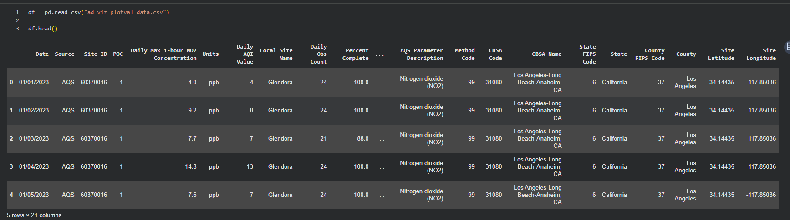

### 2.3 Características y variables

Se identificaron las columnas disponibles en el conjunto de datos. Para el modelo se seleccionó como variable independiente X el Daily AQI Value y como variable dependiente Y la Daily Max 1-hour NO2 Concentration.

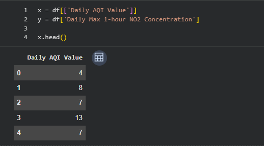

### 2.4 Revisión del período

La variable Date fue convertida a formato fecha para identificar los años y el intervalo temporal disponible.

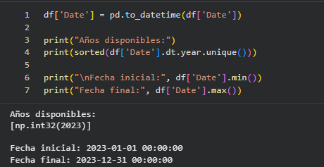

### 2.5 Análisis exploratorio

Se utilizaron gráficos de dispersión, pairplot, histograma y densidad para observar la distribución de los datos y la relación entre las variables seleccionadas.

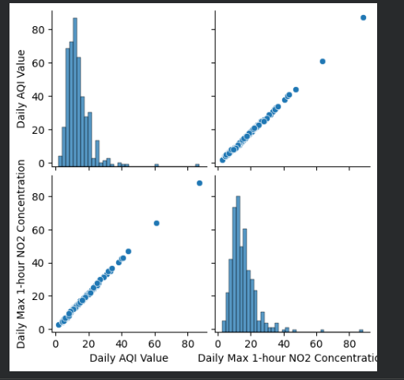

> **Interpretación: En el gráfico se puede observar una relación positiva y casi lineal entre el Daily AQI Value y la Daily Max 1-hour NO2 Concentration. Esto significa que, cuando aumenta el valor del AQI diario, también tiende a aumentar la concentración máxima de NO₂. Los puntos se encuentran bastante cercanos a una línea ascendente, por lo que visualmente se aprecia una relación fuerte entre ambas variables. También se observa que la mayoría de los datos se concentran en valores bajos, mientras que existen algunos valores más altos que se encuentran alejados del grupo principal.**

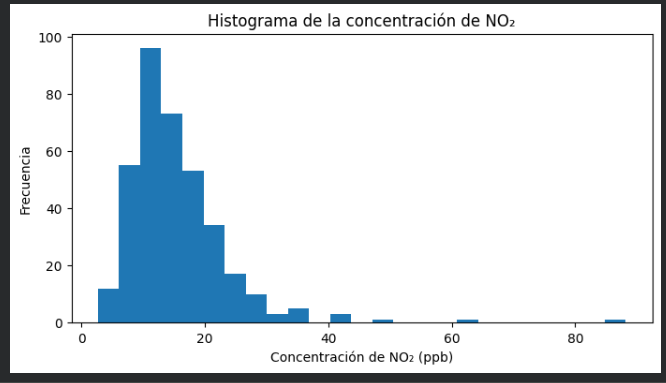

> **Interpretación: En el histograma se observa que la mayor cantidad de registros de concentración de NO₂ se encuentra aproximadamente entre 5 y 20 ppb, alcanzando su mayor frecuencia alrededor de 10 a 15 ppb. A medida que aumenta la concentración, la cantidad de registros disminuye. También se observan algunos valores bastante altos, cercanos a 40, 60 y 85 ppb, pero aparecen con poca frecuencia. Por ello, se puede decir que los datos presentan una concentración principalmente en valores bajos y una cola hacia la derecha.**

### 2.5.1 Densidad de la concentración de NO₂

La gráfica de densidad permite observar en qué valores se concentra principalmente la concentración de NO₂. La curva presenta su mayor concentración aproximadamente entre 5 y 20 ppb y después disminuye progresivamente. También se observa una cola hacia la derecha, debido a algunos valores de concentración más altos.

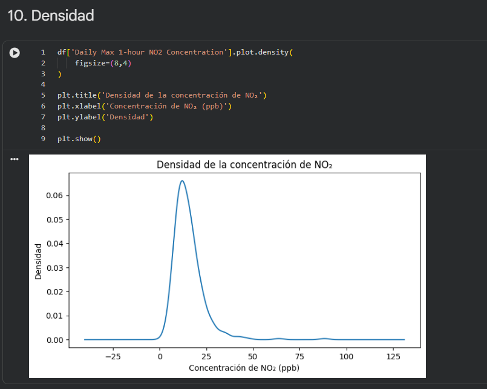

> **Interpretación: La mayoría de las mediciones de NO₂ se encuentran en valores relativamente bajos, alrededor de la zona donde la curva alcanza su punto máximo. Los valores altos aparecen con menor frecuencia, formando una cola hacia la derecha. Esto indica que los datos no están distribuidos de manera completamente simétrica.**

### 2.6 Correlación

Se calculó la matriz de correlación entre Daily AQI Value y Daily Max 1-hour NO2 Concentration. En los resultados del notebook, la correlación obtenida fue 0.998471, lo que muestra una asociación lineal positiva muy alta entre ambas variables en el conjunto de datos analizado.

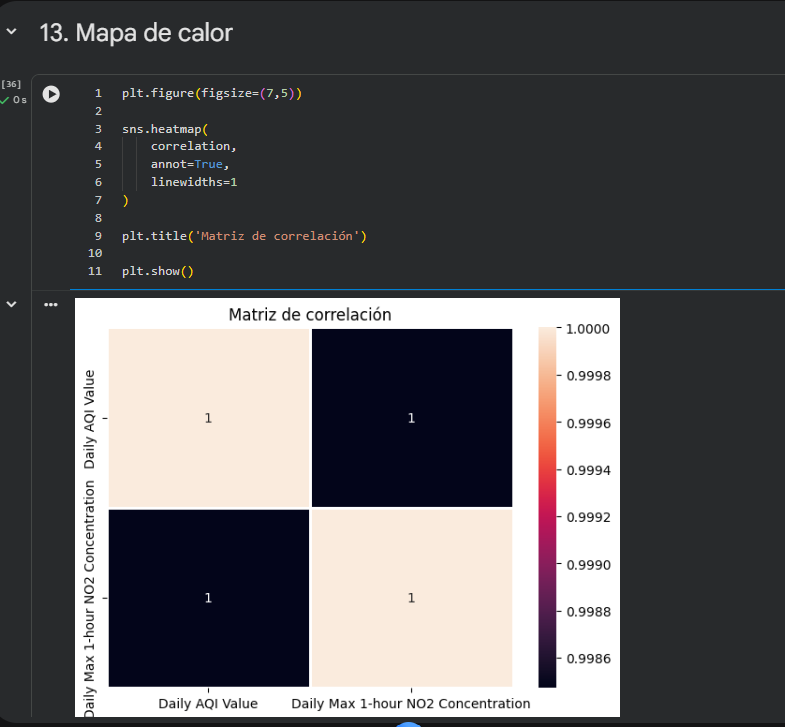

> **Interpretación: El mapa de calor muestra una correlación aproximada de 0.9985 entre Daily AQI Value y Daily Max 1-hour NO2 Concentration. Este valor, muy cercano a 1, indica una relación lineal positiva muy fuerte entre las dos variables. Como estudiante, interpreto que cuando aumenta el valor diario del AQI, también tiende a aumentar la concentración máxima de NO₂. Este resultado coincide con la tendencia ascendente observada en el gráfico de dispersión y en el pairplot.**

## 3. Construcción del modelo de regresión lineal

### 3.1 División de entrenamiento y prueba

Los datos se dividieron en 70 % para entrenamiento y 30 % para prueba. Se utilizó random_state=123 para mantener una división reproducible.

El notebook registra 254 observaciones para entrenamiento y 110 para prueba.

### 3.2 Creación y entrenamiento

Para construir el modelo de regresión lineal se utilizó la clase LinearRegression de Scikit-learn [3].

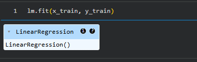

### 3.3 Intercepto y coeficiente

El modelo entrenado con el 70 % de los datos obtuvo un intercepto de 0.70534 y un coeficiente de 1.05084 para Daily AQI Value. La ecuación estimada sobre el conjunto de entrenamiento es aproximadamente:

NO₂ = 0.70534 + 1.05084(AQI)

El coeficiente indica que, según este modelo, un incremento de una unidad en Daily AQI Value se asocia con un incremento estimado de aproximadamente 1.05084 ppb en la concentración de NO₂.

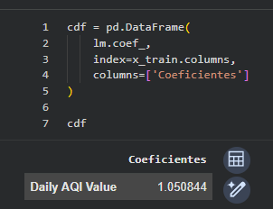

## 4. Resultados

### 4.1 Predicciones

Una vez entrenado el modelo, se realizaron predicciones sobre el conjunto de prueba utilizando el método predict().

Entre las primeras predicciones obtenidas se encuentran 13.3155, 92.1288, 21.7222, 12.2646 y 8.0612, entre otras.

### 4.2 Comparación entre valores reales y predichos

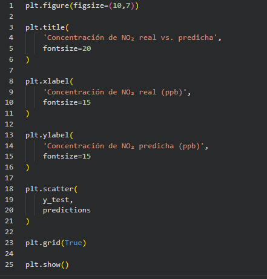

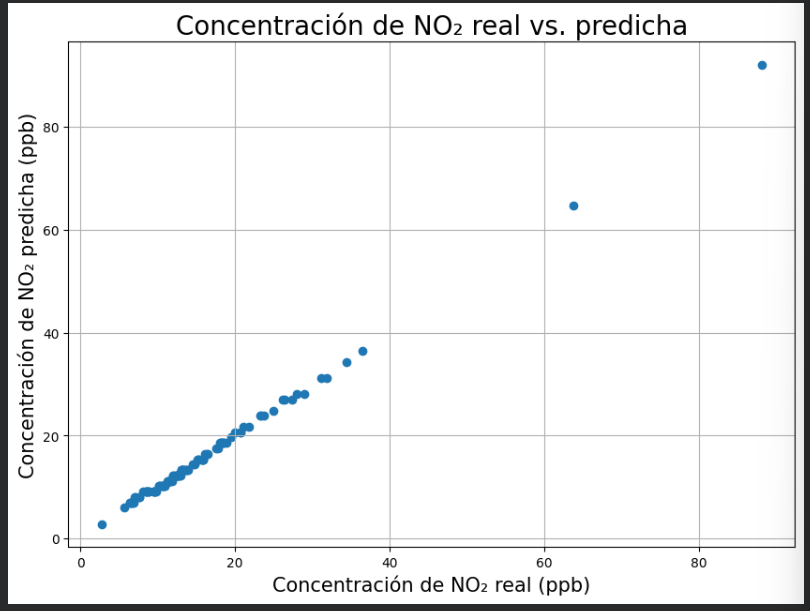

> **Interpretación: En la gráfica se comparan los valores reales de concentración de NO₂ con los valores predichos por el modelo de regresión lineal. Se observa que la mayoría de los puntos se encuentran muy cercanos entre sí y siguen una tendencia lineal ascendente, lo que indica que las predicciones del modelo son bastante similares a los valores reales.**

También se observan algunos puntos con concentraciones más altas, especialmente alrededor de 60 y 85 ppb, donde existe una pequeña diferencia entre el valor real y el predicho. En general, la gráfica muestra que el modelo logra realizar predicciones cercanas a los datos observados, especialmente en el rango donde se concentra la mayor cantidad de registros.

### 4.3 Análisis de residuos

### 4.3.1 Histograma de residuos

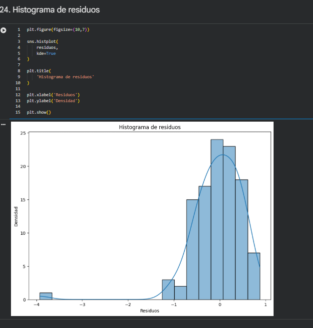

> **Interpretación: En el histograma se observa que la mayor parte de los residuos se concentra alrededor de cero. Esto indica que, en la mayoría de las observaciones, la diferencia entre el valor real y el valor predicho es relativamente pequeña. También se aprecia un valor negativo bastante alejado del resto, cercano a -4, que representa una observación con un error mayor. En general, los residuos se encuentran concentrados cerca de cero, aunque la distribución presenta una ligera asimetría hacia los valores negativos.**

Los residuos se calcularon como la diferencia entre el valor real y el valor predicho:

Residuo = valor real − valor predicho

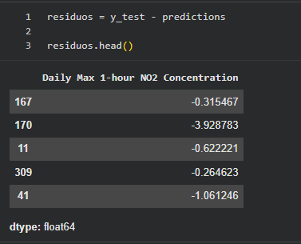

### 4.4 Homocedasticidad

Se elaboró un gráfico de residuos frente a las predicciones para observar la dispersión de los errores alrededor de cero.

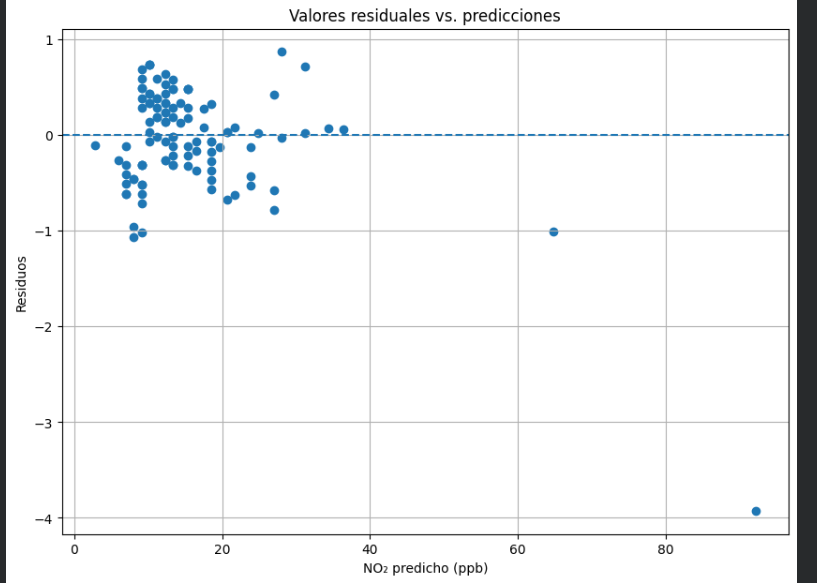

> **Interpretación: En la gráfica se observa la relación entre los valores predichos de NO₂ y los residuos del modelo. La mayoría de los puntos se encuentran alrededor de la línea de referencia en cero, lo que indica que los errores de predicción son generalmente pequeños.**

También se puede observar que los residuos están distribuidos tanto por encima como por debajo de cero. Sin embargo, aparecen algunos valores alejados, especialmente uno cercano a −4, correspondiente a un valor predicho de aproximadamente 92 ppb. Este punto representa un error mayor respecto al resto de las observaciones.

En general, la mayor concentración de puntos se encuentra en valores predichos bajos y alrededor de cero. Como estudiante, interpreto que el modelo presenta residuos relativamente pequeños en la mayoría de los casos, aunque existen algunas observaciones que generan errores más elevados.

### 4.5 Error cuadrático medio (MSE)

El notebook obtuvo un MSE de 0.32883. Este indicador resume el promedio de los errores cuadráticos entre los valores reales y las predicciones del conjunto de prueba.

### 4.6 Coeficiente de determinación R²

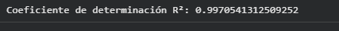

El R² obtenido en el conjunto de prueba fue 0.99705. Este valor indica que, en la muestra de prueba utilizada, el modelo presenta una proporción muy alta de variabilidad explicada por la relación lineal con Daily AQI Value.

## 5. Mínimos cuadrados ordinarios (OLS)

Para complementar la regresión se aplicó el método de Mínimos Cuadrados Ordinarios (OLS) mediante Statsmodels [4]. Este procedimiento estima los parámetros minimizando la suma de los cuadrados de las diferencias entre los valores observados y los valores estimados.

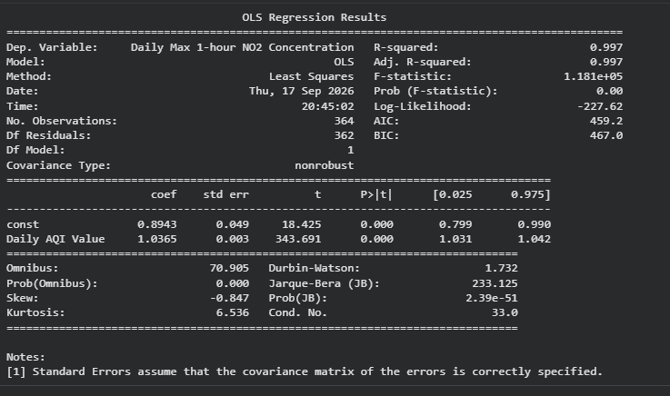

En el resumen OLS obtenido con las 364 observaciones se registró un R² de 0.997. El coeficiente estimado para Daily AQI Value fue 1.0365, con error estándar de 0.003, estadístico t de 343.691 y valor p < 0.001. El intervalo de confianza del 95 % para el coeficiente fue [1.031, 1.042].

## 6. Discusión

Los resultados obtenidos muestran una relación lineal positiva muy alta entre el Daily AQI Value y la concentración máxima diaria de NO₂. La correlación calculada fue de 0.998471, lo que evidencia que ambas variables presentan un comportamiento lineal muy cercano dentro del conjunto de datos analizado. Esta tendencia también pudo observarse gráficamente mediante el gráfico de dispersión y el mapa de calor.

El modelo de regresión lineal presentó un R² de 0.99705 en el conjunto de prueba, lo que indica que el modelo logra representar una proporción muy alta de la variabilidad observada en la concentración de NO₂ a partir del Daily AQI Value. Asimismo, el MSE de 0.32883 muestra que los errores cuadráticos promedio de las predicciones fueron relativamente pequeños para los datos utilizados.

El análisis de los residuos permite complementar estos resultados. La mayoría de los residuos se encuentra alrededor de cero, lo que indica que las diferencias entre los valores reales y predichos son generalmente pequeñas. Sin embargo, se identificó una observación con un residuo cercano a −4, correspondiente a un valor predicho de aproximadamente 92 ppb, que presenta un error mayor respecto al resto de las observaciones.

Por otro lado, se observaron pequeñas diferencias entre los coeficientes obtenidos mediante Scikit-learn y los obtenidos mediante OLS en Statsmodels. Esto se debe a que el modelo de Scikit-learn fue entrenado utilizando el 70 % de los datos, mientras que el análisis OLS se realizó utilizando las 364 observaciones disponibles. Por esta razón, los resultados de ambos procedimientos no son exactamente iguales, aunque mantienen una tendencia similar.

En conjunto, los resultados obtenidos mediante el análisis exploratorio, la regresión lineal, el estudio de los residuos y el modelo OLS muestran un comportamiento consistente de las variables analizadas. Sin embargo, estos resultados corresponden únicamente al conjunto de datos del año 2023, por lo que el análisis podría ampliarse incorporando otro período para realizar una comparación temporal.

## 7. Conclusiones

## 1. Se realizó un análisis de regresión lineal utilizando datos de calidad del aire de California y se seleccionó Daily AQI Value como variable independiente y Daily Max 1-hour NO2 Concentration como variable dependiente.

## 2. El análisis exploratorio permitió revisar la distribución de la concentración de NO₂ y visualizar la relación entre las variables mediante gráficos de dispersión, pairplot, histograma y mapa de calor.

## 3. El modelo de regresión lineal entrenado con el 70 % de los datos obtuvo un intercepto de 0.70534 y un coeficiente de 1.05084.

## 4. En el conjunto de prueba se obtuvo un MSE de 0.32883 y un R² de 0.99705, resultados que permiten describir el comportamiento del modelo sobre los datos utilizados.

## 5. El análisis OLS complementó la evaluación mediante coeficientes, errores estándar, estadísticos t, valores p e intervalos de confianza.

## 8. Referencias

[1] U.S. Environmental Protection Agency, “Download Daily Data,” U.S. EPA. [En línea]. Disponible en: https://www.epa.gov/outdoor-air-quality-data/download-daily-data. [Accedido: 17-sep-2026].

[2] M. L. Waskom, “seaborn: statistical data visualization,” Journal of Open Source Software, vol. 6, no. 60, p. 3021, 2021. [En línea]. Disponible en: https://doi.org/10.21105/joss.03021. [Accedido: 17-sep-2026].

[3] Scikit-learn Developers, “LinearRegression,” Scikit-learn Documentation. [En línea]. Disponible en: https://scikit-learn.org/stable/modules/generated/sklearn.linear_model.LinearRegression.html. [Accedido: 17-sep-2026].

[4] Statsmodels Developers, “Linear Regression,” Statsmodels Documentation. [En línea]. Disponible en: https://www.statsmodels.org/stable/regression.html. [Accedido: 17-sep-2026].

[5] The pandas development team, “pandas documentation,” pandas. [En línea]. Disponible en: https://pandas.pydata.org/docs/. [Accedido: 17-sep-2026].

