# Taller 4 --- Regresión Lineal aplicada a la calidad del aire

> **Proyecto Integrador · Introducción a IA**

------------------------------------------------------------------------

## Datos del informe

  -----------------------------------------------------------------------
  Campo                               Información
  ----------------------------------- -----------------------------------
  **Curso**                           Proyecto integrador

  **Docentes**                        María Angelica Rejas Nuñez · Ing.
                                      Renzo Jose Chan Rios

  **Integrante**                      Lumeris Sihuincha Palacin
  -----------------------------------------------------------------------

## Contenido

-   [1. Introducción](#1-introducción)
-   [2. Metodología](#2-metodología)
-   [3. Resultados](#3-resultados)
-   [4. Discusión](#4-discusión)
-   [5. Conclusión general](#5-conclusión-general)
-   [6. Referencias](#6-referencias)

------------------------------------------------------------------------

<p align="center"><em>"Año de la Esperanza y el Fortalecimiento de la Democracia"</em></p>

<p align="center">
  
</p>

Introducción a IA

Curso: Proyecto integrador

------------------------------------------------------------------------

Docentes:

María Angelica Rejas Nuñez

Ing. Renzo Jose Chan Rios

------------------------------------------------------------------------

Integrante:

Lumeris Sihuincha Palacin

# 1. Introducción

La calidad del aire es un factor importante para evaluar las condiciones
ambientales y sus posibles efectos sobre la salud humana y los
ecosistemas. Entre los principales contaminantes atmosféricos se
encuentra el material particulado fino PM2.5, compuesto por partículas
con un diámetro menor o igual a 2.5 micrómetros, capaces de permanecer
suspendidas en la atmósfera y variar en función de diferentes
condiciones ambientales.

En el presente trabajo se analizaron datos diarios de concentración de
PM2.5 obtenidos de la base de datos de calidad del aire de la
Environmental Protection Agency (EPA) \[1\]. Los datos corresponden a
los años 2022 y 2023 para el área geográfica de Hawaii, utilizando los
registros disponibles de todos los sitios de monitoreo.

El objetivo de este estudio es aplicar un modelo de regresión lineal
simple para analizar la relación entre el tiempo y la concentración de
PM2.5. Mediante este modelo se busca determinar la tendencia de los
datos y evaluar qué tan bien una función lineal representa la variación
de la concentración del contaminante durante el periodo analizado.

# 2. Metodología

Para el desarrollo del presente análisis se utilizaron datos diarios de
concentración de PM2.5 obtenidos de la base de datos de calidad del aire
de la Environmental Protection Agency (EPA) \[1\], \[2\]. El conjunto de
datos seleccionado corresponde al año 2022 y contiene registros de
medición de calidad del aire para el área geográfica de Hawaii.

El procesamiento y análisis de los datos se realizó mediante Google
Colab utilizando Python, empleando las librerías Pandas y NumPy para la
manipulación de datos, Matplotlib y Seaborn para la generación de
gráficos, y Scikit-learn para la construcción del modelo de regresión
lineal.

Inicialmente se realizó una etapa de exploración de datos mediante la
revisión de la estructura del archivo, los tipos de variables y
estadísticas descriptivas. Además, se generaron gráficos de distribución
y una matriz de correlación con el objetivo de identificar el
comportamiento general de los datos y la relación entre las variables
numéricas.

Para aplicar el modelo de regresión lineal, la variable correspondiente
a la fecha de medición fue transformada en una variable numérica
denominada Day, la cual representa la cantidad de días transcurridos
desde el primer registro del periodo analizado. De esta manera, se
definieron las variables del modelo:

Variable independiente (X): tiempo expresado en días (Day).

Variable dependiente (Y): concentración diaria de PM2.5 (Daily Mean
PM2.5 Concentration).

El modelo aplicado corresponde a una regresión lineal simple,
representada mediante la ecuación:

$$
Y = \beta_0 + \beta_1 X
$$

donde YY representa la concentración de PM2.5, XX representa el tiempo,
β0`\beta{=tex}`{=tex}\_0 es el término independiente y
β1`\beta{=tex}`{=tex}\_1 corresponde al coeficiente de la pendiente.

Posteriormente, los datos fueron divididos en conjuntos de entrenamiento
y prueba utilizando la función train_test_split, asignando el 70% de los
datos para entrenamiento y el 30% restante para evaluación. Luego se
entrenó el modelo mediante la función LinearRegression() de
Scikit-learn, obteniendo los coeficientes de la ecuación lineal y
realizando predicciones sobre los datos.

Finalmente, el rendimiento del modelo fue evaluado mediante el error
cuadrático medio (MSE) y el coeficiente de determinación (R²). También
se generaron gráficos de comparación entre valores reales y predichos,
además de gráficos de residuos para analizar el comportamiento del error
del modelo.

# 3. Resultados

## Bloque 1: Importar herramientas y cargar los datos

``` python
import numpy as np
import pandas as pd
import matplotlib.pyplot as plt
import seaborn as sns
%matplotlib inline
```

df = pd.read_csv("/content/PM25_Hawaii_2022.csv.csv")

``` python
df.head()
```

<p align="center">
  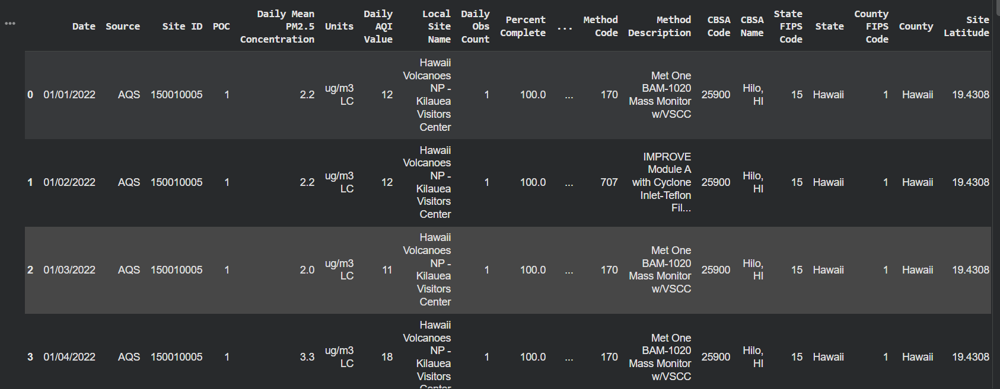
</p>

> **Aprendí:** Que lo primero es traer las librerías necesarias (numpy y
> pandas para manejar datos, matplotlib y seaborn para graficar) y
> cargar el archivo CSV con los registros diarios de PM2.5 en Hawaii,
> para luego revisar cómo se ven las primeras filas.

## Bloque 2: Revisar columnas y estadísticas generales

``` python
df.columns
```

<p align="center">
  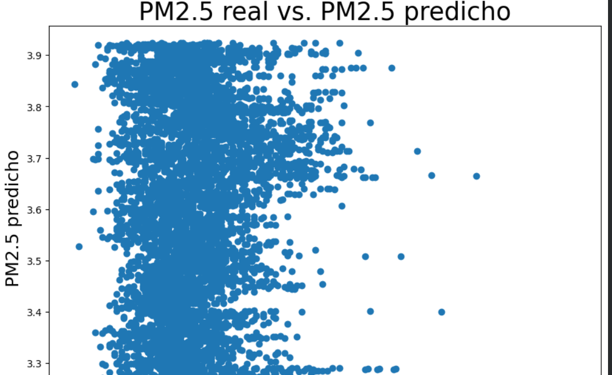
</p>

``` python
df.describe().round(2)
```

<p align="center">
  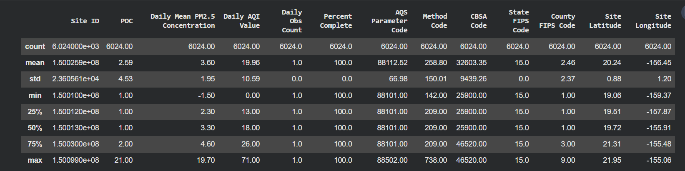
</p>

``` python
df.info(verbose=True)
df.describe().round(1)
```

<p align="center">
  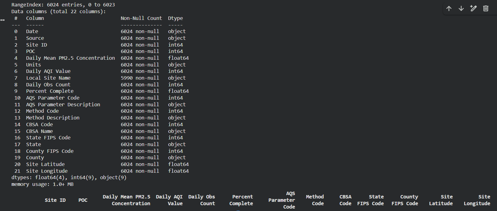
</p>

> **Aprendí:** Que antes de modelar hay que conocer los datos.
> Con columns vi los nombres de las 22 variables del archivo (fecha,
> sitio, código de estado, concentración de PM2.5, AQI, latitud,
> longitud, etc). El dataset tiene 6024 filas, sin datos vacíos.
> Con describe() obtuve un resumen numérico: la variable que me
> interesa, "Daily Mean PM2.5 Concentration", tiene un promedio bajo
> (los valores de PM2.5 en Hawaii son en general bastante bajos, lo cual
> tiene sentido por ser una zona con buena calidad del aire).

## Bloque 3: Explorar visualmente los datos

``` python
sns.pairplot(df)
```

<p align="center">
  
</p>

> **Aprendí:** Que el pairplot compara todas las variables numéricas
> entre sí en una sola cuadrícula de gráficos, para detectar a simple
> vista si hay relaciones entre ellas. Es un primer vistazo general
> antes de enfocarme en la variable que quiero predecir.

## Bloque 4: Histograma y densidad de PM2.5

df\["Daily Mean PM2.5 Concentration"\].plot.hist(

``` python
bins=25,
figsize=(8,4)
)
```

df\["Daily Mean PM2.5 Concentration"\].plot.density()

<p align="center">
  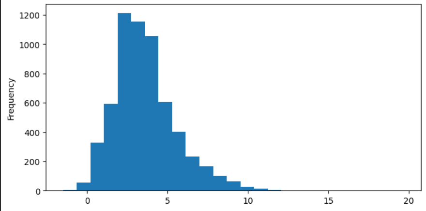
</p>

<p align="center">
  
</p>

> **Interpretación de la gráfica:** El histograma muestra que la mayoría
> de los días tienen una concentración de PM2.5 baja, concentrada entre
> 2 y 5 (aprox.), con un pico claro alrededor de 3. Muy pocos días
> superan valores de 10, y casi ninguno llega a 15-20. La gráfica de
> densidad confirma lo mismo de forma más suave: una curva con un pico
> marcado cerca de 3 y una "cola larga" hacia la derecha.

> **Aprendí:** Que la distribución de PM2.5 no es simétrica, sino que
> está sesgada a la derecha (la mayoría de los valores son bajos, pero
> hay algunos días con valores altos que "estiran" la cola). Esto es
> típico en variables ambientales, donde normalmente el aire está limpio
> pero ocasionalmente hay picos de contaminación (por ejemplo, incendios
> o eventos puntuales).

## Bloque 5: Correlación entre variables

``` python
numeric_df = df.select_dtypes(include=[np.number])
numeric_df.corr().round(4)
plt.figure(figsize=(10,7))
sns.heatmap(
numeric_df.corr(),
annot=True,
linewidths=2
)
```

<p align="center">
  
</p>

<p align="center">
  
</p>

> **Interpretación de la gráfica:** En el mapa de calor, la variable
> "Daily Mean PM2.5 Concentration" tiene correlaciones muy bajas o
> cercanas a cero con casi todas las demás variables numéricas (Site ID:
> -0.078, POC: 0.024, AQS Parameter Code: -0.18, Method Code: -0.063,
> etc). La única correlación de 1 es con "Daily AQI Value", pero eso es
> porque el AQI se calcula directamente a partir del PM2.5 (son
> básicamente la misma información expresada de otra forma), no una
> relación real entre variables distintas.

> **Aprendí:** Que ninguna de las variables numéricas disponibles
> (aparte del AQI, que no cuenta) tiene una relación fuerte con el
> PM2.5. Esto ya es una pista de que va a ser difícil predecir bien el
> PM2.5 solamente con estos datos.

## Bloque 6: Preparar la variable "Día" y separar los datos

df\["Date"\] = pd.to_datetime(df\["Date"\])

df\["Day"\] = (df\["Date"\] - df\["Date"\].min()).dt.days

``` python
x = df[["Day"]]
y = df["Daily Mean PM2.5 Concentration"]
from sklearn.model_selection import train_test_split
x_train, x_test, y_train, y_test = train_test_split(
x, y, test_size=0.3, random_state=123
)
```

<p align="center">
  
</p>

> **Aprendí:** Que convertí la fecha en un número simple: "Day"
> representa cuántos días han pasado desde el primer registro (día 0,
> día 1, día 2...). Esto permite usar el tiempo como una variable
> numérica para el modelo. Luego separé los datos en 70% para entrenar y
> 30% para probar el modelo.

## Bloque 7: Entrenar el modelo de regresión lineal

``` python
from sklearn.linear_model import LinearRegression
from sklearn import metrics
```

lm = LinearRegression()

``` python
lm.fit(x_train, y_train)
print("El termino de interseccion del modelo lineal:", lm.intercept_)
print("El coeficiente del modelo lineal:", lm.coef_)
```

### Resultado obtenido:

Intercepto: 3.92

Coeficiente de "Day": -0.00186

<p align="center">
  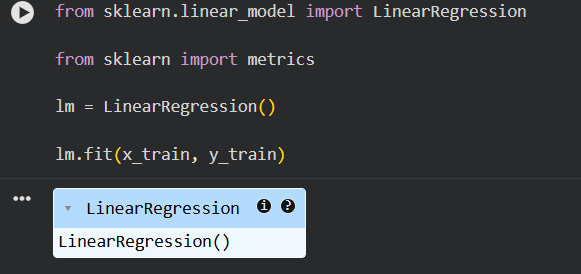
</p>

> **Aprendí:** Que el modelo aprendió una fórmula donde el PM2.5 empieza
> en, aproximadamente, 3.92 y baja muy levemente (-0.00186) por cada día
> que pasa. Ese coeficiente es prácticamente cero, lo que significa que,
> según el modelo, el paso del tiempo casi no afecta el nivel de
> PM2.5 --- la relación es extremadamente débil.

## Bloque 8: Tabla de coeficientes y predicciones

``` python
cdf = pd.DataFrame(
lm.coef_, x.columns, columns=["Coeficientes"]
)
cdf
predictions = lm.predict(x)
print("Tipo del objeto predicho:", type(predictions))
print("Tamaño del objeto predicho:", predictions.shape)
```

<p align="center">
  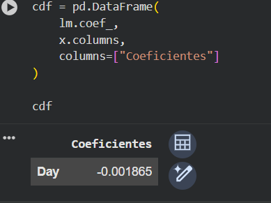
</p>

> **Aprendí:** Que organicé el coeficiente en una tabla para verlo más
> claro, y luego generé las 6024 predicciones del modelo (una por cada
> fila de datos), guardadas en un arreglo de numpy.

## Bloque 9: PM2.5 real vs. predicho

``` python
plt.figure(figsize=(10,7))
plt.title("PM2.5 real vs. PM2.5 predicho", fontsize=25)
plt.xlabel("PM2.5 real", fontsize=18)
plt.ylabel("PM2.5 predicho", fontsize=18)
plt.scatter(y, predictions)
```

<p align="center">
  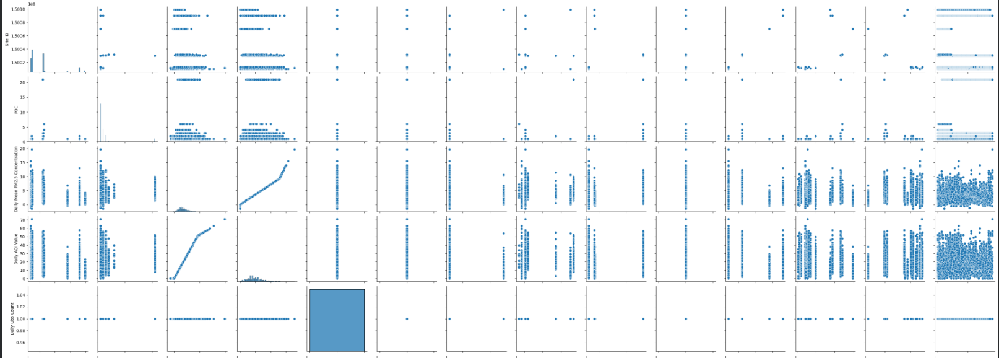
</p>

> **Interpretación de la gráfica:** Si el modelo predijera bien, los
> puntos deberían formar una línea diagonal ascendente (a mayor valor
> real, mayor valor predicho). En cambio, aquí se ve una nube de puntos
> casi completamente vertical, apretada entre 3.2 y 3.9 en el eje del
> PM2.5 predicho, sin importar si el valor real fue 0 o 20.

**¿Por qué no salió diagonal?** Porque el modelo solo tiene una variable
para predecir ("Day"), y esa variable casi no influye en el resultado.
Esto se confirma con el resumen estadístico (resultado.summary()):

<p align="center">
  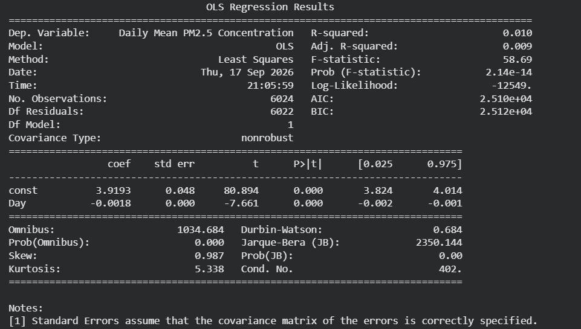
</p>

R-squared: 0.010

coef Day: -0.0018 \| P\>\|t\|: 0.000

El R² es de apenas 0.010, es decir, el "día" explica solo el 1% de lo
que varía el PM2.5. El otro 99% de la variación se debe a factores que
el modelo no tiene (viento, clima, incendios, tráfico, etc).

El coeficiente de "Day" es casi cero (-0.0018), así que para el modelo
da casi lo mismo predecir el día 1 que el día 300: siempre predice un
valor muy parecido, cercano al promedio (por eso las predicciones quedan
"apretadas" entre 3.2 y 3.9).

Aunque la columna P\>\|t\| marca 0.000 (lo que normalmente se lee como
"sí es significativo"), eso solo indica que esa pendiente tan pequeña es
estadísticamente distinta de cero --- algo que pasa fácilmente cuando
hay muchos datos (6024 filas). No significa que el "día" sea un buen
predictor en la práctica.

Como el eje "real" sí varía mucho (de 0 a 20) pero el eje "predicho"
casi no varía, el resultado visual es una franja vertical angosta en vez
de una diagonal: el modelo no logra "estirarse" para seguir el rango
real de los datos.

> **Aprendí:** Que un gráfico de real vs. predicho no sale diagonal
> cuando el modelo no logra capturar la variabilidad de los datos
> reales. Aquí eso pasó porque la única variable usada (el día) tiene
> una relación casi nula con el PM2.5, aunque el modelo "corra sin
> errores" y hasta marque el coeficiente como estadísticamente
> significativo.

## Bloque 10: Error del modelo (MSE y R²)

``` python
print("Mean square error (MSE):", metrics.mean_squared_error(y,
predictions))
print("R²:", metrics.r2_score(y, predictions))
```

### Resultado obtenido:

MSE: 3.78

R²: 0.0096

> **Aprendí:** Que el R² mide qué porcentaje de la variación del PM2.5
> logra explicar el modelo, en una escala de 0 a 1. Un R² de 0.0096
> significa que el modelo explica menos del 1% de la variación real del
> PM2.5. En otras palabras, el "Día" prácticamente no sirve para
> predecir el nivel de contaminación --- hace falta otras variables
> (como clima, viento, tráfico, incendios, etc) que este dataset no
> tiene disponibles.

## Bloque 11: Línea de regresión sobre los datos reales

``` python
plt.figure(figsize=(10,7))
plt.scatter(x, y, label="Datos reales")
plt.plot(x, predictions, linewidth=3, label="Regresión lineal")
plt.xlabel("Día")
plt.ylabel("PM2.5")
plt.title("Regresión lineal de concentración PM2.5")
plt.legend()
plt.show()
```

<p align="center">
  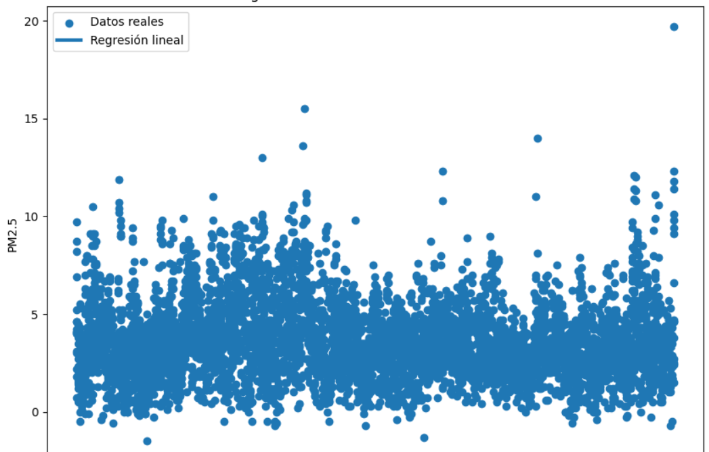
</p>

> **Interpretación de la gráfica:** Los puntos azules (datos reales)
> están muy dispersos a lo largo de todo el año, sin ningún patrón claro
> de subida o bajada. La línea de regresión (naranja) sale casi plana,
> apenas con una leve inclinación hacia abajo, porque el coeficiente era
> casi cero. Esa línea plana no logra "seguir" ninguno de los picos ni
> caídas de los datos reales.

> **Aprendí:** Que cuando una variable (el día) no tiene relación real
> con el resultado (PM2.5), el modelo de regresión lineal simplemente
> traza una línea casi horizontal en el promedio, porque es lo mejor que
> puede hacer con la información que tiene.

## Bloque 12: Histograma de residuos

``` python
plt.figure(figsize=(10,7))
plt.title("Histograma de residuos", fontsize=25)
plt.xlabel("Residuos", fontsize=18)
plt.ylabel("Densidad", fontsize=18)
sns.histplot((y - predictions), kde=True)
```

<p align="center">
  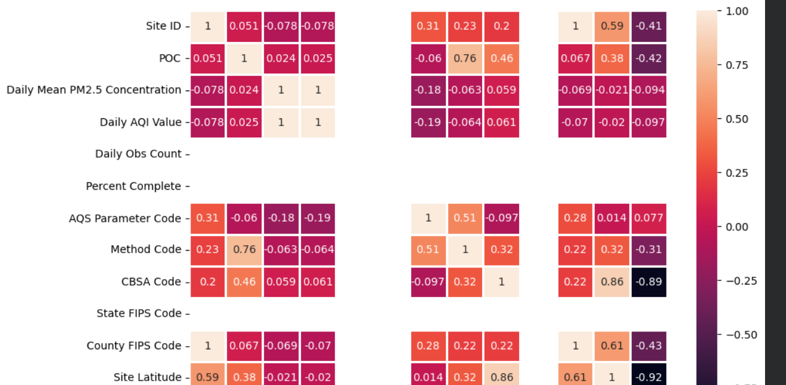
</p>

> **Interpretación de la gráfica:** Los residuos (diferencia entre el
> valor real y el predicho) tienen forma de campana, pero no
> perfectamente simétrica: hay más residuos positivos grandes (hasta 15)
> que negativos, formando una cola larga hacia la derecha. Esto refleja
> lo mismo que vimos en el histograma original del PM2.5: hay días con
> picos altos de contaminación que el modelo no logra anticipar.

> **Aprendí:** Que revisar los residuos ayuda a detectar problemas del
> modelo: en este caso, la asimetría de los residuos confirma que el
> modelo subestima los días con contaminación alta (predice bajo cuando
> en realidad fue alto).

## Bloque 13: Residuos vs. predicciones

``` python
plt.figure(figsize=(10,7))
plt.title("Valores residuales vs. predichos", fontsize=25)
plt.xlabel("PM2.5 predicho", fontsize=18)
plt.ylabel("Residuos", fontsize=18)
plt.scatter(predictions, y - predictions)
```

<p align="center">
  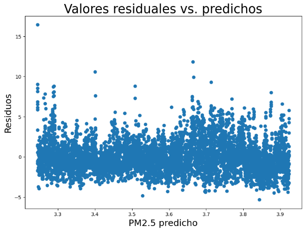
</p>

> **Interpretación de la gráfica:** Los residuos deberían idealmente
> formar una franja pareja alrededor del cero, sin ningún patrón. Aquí
> se ve justamente eso: una franja de puntos entre -5 y +5
> aproximadamente, sin ninguna forma de embudo o curva, aunque con
> varios valores atípicos (outliers) que llegan hasta 15-16 en el eje de
> residuos.

> **Aprendí:** Que, aunque el modelo es malo prediciendo (R² muy bajo),
> al menos no tiene un problema adicional de "error creciente"
> (heterocedasticidad): el error se mantiene parejo en todo el rango de
> predicción, solo que ese error es grande en términos relativos porque
> el modelo casi no usa información real del día.

## Bloque 14: Resumen estadístico completo (statsmodels)

### Resumen estadístico

``` python
print(resultado.summary())
```

### Resultado obtenido (resumen):

> **Aprendí:** Que este resumen confirma con números todo lo que ya se
> veía en las gráficas: el modelo es débil (R² bajísimo), y encima el
> bajo valor de Durbin-Watson sugiere que el PM2.5 sí tiene algún patrón
> a lo largo del tiempo (por ejemplo, por estación del año), solo que
> una simple línea recta con el "día" como único número no es capaz de
> capturarlo. Haría falta un modelo más complejo (por ejemplo, agregar
> el mes o la estación del año, o usar otro tipo de modelo) para
> predecir mejor.

# 4. Discusión

Los resultados del modelo de regresión lineal muestran que la variable
tiempo (Day) presenta una relación estadísticamente significativa con la
concentración de PM2.5; sin embargo, su influencia es muy baja. El
coeficiente obtenido fue de -0.0018, indicando una ligera disminución de
la concentración conforme avanzan los días.

El modelo obtuvo un R² = 0.010, lo que significa que el tiempo explica
aproximadamente el 1% de la variabilidad de los datos. Por ello, aunque
la variable sea significativa estadísticamente debido a la cantidad de
registros analizados, su efecto no representa una relación importante
para predecir la concentración de PM2.5.

En el gráfico de valores reales frente a predichos, los puntos no siguen
una tendencia diagonal debido a que el modelo no logra representar
adecuadamente las variaciones diarias del contaminante. Esto ocurre
porque únicamente se utilizó el tiempo como variable independiente, por
lo que las predicciones tienden a mantenerse cercanas al valor promedio
en lugar de seguir los cambios reales de PM2.5.

La baja capacidad predictiva del modelo indica que el comportamiento del
contaminante depende de otros factores que no fueron considerados, como
condiciones meteorológicas, emisiones locales o eventos ambientales. A
pesar de ello, el análisis permitió aplicar el proceso completo de
regresión lineal y evaluar sus limitaciones mediante métricas
estadísticas y gráficos.

# 5. Conclusión general

En este taller aprendí a aplicar el mismo flujo de un modelo de
regresión lineal (explorar datos, entrenar, predecir, evaluar con
gráficas) pero esta vez con un caso donde el modelo resultó ser malo: el
día del año no tiene relación real con el nivel de PM2.5 (R² = 0.0096,
coeficiente casi cero). Esto me enseñó que no todos los modelos
funcionan bien, y que las gráficas (real vs. predicho, línea de
regresión, residuos) son clave para darse cuenta de que el modelo no
está funcionando, en vez de confiar solo en que "corrió sin errores"

# 6. Referencias

\[1\] United States Environmental Protection Agency,

"Outdoor Air Quality Data," U.S. Environmental Protection Agency.

\[Online\]. Available: https://www.epa.gov/outdoor-air-quality-data

\[2\] United States Environmental Protection Agency,

"Air Data: Air Quality Data Collected at Outdoor Monitors Across the
US,"

U.S. Environmental Protection Agency.

\[Online\]. Available: https://www.epa.gov/air-data

\[3\] F. Pedregosa et al., "Scikit-learn: Machine Learning in Python,"

Journal of Machine Learning Research, vol. 12, pp. 2825-2830, 2011.
