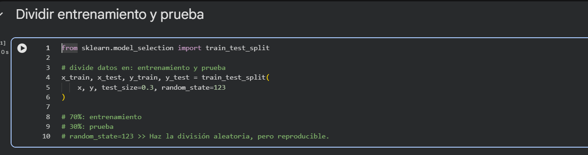
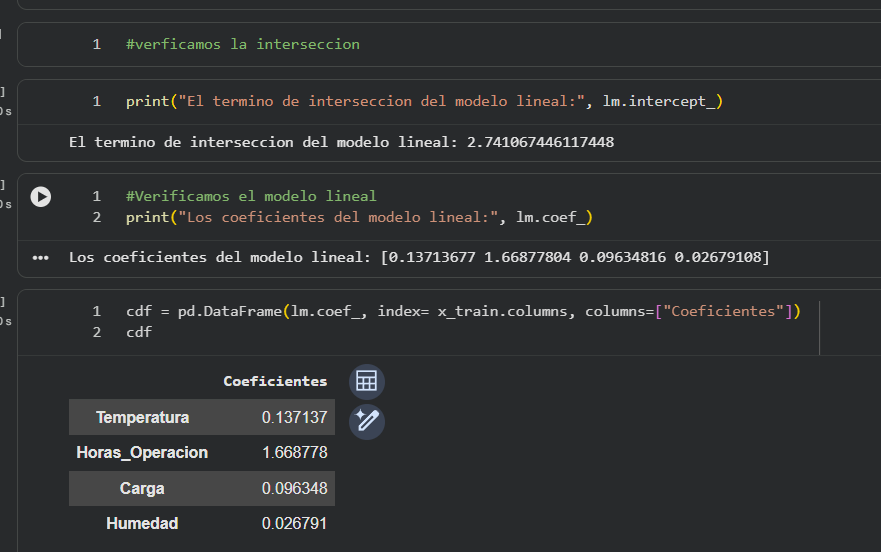
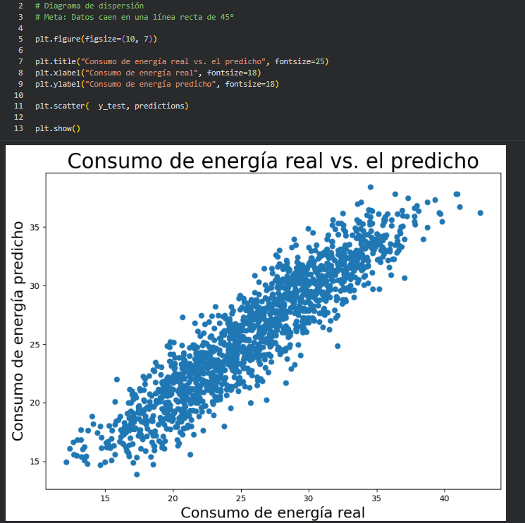
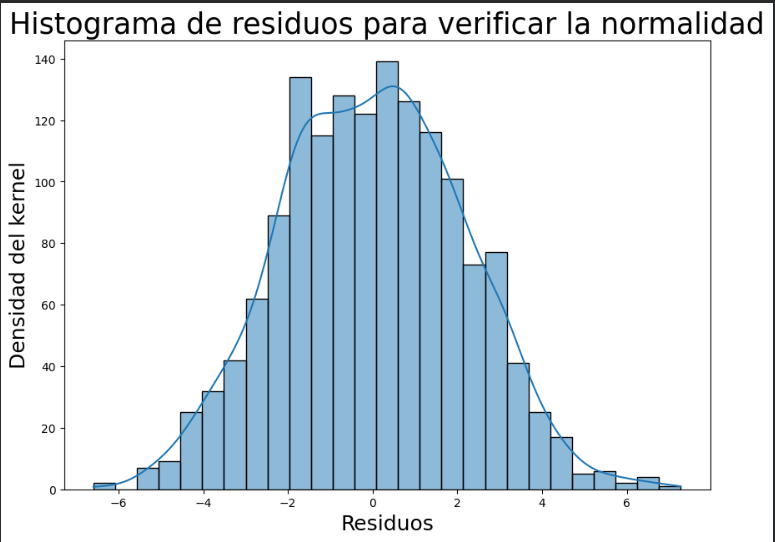
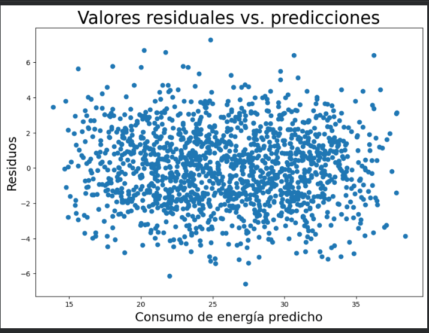
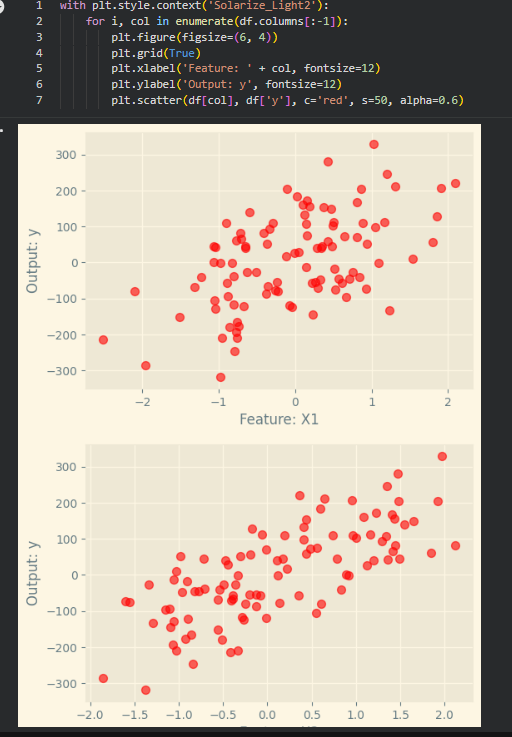
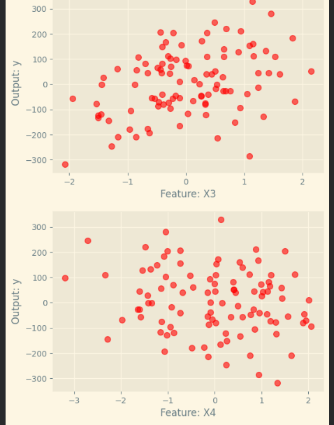
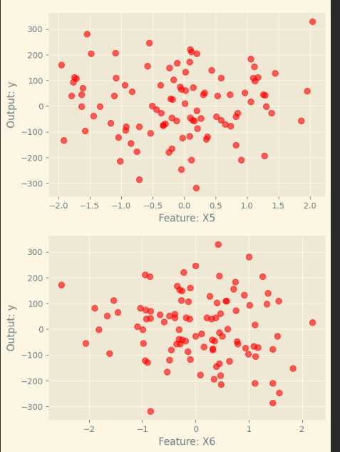
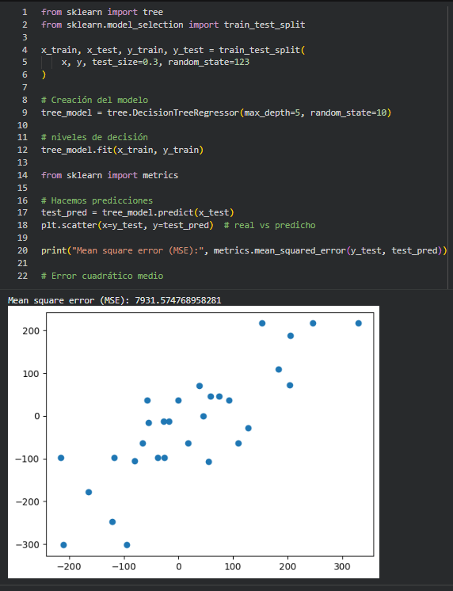
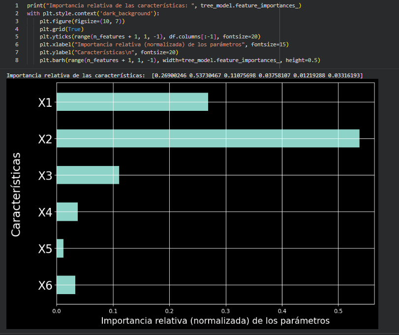

# Regresión Lineal

Regresión Lineal

## 1.  ¿Qué es la regresión lineal?

La regresión lineal permite analizar la relación entre una variable que queremos predecir y una o varias variables que pueden influir en ella.

En la clase se trabajó con:

Variable dependiente (Y): Consumo_Energia

Variables independientes (X):

Temperatura

Horas_Operacion

Carga

Humedad

El modelo utilizado fue una regresión lineal múltiple.

## 2.  División de los datos

Los datos se dividieron en:

70 % → entrenamiento

30 % → prueba

train_test_split(x, y, test_size=0.3, random_state=123)

random_state=123 permite obtener la misma división cada vez que se ejecuta el código.

## 3.  Creación y entrenamiento del modelo

Se utilizó LinearRegression() de sklearn:

lm = LinearRegression()

lm.fit(x_train, y_train)

fit() → entrena el modelo utilizando los datos de entrenamiento.

El modelo aprende cómo se relacionan las variables independientes con el consumo de energía.

## 4. Ecuación de regresión

La regresión lineal múltiple tiene la forma:

En nuestro caso:

El modelo obtuvo:

Intercepto: 2.7411

Temperatura: 0.1371

Horas de operación: 1.6688

Carga: 0.0963

Humedad: 0.0268

## 5.  ¿Qué significan los coeficientes?

Los coeficientes indican cuánto cambia aproximadamente el Consumo_Energia cuando aumenta una variable independiente, manteniendo las demás constantes.

Por ejemplo:

El coeficiente de Horas_Operacion es aproximadamente 1.6688.

Esto indica que un aumento de una unidad en las horas de operación se relaciona con un aumento aproximado de 1.6688 unidades en el consumo, manteniendo las demás variables constantes.

## 6.  Predicciones

Una vez entrenado el modelo, podemos utilizarlo para obtener valores predichos:

predictions = lm.predict(x_test)

Después se pueden comparar:

Valor real

Valor predicho por el modelo

## 7.  Residuos

El residuo representa la diferencia entre el valor real y el valor que predijo el modelo:

Los residuos sirven para analizar si el modelo está cometiendo errores sistemáticos.

El histograma se utilizó para observar la distribución de los residuos y comprobar visualmente su comportamiento.

## 8.  Homocedasticidad

Se puede analizar mediante un gráfico de:

Predicciones vs. residuos

La idea es observar si los errores mantienen una dispersión aproximadamente constante a lo largo de las predicciones.

## 9. Análisis de las características

En esta gráfica se observa la relación entre las diferentes características de entrada y la variable de salida. Los puntos representan los valores registrados para cada característica, permitiendo visualizar cómo se distribuyen los datos y si existe algún patrón o relación con la variable objetivo.

## 10. Predicciones del árbol de decisión

En este caso se utilizó un árbol de decisión para regresión, dividiendo los datos en un 70 % para entrenamiento y 30 % para prueba. El modelo obtuvo un Error Cuadrático Medio (MSE) de 7931.57. La gráfica compara los valores reales con los valores predichos por el modelo; mientras más cercanos se encuentren los puntos a una relación lineal, mayor será la similitud entre las predicciones y los valores reales.

> **Imagen 2: Comparación entre valores reales y valores predichos mediante el árbol de decisión.**

## 11. Importancia relativa de las características

La gráfica muestra la importancia relativa de cada característica utilizada por el árbol de decisión para realizar sus predicciones. Se observa que X2 presenta la mayor importancia, con aproximadamente 0.537, seguida de X1 con 0.269 y X3 con 0.111. Las características X4, X5 y X6 presentan una importancia menor dentro del modelo.

Esto permite identificar cuáles variables tienen mayor participación en las decisiones realizadas por el árbol.

---

## Imágenes del documento

### Imagen 1

### Imagen 2

### Imagen 3

### Imagen 4

### Imagen 5

### Imagen 6

### Imagen 7

### Imagen 8

### Imagen 9

### Imagen 10

