# TALLER 05 — Proyecto Integrador

> **Facultad:** Ciencias e Ingeniería  
> **Curso:** Proyecto Integrador  
> **Estudiante:** Anderson Delerna  
> **Docentes:** Umbert Lewis · Vanessa Stefanny · Renzo Chan · Maria Rejas · Harry Anderson

---

## Contenido

- [1. CNN — Redes Neuronales Convolucionales](#1-cnn--redes-neuronales-convolucionales)
- [2. Interpretación de imágenes — Grad-CAM](#2-interpretación-de-imágenes--grad-cam)
- [3. Keras](#3-keras)
- [4. Perceptrón](#4-perceptrón)
- [5. Aplicación en GREENPLANT](#5-aplicación-en-greenplant)

---

FACULTAD DE CIENCIAS E INGENIERÍA


CURSO:

PROYECTO INTEGRADOR

TALLER05

Anderson Delerna

DOCENTES:

Umbert Lewis

Vanessa Stefanny

Renzo Chan

Maria Rejas

Harry Anderson

## 1. CNN — Redes Neuronales Convolucionales

### ¿Qué hemos aprendido?

En el Colab aprendimos que una CNN (Convolutional Neural Network) permite analizar imágenes utilizando los píxeles cercanos y pequeños filtros llamados kernels, que recorren la imagen buscando determinados patrones.

También trabajamos una CNN desde cero utilizando bloques de:

Convolución.

ReLU.

MaxPooling.

Clasificación final.

La estructura principal:

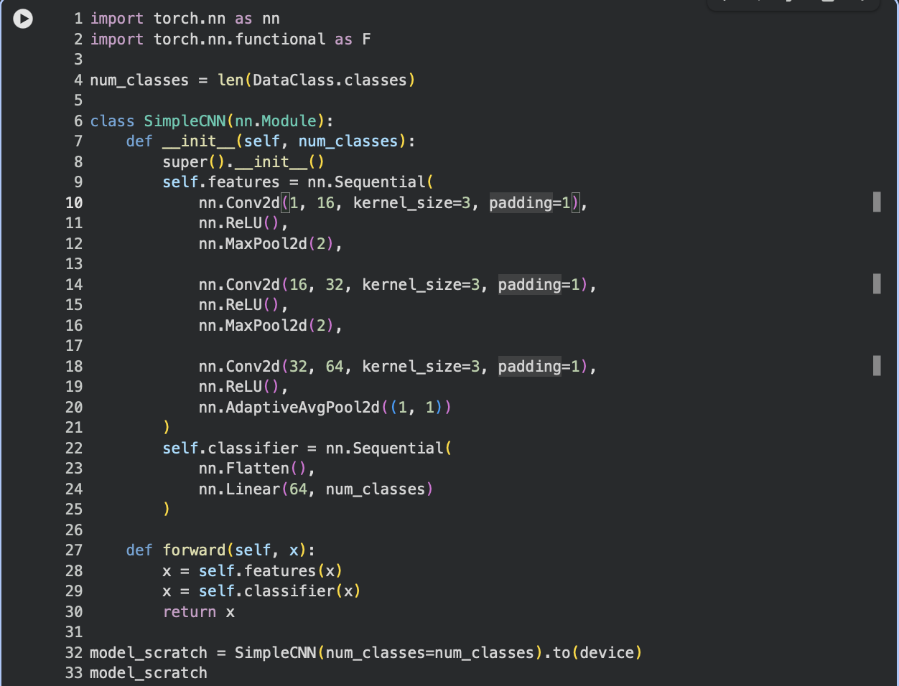

### ¿Por qué es importante utilizarlo?

La línea:

```python
nn.Conv2d(1, 16, kernel_size=3, padding=1)
```

es importante porque crea una capa convolucional que utiliza 16 filtros de 3 × 3 para detectar características en la imagen.

Posteriormente:

```python
nn.ReLU()
```

aplica una función de activación que permite introducir no linealidad en la red.

Y:

```python
nn.MaxPool2d(2)
```

reduce el tamaño de la información conservando las características más relevantes.

Finalmente, el modelo utiliza:

```python
nn.Linear(64, num_classes)
```

para realizar la clasificación de las imágenes.

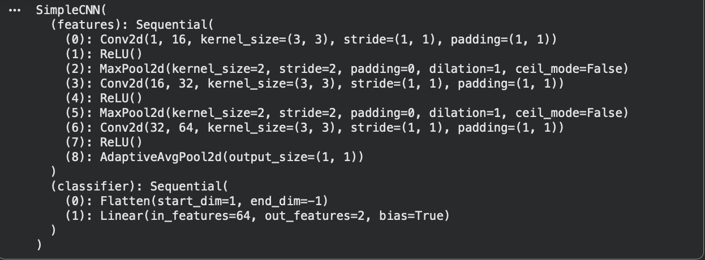

## 2. Interpretación de imágenes — Grad-CAM

### ¿Qué hemos aprendido?

En el Colab también aprendimos una técnica de interpretación llamada Grad-CAM.

Grad-CAM genera un mapa de calor sobre una imagen para mostrar las regiones que tuvieron mayor influencia en la predicción realizada por la red neuronal.

La función desarrollada en el Colab fue:

```python
def grad_cam(model, image_tensor, target_class=None):
```

Y una de las líneas principales para obtener el resultado fue:

```python
cam, pred_class = grad_cam(resnet, x)
```

Después se realizó la visualización:

```python
plt.imshow(img, cmap="gray")
```

```python
plt.imshow(cam, alpha=0.5)
```

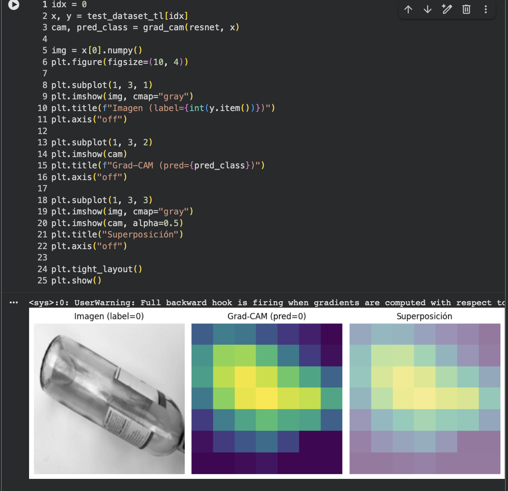

Según lo trabajado en el Colab, las zonas más claras o amarillas representan una mayor importancia para la predicción, mientras que las zonas oscuras o moradas representan una menor contribución.

### ¿Por qué es importante utilizarlo?

Porque permite interpretar una predicción de la CNN.

En lugar de obtener solamente una clasificación, podemos observar qué regiones de la imagen fueron relevantes para que el modelo tomara esa decisión.

## 3. Keras

### ¿Qué hemos aprendido?

En el Colab trabajamos Keras para construir una red neuronal mediante una estructura Sequential.

```python
model3 = models.Sequential()
```

Después se agregaron las capas:

```python
model3.add(layers.Dense(
```

16,

activation='relu',

input_shape=(10000,),

kernel_regularizer=regularizers.l2(0.001)

))

Luego:

```python
model3.add(layers.Dense(
```

16,

activation='relu',

kernel_regularizer=regularizers.l2(0.001)

))

Y finalmente:

```python
model3.add(layers.Dense(1, activation='sigmoid'))
```

El modelo fue configurado mediante:

```python
model3.compile(
```

optimizer='rmsprop',

loss='binary_crossentropy',

metrics=['accuracy']

)

Y entrenado con:

```python
modelb3 = model3.fit(
```

partial_x_train,

partial_y_train,

epochs=20,

batch_size=512,

validation_data=(x_val,y_val)

)

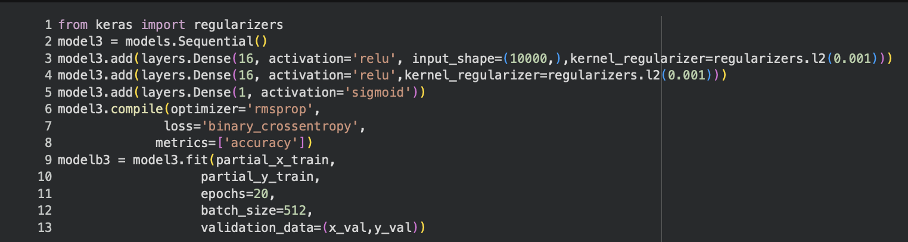

### ¿Por qué es importante utilizarlo?

Keras facilita la construcción, configuración y entrenamiento de redes neuronales.

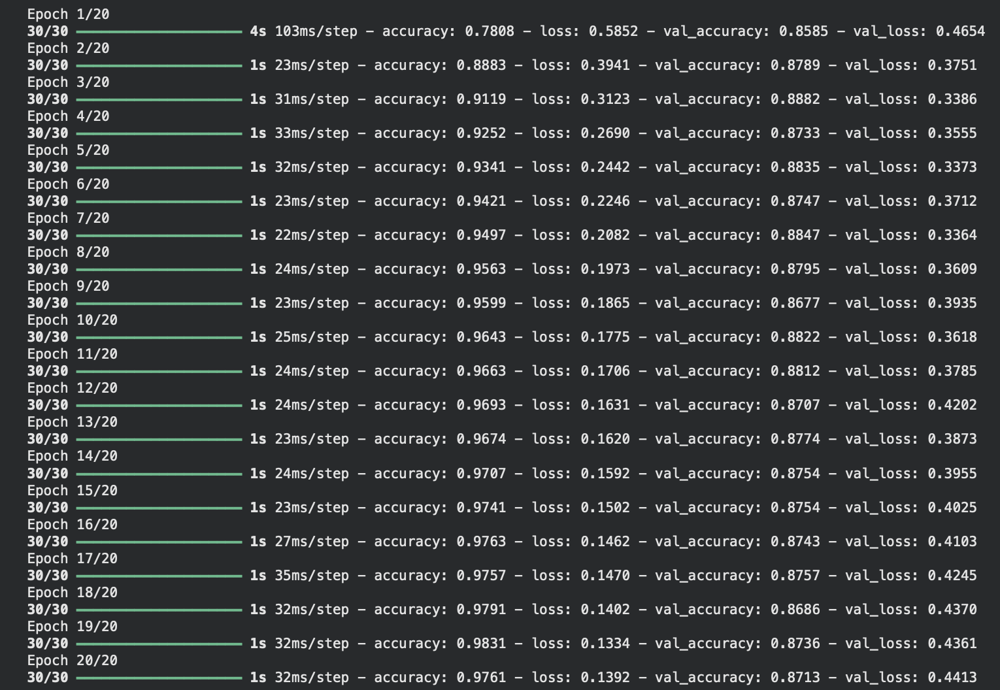

Tambien trabajamos conceptos relacionados con:

Capas densas: Son capas donde cada neurona está conectada con todas las neuronas de la capa anterior. Se utilizan para procesar la información y obtener la salida final.

Funciones de activación: Determinan cómo una neurona transforma su entrada. En el Colab se utilizó principalmente ReLU en las capas internas y sigmoid en la salida para obtener una clasificación binaria.

Entrenamiento: Es el proceso en el que la red aprende a partir de los datos de entrenamiento, ajustando sus pesos para mejorar sus predicciones.

Validación: Se utilizan datos que no participan directamente en el aprendizaje para comprobar cómo está funcionando el modelo durante el entrenamiento.

Accuracy: Indica el porcentaje de predicciones que el modelo clasificó correctamente.

Función de pérdida: Mide qué tan diferentes son las predicciones del modelo respecto a los valores reales. El modelo utiliza esta medida para ajustar sus parámetros durante el entrenamiento.

Regularización: Es una técnica para evitar que el modelo aprenda demasiado los datos de entrenamiento y tenga un mal desempeño con datos nuevos. En el Colab se utilizó L2, por ejemplo con kernel_regularizer=regularizers.l2(0.001).\

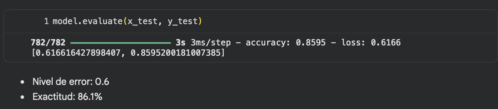

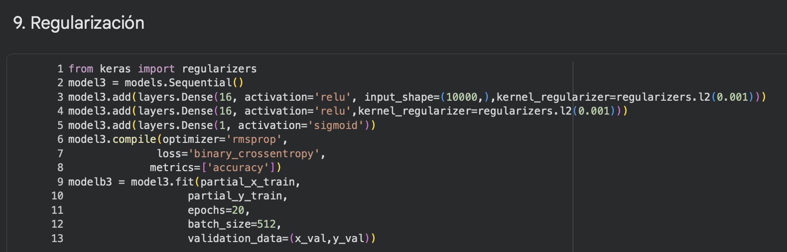

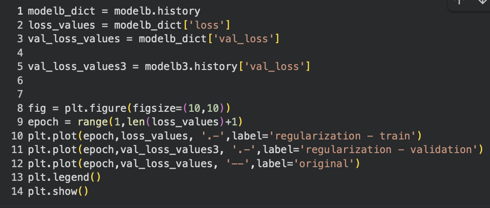

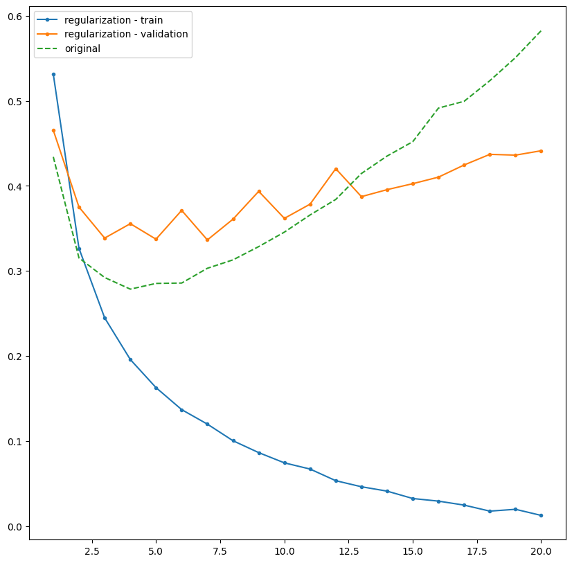

El gráfico muestra la evolución de la función de pérdida durante el entrenamiento y la validación. Se comparan los resultados del modelo original con el modelo que utiliza regularización. La regularización busca reducir el sobreajuste, por lo que observamos principalmente el comportamiento de las curvas de validación. Si la pérdida de validación se mantiene cercana a la de entrenamiento y disminuye progresivamente, el modelo presenta una mejor generalización. En cambio, si la pérdida de entrenamiento continúa disminuyendo mientras la de validación aumenta, existe sobreajuste.

## 4. Perceptrón

### ¿Qué hemos aprendido?

Aprendimos el funcionamiento básico de una neurona artificial mediante un perceptrón.

Se definió una función de activación escalón:

```python
def step_function(x):
```

```python
return 1 if x >= 0 else 0
```

También se trabajó con una función tanh:

```python
def tanh_activation(x):
```

```python
return np.tanh(x)
```

La función principal del perceptrón fue:

```python
def perceptron(inputs, weights, bias, activation_func):
```

```python
weighted_sum = np.dot(inputs, weights) + bias
```

```python
output = activation_func(weighted_sum)
```

```python
return output
```

La línea fundamental es:

```python
weighted_sum = np.dot(inputs, weights) + bias
```

Esta realiza la suma ponderada de las entradas y agrega el bias.

Después:

```python
output = activation_func(weighted_sum)
```

aplica la función de activación para obtener la salida.

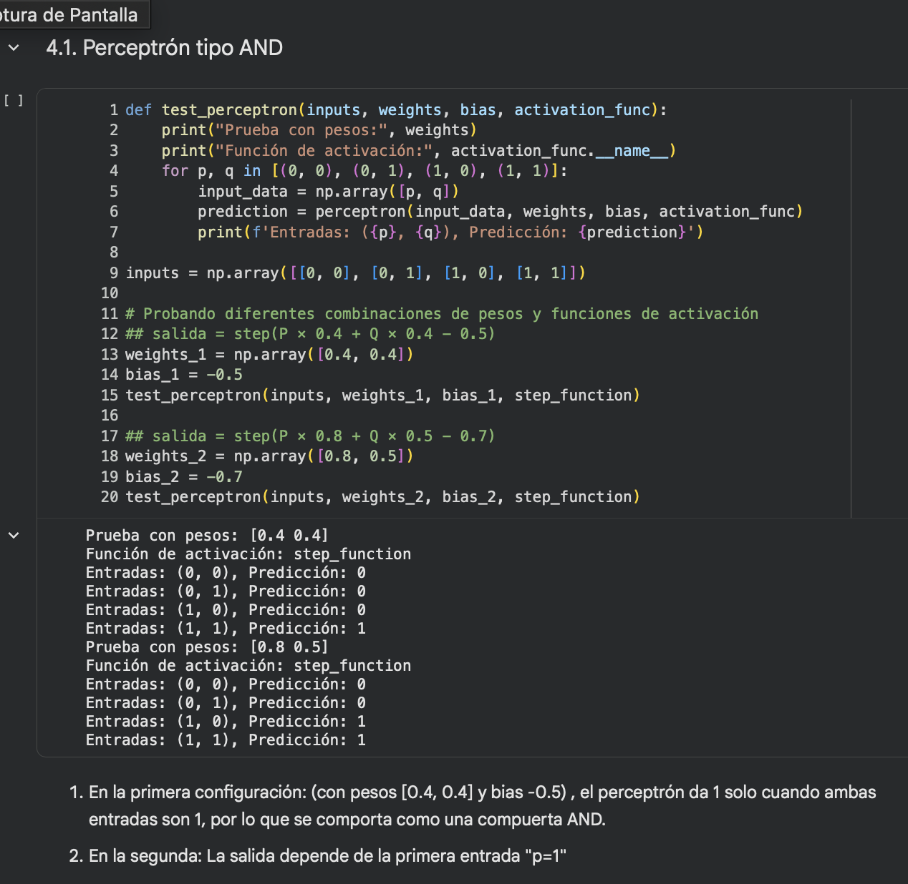

También comprobamos el comportamiento del perceptrón con las compuertas:

AND.

OR.

XOR.

En el caso de XOR aprendimos que:

Un solo perceptrón no puede resolver XOR; se necesitan múltiples perceptrones organizados en capas.

### ¿Por qué es importante utilizarlo?

Utilizamos el perceptrón porque nos permite comprender el funcionamiento básico de una neurona artificial y cómo una red neuronal puede tomar una decisión a partir de diferentes entradas. En el Colab, el perceptrón recibe valores de entrada, los multiplica por sus respectivos pesos, suma un bias y posteriormente aplica una función de activación para obtener una salida. Esto nos permite entender de forma sencilla cómo los datos pueden transformarse en una clasificación, como ocurre con las compuertas AND, OR y XOR que se trabajaron en el ejercicio. Además, sirve como base para comprender modelos más complejos, ya que las redes neuronales están formadas por muchas neuronas conectadas entre sí.

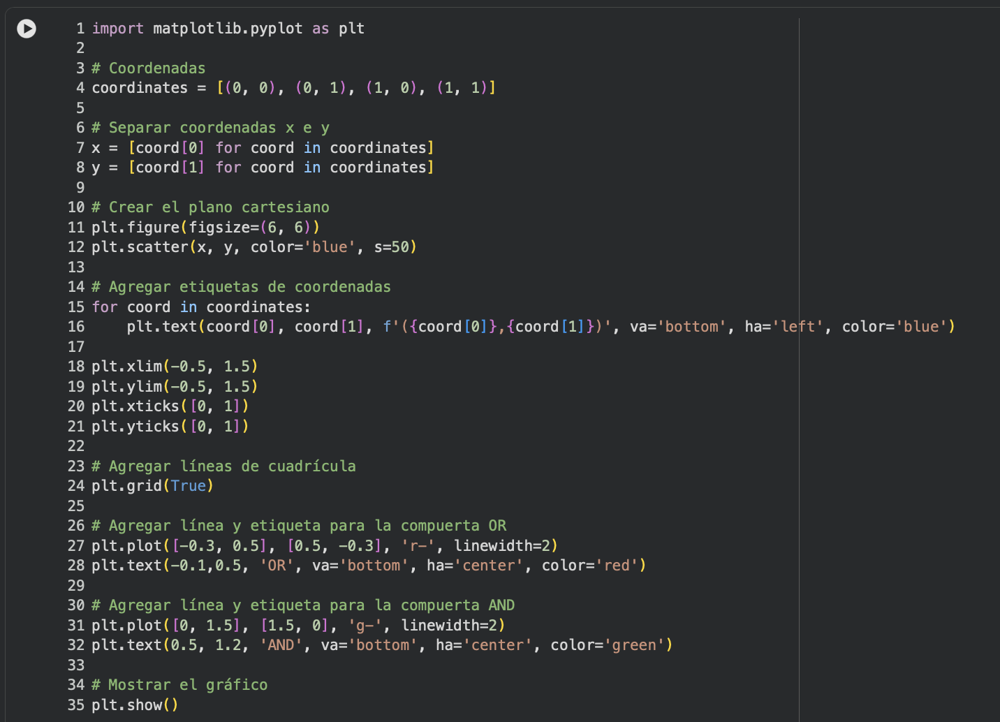

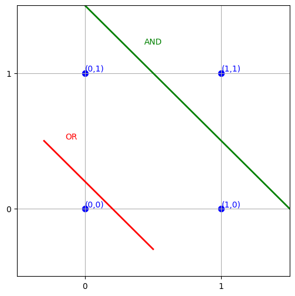

Este gráfico representa las cuatro combinaciones posibles de dos entradas binarias. Cada punto corresponde a una combinación de A y B. Las líneas representan fronteras de decisión para las compuertas OR y AND. En OR, solamente la combinación (0,0) produce una salida 0, mientras que las demás producen 1. En AND ocurre lo contrario: únicamente (1,1) produce 1. Por eso ambas compuertas pueden separarse mediante una línea recta y se consideran problemas linealmente separables.

## 5. Aplicación en GREENPLANT

### Proyecto GREENPLANT

GREENPLANT es un prototipo experimental orientado al monitoreo del cultivo de papa mediante sensores y adquisición de datos.

El sistema contará con una cámara experimental cerrada donde se colocará una planta joven de papa junto con su sustrato.

Dentro de la cámara se realizarán mediciones controladas de diferentes variables.

### Variables que se pueden registrar

NH₃.

CO₂.

Temperatura ambiental.

Humedad ambiental.

Temperatura del suelo.

Humedad del suelo.

Iluminación.

Tiempo de experimentación.

Los datos serán almacenados para posteriormente analizarlos, compararlos e identificar variaciones y posibles relaciones entre las variables registradas.

### ¿Cómo utilizaríamos lo aprendido en GREENPLANT?

```python
CNN
```

La CNN podría utilizarse para analizar las imágenes de la planta de papa obtenidas mediante la cámara.

Por ejemplo:

Cámara

↓

Imagen de la planta

↓

```python
CNN
```

↓

Clasificación de la imagen

La CNN podría entrenarse posteriormente con imágenes obtenidas durante los experimentos para identificar diferentes condiciones visuales de la planta.

```python
Grad-CAM
```

Grad-CAM podría utilizarse para interpretar las predicciones de la CNN.

Por ejemplo:

Imagen de la planta

↓

```python
CNN
```

↓

Predicción

↓

```python
Grad-CAM
```

↓

Mapa de las regiones importantes

Esto permitiría observar qué zonas de la planta tuvieron mayor influencia en la predicción.

```python
Keras
```

Keras podría utilizarse posteriormente para construir una red neuronal que trabaje con los datos numéricos obtenidos de los sensores.

Por ejemplo:

NH₃

CO₂

Temperatura

Humedad

Temperatura del suelo

Humedad del suelo

Iluminación

↓

Red neuronal

↓

Análisis / clasificación

De esta manera, la información de los sensores podría utilizarse como entrada para un modelo de aprendizaje automático.

```python
Perceptrón
```

El perceptrón podría utilizarse para realizar una clasificación sencilla basada en los valores de los sensores.

Por ejemplo:

Datos de sensores

↓

```python
Perceptrón
```

↓

Resultado

Podría establecerse experimentalmente una salida como:

0 → Condición dentro del rango establecido

1 → Condición que requiere atención

Los pesos y el bias tendrían que obtenerse mediante entrenamiento con datos experimentales o definirse mediante reglas justificadas.


