# TALLER 05 — Redes Neuronales

> **Facultad:** Ciencias e Ingeniería  
> **Curso:** Proyecto Integrador  
> **Docentes:** Umbert Lewis · Vanessa Stefanny · Renzo Chan · Maria Rejas · Cesar Milla  
> **Año:** 2026

---

## Contenido

- [1. Redes Neuronales Convolucionales (CNN)](#1-redes-neuronales-convolucionales-cnn)
- [2. Clasificación binaria con Keras](#2-clasificación-binaria-con-keras)
- [3. Perceptrón](#3-perceptrón)
- [4. Comparación de los métodos estudiados](#4-comparación-de-los-métodos-estudiados)
- [5. Conclusiones](#5-conclusiones)
- [6. Referencias](#6-referencias)

---

FACULTAD DE CIENCIAS E INGENIERÍA

CURSO:

PROYECTO INTEGRADOR

TALLER 05 - Redes Neuronales

DOCENTES:

Umbert Lewis

Vanessa Stefanny

Renzo Chan

Maria Rejas

Cesar Milla

2026

## 1. Redes Neuronales Convolucionales (CNN)

Una CNN es una red neuronal especialmente útil para trabajar con imágenes. En el cuaderno se explica que analiza los píxeles cercanos mediante filtros o kernels capaces de detectar patrones. Sus componentes principales son las capas de convolución, las funciones de activación ReLU, las capas de pooling y las capas densas utilizadas para producir la clasificación final. [1]

1.1. ¿Qué aprendí de la CNN?

Una imagen puede procesarse por etapas: primero se extraen características y después se realiza la clasificación.

Las capas Conv2D aprenden patrones visuales, mientras que MaxPool reduce el tamaño de la representación y conserva información relevante.

El entrenamiento se evalúa con métricas como accuracy y ROC-AUC; no basta con observar solamente la pérdida de entrenamiento.

El aumento de datos (data augmentation) modifica las imágenes de entrenamiento para mejorar la capacidad de generalización.

El transfer learning permite reutilizar un modelo ya entrenado. En el cuaderno, ResNet18 obtuvo un rendimiento claramente mayor que la CNN entrenada desde cero.

1.2. Códigos más importantes del cuaderno

Código 1. Creación de los conjuntos de entrenamiento, validación y prueba (celda 16)

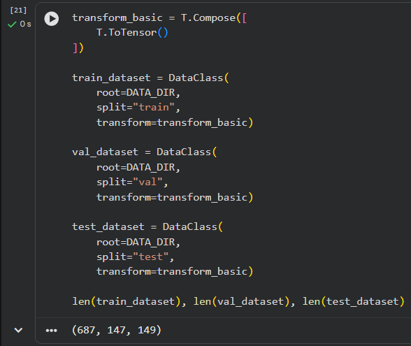

> **Interpretación: El cuaderno crea tres objetos del dataset usando los valores split="train", split="val" y split="test". La transformación básica convierte las imágenes a tensores para que puedan ser utilizadas por PyTorch. La lógica interna de cómo se realiza la partición pertenece a trash_dataset.py y, por indicación, no se incluye en este informe.**

Código 2. Arquitectura de la CNN SimpleCNN (celda 24)

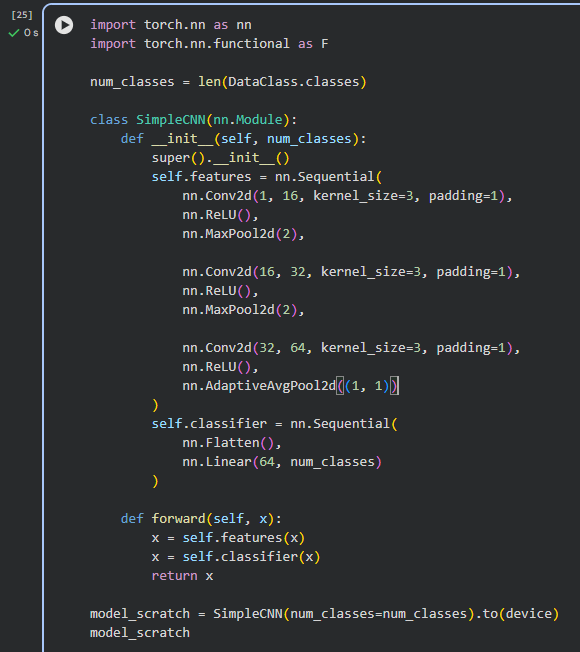

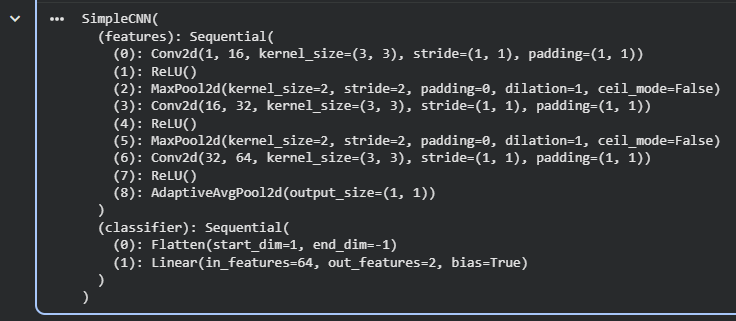

> **Interpretación: Esta es la arquitectura principal de la CNN entrenada desde cero. Utiliza tres convoluciones, activaciones ReLU y pooling. Al final, AdaptiveAvgPool2d reduce las características a una representación compacta y la capa Linear produce la clasificación entre las clases disponibles.**

Código 3. Entrenamiento de la CNN desde cero (celda 28)

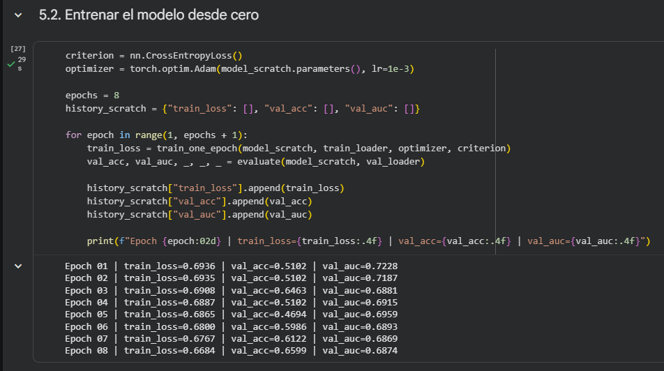

> **Interpretación: Se define CrossEntropyLoss como función de pérdida y Adam como optimizador. Durante ocho épocas se entrena el modelo y, al finalizar cada época, se calculan accuracy y ROC-AUC en validación. Esto permite observar si el modelo mejora y si generaliza a datos no usados directamente para ajustar sus pesos.**

Código 4. Aumento de datos o data augmentation (celda 36)

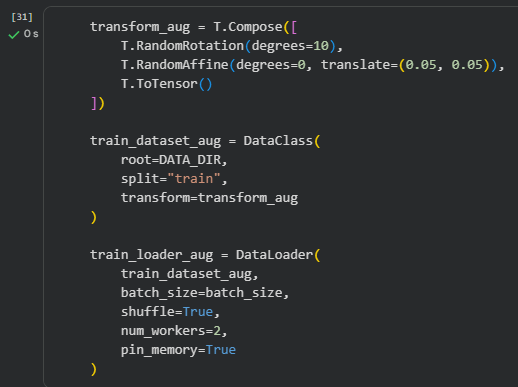

> **Interpretación: Se aplican rotaciones aleatorias y pequeños desplazamientos a las imágenes del conjunto de entrenamiento. La finalidad es presentar variaciones de una misma clase sin modificar manualmente el dataset original.**

Código 5. Transfer learning con ResNet18 (celda 43)

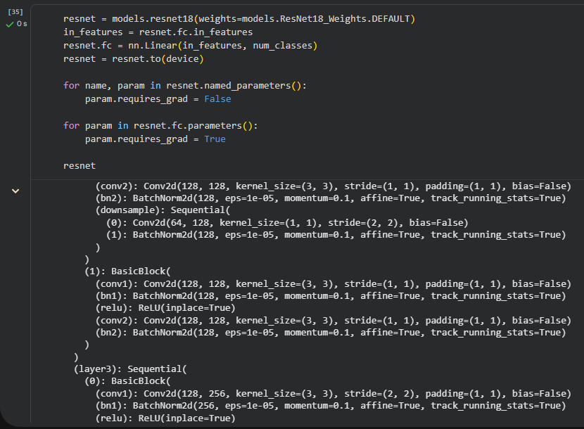

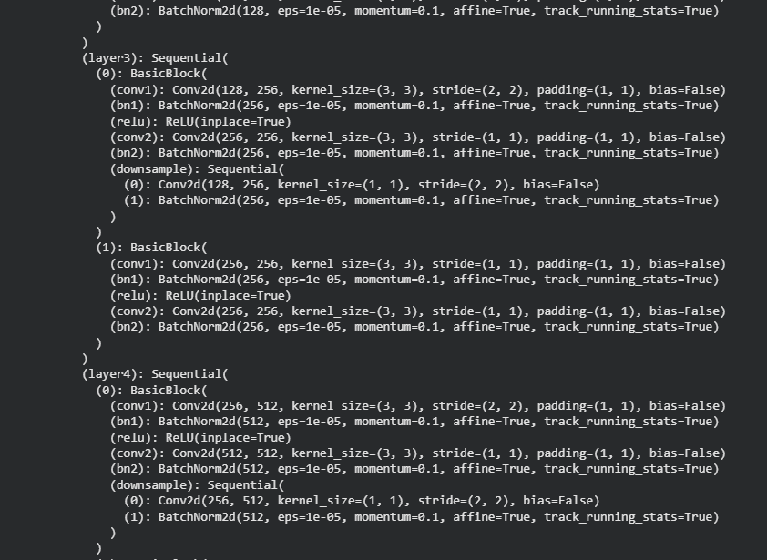

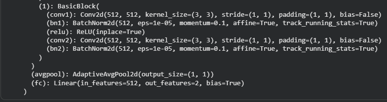

> **Interpretación: El modelo ResNet18 se carga con pesos preentrenados. Se reemplaza la capa final para adaptarla al número de clases del problema y, en una primera etapa, se congelan los parámetros del extractor de características para entrenar solamente la capa final.**

Código 6. Resumen comparativo de resultados (celda 52)

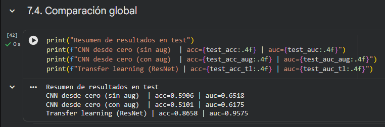

> **Interpretación: Este fragmento compara las tres estrategias evaluadas en el cuaderno: CNN desde cero, CNN con augmentation y transfer learning con ResNet. De acuerdo con la salida obtenida, el transfer learning alcanzó el mejor resultado.**

1.3. Gráficas obtenidas

#### 1.3.1 Curvas de entrenamiento

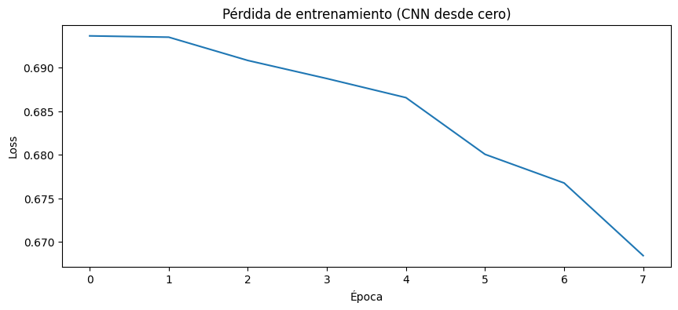

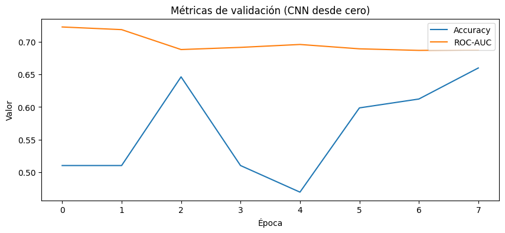

> **Interpretación: Se observa que, a medida que avanzan las épocas, la pérdida disminuye y la exactitud de validación mejora, lo que indica que la CNN está aprendiendo progresivamente a diferenciar las imágenes de glass y plastic. Sin embargo, el ROC-AUC se mantiene en valores moderados, por lo que el modelo todavía presenta limitaciones para clasificar ambas clases con alta precisión.**

1.3.2. Matriz de confusión

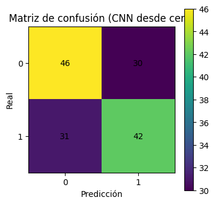

> **Interpretación: La matriz de confusión muestra que la CNN clasificó correctamente 46 imágenes de la clase 0 y 42 de la clase 1, pero confundió 30 imágenes de la clase 0 como clase 1 y 31 de la clase 1 como clase 0. Esto indica que el modelo logra distinguir ambas clases, aunque todavía presenta una cantidad considerable de errores y un desempeño moderado en la clasificación.**

## 2. Clasificación binaria con Keras

Keras permite construir y entrenar redes neuronales con una sintaxis más directa. En el cuaderno se utiliza para clasificar reseñas de películas del dataset IMDB en dos categorías: negativas (0) o positivas (1). El ejemplo permite observar todo el flujo de una red densa: preparación de los datos, construcción de capas, compilación, entrenamiento, validación, evaluación y predicción. [2]

2.1. ¿Qué aprendí de Keras?

Keras facilita la construcción de modelos mediante Sequential y capas Dense.

Antes del entrenamiento, los datos deben transformarse a una representación numérica que la red pueda procesar.

La función sigmoid es adecuada para producir una salida entre 0 y 1 en una clasificación binaria.

El conjunto de validación permite detectar sobreajuste al comparar la pérdida de entrenamiento con la pérdida de validación.

La regularización y Dropout son estrategias utilizadas en el cuaderno para intentar reducir el sobreajuste.

2.2. Códigos más importantes del cuaderno

Código 7. Carga del dataset IMDB (celda 66)

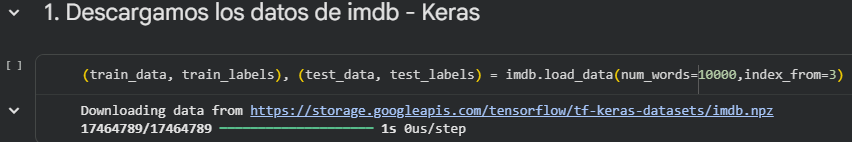

> **Interpretación: Se cargan datos de entrenamiento y prueba, limitando el vocabulario a las 10 000 palabras más frecuentes. Las etiquetas indican si la reseña es negativa o positiva.**

Código 8. Vectorización de las reseñas (celda 75)

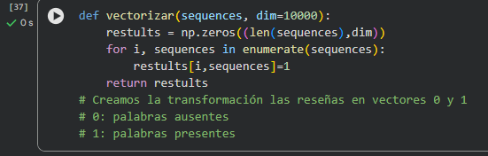

> **Interpretación: La función transforma cada reseña en un vector de 10 000 posiciones. Un valor 1 representa la presencia de una palabra y un valor 0 representa su ausencia, creando así una entrada numérica compatible con la red neuronal.**

Código 9. Arquitectura del modelo en Keras (celda 80)

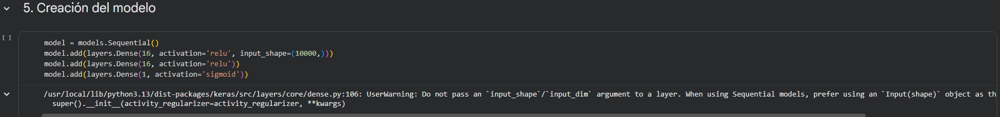

> **Interpretación: La red contiene dos capas ocultas de 16 neuronas con ReLU y una capa final de una neurona con sigmoid. La salida final puede interpretarse como una probabilidad para la clasificación binaria.**

Código 10. Compilación y configuración del aprendizaje (celda 82)

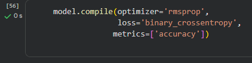

> **Interpretación: El modelo utiliza rmsprop como optimizador, binary_crossentropy como función de pérdida y accuracy como métrica. Esta configuración corresponde al problema binario trabajado en el cuaderno.**

Código 11. Entrenamiento del modelo (celda 84)

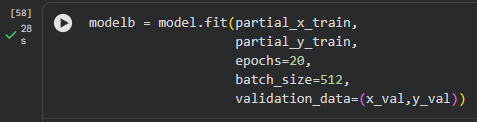

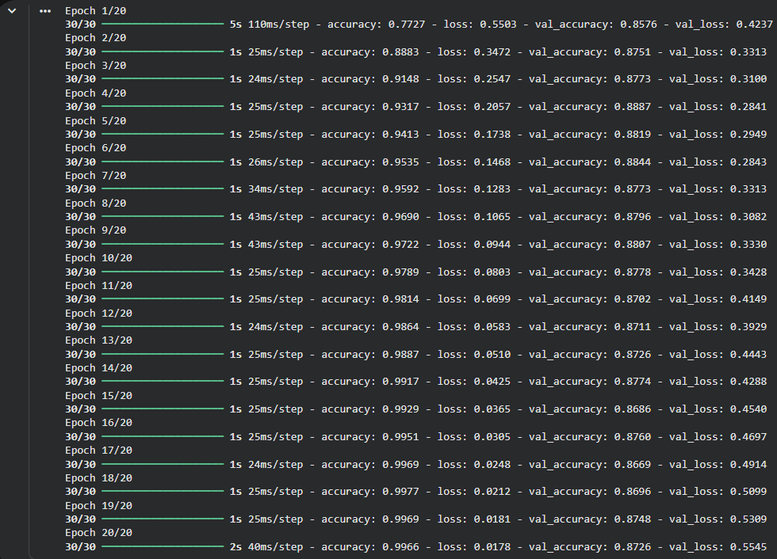

> **Interpretación: El entrenamiento se realiza durante 20 épocas con lotes de 512 observaciones. Además, se entrega un conjunto de validación para comparar el rendimiento durante el aprendizaje y observar la aparición de sobreajuste.**

Código 12. Dropout para reducir sobreajuste (celda 100)

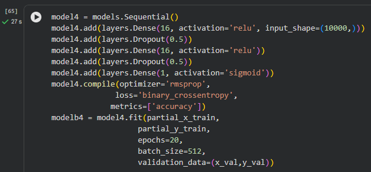

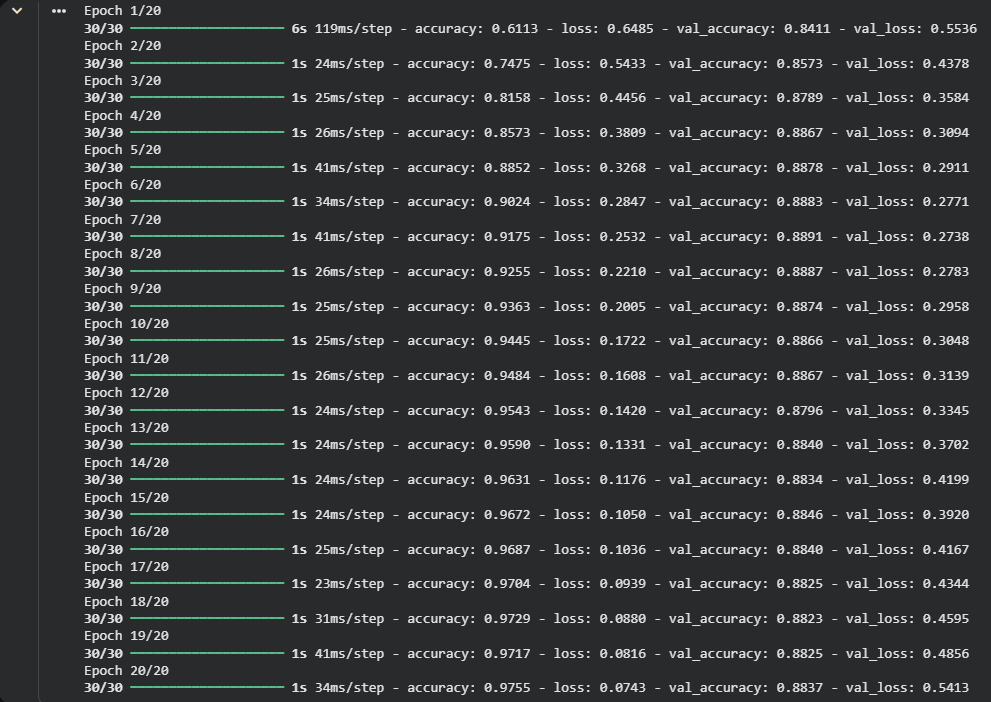

> **Interpretación: El cuaderno incorpora Dropout(0.5) después de las capas densas. Durante el entrenamiento se desactiva aleatoriamente una parte de las neuronas, lo cual obliga al modelo a aprender utilizando diferentes combinaciones de unidades.**

Código 13. Evaluación del modelo (celda 88)

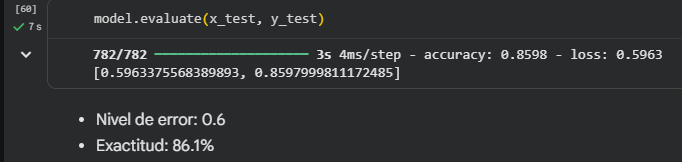

> **Interpretación: Esta instrucción evalúa el modelo con el conjunto de prueba. La salida registrada en el cuaderno fue una pérdida aproximada de 0.6056 y una accuracy aproximada de 0.8611, equivalente a 86.11 %.**

2.3. Gráficos obtenidos

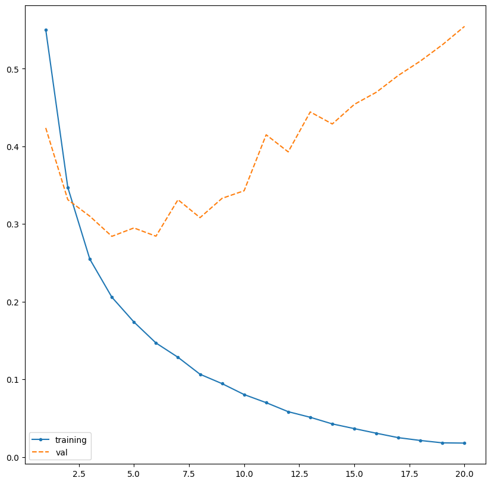

2.3.1. Curvas de pérdida durante el entrenamiento y validación

> **Interpretación: Se observa que la pérdida de entrenamiento disminuye de forma continua hasta valores muy bajos, mientras que la pérdida de validación disminuye solo al inicio y luego comienza a aumentar. Esto indica que el modelo aprende muy bien los datos de entrenamiento, pero después de aproximadamente 4 a 6 épocas empieza a presentar sobreajuste (overfitting), ya que pierde capacidad para generalizar correctamente con datos nuevos.**

2.3.2. Curvas de pérdida en validación para arquitecturas de diferente capacidad

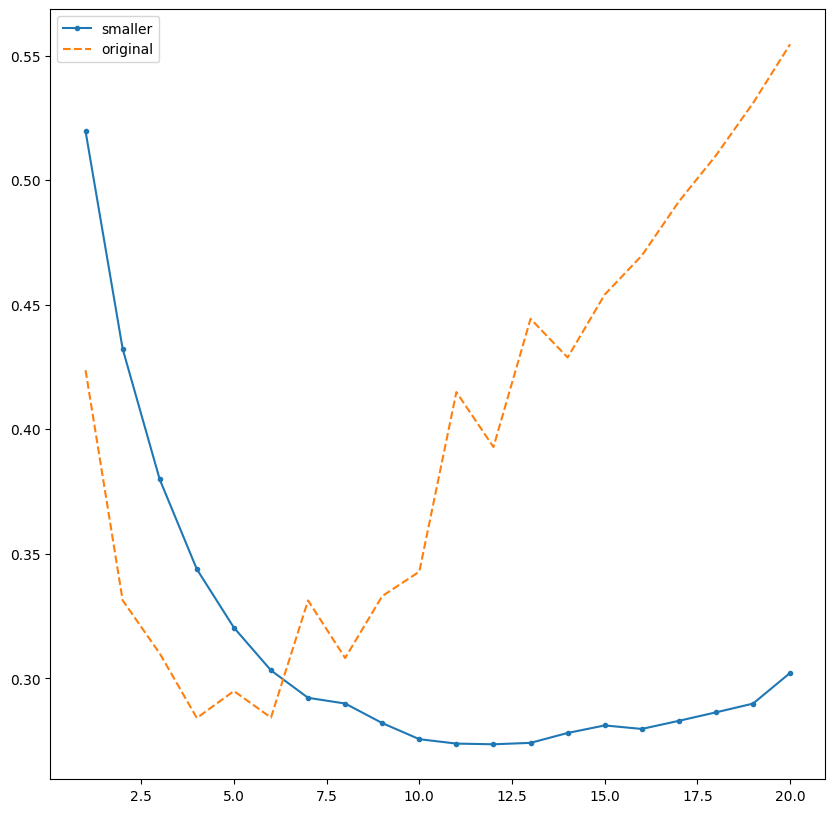

> **Interpretación: El gráfico compara la pérdida de validación a lo largo de 20 épocas entre el modelo base (original) y una versión de menor capacidad. En las curvas se observa que el modelo original empieza a sobreajustarse tempranamente a partir de la época 4 o 6, punto en el que su error se dispara de forma pronunciada. Por el contrario, el modelo reducido (smaller) mantiene una curva de pérdida mucho más estable, alcanzando un mínimo global más bajo y retrasando el sobreajuste hasta aproximadamente la época 12 o 13, lo que demuestra que reducir la complejidad de la arquitectura ayuda a regularizar la red y mejora su capacidad de generalización sobre el conjunto de datos.**

2.3.3. Comparativa de convergencia y generalización: Modelo regularizado vs. Modelo original

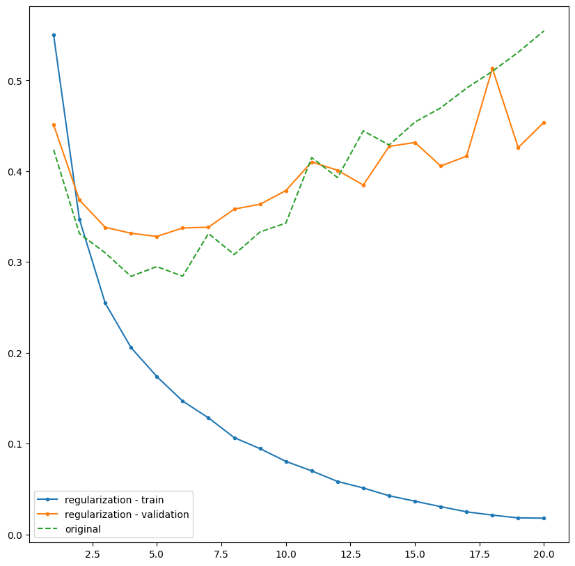

> **Interpretación: La gráfica ilustra el efecto de la regularización en la función de pérdida a lo largo de 20 épocas. Mientras que la pérdida de entrenamiento (regularization - train) decrece de forma continua hasta valores cercanos a cero, la pérdida de validación (regularization - validation) alcanza su punto óptimo en torno a la época 5 (~0.33) para luego comenzar a ascender, lo que evidencia el inicio del sobreajuste (overfitting). No obstante, al contrastar esta curva con la del modelo base sin regularizar (original), se aprecia que la regularización logra ralentizar la degradación del rendimiento en las épocas avanzadas, manteniendo el error de validación predominantemente por debajo del modelo original (que supera 0.55 al final). Esto confirma que, si bien la técnica atenúa el sobreajuste al penalizar la complejidad del modelo, resulta necesario aplicar estrategias complementarias como la detención temprana (early stopping) cerca de la época 5 para conservar el mejor punto de generalización.**

2.3.4. Comparación de la pérdida de validación entre el modelo con Dropout y el modelo base

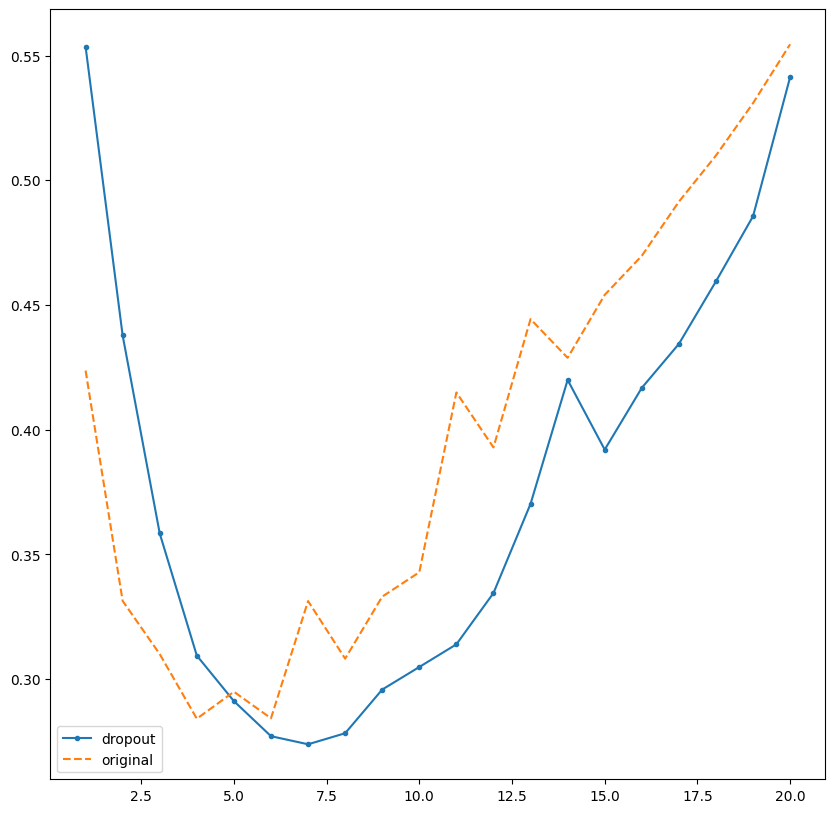

> **Interpretación: El gráfico compara la pérdida de validación a lo largo de 20 épocas entre la arquitectura base (original) y la versión implementada con dropout. Se aprecia que la inclusión de capas de dropout retrasa eficazmente la aparición del sobreajuste, logrando un mínimo de pérdida más profundo y sostenido alrededor de las épocas 6 a 8 (~0.27), en contraste con el modelo original que empieza a degradarse de forma abrupta a partir de la época 6. Aunque a partir de la época 9 el modelo con dropout también comienza a incrementar su error debido a la acumulación de iteraciones, mantiene valores de pérdida predominantemente inferiores a los de la red original durante la mayor parte del entrenamiento. Esto demuestra que la desactivación aleatoria de neuronas actúa como un regularizador eficaz que mejora la capacidad de generalización en las etapas intermedias, requiriéndose una parada temprana cerca de la época 7 u 8 para aprovechar su rendimiento óptimo.**

## 3. Perceptrón

El Perceptrón es un modelo sencillo de inteligencia artificial que recibe varias entradas, las combina mediante pesos y un sesgo, calcula una suma ponderada y la transforma mediante una función de activación. En el cuaderno se utiliza un ejemplo con temperatura y vibración para decidir si existe una alerta de sobrecalentamiento. [3]

3.1. ¿Qué aprendí del Perceptrón?

Cada variable de entrada tiene un peso que determina su influencia sobre la salida.

El bias o sesgo desplaza el punto a partir del cual el modelo cambia de decisión.

La función de activación transforma la suma ponderada en la salida de la neurona.

Con una función escalón, el Perceptrón puede producir decisiones binarias como 0 o 1.

Un solo Perceptrón puede representar problemas linealmente separables como AND u OR, pero el cuaderno muestra que XOR requiere más de una neurona o una capa adicional.

3.2. Códigos más importantes del cuaderno

Código 14. Funciones de activación y función del Perceptrón (celda 110)

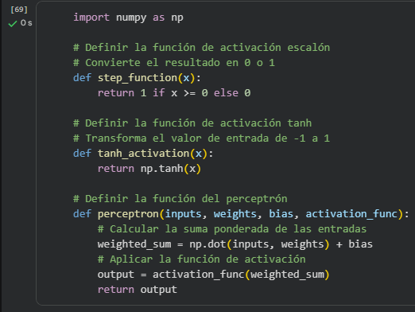

> **Interpretación: La función perceptron calcula np.dot(inputs, weights) + bias y luego aplica la función de activación elegida. El ejemplo permite comparar una decisión binaria con step_function y una salida continua entre -1 y 1 con tanh.**

Código 15. Entradas de temperatura y vibración (celda 112)

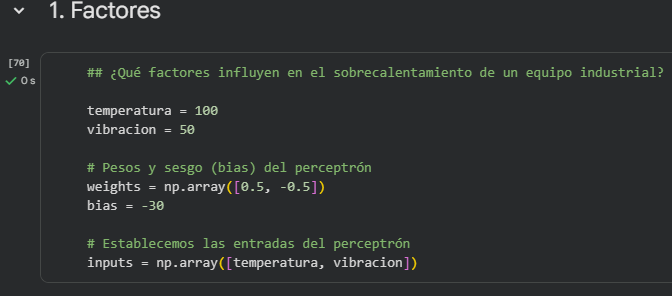

> **Interpretación: Se definen dos variables de entrada, sus pesos y el sesgo. Este ejemplo es especialmente útil para comprender cómo una neurona artificial podría recibir datos provenientes de sensores.**

Código 16. Aplicación de dos funciones de activación (celda 114)

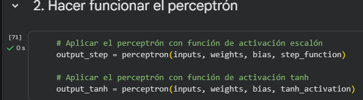

> **Interpretación: Las mismas entradas y pesos se procesan con dos funciones de activación diferentes. Esto permite observar cómo la función de activación modifica la forma de interpretar el resultado de la suma ponderada.**

Código 17. Prueba de configuraciones tipo AND (celda 121)

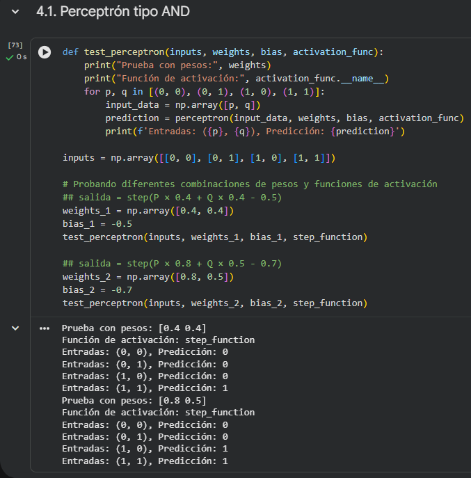

> **Interpretación: El cuaderno prueba diferentes pesos y sesgos con combinaciones binarias. La primera configuración produce una salida 1 únicamente cuando ambas entradas son 1, por lo que reproduce el comportamiento de una compuerta AND.**

Código 18. Configuración tipo OR (celda 124)

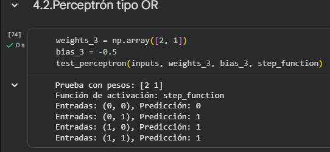

> **Interpretación: Con los pesos [2, 1] y bias -0.5, la salida es 1 cuando al menos una de las entradas vale 1. Esto muestra cómo el cambio de pesos y sesgo modifica la frontera de decisión del Perceptrón.**

3.3. Gráficos obtenidos

3.3.1. Representación en el espacio de características de los hiperplanos de decisión para funciones lógicas AND y OR

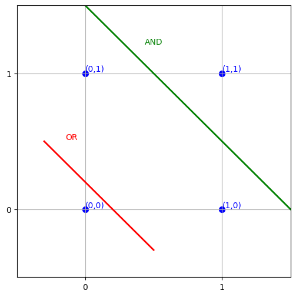

> **Interpretación: La figura representa el espacio de entradas bidimensional correspondientes a las combinaciones booleanas (0,0), (0,1), (1,0) y (1,1). Se ilustra la capacidad de un perceptrón simple para resolver problemas linealmente separables mediante la definición de hiperplanos o líneas de decisión. La línea roja delimita la función lógica OR, separando el punto (0,0) (salida 0) de las tres combinaciones restantes que activan la salida (valor 1). Por su parte, la línea verde corresponde a la compuerta AND, aislando de manera exclusiva al punto (1,1) (único con salida 1) del resto de los pares de entrada. Este comportamiento gráfico evidencia que ambas funciones pueden ser aprendidas directamente por una sola neurona artificial, al existir fronteras lineales capaces de clasificar correctamente ambas clases sin requerir capas ocultas.**

3.3.2. Fronteras de decisión lineales combinadas para la clasificación de la función lógica XOR

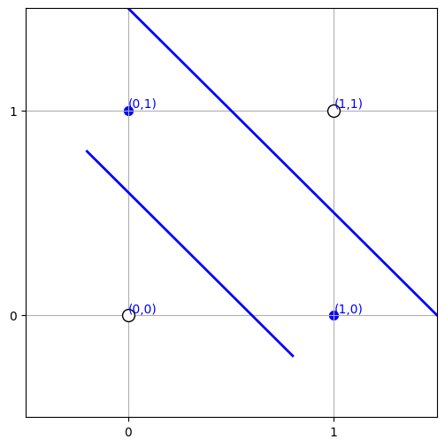

> **Interpretación: La figura expone la clásica limitación del perceptrón simple ante problemas no linealmente separables, ejemplificado mediante la compuerta lógica XOR. En este espacio, las entradas con salida positiva o clase 1 correspondientes a (0,1) y (1,0) (puntos rellenos) se encuentran dispuestas de forma diagonal frente a las salidas 0 correspondientes a (0,0) y (1,1) (círculos vacíos). Debido a esta distribución, resulta imposible separarlas con una única línea recta o hiperplano de decisión. Para clasificar correctamente ambas clases, se requiere trazar dos fronteras lineales independientes (líneas azules) que aíslen la región intermedia, lo que demuestra conceptualmente la necesidad de incorporar capas ocultas y emplear un perceptrón multicapa (Multilayer Perceptron o MLP) para resolver patrones no lineales.**

## 4. Comparación de los métodos estudiados

### ¿Cuál usaría en mi proyecto?

Para el enfoque actual de GREENPLANT, usaríamos principalmente Keras para construir una red neuronal densa orientada a datos de sensores. A diferencia del ejemplo IMDB del cuaderno, las entradas del proyecto serían variables numéricas como NH₃, CO₂, temperatura, humedad e iluminación. Keras permite definir con facilidad varias capas, entrenar el modelo y evaluar su desempeño, por lo que resulta adecuado si se desea aprender relaciones entre varias variables al mismo tiempo.

El Perceptrón también podría emplearse como punto de partida para una función sencilla de alerta, por ejemplo cuando una combinación de temperatura y concentración de gas supere una condición determinada. Sin embargo, al trabajar con varias variables y relaciones posiblemente no lineales, una red con varias neuronas construida en Keras ofrecería mayor flexibilidad.

La CNN tendría una aplicación complementaria si GREENPLANT incorpora posteriormente análisis de imágenes de la planta, por ejemplo para reconocer cambios visuales en hojas o crecimiento. Con la descripción actual del proyecto, las mediciones principales son numéricas, por lo que la CNN no sería el método principal para los datos de sensores.

## 5. Conclusiones

La CNN permitió comprender cómo una red extrae características de imágenes y cómo el transfer learning puede mejorar notablemente el rendimiento cuando se reutiliza un modelo preentrenado.

Keras mostró una forma más directa de construir redes neuronales, entrenarlas, validarlas y aplicar técnicas como regularización y Dropout frente al sobreajuste.

El Perceptrón permitió comprender el funcionamiento básico de una neurona artificial mediante entradas, pesos, bias y funciones de activación.

Para GREENPLANT, Keras es el enfoque con mejor correspondencia con el análisis futuro de múltiples variables numéricas de sensores; el Perceptrón puede servir para alertas simples y la CNN sería relevante si se incorporan imágenes.

## 6. Referencias

[1] I. Goodfellow, Y. Bengio and A. Courville, Deep Learning. Cambridge, MA, USA: MIT Press, 2016. [Online]. Available: https://www.deeplearningbook.org/

[2] Keras Team, “About Keras 3,” Keras Documentation. [Online]. Available: https://keras.io/getting_started/about/ [Accessed: Sep. 22, 2026].

[3] F. Rosenblatt, “The perceptron: A probabilistic model for information storage and organization in the brain,” Psychological Review, vol. 65, no. 6, pp. 386–408, 1958, doi: 10.1037/h0042519.

