# 🧠 Proyecto Integrador — Redes Neuronales

## ACTIVIDAD: REDES NEURONALES, CNN, KERAS Y PERCEPTRÓN

> **Informe académico**  
> **Proyecto Integrador**  
> **Fecha:** 22 de septiembre de 2026  
> **Lugar:** Lima, Perú

---

## Introducción

En la presente actividad se desarrollaron diferentes técnicas relacionadas con las redes neuronales artificiales y el aprendizaje automático, con el propósito de comprender cómo los modelos de inteligencia artificial pueden utilizar datos para realizar procesos de clasificación y predicción.

La práctica se dividió en tres partes principales. En primer lugar, se implementó una Red Neuronal Convolucional (CNN) utilizando PyTorch, aplicada a la clasificación de imágenes correspondientes a las categorías de vidrio y plástico mediante el conjunto de datos TrashNet. Para ello, se realizó la preparación de los datos, su división en conjuntos de entrenamiento, validación y prueba, la construcción de una CNN desde cero y posteriormente la aplicación de técnicas de aumento de datos y Transfer Learning con ResNet18. redes_neuronales_ss

En segundo lugar, se desarrolló un modelo de clasificación binaria utilizando Keras, empleando el conjunto de datos IMDB de reseñas de películas. En este caso, las reseñas fueron clasificadas como positivas o negativas mediante una red neuronal con capas densas. Además, se analizaron problemas de sobreajuste y se aplicaron técnicas de regularización L2 y Dropout para mejorar la capacidad de generalización del modelo. redes_neuronales_ss

Finalmente, se estudió el funcionamiento básico de un perceptrón, utilizando diferentes funciones de activación y ejemplos relacionados con la detección de sobrecalentamiento de un equipo industrial. También se analizaron las compuertas lógicas AND, OR y XOR para comprender las capacidades y limitaciones de una neurona artificial sencilla. redes_neuronales_ss(1)

Objetivos

### 2.1. Objetivo general

Comprender el funcionamiento y la aplicación de diferentes modelos de redes neuronales artificiales mediante la implementación de un perceptrón, una red neuronal para clasificación binaria y una red neuronal convolucional aplicada al reconocimiento de imágenes.

### 2.2. Objetivos específicos

Comprender el funcionamiento básico de una neurona artificial y del perceptrón.

Analizar el uso de diferentes funciones de activación.

Implementar una CNN para clasificar imágenes de vidrio y plástico.

Comprender las etapas de entrenamiento, validación y prueba de un modelo.

Evaluar un modelo mediante métricas como accuracy, ROC-AUC, precision, recall y F1-score.

Aplicar técnicas de Data Augmentation para generar variaciones de las imágenes de entrenamiento.

Comprender el funcionamiento del Transfer Learning mediante una arquitectura ResNet18.

Analizar el problema del sobreajuste en redes neuronales.

Aplicar técnicas de regularización L2 y Dropout.

Comprender el uso de Keras para construir redes neuronales de manera simplificada.

Analizar la utilidad de Grad-CAM para interpretar las predicciones de una CNN.

Desarrollo de la actividad

### 3.1. Perceptrón

El perceptrón constituye uno de los modelos más sencillos de una neurona artificial. Su funcionamiento consiste en recibir diferentes entradas, multiplicarlas por determinados pesos, agregar un término denominado bias o sesgo y posteriormente aplicar una función de activación para obtener una salida.

En la actividad se utilizó un ejemplo relacionado con el posible sobrecalentamiento de un equipo industrial, considerando como entradas la temperatura y la vibración del equipo. Se utilizaron pesos y un bias para calcular una suma ponderada y posteriormente determinar la salida mediante una función de activación.

El código implementado permite utilizar tanto una función de activación escalón como la función tanh. La función escalón permite obtener una salida binaria de 0 o 1, mientras que tanh transforma el resultado a un intervalo entre -1 y 1. redes_neuronales_ss(1)

### Análisis

A partir de esta parte pude comprender mejor cómo funciona un perceptrón en una situación práctica. En el ejemplo, la temperatura y la vibración son las entradas, mientras que los pesos y el bias determinan cómo influyen estas variables en la decisión final.

Con los valores utilizados, la suma ponderada resulta en -5, por lo que la función escalón genera una salida de 0, indicando que el equipo no presenta una alerta de sobrecalentamiento. En cambio, al utilizar tanh, se obtiene un valor aproximado de -0.9999, mostrando que una misma entrada puede producir diferentes tipos de salida dependiendo de la función de activación utilizada.

Esta práctica me permitió comprender que los pesos, el bias y la función de activación trabajan conjuntamente para que el perceptrón pueda tomar una decisión. Además, estos conceptos constituyen la base para comprender redes neuronales más complejas, donde se utilizan varias neuronas y capas para analizar problemas de mayor dificultad.

Compuertas lógicas AND, OR y XOR

Como parte del estudio del perceptrón, se realizaron pruebas utilizando las compuertas lógicas AND, OR y XOR.

Para la compuerta AND, se configuraron los pesos y el bias de manera que la salida fuera 1 únicamente cuando las dos entradas fueran 1.

En el caso de la compuerta OR, se configuraron los parámetros para que la salida fuera 1 cuando al menos una de las entradas tuviera el valor 1. redes_neuronales_ss

La compuerta XOR fue utilizada para comprender una de las principales limitaciones del perceptrón simple. En esta operación, la salida es 1 cuando las entradas son diferentes. Debido a la forma en que se distribuyen sus puntos, una única frontera lineal no resulta suficiente para representar esta operación.

### Análisis

A partir de las pruebas realizadas pude comprender mejor cómo el perceptrón puede representar diferentes operaciones lógicas mediante la combinación de entradas, pesos y bias. En el caso de AND, los resultados muestran que el modelo solamente genera 1 cuando ambas entradas son 1, mientras que para las demás combinaciones obtiene 0. Esto demuestra que los pesos y el bias fueron ajustados para establecer correctamente la condición requerida.

En la compuerta OR, el comportamiento cambia, ya que el perceptrón genera 1 cuando al menos una de las entradas tiene el valor 1. Al comparar ambas pruebas, pude observar que un mismo modelo puede representar diferentes comportamientos modificando sus pesos y bias, sin necesidad de cambiar la estructura del perceptrón.

La parte de XOR permitió comprender una limitación importante. En el gráfico se observa que los puntos correspondientes a las diferentes combinaciones de entrada no pueden separarse correctamente mediante una sola línea recta. Por ello, una única neurona no es suficiente para representar esta operación. En la última gráfica se observa cómo se utilizan dos líneas de separación, lo que permite visualizar por qué sería necesario combinar más de una neurona para resolver este tipo de problema.

En conjunto, estas pruebas me permitieron comprender que la capacidad de una red neuronal no depende únicamente de las entradas, sino también de cómo se configuran sus pesos, bias y neuronas. Además, el ejercicio con AND, OR y XOR ayuda a entender por qué las redes neuronales utilizan múltiples capas cuando deben resolver problemas que presentan relaciones más complejas.

Redes Neuronales Convolucionales (CNN)

Una de las partes principales de la actividad fue la implementación de una Red Neuronal Convolucional (CNN) utilizando PyTorch.

Para esta práctica se utilizó el conjunto de datos TrashNet, considerando dos categorías: vidrio y plástico. Las imágenes fueron convertidas a escala de grises para mantener compatibilidad con la arquitectura CNN utilizada. Los datos fueron divididos en aproximadamente 70 % para entrenamiento, 15 % para validación y 15 % para prueba. trash_dataset

### Análisis

A partir de esta parte de la actividad pude comprender cómo se prepara un conjunto de imágenes antes de utilizarlo para entrenar una Red Neuronal Convolucional (CNN). Primero se realizó la descarga del conjunto de datos TrashNet y se trabajó únicamente con las categorías de vidrio y plástico, lo que permitió plantear el problema como una clasificación de dos clases.

En la segunda captura se observa el código utilizado para recorrer el conjunto de datos y seleccionar ejemplos de ambas categorías. Esto permitió comprobar directamente cómo estaban organizadas las clases antes de iniciar el entrenamiento. Además, las imágenes fueron trabajadas en escala de grises, lo que simplifica la información de entrada que recibirá la red.

En la última captura se pueden observar ejemplos reales de las dos clases. Se aprecia que existen diferentes formas, tamaños y presentaciones tanto en los objetos de vidrio como en los de plástico. Esto es importante porque la CNN no debe aprender solamente un objeto específico, sino identificar características visuales que permitan diferenciar ambas categorías.

Finalmente, la división del conjunto de datos en entrenamiento, validación y prueba permite separar los datos utilizados para aprender de aquellos empleados posteriormente para comprobar el comportamiento del modelo. Esta etapa me permitió comprender que, antes de construir una CNN, es necesario organizar, revisar y preparar correctamente los datos, ya que la calidad y variedad de las imágenes influye directamente en el aprendizaje posterior de la red.

### 5.1. Construcción de la CNN

Se construyó una CNN desde cero utilizando capas convolucionales, funciones de activación ReLU y capas de pooling. La arquitectura utilizada contiene diferentes bloques encargados de extraer características de las imágenes y, finalmente, una capa clasificadora encargada de determinar la clase correspondiente. redes_neuronales_ss

La estructura general puede representarse de la siguiente manera:

Imagen → Convolución → ReLU → MaxPooling → Convolución → ReLU → MaxPooling → Convolución → Clasificador

Las capas convolucionales permiten detectar características presentes en las imágenes, mientras que el pooling permite reducir progresivamente las dimensiones de la información manteniendo características importantes.

### Análisis

A partir de esta parte pude comprender cómo se construye la CNN desde cero y cuál es la función de cada bloque dentro de la arquitectura. En el código se observa que primero se utilizan capas de convolución, seguidas de ReLU y MaxPooling, repitiendo este proceso para extraer progresivamente características de las imágenes.

Las capas convolucionales permiten que la red vaya identificando características visuales, mientras que ReLU introduce la no linealidad necesaria para que el modelo pueda aprender relaciones más complejas. Por otro lado, MaxPooling reduce el tamaño de la información, manteniendo las características más importantes y haciendo que el procesamiento sea más eficiente.

En la segunda captura se puede observar la arquitectura completa de SimpleCNN, donde las capas convolucionales aumentan progresivamente de 16 a 32 y luego 64 canales. Finalmente, mediante AdaptiveAvgPool2d, Flatten y la capa Linear, las características extraídas se transforman en la salida correspondiente a las dos clases del problema.

Esta parte me permitió entender que cada capa cumple una función específica y que la CNN no realiza la clasificación directamente desde la imagen, sino que primero extrae características y posteriormente utiliza esas características para determinar la clase. Esto ayuda a comprender mejor cómo una red neuronal puede pasar de información visual a una predicción.

Entrenamiento y evaluación de la CNN

Después de construir la red neuronal, se realizó su entrenamiento utilizando un optimizador Adam y la función de pérdida CrossEntropyLoss.

Durante el proceso se registraron diferentes métricas para observar el comportamiento del modelo. Entre ellas se consideraron:

Accuracy.

ROC-AUC.

Precision.

Recall.

F1-score.

Matriz de confusión.

Estas métricas permiten analizar el comportamiento del modelo desde diferentes perspectivas y no únicamente mediante el porcentaje de predicciones correctas. redes_neuronales_ss

### Análisis

A partir de los resultados obtenidos durante el entrenamiento pude observar cómo fue evolucionando el comportamiento de la CNN. En la gráfica de pérdida se aprecia una disminución progresiva del loss, lo que indica que el modelo fue aprendiendo durante las épocas de entrenamiento. Asimismo, la gráfica de validación muestra que la Accuracy aumenta principalmente en las últimas épocas, llegando aproximadamente al 63,27 %, mientras que el ROC-AUC se mantiene alrededor de 0,67–0,69 durante el proceso.

Sin embargo, al evaluar finalmente el modelo con el conjunto de prueba, se obtuvo una accuracy de 55,03 % y un ROC-AUC de 0,6191. Esto muestra que el rendimiento sobre datos que el modelo no utilizó durante el entrenamiento fue menor que el observado en algunas etapas de validación, por lo que es importante no considerar únicamente los resultados de entrenamiento o validación.

La matriz de confusión también permite analizar con mayor detalle las predicciones. Se observa que el modelo clasificó correctamente 38 casos de la clase 0 y 44 de la clase 1, pero también presentó 38 y 29 casos clasificados incorrectamente, respectivamente. Esto indica que todavía existe cierta dificultad para diferenciar correctamente entre vidrio y plástico.

En conjunto, esta parte de la actividad me permitió comprender que entrenar una red neuronal no significa necesariamente obtener buenos resultados en datos nuevos. Por ello, es necesario utilizar diferentes métricas y la matriz de confusión para identificar dónde está fallando el modelo y qué aspectos podrían mejorarse posteriormente.

Data Augmentation

Posteriormente, se aplicó la técnica denominada Data Augmentation, cuyo objetivo es generar variaciones de las imágenes utilizadas durante el entrenamiento.

En esta actividad se aplicaron transformaciones como pequeñas rotaciones y desplazamientos de las imágenes. De esta manera, el modelo puede observar diferentes variaciones de una misma imagen durante el entrenamiento. redes_neuronales_ss(1)

¿Qué aprendimos con Data Augmentation?

Aprendimos que el Data Augmentation permite generar variaciones de las imágenes originales mediante pequeñas transformaciones, como rotaciones y desplazamientos. Esto permite que el modelo observe diferentes versiones de una misma imagen durante el entrenamiento y pueda mejorar su capacidad para generalizar frente a datos nuevos.

También comprendimos que estas transformaciones deben aplicarse de manera adecuada, ya que una modificación demasiado grande podría cambiar características importantes del objeto y afectar el aprendizaje del modelo.

### Análisis

A partir de esta parte pude comprender que aumentar la cantidad de variaciones disponibles durante el entrenamiento no significa simplemente agregar imágenes nuevas, sino modificar de forma controlada las imágenes existentes. En este caso, las pequeñas rotaciones y desplazamientos permiten que el modelo no dependa de una única posición o presentación del objeto.

Además, al observar la comparación de resultados de la actividad, se puede apreciar que las diferentes estrategias de entrenamiento producen resultados distintos. Esto permite entender que las técnicas utilizadas sobre los datos pueden influir en la capacidad del modelo para reconocer correctamente las clases.

Por ello, considero que Data Augmentation es una herramienta útil para preparar los datos, pero debe utilizarse de acuerdo con el tipo de problema y las características que se necesitan conservar en las imágenes.

Transfer Learning con ResNet18

Otra técnica desarrollada durante la actividad fue el Transfer Learning, utilizando una arquitectura ResNet18 previamente entrenada.

En lugar de entrenar toda la red desde cero, se utilizaron características aprendidas previamente y se modificó la capa final para adaptarla al problema de clasificación de vidrio y plástico.

Inicialmente se congelaron los parámetros de la red y se entrenó únicamente la capa final. Posteriormente se realizó Fine-Tuning, descongelando las últimas capas del modelo para permitir que se adaptaran al nuevo problema. redes_neuronales_ss

### Análisis

A partir de esta parte pude comprender que el Transfer Learning permite aprovechar el conocimiento que un modelo ya adquirió previamente, en lugar de comenzar todo el entrenamiento desde cero. En este caso, se utilizó ResNet18 y se modificó su capa final para adaptarla a la clasificación de vidrio y plástico.

También pude observar que el proceso se realizó en dos etapas. Primero se congelaron los parámetros de la red y se entrenó únicamente la capa final. Después, mediante Fine-Tuning, se descongelaron las últimas capas para que el modelo pudiera adaptarse mejor a las características específicas del nuevo conjunto de imágenes.

Considero que esta práctica permitió comprender la diferencia entre reutilizar un modelo previamente entrenado y ajustarlo posteriormente a un problema específico. De esta manera, el Transfer Learning representa una alternativa para aprovechar características aprendidas anteriormente y adaptarlas a una nueva tarea de clasificación.

Grad-CAM e interpretación del modelo

Finalmente, en la parte correspondiente a CNN se implementó una versión simplificada de Grad-CAM para interpretar las predicciones realizadas por ResNet18.

Grad-CAM genera un mapa de calor que permite identificar las regiones de una imagen que tuvieron mayor influencia en la predicción del modelo. En la implementación realizada, las regiones con mayor intensidad representan una mayor contribución a la decisión de clasificación.

### Análisis

A partir de esta parte pude comprender que Grad-CAM permite visualizar qué zonas de una imagen tienen mayor influencia en la predicción del modelo. En las capturas se observa primero la imagen original de una botella de vidrio, luego el mapa de calor generado y finalmente la superposición entre ambos.

En este caso, las zonas con mayor intensidad en el mapa de calor se concentran principalmente en la parte central del objeto, especialmente alrededor del cuerpo de la botella. Esto permite relacionar visualmente la predicción del modelo con las características que está tomando en cuenta de la imagen.

Además, la comparación entre la imagen original y la superposición facilita interpretar el resultado de una manera más sencilla, ya que permite observar directamente dónde se concentra la atención del modelo. Por ello, pude comprender que Grad-CAM no solo muestra qué clase predice la CNN, sino que también ayuda a analizar el motivo visual de esa predicción, haciendo que el comportamiento del modelo sea más comprensible.

### 6. Clasificación binaria utilizando Keras

En la segunda parte de la actividad se trabajó con Keras para desarrollar una red neuronal orientada a la clasificación de reseñas de películas.

Para ello se utilizó el conjunto de datos IMDB, donde cada reseña posee una etiqueta:

0: reseña negativa.

1: reseña positiva.

Las reseñas fueron transformadas mediante una representación denominada one-hot encoding, convirtiendo la información textual en vectores numéricos que podían ser utilizados como entrada de la red neuronal.

### Análisis

A partir de esta parte pude comprender cómo se prepara la información textual para que pueda ser utilizada por una red neuronal. En este caso, las reseñas del conjunto IMDB tienen dos categorías: 0 para reseñas negativas y 1 para reseñas positivas, por lo que el problema se plantea como una clasificación binaria.

En la captura se observa la función de one-hot encoding, donde cada reseña es transformada en un vector de 10 000 posiciones. En esta representación, los valores indican la presencia o ausencia de determinadas palabras dentro de la reseña. De esta manera, el texto deja de ser procesado directamente como palabras y pasa a convertirse en información numérica que puede recibir la red neuronal.

Esta parte me permitió comprender que, antes de entrenar un modelo con texto, es necesario transformar los datos a una representación que la red pueda procesar. Además, pude relacionar este proceso con la clasificación posterior, ya que los vectores generados servirán como entrada para que el modelo aprenda a diferenciar entre reseñas positivas y negativas.

Construcción de la red neuronal con Keras

Para realizar la clasificación se construyó un modelo secuencial con dos capas ocultas de 16 neuronas y una capa de salida con una neurona.

Las capas ocultas utilizaron la función de activación ReLU, mientras que la capa de salida utilizó sigmoid, debido a que se trataba de un problema de clasificación binaria. redes_neuronales_ss

La estructura utilizada fue:

Entrada → Dense(16, ReLU) → Dense(16, ReLU) → Dense(1, Sigmoid)

El modelo fue compilado utilizando el optimizador RMSprop, la función de pérdida binary_crossentropy y la métrica accuracy.

### Análisis

A partir de esta parte pude comprender cómo se construye una red neuronal en Keras para resolver un problema de clasificación binaria. En la primera captura se observa una arquitectura sencilla, con capas Dense y funciones de activación ReLU en las capas ocultas, mientras que la capa de salida utiliza sigmoid, adecuada para obtener una salida relacionada con las dos categorías de las reseñas.

También pude observar que el modelo se entrenó durante 20 épocas, utilizando RMSprop, binary_crossentropy y accuracy. En los resultados de entrenamiento se aprecia que la exactitud aumenta progresivamente, llegando aproximadamente a 97,77 % en la última época, mientras que la pérdida de entrenamiento disminuye hasta aproximadamente 0,0943.

Sin embargo, la exactitud de validación se mantiene alrededor del 88 %, mostrando una diferencia respecto al desempeño sobre los datos de entrenamiento. Esto permite observar que el modelo aprende correctamente los datos utilizados durante el entrenamiento, pero su comportamiento sobre datos de validación es diferente.

Esta parte me permitió comprender que no basta con observar qué tan bien aprende el modelo durante el entrenamiento. También es necesario comparar sus resultados con los datos de validación para analizar si realmente está aprendiendo patrones generales o si comienza a adaptarse demasiado a los datos de entrenamiento.

Análisis del sobreajuste

Durante el entrenamiento de la red neuronal se observó el comportamiento de las pérdidas correspondientes al conjunto de entrenamiento y al conjunto de validación.

Interpretación: El análisis permitió identificar un problema de sobreajuste (overfitting). Esto ocurre cuando el modelo aprende demasiado bien las características específicas de los datos de entrenamiento, pero pierde capacidad para generalizar correctamente frente a datos que no ha visto.

En la actividad, el modelo original alcanzó aproximadamente 86,1 % de exactitud durante la evaluación realizada. redes_neuronales_ss(1)

¿Qué aprendimos del sobreajuste?

Aprendimos que una accuracy elevada durante el entrenamiento no garantiza que el modelo funcione correctamente con datos nuevos. El sobreajuste ocurre cuando el modelo aprende demasiado los patrones específicos de los datos de entrenamiento y pierde capacidad para generalizar. Por ello, es necesario comparar el comportamiento del entrenamiento con el de validación y prueba.

### Análisis

Al observar la gráfica, pude identificar claramente el comportamiento del sobreajuste. La pérdida de entrenamiento disminuye progresivamente durante las épocas, mientras que la pérdida de validación primero disminuye y posteriormente comienza a aumentar. Esto indica que el modelo continúa aprendiendo los datos de entrenamiento, pero su desempeño frente a datos de validación empieza a empeorar.

Además, aunque el modelo alcanzó aproximadamente 86,1 % de exactitud en la evaluación realizada, la gráfica muestra que una buena exactitud por sí sola no es suficiente para determinar el comportamiento del modelo. Esta comparación me permitió comprender la importancia de observar las curvas de entrenamiento y validación para identificar cuándo un modelo empieza a perder capacidad de generalización.

Regularización L2 y Dropout

Para reducir el sobreajuste se probaron diferentes técnicas de regularización.

La primera fue la regularización L2, incorporada a las capas densas mediante kernel_regularizer. Esta técnica penaliza determinados valores elevados de los pesos y ayuda a controlar la complejidad del modelo. redes_neuronales_ss(1)

Posteriormente se implementó Dropout, utilizando una tasa de 0,5. Durante el entrenamiento, esta técnica desactiva aleatoriamente una parte de las neuronas, obligando al modelo a aprender utilizando diferentes combinaciones de ellas. redes_neuronales_ss(1)

### Análisis

A partir de estas pruebas pude comprender mejor cómo las técnicas de regularización L2 y Dropout buscan reducir el sobreajuste de la red. En la primera captura se observa que se incorporó la regularización L2 en las capas densas mediante kernel_regularizer, mientras que posteriormente se utilizó Dropout con una tasa de 0,5, haciendo que durante el entrenamiento una parte de las neuronas se desactive aleatoriamente.

En los resultados del entrenamiento se puede observar que la accuracy de entrenamiento aumenta progresivamente, llegando a valores superiores al 97 %, mientras que la accuracy de validación se mantiene alrededor del 87–89 % y presenta variaciones entre las épocas. Esto muestra que, aunque el modelo continúa aprendiendo los datos de entrenamiento, existe una diferencia entre su comportamiento en entrenamiento y validación.

La segunda captura permite comparar las pérdidas de validación del modelo con Dropout y del modelo original. Se observa que ambas presentan un comportamiento similar, disminuyendo inicialmente y aumentando posteriormente. Sin embargo, la curva correspondiente a Dropout presenta variaciones diferentes respecto al modelo original, lo que permite observar cómo la regularización modifica el comportamiento del entrenamiento.

Esta parte me permitió comprender que aplicar regularización no significa simplemente buscar una accuracy más alta, sino controlar la forma en que el modelo aprende. L2 limita el crecimiento de los pesos, mientras que Dropout obliga a la red a utilizar diferentes combinaciones de neuronas. De esta manera, ambas técnicas buscan evitar que el modelo dependa demasiado de características específicas de los datos de entrenamiento y favorecer una mejor generalización.

Predicción con Keras

Finalmente, se realizaron predicciones utilizando el modelo entrenado..

### Análisis

A partir de esta parte pude observar cómo el modelo entrenado utiliza la información procesada de las reseñas para generar una predicción asociada a una categoría. En la captura se muestra que, para el índice 10 del conjunto de prueba, el modelo obtuvo un valor aproximado de 0.9948, que corresponde a una probabilidad cercana al 99,4 % para la clase positiva.

Este resultado permite comprender cómo la función de salida sigmoid transforma la información obtenida por la red en un valor entre 0 y 1, que puede interpretarse como la probabilidad asociada a una de las clases. En este caso, el valor obtenido se encuentra muy cercano a 1, por lo que la predicción corresponde a una reseña positiva.

La práctica también me permitió observar el proceso completo: primero se transforma el texto en información numérica, después la red aprende patrones durante el entrenamiento y finalmente utiliza lo aprendido para generar una predicción sobre una reseña que forma parte del conjunto de prueba. Esto muestra de manera práctica cómo una red neuronal puede pasar de datos de texto procesados a una predicción de clasificación.

¿Qué hemos aprendido?

A través del desarrollo de esta actividad hemos aprendido que las redes neuronales artificiales pueden utilizarse para resolver diferentes tipos de problemas de clasificación.

En primer lugar, comprendimos el funcionamiento básico de un perceptrón, identificando la función de las entradas, los pesos, el bias y las funciones de activación. También observamos que un perceptrón sencillo presenta limitaciones cuando el problema no puede separarse mediante una frontera lineal.

En segundo lugar, aprendimos a implementar una CNN, comprendiendo la función de las capas convolucionales, ReLU y pooling para extraer características de imágenes. También aprendimos a dividir los datos en entrenamiento, validación y prueba y a evaluar el modelo mediante diferentes métricas.

Además, comprendimos la utilidad de Data Augmentation, ya que permite introducir variaciones en las imágenes durante el entrenamiento y puede contribuir a mejorar la generalización del modelo.

Otro aprendizaje importante fue el Transfer Learning, mediante el cual podemos utilizar un modelo previamente entrenado y adaptarlo a un problema específico. Asimismo, mediante Fine-Tuning comprendimos cómo algunas capas pueden ser descongeladas para realizar una adaptación más específica.

Por otro lado, mediante Keras aprendimos que es posible construir redes neuronales de manera más sencilla utilizando capas previamente implementadas. La clasificación de reseñas permitió comprender el procesamiento de información textual y el funcionamiento de una clasificación binaria.

Finalmente, aprendimos a identificar el sobreajuste y a utilizar técnicas como la regularización L2 y Dropout para intentar mejorar la capacidad de generalización de una red neuronal.

¿Por qué es importante utilizar estas técnicas?

El estudio de las redes neuronales es importante porque permite desarrollar sistemas capaces de aprender patrones a partir de datos y realizar predicciones sin necesidad de establecer manualmente todas las reglas que debe seguir el sistema.

Las CNN son especialmente importantes para trabajar con imágenes, debido a su capacidad para aprender características espaciales y patrones visuales. Esto permite aplicarlas en problemas como clasificación de objetos, reconocimiento de imágenes, análisis médico, control de calidad y clasificación automática de diferentes materiales.

El Transfer Learning es importante porque permite reutilizar conocimientos aprendidos previamente por un modelo. Esto puede ser especialmente útil cuando el conjunto de datos disponible para un nuevo proyecto es limitado.

Por otra parte, Keras facilita la construcción y experimentación con redes neuronales, permitiendo desarrollar modelos de clasificación de manera estructurada y relativamente sencilla.

Las técnicas de regularización y Dropout son importantes porque ayudan a controlar el sobreajuste y permiten buscar modelos que no solamente memoricen los datos utilizados durante el entrenamiento, sino que también puedan responder adecuadamente frente a datos nuevos.

Finalmente, herramientas como Grad-CAM son importantes porque permiten analizar las predicciones de modelos complejos y obtener una representación visual de las regiones que influyeron en sus decisiones. redes_neuronales_ss(1)

Importancia de la actividad para nuestra formación

El desarrollo de esta actividad permitió relacionar conceptos teóricos de inteligencia artificial con implementaciones prácticas utilizando Python y diferentes bibliotecas especializadas.

Además, se comprendió que el desarrollo de un modelo de inteligencia artificial no termina con su entrenamiento. Es necesario preparar correctamente los datos, seleccionar una arquitectura adecuada, entrenar el modelo, evaluar sus resultados, identificar posibles problemas como el sobreajuste y aplicar técnicas que permitan mejorar su capacidad de generalización.

Por ello, esta práctica permitió obtener una visión más completa del proceso de desarrollo de modelos de aprendizaje automático, desde una neurona artificial sencilla hasta arquitecturas más avanzadas utilizadas para el procesamiento de imágenes.

### Conclusiones

Se comprendió el funcionamiento básico del perceptrón mediante el análisis de entradas, pesos, bias y funciones de activación.

Se comprobó mediante ejemplos de compuertas lógicas que un perceptrón puede resolver determinados problemas de clasificación, pero presenta limitaciones frente a problemas que no pueden separarse linealmente.

Se implementó una CNN utilizando PyTorch para realizar una clasificación binaria de imágenes correspondientes a vidrio y plástico, comprendiendo las funciones principales de las capas convolucionales, ReLU y pooling. redes_neuronales_ss

Se aprendió a evaluar modelos de clasificación mediante métricas como accuracy, ROC-AUC, precision, recall, F1-score y matriz de confusión.

Se comprendió la utilidad del Data Augmentation como estrategia para generar variaciones de los datos de entrenamiento y favorecer la generalización del modelo.

Mediante Transfer Learning y Fine-Tuning se comprendió que es posible reutilizar un modelo previamente entrenado y adaptarlo a una nueva tarea de clasificación. redes_neuronales_ss

La implementación de Keras permitió comprender de una manera práctica la construcción de una red neuronal para clasificación binaria de reseñas de películas.

Se identificó el problema del sobreajuste y se aplicaron técnicas como regularización L2 y Dropout para controlar la complejidad del modelo. redes_neuronales_ss(1)

Finalmente, mediante Grad-CAM se comprendió la importancia de la interpretabilidad de los modelos de inteligencia artificial, ya que permite visualizar las regiones de una imagen que influyen en una predicción. redes_neuronales_ss(1)

En conjunto, la actividad permitió comprender que las redes neuronales constituyen una herramienta flexible para resolver problemas de clasificación y que la selección de los datos, arquitectura, entrenamiento, evaluación e interpretación son etapas fundamentales para desarrollar modelos de inteligencia artificial.

---

## 🖼️ Imágenes del informe

Todas las imágenes originales embebidas en el documento Word se incluyen en la carpeta `images/`.

### Imagen 1

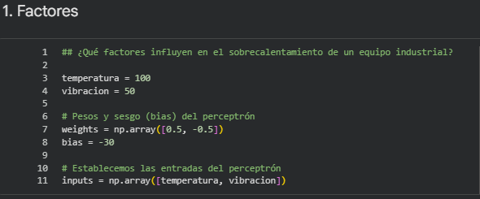

### Imagen 2

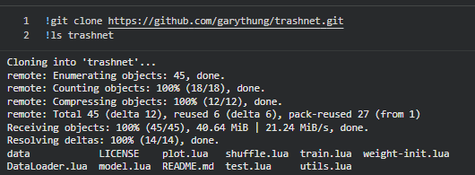

### Imagen 3

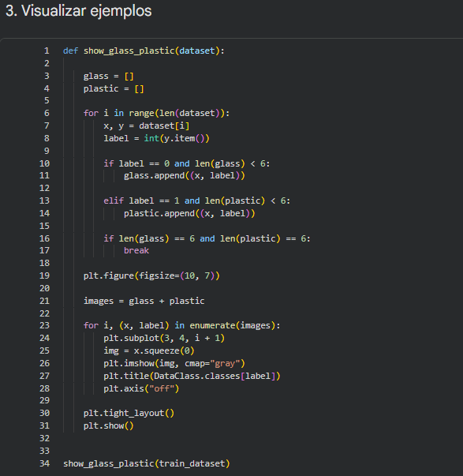

### Imagen 4

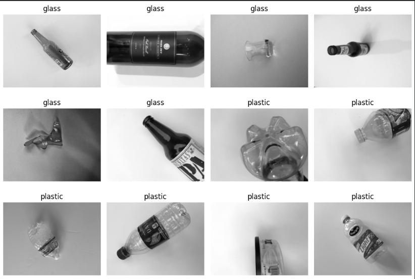

### Imagen 5

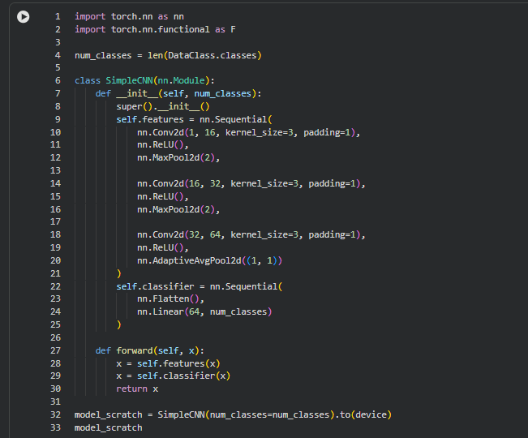

### Imagen 6

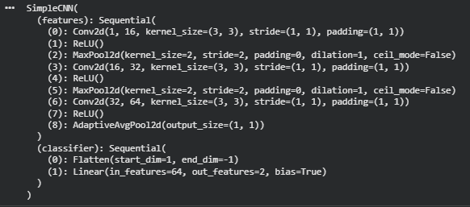

### Imagen 7

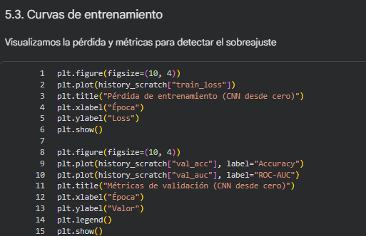

### Imagen 8

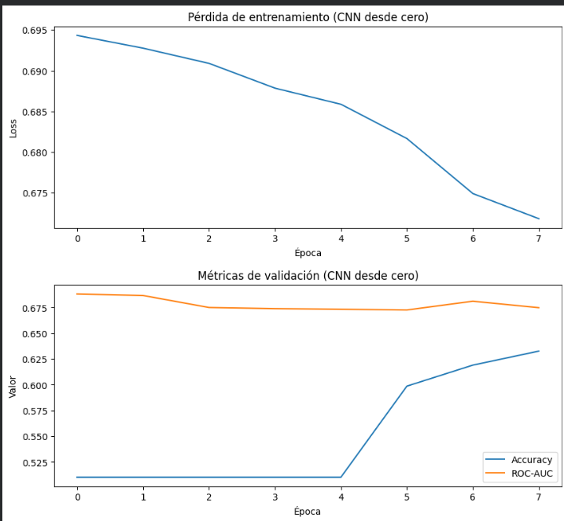

### Imagen 9

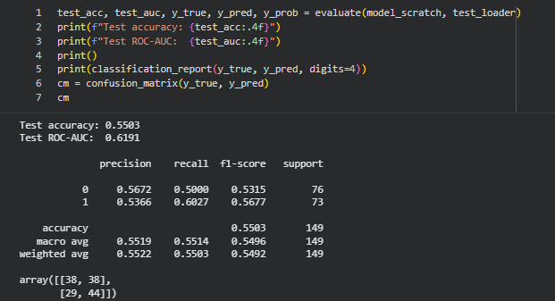

### Imagen 10

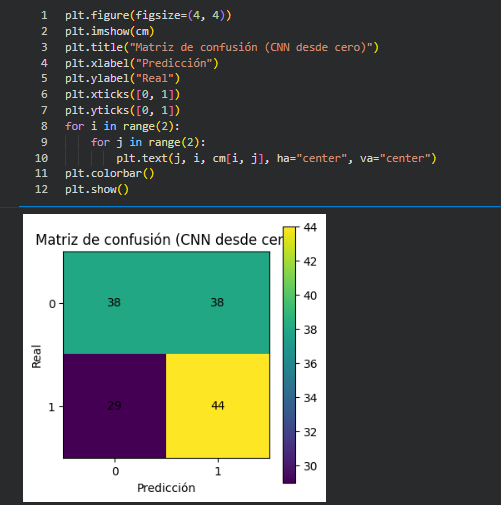

### Imagen 11

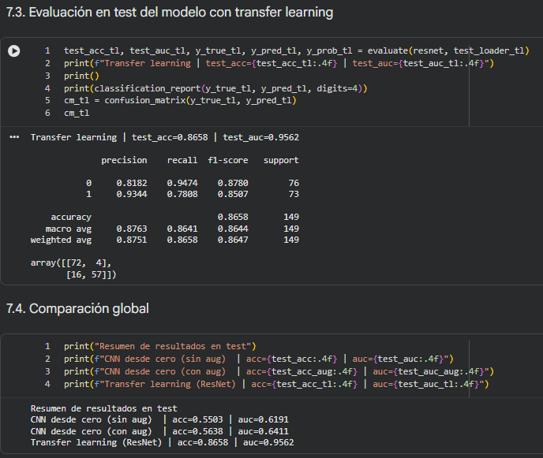

### Imagen 12

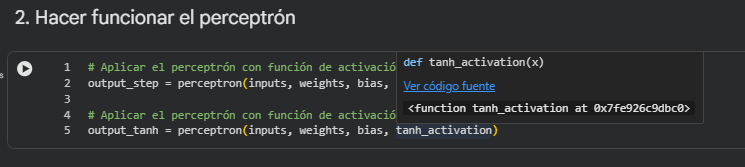

### Imagen 13

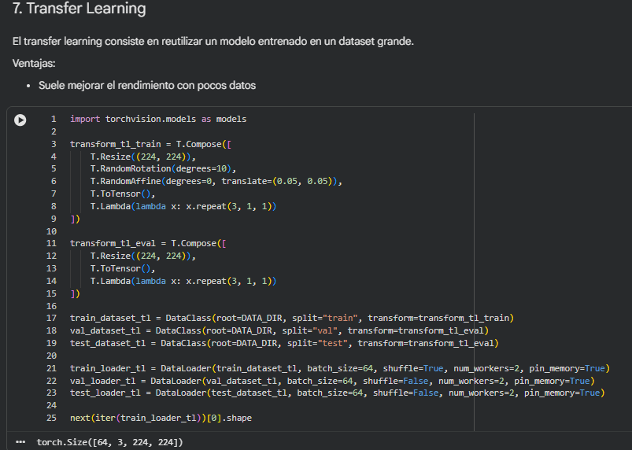

### Imagen 14

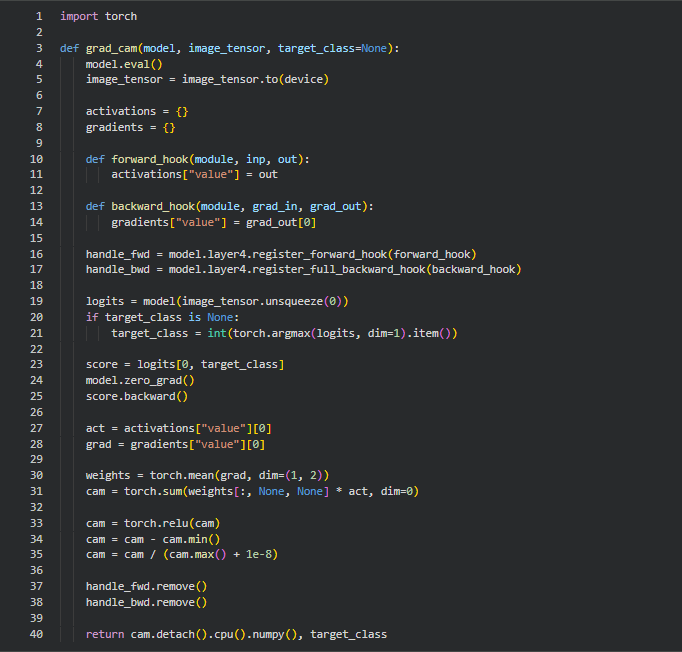

### Imagen 15

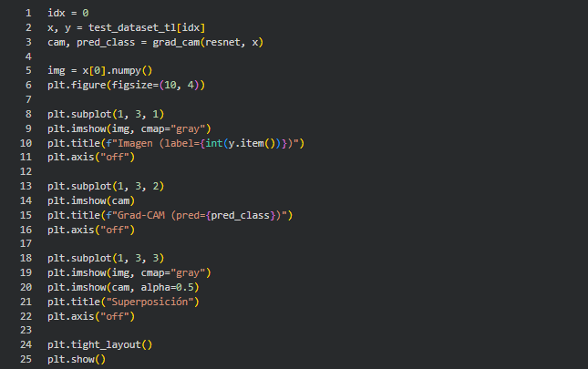

### Imagen 16

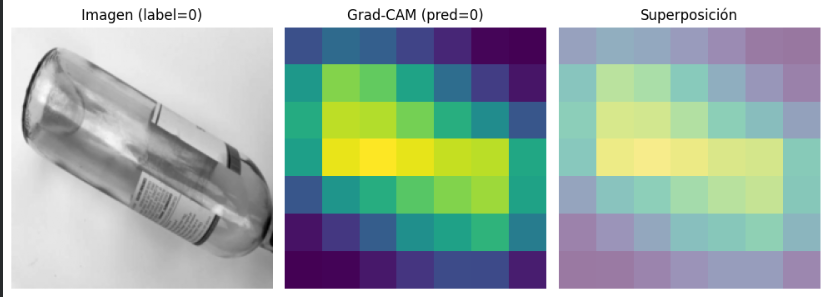

### Imagen 17

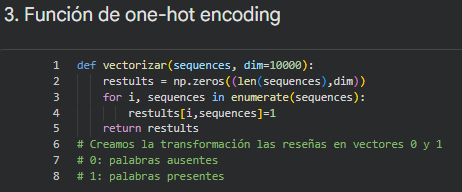

### Imagen 18

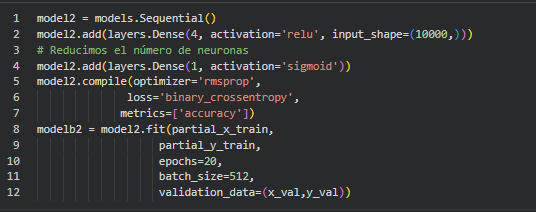

### Imagen 19

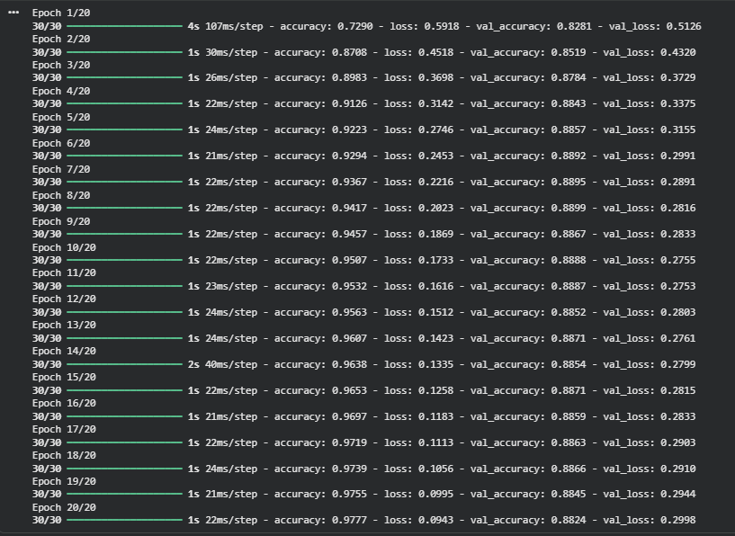

### Imagen 20

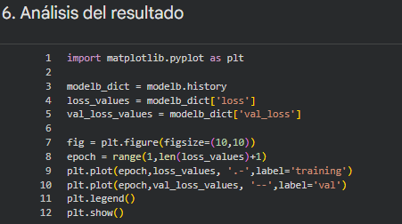

### Imagen 21

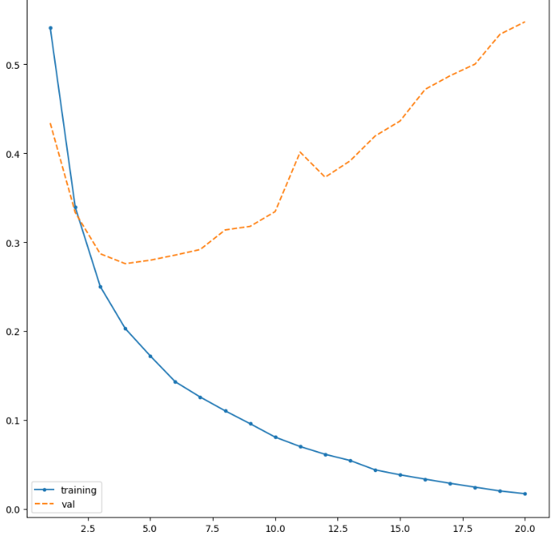

### Imagen 22

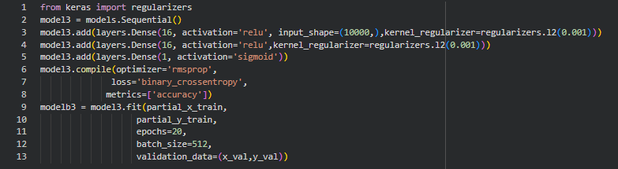

### Imagen 23

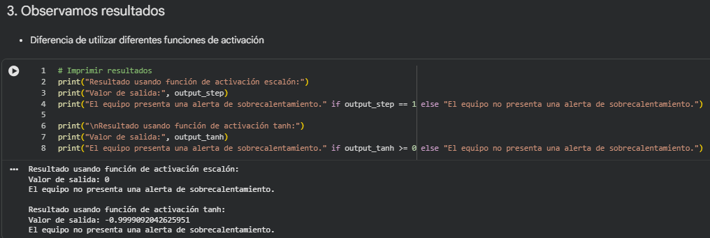

### Imagen 24

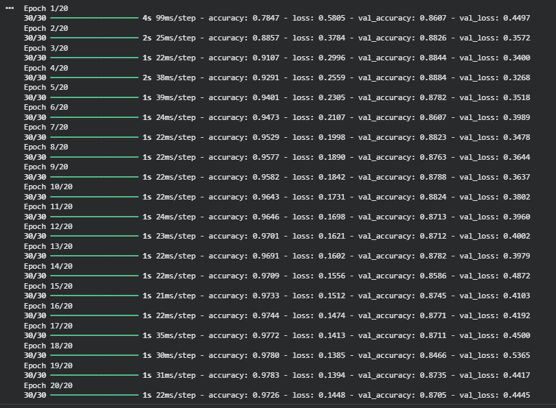

### Imagen 25

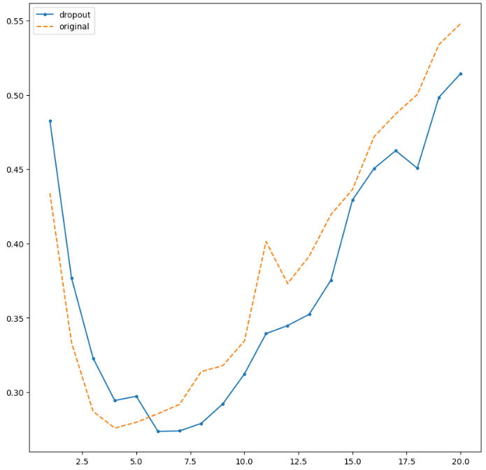

### Imagen 26

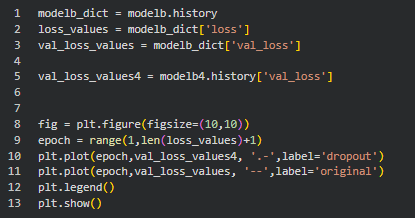

### Imagen 27

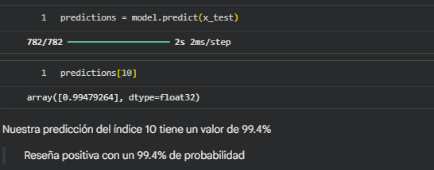

### Imagen 28

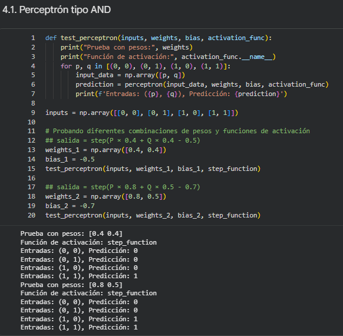

### Imagen 29

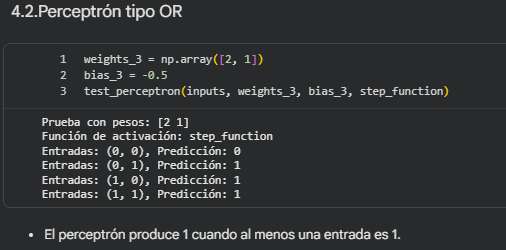

### Imagen 30

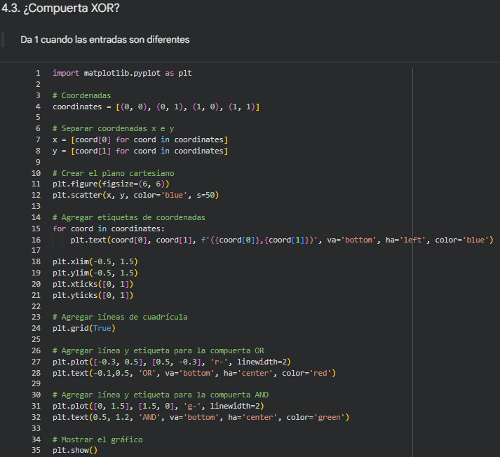

### Imagen 31

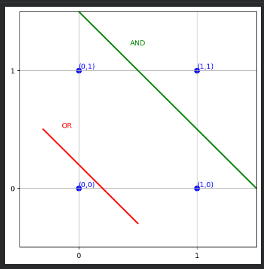

### Imagen 32

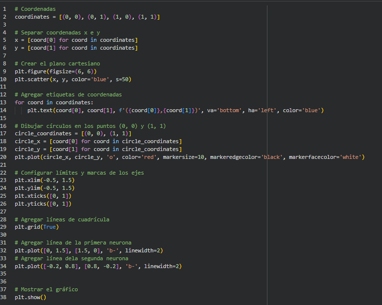

### Imagen 33

