# Taller 5: Definición de CNN, Keras y Perceptrón

> **Curso:** Proyecto Integrador  
> **Docentes:** Ing. Maria Rejas Nuñez e Ing. Renzo Jose Chan Rios

## 📚 Contenido
- [CNN](#cnn)
- [Keras](#keras)
- [Perceptrón](#perceptrón)
- [Aplicación en GREENPLANT](#cuál-usarían-en-su-proyecto)
- [Discusión](#discusión)
- [Conclusión](#conclusión)

Taller 5, Definición de CNN, KERAS Y PERCEPTRON

Curso: Proyecto Integrador

Docentes: Ing. Maria Rejas Nuñez, Ing Renzo Jose Chan Rios

### Introducción

La inteligencia artificial ha permitido desarrollar sistemas capaces de aprender, analizar información y tomar decisiones a partir de datos. Dentro de este campo se encuentran las redes neuronales artificiales, modelos inspirados en el funcionamiento del cerebro humano que permiten resolver diferentes tipos de problemas mediante el aprendizaje automático.

En este trabajo se estudian tres conceptos fundamentales relacionados con las redes neuronales: CNN (Convolutional Neural Network), Keras y Perceptrón. Cada uno representa un enfoque diferente dentro del aprendizaje automático. Las CNN están orientadas principalmente al procesamiento y clasificación de imágenes mediante la extracción automática de características; Keras es una herramienta que facilita la creación, entrenamiento y evaluación de modelos de aprendizaje profundo; mientras que el perceptrón representa uno de los modelos neuronales más básicos para realizar tareas de clasificación.

El análisis de estos modelos permite comprender desde los fundamentos de una neurona artificial hasta la implementación de arquitecturas más avanzadas. Además, permite identificar qué tipo de modelo resulta más adecuado según las características del problema y los datos disponibles.

## 1. CNN — Redes Neuronales Convolucionales

Es un tipo de red neuronal que permite a una computadora analizar imágenes y encontrar características importantes dentro de ellas. Su funcionamiento ayuda a reconocer patrones como formas, colores o detalles que permiten identificar y clasificar objetos.

### 1. Creación del modelo CNN desde cero

Código:

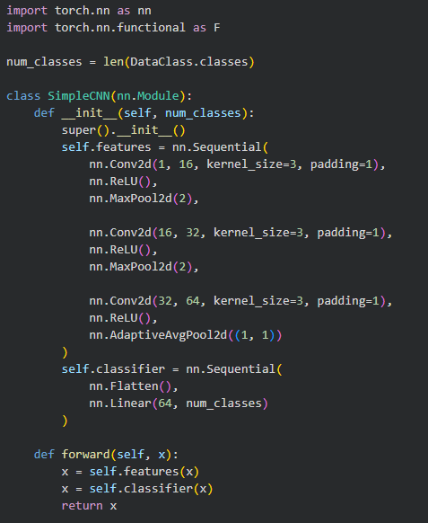

### ¿Para qué sirve?

Sirve para crear una Red Neuronal Convolucional (CNN) desde cero para clasificar imágenes.

Conv2d: permite extraer características de las imágenes como bordes, formas y patrones.

ReLU: agrega una función de activación para que la red pueda aprender relaciones más complejas.

MaxPool2d: reduce el tamaño de la información manteniendo las características importantes.

AdaptiveAvgPool2d: reduce la información obtenida antes de enviarla al clasificador.

Linear: realiza la clasificación final según el número de clases.

El modelo creado aprende directamente desde las imágenes del dataset sin utilizar conocimientos previos.

### 2. Funciones para evaluar y entrenar el modelo

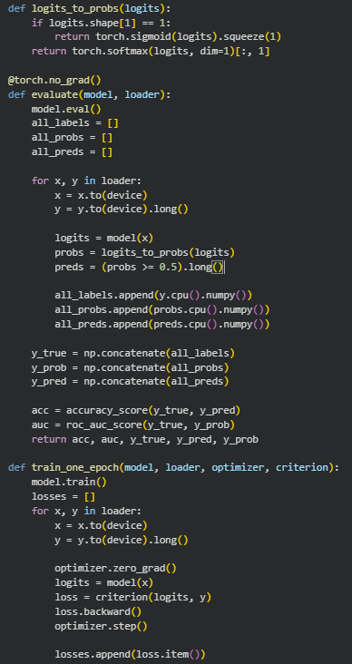

### ¿Para qué sirve?

Estas funciones permiten entrenar y evaluar la CNN.

train_one_epoch() se encarga de entrenar la red durante una época, calculando el error y ajustando los pesos del modelo.

evaluate() mide el rendimiento del modelo utilizando datos que no fueron usados durante el entrenamiento.

logits_to_probs() convierte las salidas de la red en probabilidades para poder realizar la clasificación.

Estas funciones permiten conocer si el modelo está aprendiendo correctamente.

### 3. Entrenamiento de la CNN

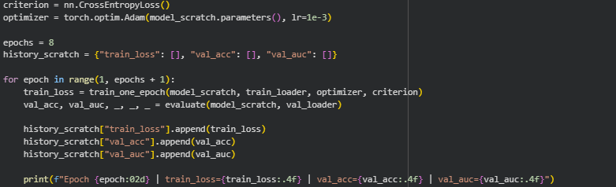

### ¿Para qué sirve?

Este código permite entrenar la CNN utilizando las imágenes del conjunto de entrenamiento.

CrossEntropyLoss() calcula el error entre la predicción realizada y la clase real.

Adam es el optimizador encargado de modificar los pesos de la red para reducir el error.

epochs indica cuántas veces la red revisará todo el conjunto de datos.

Durante cada época se calcula el rendimiento del modelo mediante accuracy y ROC-AUC.

3.1 Imagen:

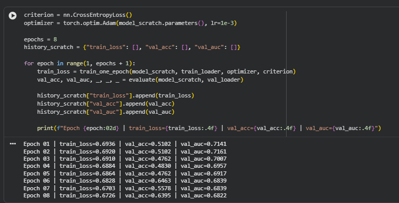

### Interpretación:

Se observa una ligera disminución del error durante el entrenamiento. Esto indica que la red está aprendiendo progresivamente a reconocer patrones en las imágenes, aunque la reducción no es muy grande.

Una pérdida cercana a 0.69 al inicio indica que el modelo comienza casi sin conocimiento y realiza predicciones similares al azar. Al disminuir con las épocas, significa que la CNN está ajustando sus parámetros para mejorar sus predicciones.

### 4. Data Augmentation

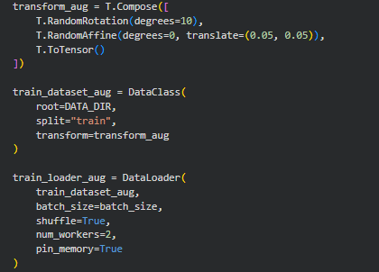

### ¿Para qué sirve?

Este código aplica modificaciones aleatorias a las imágenes de entrenamiento.

Las transformaciones utilizadas son:

Rotaciones pequeñas.

Desplazamientos horizontales y verticales.

Su objetivo es crear variaciones de las imágenes originales para que la CNN aprenda características más generales y reduzca el sobreajuste (overfitting).

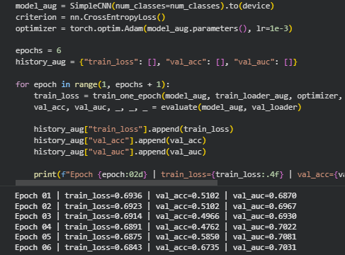

### Interpretación:

Los resultados muestran que la CNN está aprendiendo correctamente, ya que:

La pérdida de entrenamiento disminuye de 0.6936 a 0.6843.

La precisión de validación aumenta de 51.02% a 67.35%.

El ROC-AUC mejora de 0.6870 a 0.7031.

Esto indica que el modelo empieza a extraer características útiles de las imágenes y logra realizar mejores clasificaciones después del entrenamiento. Sin embargo, todavía existe margen de mejora mediante técnicas como data augmentation, ajuste de parámetros o utilizando modelos preentrenados mediante transfer learning.

### 5. Transfer Learning con ResNet18

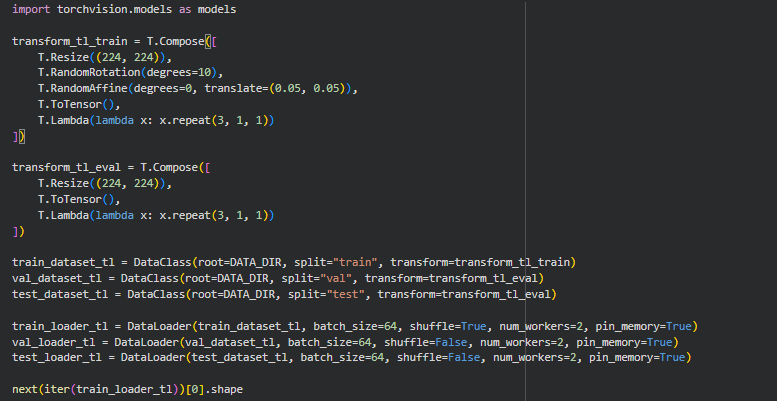

### ¿Para qué sirve?

Este código utiliza una red neuronal previamente entrenada llamada ResNet18.

En lugar de entrenar una red desde cero, se aprovechan características que la red ya aprendió anteriormente, como:

Bordes.

Texturas.

Formas.

Después se reemplaza la última capa (fc) para adaptarla a las clases del dataset TrashNet.

Esto permite obtener mejores resultados con menos datos y menor tiempo de entrenamiento.

### 6. Grad-CAM para interpretar la CNN

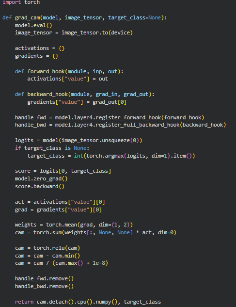

### ¿Para qué sirve?

Grad-CAM permite visualizar qué partes de una imagen fueron importantes para que la CNN tomara una decisión.

Esto ayuda a interpretar el modelo y entender si está observando las características correctas para realizar una clasificación.

### ¿Qué he aprendido en general?

He aprendido cómo funcionan las Redes Neuronales Convolucionales y cómo aplicarlas para clasificar imágenes. Aprendí a crear una CNN desde cero, entrenarla con un dataset, evaluar su rendimiento mediante métricas y mejorar sus resultados utilizando técnicas como Data Augmentation y Transfer Learning.

También aprendí que una CNN no solamente genera una predicción, sino que mediante herramientas como Grad-CAM se puede analizar qué características de la imagen influyen en la decisión del modelo.

### ¿Por qué es importante utilizarlo?

Las CNN son importantes porque permiten que las computadoras puedan analizar imágenes automáticamente y reconocer patrones visuales con gran precisión. Son utilizadas en diferentes áreas como reconocimiento facial, diagnóstico médico, vehículos autónomos y clasificación de objetos.

En este caso, la CNN permite clasificar residuos mediante imágenes, ayudando a automatizar procesos de separación y reciclaje. Además, técnicas como Transfer Learning permiten desarrollar modelos eficientes incluso cuando se dispone de una cantidad limitada de datos.

## Keras

### 1. Importación de librerías y carga del dataset IMDB

Código:

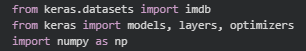

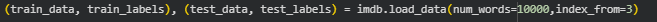

### ¿Para qué sirve?

Este código importa las herramientas necesarias de Keras y carga el dataset IMDB, que contiene reseñas de películas clasificadas como positivas o negativas.

imdb.load_data() permite obtener los datos de entrenamiento y prueba.

num_words=10000 limita el vocabulario a las 10 000 palabras más frecuentes.

train_data contiene las reseñas transformadas en números.

train_labels contiene la clasificación:

0: reseña negativa.

1: reseña positiva.

El objetivo del modelo será aprender a identificar el sentimiento de una reseña.

### 2. Conversión de palabras a índices

Código:

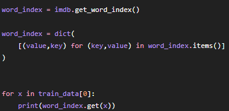

### ¿Para qué sirve?

Este código permite recuperar la relación entre los números y las palabras originales del dataset.

Como las redes neuronales no trabajan directamente con texto, las palabras fueron convertidas previamente en números.

Por ejemplo:

Palabra → número.

Número → representación utilizada por la red.

Esto permite observar cómo una reseña de texto es transformada en datos que una computadora puede procesar.

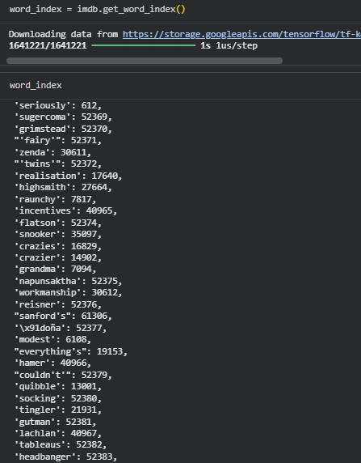

Interpretar

ermite observar cómo una reseña que originalmente estaba escrita con palabras fue transformada en números.

Estos números representan la posición de cada palabra dentro del vocabulario utilizado por el modelo.

### 3. Vectorización de las reseñas

Código:

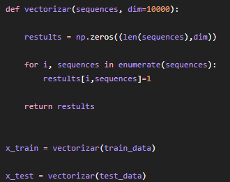

### ¿Para qué sirve?

Esta función convierte las reseñas en vectores binarios que pueden ser utilizados por la red neuronal.

La transformación funciona así:

0: la palabra no aparece en la reseña.

1: la palabra está presente.

Por ejemplo, una reseña de texto se convierte en un vector de 10 000 posiciones donde cada posición representa una palabra del vocabulario.

Esto permite que la información textual pueda ser procesada por el modelo.

### 4. Preparación de etiquetas

Código:

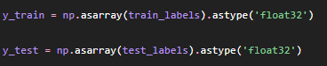

### ¿Para qué sirve?

Este código convierte las etiquetas del dataset a un formato numérico compatible con Keras.

Las etiquetas representan la clase que debe predecir la red:

0 → sentimiento negativo.

1 → sentimiento positivo.

### 5. Creación del modelo neuronal con Keras

Código:

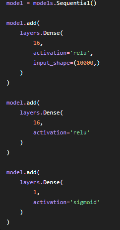

### ¿Para qué sirve?

Este código crea una red neuronal utilizando la estructura Sequential de Keras.

La arquitectura creada contiene:

Primera capa Dense con 16 neuronas:

Recibe el vector de 10 000 palabras.

Aprende patrones relacionados con el texto.

Segunda capa Dense con 16 neuronas:

Aprende características más complejas.

Capa final con una neurona:

Utiliza sigmoid.

Genera una probabilidad entre 0 y 1.

Permite clasificar la reseña como positiva o negativa.

### 6. Compilación del modelo

Código:

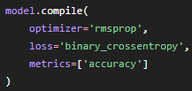

### ¿Para qué sirve?

Este código configura la forma en que la red aprenderá.

rmsprop:

Optimiza los pesos del modelo durante el entrenamiento.

binary_crossentropy:

Calcula el error en problemas de clasificación binaria.

accuracy:

Permite medir el porcentaje de predicciones correctas.

### 7. División de datos para validación

Código:

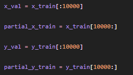

### ¿Para qué sirve?

Este código divide los datos de entrenamiento en dos grupos:

Datos de entrenamiento:

Utilizados para que la red aprenda.

Datos de validación:

Utilizados para comprobar si el modelo está aprendiendo correctamente.

Esto permite detectar problemas como el sobreajuste (overfitting).

### 8. Entrenamiento del modelo

Código:

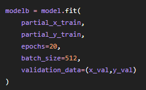

### ¿Para qué sirve?

Este código entrena la red neuronal.

Durante el entrenamiento:

La red recibe las reseñas.

Realiza una predicción.

Calcula el error.

Ajusta sus pesos para mejorar.

Parámetros:

epochs=20: la red revisa los datos 20 veces.

batch_size=512: procesa 512 muestras antes de actualizar los pesos.

validation_data: evalúa el modelo durante el entrenamiento.

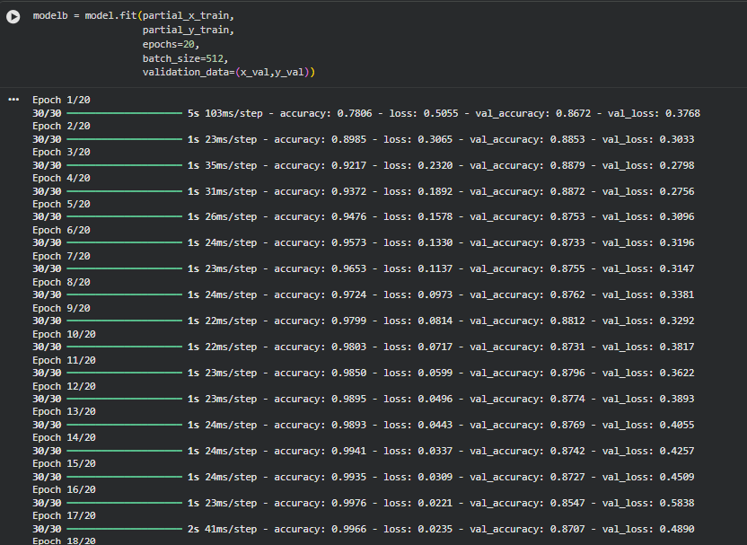

Interpretación

Logra aprender correctamente la clasificación de sentimientos, alcanzando una precisión de entrenamiento cercana al 100%. Además, mantiene una precisión de validación alrededor del 87%, demostrando que puede clasificar correctamente la mayoría de las reseñas nuevas.

Sin embargo, el aumento de la pérdida de validación en las últimas épocas indica que el modelo comienza a memorizar los datos de entrenamiento.

### 9. Visualización del error de entrenamiento

Código:

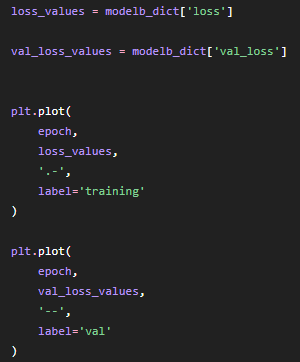

### ¿Para qué sirve?

Este código permite observar cómo cambia el error del modelo durante las épocas.

Se comparan:

Error de entrenamiento.

Error de validación.

Esto ayuda a identificar si el modelo está aprendiendo correctamente o si comienza a memorizar los datos.

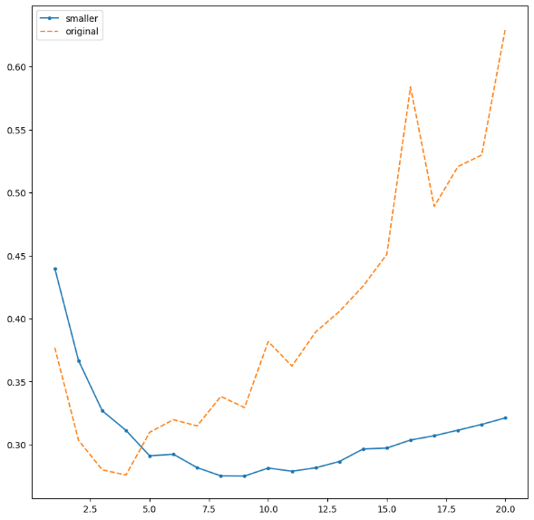

Interpretación

El gráfico demuestra que reducir la cantidad de neuronas puede ayudar a controlar el sobreajuste. El modelo original logra aprender más información del conjunto de entrenamiento, pero después de varias épocas comienza a perder rendimiento con datos nuevos.

El modelo reducido presenta una menor pérdida de validación, por lo que consigue un equilibrio más adecuado entre aprendizaje y capacidad de generalización.

### 10. Evaluación del modelo

Código:

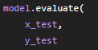

### ¿Para qué sirve?

Este código prueba el modelo utilizando datos que no fueron usados durante el entrenamiento.

Permite conocer el rendimiento final mediante:

Pérdida del modelo.

Precisión de clasificación.

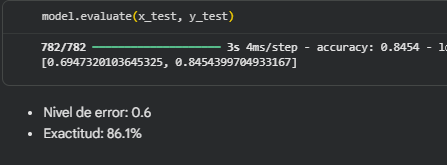

Interpretación

La evaluación final muestra que el modelo Keras obtuvo un rendimiento adecuado, alcanzando una precisión de 84.54% en datos nuevos. Esto demuestra que la red neuronal aprendió características importantes del texto y logró realizar una clasificación efectiva de sentimientos.

Sin embargo, al comparar este resultado con el entrenamiento previo, donde la precisión llegó cerca del 99%, se observa una diferencia entre el rendimiento de entrenamiento y prueba. Esto indica que existe cierto nivel de sobreajuste, ya que el modelo aprendió muy bien los datos de entrenamiento, pero no con la misma precisión los datos nuevos.

### 11. Reducción de neuronas

Código:

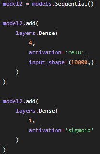

### ¿Para qué sirve?

Este modelo modifica la arquitectura reduciendo la cantidad de neuronas.

La finalidad es analizar cómo afecta la capacidad del modelo:

Menos neuronas → modelo más simple.

Más neuronas → mayor capacidad de aprendizaje.

Permite comparar el impacto de la complejidad de la red.

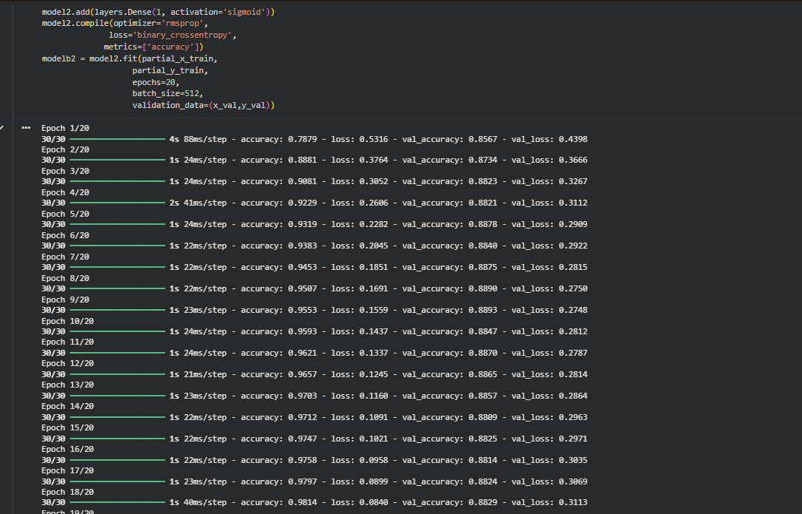

Interpretación

El modelo reducido (model2) logra un buen rendimiento utilizando una arquitectura más sencilla. Aunque posee menos neuronas, alcanza una precisión de validación cercana al 88%, demostrando que no siempre un modelo más grande obtiene mejores resultados.

La reducción de la cantidad de neuronas permite disminuir la complejidad del modelo y mejorar su capacidad de generalización, evitando que aprenda demasiado los datos de entrenamiento.

### 12. Regularización L2

Código:

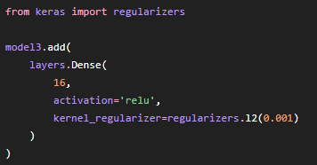

### ¿Para qué sirve?

La regularización L2 ayuda a evitar el sobreajuste.

Agrega una penalización a los pesos demasiado grandes del modelo, logrando que la red tenga una mejor capacidad de generalización.

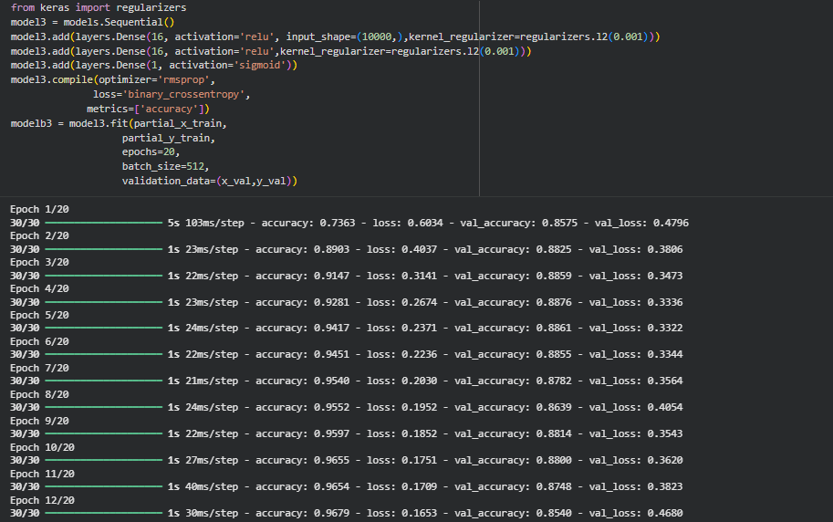

Interpretación

El modelo con regularización L2 logra mantener un buen rendimiento mientras reduce la tendencia del modelo a memorizar los datos de entrenamiento.

Aunque alcanza una precisión de entrenamiento menor que el modelo original, consigue una precisión de validación estable cercana al 88%, demostrando una mejor capacidad de generalización.

### 13. Dropout

Código:

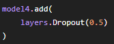

### ¿Para qué sirve?

Dropout desactiva aleatoriamente algunas neuronas durante el entrenamiento.

Esto evita que la red dependa demasiado de ciertas neuronas y ayuda a que aprenda patrones más generales.

### 14. Predicción de nuevas reseñas

Código:

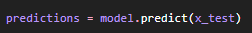

### ¿Para qué sirve?

Este código utiliza el modelo entrenado para clasificar nuevas reseñas.

La salida representa la probabilidad de que una reseña sea positiva o negativa.

### ¿Qué he aprendido en general?

He aprendido que Keras facilita la creación y entrenamiento de redes neuronales mediante una estructura sencilla basada en capas. En este caso, aprendí cómo utilizar una red neuronal para procesar texto, transformar reseñas en vectores numéricos y entrenar un modelo capaz de clasificar sentimientos positivos y negativos.

También aprendí la importancia de mejorar los modelos mediante técnicas como reducción de neuronas, regularización L2 y Dropout para controlar el sobreajuste.

### ¿Por qué es importante utilizarlo?

Keras es importante porque permite desarrollar modelos de inteligencia artificial de manera más rápida y organizada. Su facilidad para construir redes neuronales permite trabajar con diferentes tipos de datos como texto, imágenes y números.

En este caso, Keras permite crear un modelo de análisis de sentimientos capaz de interpretar reseñas de usuarios automáticamente, lo cual tiene aplicaciones en análisis de opiniones, atención al cliente y procesamiento de lenguaje natural.

## Perceptrón

### 1. Importación de librerías y funciones de activación

Código:

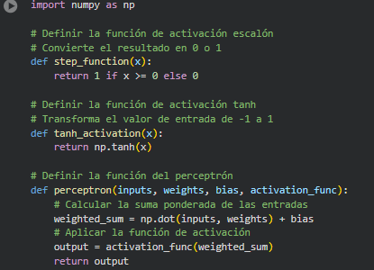

### ¿Para qué sirve?

Este código importa la librería NumPy y define las funciones de activación que utilizará el perceptrón.

Las funciones de activación permiten transformar la salida calculada por el modelo:

step_function():

Convierte el resultado en una salida binaria.

Si el valor es mayor o igual a 0 devuelve 1.

Si es menor devuelve 0.

tanh_activation():

Convierte los valores a un rango entre -1 y 1.

Permite representar diferentes niveles de activación.

Estas funciones permiten que el perceptrón tome una decisión a partir de los datos de entrada.

### 2. Creación de la función del perceptrón

Código:

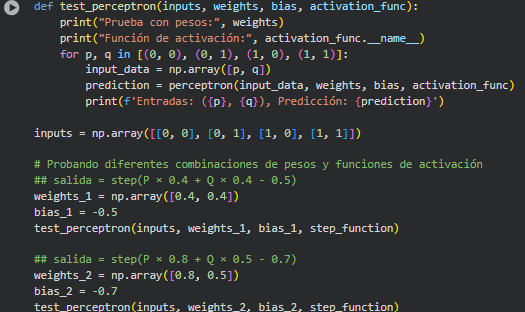

### ¿Para qué sirve?

Esta función representa el funcionamiento básico de un perceptrón.

El proceso realizado es:

Recibe los datos de entrada (inputs).

Multiplica cada entrada por su peso correspondiente (weights).

Suma el valor del sesgo (bias).

Aplica una función de activación.

Genera una salida.

La fórmula utilizada es:

Salida = Función de activación (Entrada × Peso + Bias)

Los pesos determinan la importancia de cada entrada y el bias permite ajustar el punto de decisión.

### 3. Aplicación del perceptrón para detectar sobrecalentamiento

Código:

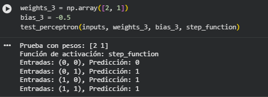

### ¿Para qué sirve?

Este código define las variables que ingresarán al perceptrón para analizar si un equipo industrial presenta riesgo de sobrecalentamiento.

Las entradas son:

temperatura: valor de temperatura del equipo.

vibracion: nivel de vibración detectado.

Los pesos indican la influencia de cada variable:

Temperatura tiene peso positivo.

Vibración tiene peso negativo.

El bias ajusta el límite para decidir si existe una alerta.

### 4. Predicción utilizando diferentes funciones de activación

Código:

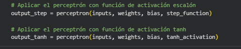

### ¿Para qué sirve?

Este código ejecuta el perceptrón utilizando dos funciones de activación diferentes.

Con la función escalón:

La salida será 0 o 1.

Representa una decisión directa:

1 → alerta de sobrecalentamiento.

0 → funcionamiento normal.

Con la función tanh:

La salida tendrá valores entre -1 y 1.

Permite representar una intensidad de activación.

### 5. Visualización del resultado del perceptrón

Código:¿Para qué sirve?

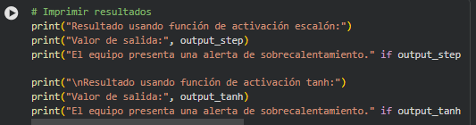

Este código muestra el resultado obtenido por el perceptrón.

Permite observar cómo diferentes funciones de activación generan diferentes interpretaciones de la misma información.

La función escalón entrega una decisión binaria, mientras que tanh entrega un valor continuo.

### 6. Prueba del perceptrón con diferentes entradas

Código:

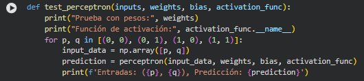

### ¿Para qué sirve?

Esta función permite probar el comportamiento del perceptrón con diferentes combinaciones de entradas.

Las combinaciones evaluadas son:

(0,0)

(0,1)

(1,0)

(1,1)

Estas pruebas representan problemas clásicos de lógica como:

AND.

OR.

### 7. Configuración de pesos para compuertas lógicas

Código:

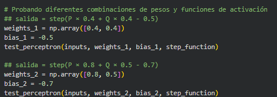

### ¿Para qué sirve?

Este código configura un perceptrón para realizar una clasificación lógica.

Los pesos y el bias determinan la forma en que el modelo separa los datos.

Al modificar estos valores se puede cambiar el comportamiento del perceptrón y representar diferentes funciones lógicas.

### 8. Representación gráfica del perceptrón

Código:

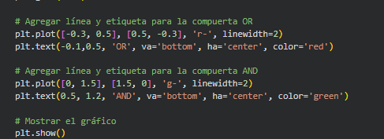

### ¿Para qué sirve?

Este código genera una representación visual de los puntos de entrada y las líneas de separación creadas por el perceptrón.

Las líneas representan las fronteras de decisión:

Separan las clases.

Muestran cómo el perceptrón clasifica los datos.

Esto permite entender visualmente cómo una neurona artificial toma decisiones.

### 9. Separación de datos con múltiples líneas de decisión

Código:

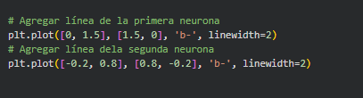

### ¿Para qué sirve?

Este código muestra diferentes líneas de separación generadas por neuronas.

Permite observar que un solo perceptrón puede resolver problemas simples, pero problemas más complejos requieren combinar varias neuronas formando redes neuronales.

### ¿Qué he aprendido en general?

He aprendido que el perceptrón es uno de los modelos más básicos de inteligencia artificial y representa el funcionamiento de una neurona artificial. Aprendí cómo recibe datos de entrada, aplica pesos, suma un bias y utiliza una función de activación para generar una respuesta.

También aprendí cómo un perceptrón puede utilizarse para resolver problemas de clasificación simple, como detectar una alerta de sobrecalentamiento o representar compuertas lógicas mediante diferentes pesos y valores de sesgo.

### ¿Por qué es importante utilizarlo?

El perceptrón es importante porque es la base de las redes neuronales modernas. Aunque es un modelo sencillo, permite comprender conceptos fundamentales como pesos, bias, funciones de activación y clasificación.

Su estudio ayuda a entender cómo funcionan modelos más avanzados como las CNN y otras arquitecturas de aprendizaje profundo. Además, puede utilizarse en problemas simples de toma de decisiones donde los datos pueden separarse mediante reglas matemáticas.

### ¿Cuál usarían en su proyecto?

## Perceptrón

Implementación en el proyecto

En el proyecto GREENPLANT, el perceptrón se implementaría como un sistema de clasificación basado en los datos obtenidos por los sensores. Su función sería analizar las variables medidas dentro de la cámara experimental, como la concentración de NH₃, CO₂, temperatura, humedad ambiental y humedad del suelo, para determinar el estado del cultivo.

El modelo recibiría los datos recopilados por los sensores como valores de entrada y, mediante un proceso de cálculo, generaría una salida que indicaría la condición del sistema.

La implementación tendría la siguiente estructura:

Sensores → Perceptrón → Clasificación/Alerta

Las entradas del modelo podrían ser:

Concentración de NH₃.

Concentración de CO₂.

Temperatura ambiental.

Humedad ambiental.

Temperatura del suelo.

Humedad del suelo.

La salida del perceptrón representaría una decisión:

0: Condición normal del cultivo.

1: Generación de alerta por valores fuera del rango establecido.

De esta manera, el perceptrón permitiría automatizar la interpretación de los datos obtenidos por los sensores y apoyar el monitoreo del estado experimental del cultivo.

Ejemplo de implementación ayudado por ia:

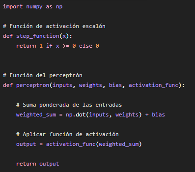

Aplicación para generar una alerta

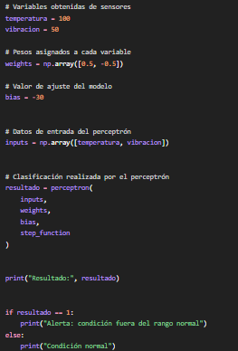

Adaptación al proyecto GREENPLANT

Para utilizarlo directamente en el sistema de monitoreo, las entradas del ejemplo podrían reemplazarse por las variables obtenidas de los sensores:

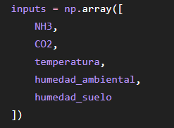

### Discusión

Durante el desarrollo del trabajo se analizaron tres modelos relacionados con las redes neuronales: CNN, Keras y Perceptrón, observando que cada uno presenta características diferentes según el tipo de problema que se desea resolver. La CNN permitió comprender cómo una red neuronal puede analizar imágenes mediante la extracción automática de características, siendo adecuada para problemas donde se necesita identificar patrones visuales, como la clasificación de residuos mediante imágenes.

En el caso de Keras, se pudo observar que facilita la creación y entrenamiento de modelos neuronales mediante una estructura más sencilla basada en capas. La implementación realizada permitió clasificar reseñas de texto como positivas o negativas, obteniendo una precisión aproximada de 84.54% en datos nuevos. Sin embargo, también se identificó la presencia de cierto sobreajuste debido a la diferencia entre la precisión de entrenamiento y la precisión obtenida con datos de prueba.

Por otro lado, el perceptrón permitió comprender los fundamentos de una neurona artificial, donde las entradas reciben pesos, se agrega un valor de bias y se aplica una función de activación para obtener una respuesta. Aunque es un modelo más sencillo que una CNN o una red desarrollada con Keras, resulta útil para problemas de clasificación básica y como base para comprender modelos más complejos.

Para el proyecto GREENPLANT, el perceptrón puede ser utilizado como un sistema de clasificación basado en los datos obtenidos por sensores, utilizando variables como concentración de NH₃, CO₂, temperatura y humedad para determinar el estado del cultivo y generar alertas cuando existan valores fuera de los rangos establecidos.

### Conclusión

El desarrollo de este trabajo permitió comprender la importancia de las redes neuronales artificiales y su aplicación en diferentes tipos de datos. Se identificó que la CNN es una alternativa adecuada para el procesamiento de imágenes debido a su capacidad para reconocer patrones visuales, mientras que Keras facilita la construcción y evaluación de modelos de aprendizaje profundo mediante una implementación más organizada.

Asimismo, el estudio del perceptrón permitió conocer los conceptos fundamentales de las redes neuronales, como pesos, bias y funciones de activación, los cuales forman parte de modelos más avanzados. Aunque presenta limitaciones para resolver problemas complejos, su funcionamiento permite comprender la base de la inteligencia artificial moderna.

Finalmente, para el proyecto GREENPLANT, el uso del perceptrón permitiría interpretar los datos obtenidos por sensores y convertirlos en decisiones automáticas de monitoreo. Este modelo puede servir como una primera aproximación para la clasificación del estado del cultivo, mientras que modelos más avanzados podrían implementarse posteriormente si se requiere analizar mayor cantidad de información o patrones más complejos.
