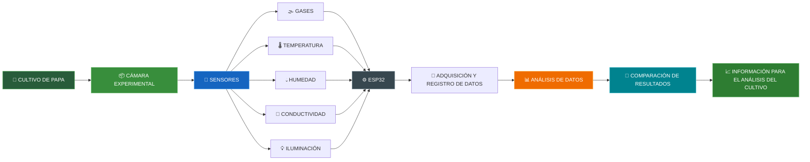

<p align="center">
  
</p>

<p align="center">
  <strong>Sistema para el monitoreo experimental del cultivo de papa y sus emisiones gaseosas</strong>
</p>

<p align="center">
  <strong>PROYECTO INTEGRADOR · 2026-II</strong>
  <br>
  <sub>Universidad Peruana Cayetano Heredia · Ingeniería Informática + Ingeniería Industrial</sub>
</p>

<p align="center">
  
  
  
  
  
</p>

<br>

<p align="center">
  
</p>

---

# 🌱 Simulación del funcionamiento de GREENPLANT AI


# 🔄 Flujo principal

**Cultivo → Cámara → Sensores → ESP32 → Datos → Análisis → Comparación**

GREENPLANT AI busca obtener datos del cultivo de papa bajo condiciones experimentales controladas para posteriormente analizarlos y encontrar patrones relacionados con las variables medidas.

---

# 🌍 Objetivos de Desarrollo Sostenible

<p align="center">
  
  
  
</p>

## 🌱 ODS 13 · Acción por el Clima

GREENPLANT AI se relaciona con el **ODS 13: Acción por el Clima**, debido a que busca contribuir al monitoreo y análisis experimental de gases asociados a actividades agrícolas.

El proyecto utiliza **IoT y sensores** para generar información que permita estudiar el comportamiento de las variables medidas durante los ensayos.

## 🌾 ODS 2 · Hambre Cero

GREENPLANT AI se relaciona con el **ODS 2: Hambre Cero**, debido a que el proyecto se enfoca en el **cultivo de papa** y busca generar información experimental sobre las condiciones que rodean su desarrollo.

<p>
Mediante el monitoreo de <strong>NH₃, CO₂ y variables ambientales y del sustrato</strong>, el proyecto busca obtener datos que permitan analizar y comparar las condiciones del cultivo, contribuyendo al estudio de procesos relacionados con la producción agrícola.
</p>

## ⚙️ ODS 9 · Industria, Innovación e Infraestructura

GREENPLANT AI se relaciona con el **ODS 9: Industria, Innovación e Infraestructura**, debido a que propone el desarrollo de una solución tecnológica basada en **IoT, sensores y un ESP32** para el monitoreo experimental del cultivo de papa.

El proyecto integra **hardware, sensores, adquisición y registro de datos** para construir una herramienta tecnológica que permita realizar mediciones de **NH₃, CO₂ y variables ambientales y del sustrato**, fortaleciendo el uso de tecnologías de monitoreo e innovación aplicadas al ámbito agrícola.

# 🌱 GREENPLANT AI

> **Una solución experimental orientada al monitoreo del cultivo de papa mediante sensores y adquisición de datos.**

## 🎯 Nuestro enfoque

GREENPLANT AI busca desarrollar un **prototipo experimental para el cultivo de papa**, utilizando una cámara cerrada, sensores y un sistema de adquisición de datos.

El sistema permitirá registrar información relacionada con:

<pre align="center">
🌱 CULTIVO DE PAPA
        ↓
📦 CÁMARA EXPERIMENTAL
        ↓
📡 SENSORES
        ↓
💾 REGISTRO DE DATOS
        ↓
🧹 PROCESAMIENTO
        ↓
📊 ANÁLISIS Y PATRONES
        ↓
📈 COMPARACIÓN
</pre>


# 📸 Fotografía del Equipo

<p align="center">
  
</p>

<p align="center">
  <em>Figura 1. Fotografía del equipo 01</em>
</p>

---

# 👥 Integrantes del Equipo

<div align="center">

| Foto | Nombre | Rol | Intereses |
|------|--------|-----|-----------|
|  | **Cesar Rodrigo Milla Gómez** | Responsable de función general, análisis de información y seguridad | Investigación, tecnología y análisis |
|  | **Anderson Josue Delerna Infantes** | Responsable de geometría, energía, control y software | Programación, automatización y desarrollo |
|  | **Kevin Esty Carvallo Neciosup** | Líder del equipo y responsable de sensores, hardware y adquisición de datos | Sensores, programación y sistemas |
|  | **Shedira Lumeris Sihuincha Palacin** | Responsable de estructura, comunicaciones, ergonomía, calidad y documentación | Procesos, análisis y organización |

</div>

---
# 📌 Resumen del Proyecto

## 🌱 ¿Qué es GREENPLANT AI?

**GREENPLANT AI** es un prototipo experimental orientado al **monitoreo del cultivo de papa**, mediante sensores y adquisición de datos.

El sistema utilizará una **cámara experimental cerrada**, en la cual se colocará una planta joven de papa junto con su sustrato.

Dentro de la cámara se realizarán mediciones controladas de gases y variables relacionadas con las condiciones del cultivo.

### 📡 Las mediciones podrán incluir:

- 🌫️ Gases presentes en la cámara
- 🌡️ Temperatura ambiental
- 💧 Humedad ambiental
- 🌡️ Temperatura del suelo
- 💧 Humedad del suelo
- 💡 Iluminación
- ⏱️ Tiempo de experimentación

De acuerdo con el enfoque planteado para el proyecto, se prestará especial atención al monitoreo de **amoniaco gaseoso (NH₃)** y **dióxido de carbono (CO₂)** en el cultivo de papa.

Los datos obtenidos serán almacenados para posteriormente **analizarlos y compararlos**, buscando identificar variaciones y relaciones entre las variables registradas durante los ensayos.

---

## ⚠️ Problemática

La agricultura requiere información que permita comprender el comportamiento de los cultivos y las condiciones que influyen en su desarrollo. En particular, el cultivo de papa presenta diferentes procesos asociados al suelo, la planta y el ambiente que pueden ser estudiados mediante el seguimiento de variables físicas y gaseosas durante condiciones experimentales controladas.

Uno de los aspectos de interés es el comportamiento del **CO₂**, debido a que su concentración puede estar relacionada con procesos de respiración e intercambio gaseoso del sistema suelo-planta. Kusa et al. (2008) demostraron la utilidad de las cámaras cerradas para realizar mediciones relacionadas con los flujos de CO₂ en suelos, mientras que Baneschi et al. (2023) plantearon un procedimiento mediante cámaras cerradas para estudiar la respiración del suelo a partir de la evolución de la concentración de CO₂.

Por otro lado, la utilización de fertilizantes nitrogenados como la **urea** puede generar pérdidas de nitrógeno hacia la atmósfera mediante la volatilización de **NH₃**. Sunderlage y Cook (2018) señalaron que las propiedades del suelo y las condiciones de aplicación pueden influir en la volatilización de NH₃ proveniente de la urea. Asimismo, Klimczyk et al. (2021) estudiaron diferentes factores relacionados con las emisiones de NH₃ derivadas de la fertilización con urea.

Esta problemática también está presente específicamente en el cultivo de papa. Lee et al. (2024) analizaron la volatilización de NH₃ en diferentes cultivos, incluyendo papa, bajo condiciones de fertilización con urea, mostrando la importancia de considerar las condiciones del suelo y del cultivo al estudiar estas emisiones. Además, Chatzitriantafyllou et al. (2026) destacan la importancia de evaluar la eficiencia de la fertilización nitrogenada en el cultivo de papa y las pérdidas de nitrógeno asociadas.

Sin embargo, estudiar simultáneamente las concentraciones de **NH₃ y CO₂** junto con variables ambientales y del sustrato requiere mantener condiciones experimentales controladas y registrar las mediciones de manera organizada. Una medición aislada de un gas no permite comprender por sí sola cómo se comporta el sistema durante el ensayo.

Por ello, el problema no consiste únicamente en detectar la presencia de NH₃ o CO₂, sino en **obtener información experimental que permita relacionar la concentración de estos gases con las condiciones del cultivo y observar su comportamiento a lo largo del tiempo**.

Ante esta necesidad, GREENPLANT AI propone una alternativa experimental orientada a:

<div align="center">

🔬 **Medir** → 💾 **Registrar** → 🧠 **Analizar** → 📊 **Comparar**

</div>

las variables obtenidas durante los ensayos.

El sistema busca transformar las lecturas individuales de los sensores en **datos experimentales organizados**, permitiendo identificar tendencias, analizar posibles relaciones entre variables y comparar los resultados obtenidos bajo diferentes condiciones del cultivo.

<div align="center">

| 🔬 Medir | 💾 Registrar | 🧠 Analizar | 📊 Comparar |
|:---:|:---:|:---:|:---:|
| Gases y variables | Datos experimentales | Tendencias y relaciones | Resultados |

</div>

<p>
De esta manera, GREENPLANT AI busca generar una base tecnológica para el <strong>estudio experimental del cultivo de papa</strong>, permitiendo observar el comportamiento de NH₃ y CO₂ bajo condiciones controladas y generar información que pueda ser utilizada posteriormente para el análisis de los resultados.
</p>

## 📚 Estudios que anteceden

La propuesta se fundamenta en investigaciones relacionadas con la medición de gases en sistemas suelo-planta, el uso de cámaras cerradas y la volatilización de NH₃ asociada a la fertilización con urea.

<div align="center">

| Estudio | Aporte principal | Relación con nuestro proyecto |
|:---|:---|:---|
| **Kusa et al. (2008)** | Compararon métodos de cámara cerrada y gradiente de concentración para medir flujos de CO₂ y N₂O en suelos agrícolas. | Sustenta el uso de una **cámara cerrada** como base para realizar mediciones de gases en condiciones controladas. |
| **Baneschi et al. (2023)** | Desarrollaron un protocolo con cámaras cerradas para medir la respiración del suelo mediante CO₂ y analizar la incertidumbre de las mediciones. | Sustenta la necesidad de controlar el **volumen de la cámara, el tiempo de medición y la calidad de los datos de CO₂**. |
| **Perez-Trejo et al. (1981)** | Estudiaron el intercambio gaseoso y la respiración de tejidos de papa en relación con el CO₂. | Relaciona el **CO₂ con procesos respiratorios de la papa**, respaldando su inclusión como variable de estudio. |
| **Lee et al. (2024)** | Evaluaron la volatilización de NH₃ en diferentes cultivos, incluyendo papa, bajo fertilización con urea y otras fuentes nitrogenadas. | Sustenta el estudio del **NH₃ en papa bajo condiciones de fertilización**, considerando variables del suelo y ambientales. |
| **Sunderlage y Cook (2018)** | Analizaron la influencia de propiedades del suelo sobre la volatilización de NH₃ proveniente de la urea. | Sustenta la importancia de controlar las **condiciones del sustrato** durante los ensayos con urea. |
| **Chatzitriantafyllou et al. (2026)** | Revisaron estrategias de fertilización nitrogenada en papa y los problemas relacionados con la eficiencia del uso del nitrógeno y las pérdidas ambientales. | Refuerza la importancia de estudiar la **fertilización nitrogenada en el cultivo de papa** y generar información experimental. |

</div>

### 🔎 Conclusión de los antecedentes

Los estudios revisados muestran que existen bases científicas para estudiar los gases mediante cámaras cerradas y que las condiciones del suelo, la fertilización y las características del cultivo pueden influir en las mediciones de NH₃ y CO₂.

<p>
A partir de estos antecedentes, GREENPLANT AI plantea integrar sensores, adquisición de datos y una cámara experimental para obtener información organizada que permita **medir, registrar, analizar y comparar** el comportamiento de estas variables durante los ensayos.
<p>

# 🎯 Objetivo General

Desarrollar un **prototipo experimental inteligente** capaz de monitorear gases y variables ambientales y del suelo asociadas al cultivo de papa mediante **sensores y IoT**, generando datos que permitan analizar y comparar los resultados obtenidos durante los ensayos.

---

# 🎯 Objetivos Específicos

- Diseñar una cámara experimental cerrada para realizar ensayos con plantas jóvenes de papa.
- Implementar sensores para medir gases y variables ambientales y del sustrato.
- Registrar información relacionada con las concentraciones de gases presentes durante cada ensayo.
- Registrar temperatura, humedad e iluminación asociadas a las condiciones experimentales.
- Utilizar un microcontrolador **ESP32** para adquirir y gestionar los datos obtenidos por los sensores.
- Almacenar las mediciones junto con la identificación del cultivo y el tiempo de experimentación.
- Generar un conjunto de datos para el análisis de las variables registradas.
- Comparar los resultados obtenidos durante diferentes ensayos del cultivo de papa.
- Generar información que facilite el análisis experimental del comportamiento del cultivo.

---

# 👤 Público Objetivo

**GREENPLANT AI** estará dirigido principalmente a usuarios relacionados con el **estudio, producción y monitoreo agrícola**.

### 👨‍🌾 Agricultores
Interesados en conocer mejor las condiciones de sus cultivos.

### 🔬 Investigadores
Para realizar ensayos y analizar datos relacionados con cultivos.

### 🎓 Estudiantes
Como herramienta experimental para proyectos académicos.

### 🏫 Instituciones educativas
Para actividades de investigación y experimentación.

> El proyecto se plantea inicialmente para el **cultivo de papa**, pudiendo posteriormente adaptarse a otros cultivos.

---

# 🧪 Variables y Gases a Monitorear

GREENPLANT AI utilizará diferentes sensores para obtener información del ambiente, del sustrato y de los gases presentes dentro de la cámara.

<div align="center">

| Variable | Función |
|---|---|
| 🧂 **NH₃** | Monitoreo de amoniaco gaseoso |
| 🌫️ **CO₂** | Monitoreo de dióxido de carbono gaseoso |
| 🌡️ **Temperatura ambiental** | Medición de la temperatura dentro de la cámara |
| 💧 **Humedad ambiental** | Medición de la humedad relativa |
| 🌡️ **Temperatura del suelo** | Caracterización de las condiciones del sustrato |
| 💧 **Humedad del suelo** | Medición de humedad del sustrato |
| 💡 **Iluminación** | Medición de la intensidad de luz |
| ⏱️ **Tiempo** | Registro temporal de cada medición |

<div align="center">

> ⚠️ **Nota importante:**  
> La selección definitiva de sensores dependerá de la **viabilidad técnica, disponibilidad y validación de los componentes** durante el desarrollo del prototipo.

</div>
---

# 📦 Cámara Experimental

GREENPLANT AI contará con una **cámara experimental cerrada** destinada a realizar mediciones controladas del cultivo de papa.

La cámara permitirá mantener un volumen de medición definido y facilitar la instalación de los sensores.

### 📏 Diseño aproximado

| Característica | Valor |
|----------------|-------|
| Altura total | 22 – 24 cm |
| Diámetro exterior | 18 – 20 cm |
| Diámetro interior | 16 – 17 cm |
| Altura útil interna | 15 – 18 cm |
| Grosor de paredes | 3 – 4 mm |
| Volumen interno | 2.5 – 3.5 L |
| Planta | Planta joven de papa |

### ⚙️ Características principales

- 📦 Cámara experimental cerrada.
- 🌱 Espacio para una planta joven de papa.
- 🔍 Tapa superior transparente.
- 💡 Sistema de iluminación artificial.
- 📡 Soportes para sensores.
- 🔌 Entradas organizadas para cables.
- 🌬️ Sistema de ventilación.
- 🛠️ Estructura diseñada para facilitar el montaje y desmontaje.
- 🧹 Facilidad de limpieza entre ensayos.

---

# ⚙️ Funcionamiento del Sistema

<details>
<summary>🌱 <strong>Ver cómo funcionará GREENPLANT AI</strong> ⬇️</summary>

<br>

### 1️⃣ Preparación

Se seleccionará una planta joven de papa y se colocará dentro de la cámara experimental junto con su sustrato.

### 2️⃣ Instalación

Se instalarán los sensores correspondientes dentro de la cámara y en el sustrato.

### 3️⃣ Medición

Los sensores realizarán mediciones de gases y variables ambientales y del suelo.

- 🌫️ NH₃
- 🌫️ CO₂
- 🌡️ Temperatura
- 💧 Humedad
- 💡 Iluminación

### 4️⃣ Adquisición

El **ESP32** recibirá las lecturas generadas por los sensores.

### 5️⃣ Registro

Los datos serán registrados junto con información como:

- Identificación del cultivo.
- Número de ensayo.
- Fecha.
- Tiempo de medición.
- Variables ambientales.
- Variables del sustrato.
- Concentraciones gaseosas.

### 6️⃣ Procesamiento

Los datos serán organizados y preparados para su análisis.

### 7️⃣ Comparación

Los resultados de los ensayos podrán compararse para observar diferencias en el comportamiento de las variables medidas.

<br>

<div align="center">

🌱 **PAPA**  
⬇️  
📦 **CÁMARA EXPERIMENTAL**  
⬇️  
📡 **SENSORES**  
⬇️  
⚙️ **ESP32**  
⬇️  
💾 **DATOS**  
⬇️  
📊 **ANÁLISIS**  
⬇️  
📈 **COMPARACIÓN**

</div>

</details>

---

# 🧠 ¿Dónde está nuestra innovación?

GREENPLANT AI no busca afirmar que los sensores, el ESP32 o las cámaras experimentales sean tecnologías nuevas.

La propuesta de innovación está en **integrar sensores de gases, variables ambientales y variables del sustrato dentro de una cámara experimental**, generando un conjunto de datos que permita analizar y comparar las condiciones del cultivo.

| Enfoque convencional | GREENPLANT AI |
|----------------------|---------------|
| 🌫️ Medición individual | 📡 Múltiples variables |
| 🔢 Obtiene valores | 💾 Registra datos |
| 📊 Observación manual | 📊 Análisis de datos |
| 📍 Mediciones aisladas | ⏱️ Registro temporal |
| 🌱 Un ensayo | 📊 Comparación entre ensayos |
| 👨‍🔬 Interpretación manual | 🔎 Comparación de resultados |

Por ello, la propuesta busca pasar de:

> **“¿Qué concentración de gas se obtuvo?”**

a:

> **“¿Cómo varían las concentraciones gaseosas al relacionarlas con las condiciones ambientales y del sustrato del cultivo de papa?”**

---

# 📊 Análisis de Datos

Los datos experimentales generados por GREENPLANT AI serán organizados para facilitar su análisis y comparación.

### 📋 El conjunto de datos podrá incluir:

| Variable | Información |
|----------|-------------|
| 🌱 Cultivo | Identificación del cultivo |
| 🌫️ NH₃ | Concentración medida |
| 🌫️ CO₂ | Concentración medida |
| 🌡️ Temperatura | Condición ambiental |
| 💧 Humedad | Condición ambiental |
| 🌡️ Temperatura del suelo | Condición del sustrato |
| 💧 Humedad del suelo | Condición del sustrato |
| 💡 Iluminación | Condición experimental |
| ⏱️ Tiempo | Momento de la medición |

### 🔄 Flujo de análisis

```text
📡 ADQUISICIÓN DE DATOS
          ↓
💾 ALMACENAMIENTO
          ↓
🧹 ORGANIZACIÓN DE DATOS
          ↓
📊 ANÁLISIS
          ↓
🔎 COMPARACIÓN
          ↓
📈 RESULTADOS EXPERIMENTALES
```
# 📖 Referencias

[1] K. Kusa, T. Sawamoto, R. Hu, and R. Hatano, “Comparison of the closed-chamber and gas concentration gradient methods for measurement of CO₂ and N₂O fluxes in two upland field soils,” *Soil Science and Plant Nutrition*, vol. 54, no. 5, pp. 777–785, 2008, doi: 10.1111/j.1747-0765.2008.00292.x.

[2] I. Baneschi, B. Raco, M. Magnani, M. Giamberini, M. Lelli, P. Mosca, A. Provenzale, L. Coppo, and M. Guidi, “Non-steady-state closed dynamic chamber to measure soil CO₂ respiration: A protocol to reduce uncertainty,” *Frontiers in Environmental Science*, vol. 10, 1048948, 2023, doi: 10.3389/fenvs.2022.1048948.

[3] B. Sunderlage and R. L. Cook, “Soil Property and Fertilizer Additive Effects on Ammonia Volatilization from Urea,” *Soil Science Society of America Journal*, vol. 82, no. 1, pp. 253–259, 2018, doi: 10.2136/sssaj2017.05.0151.

[4] M. Klimczyk, A. Siczek, and L. Schimmelpfennig, “Improving the efficiency of urea-based fertilization leading to reduction in ammonia emission,” *Science of the Total Environment*, vol. 771, 145483, 2021, doi: 10.1016/j.scitotenv.2021.145483.

[5] Y.-J. Lee, E.-C. Im, G. Lee, S.-C. Hong, C.-G. Lee, and S.-J. Park, “Comparison of ammonia volatilization in paddy and field soils fertilized with urea and ammonium sulfate during rice, potato, and Chinese cabbage cultivation,” *Atmospheric Pollution Research*, vol. 15, no. 4, 102049, 2024, doi: 10.1016/j.apr.2024.102049.

[6] M. Chatzitriantafyllou, P. Stavropoulos, S. Kallergi, M. Mavroeidis, I. Roussis, S. Karydogianni, D. Bilalis, and I. Kakabouki, “Optimizing Nitrogen Fertilization in Potato (Solanum tuberosum L.) Cultivation: A Review Regarding Inhibitor Use, Multifaceted Assessment Indicators, and Pathways to Sustainable Intensification,” *Applied Sciences*, vol. 16, no. 5, 2565, 2026, doi: 10.3390/app16052565.

[7] M. S. Perez-Trejo, H. W. Janes, and C. Frenkel, “Mobilization of Respiratory Metabolism in Potato Tubers by Carbon Dioxide,” *Plant Physiology*, vol. 67, no. 3, pp. 514–517, 1981, doi: 10.1104/pp.67.3.514.

[8] Winsen Electronics, “ME3-NH3 Electrochemical Gas Sensor,” Winsen Electronics, 2026.

[9] Winsen Electronics, “MH-Z19C NDIR CO₂ Sensor for HVAC and IAQ,” Winsen Electronics, 2026.

[10] Espressif Systems, “ESP32 Series Datasheet,” Espressif Systems, 2026.

