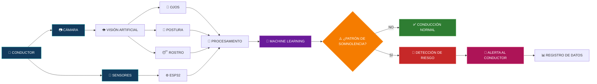

<p align="center">
  
</p>

<p align="center">
  <strong>🚗 Sistema inteligente para la detección de somnolencia y cambios de postura en conductores</strong>
</p>

<p align="center">
  <strong>PROYECTO INTEGRADOR · 2026-II</strong>
  <br>
  <sub>Universidad Peruana Cayetano Heredia · Ingeniería Informática + Ingeniería Industrial</sub>
</p>

<p align="center">
  
  
  
  
</p>

<br>

<p align="center">
  
</p>

---
## 🧠 Simulación del funcionamiento de DriveSafe AI



### 🔄 Flujo principal

**Conductor → Captura → Análisis → Machine Learning → Detección → Alerta**

El sistema combinará información visual y datos de sensores para analizar el comportamiento del conductor y determinar si existe un patrón asociado a la somnolencia.

## 🌍 Objetivos de Desarrollo Sostenible

<p align="center">
  
  
</p>

### ❤️ ODS 3 · Salud y Bienestar

DriveSafe AI se relaciona principalmente con la **ODS 3**, ya que busca contribuir a la prevención de accidentes de tránsito mediante la detección temprana de posibles signos de **somnolencia y fatiga durante la conducción**.

### 💡 ODS 9 · Industria, Innovación e Infraestructura

De manera complementaria, el proyecto se relaciona con la **ODS 9** mediante la aplicación de **Inteligencia Artificial, visión artificial, IoT y Machine Learning** para desarrollar una solución tecnológica orientada a la seguridad vial.

---

# 🚗 DriveSafe AI

> **Una solución inteligente orientada a reducir el riesgo asociado a la somnolencia durante la conducción mediante visión artificial, sensores y Machine Learning.**

### 🎯 Nuestro enfoque

DriveSafe AI busca desarrollar un **prototipo de monitoreo del conductor** capaz de analizar indicadores visuales y posturales para identificar posibles signos de somnolencia y generar una alerta cuando se detecte un patrón de riesgo.

```text
        👁️ ROSTRO
           +
        🧍 POSTURA
           +
       📡 SENSORES
           ↓
    🧠 MACHINE LEARNING
           ↓
   📊 ANÁLISIS DEL PATRÓN
           ↓
      ⚠️ DETECCIÓN
           ↓
      🔔 ALERTA
```
# 📸 Fotografía del Equipo

<p align="center">
  
</p>

<p align="center">
  <em>Figura 1. Fotografía del equipo 01</em>
</p>

---

# 👥 Integrantes del Equipo

<div align="center">

| Foto | Nombre | Rol | Intereses |
|------|--------|-----|-----------|
|  | **Cesar Rodrigo Milla Gómez** | Responsable de función general, análisis de información y seguridad | Investigación, tecnología y análisis |
|  | **Anderson Josue Delerna Infantes** | Responsable de geometría, energía, control y software | Programación, automatización y desarrollo |
|  | **Kevin Esty Carvallo Neciosup** | Líder del equipo y responsable de sensores, hardware y adquisición de datos | Sensores, programación y sistemas |
|  | **Shedira Lumeris Sihuincha Palacin** | Responsable de estructura, comunicaciones, ergonomía, calidad y documentación | Procesos, análisis y organización |

</div>

---

# 🚗 DriveSafe AI

### Sistema inteligente para la detección de somnolencia y cambios de postura en conductores mediante visión artificial, sensores y Machine Learning

<p align="center">

**Conductor → Cámara + Sensores → Datos → Machine Learning → Análisis → Alerta**

</p>

---

# 📌 Resumen del Proyecto

## 🚗 ¿Qué es DriveSafe AI?

**DriveSafe AI** es un prototipo experimental diseñado para **detectar signos de somnolencia y cambios de postura en conductores**, utilizando visión artificial, sensores y técnicas de Machine Learning.

El sistema busca analizar el comportamiento del conductor durante la conducción para identificar patrones asociados con la pérdida de atención o somnolencia.

A diferencia de una solución basada únicamente en el cierre de los ojos, DriveSafe AI propone combinar diferentes indicadores para mejorar la detección.

Las principales variables consideradas son:

- 👁️ **Estado de los ojos**
- 🧑 **Posición e inclinación de la cabeza**
- 🪑 **Cambios de postura**
- ⏱️ **Duración de los eventos**
- 🔄 **Frecuencia de los eventos**
- 📷 **Imágenes del conductor**
- 🌡️ **Condiciones ambientales**, si se incorporan al prototipo

Los datos obtenidos serán procesados mediante técnicas de **Machine Learning**, con el objetivo de identificar patrones relacionados con la somnolencia y generar alertas oportunas.

> **DriveSafe AI no busca determinar únicamente si el conductor tiene los ojos cerrados, sino analizar diferentes indicadores de comportamiento para identificar patrones compatibles con somnolencia.**

---

# ⚠️ Problemática

La **somnolencia durante la conducción** puede disminuir la atención, el tiempo de reacción y la capacidad del conductor para responder adecuadamente ante situaciones inesperadas.

El problema puede ser especialmente relevante en conductores que realizan:

- Jornadas prolongadas.
- Viajes interprovinciales.
- Conducción nocturna.
- Transporte público.
- Transporte de carga.

Los sistemas existentes de monitoreo pueden utilizar diferentes tecnologías para detectar la somnolencia. Sin embargo, algunos se basan principalmente en indicadores como el cierre de los ojos o se encuentran integrados de fábrica en vehículos modernos.

Por ello, se plantea desarrollar una alternativa que pueda **combinar indicadores visuales y posturales**, utilizando tecnologías accesibles y con posibilidad de adaptación a vehículos convencionales.

> **El reto no es solamente detectar el cierre de los ojos, sino identificar de manera más confiable un patrón de somnolencia mediante la combinación de diferentes señales del conductor.**

---

# 🎯 Objetivo General

**Desarrollar un prototipo inteligente capaz de detectar signos de somnolencia y cambios de postura en conductores mediante visión artificial, sensores y técnicas de Machine Learning, generando alertas oportunas ante situaciones de riesgo.**

---

# 🎯 Objetivos Específicos

1. Diseñar un prototipo de monitoreo orientado al conductor.

2. Implementar una cámara para capturar imágenes del rostro y postura del conductor.

3. Detectar indicadores relacionados con la somnolencia, como cierre prolongado de los ojos e inclinación de la cabeza.

4. Identificar cambios significativos en la postura del conductor.

5. Registrar los eventos detectados junto con su duración y frecuencia.

6. Generar un conjunto de datos para el entrenamiento y evaluación del modelo.

7. Aplicar técnicas de Machine Learning para analizar los patrones relacionados con la somnolencia.

8. Implementar un sistema de alerta ante la detección de un patrón de posible somnolencia.

9. Evaluar el funcionamiento del prototipo mediante pruebas controladas.

---

# 👤 Público Objetivo

El proyecto estará orientado principalmente a **conductores de vehículos que realizan jornadas prolongadas o recorridos extensos**.

Entre los posibles usuarios se consideran:

- 🚍 Conductores de transporte público.
- 🚌 Conductores de transporte interprovincial.
- 🚛 Conductores de vehículos de carga.
- 🚕 Conductores de taxi.
- 🚗 Conductores de vehículos convencionales.

La propuesta busca especialmente desarrollar una alternativa que pueda adaptarse a **vehículos que no cuentan con sistemas avanzados de monitoreo del conductor incorporados de fábrica**.

---

# 🧠 Detección mediante Machine Learning

Uno de los principales componentes de DriveSafe AI será el análisis mediante **Machine Learning y visión artificial**.

El sistema no tomará una decisión únicamente por una señal aislada.

Por ejemplo:

```text
👁️ Cierre de ojos
        +
🧑 Inclinación de cabeza
        +
🪑 Cambio de postura
        +
⏱️ Duración
        ↓
🧠 MACHINE LEARNING
        ↓
¿Patrón de posible somnolencia?
        ↓
   Sí          No
   ↓            ↓
🚨 Alerta     👌 Continuar
